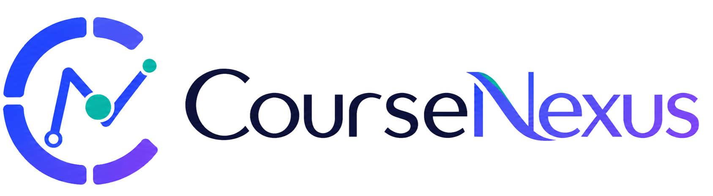
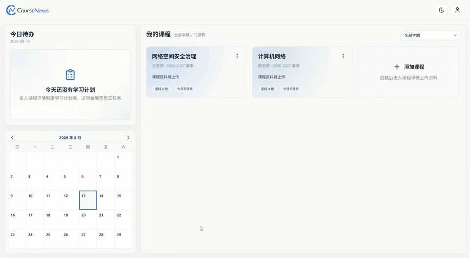
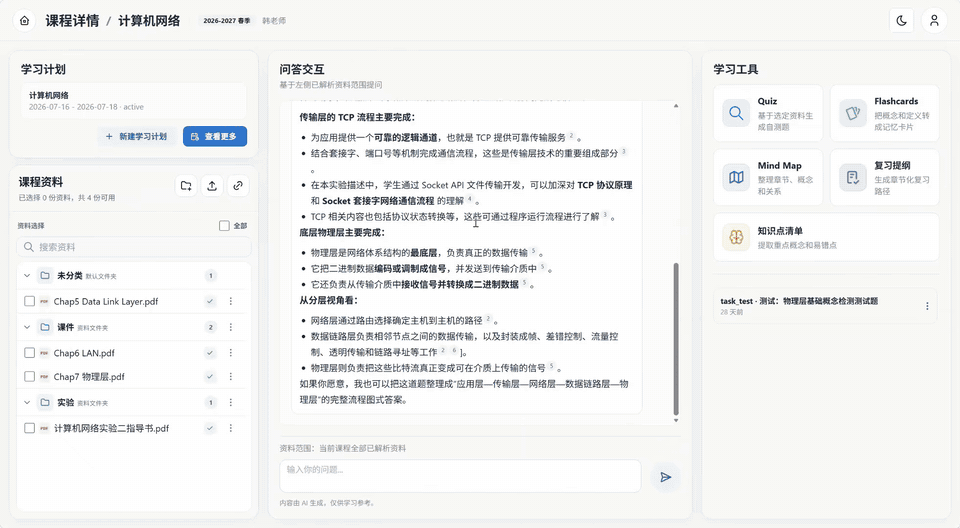
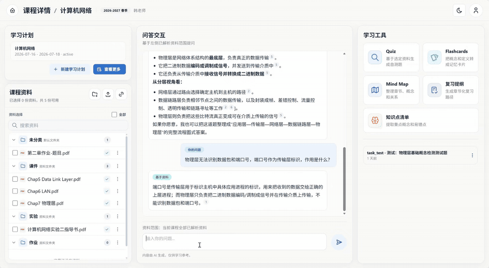
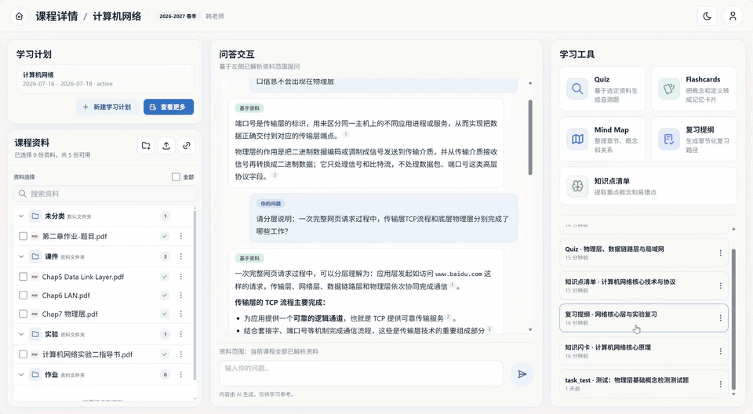
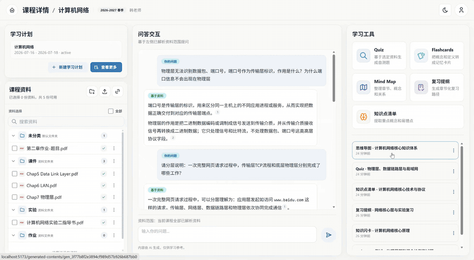
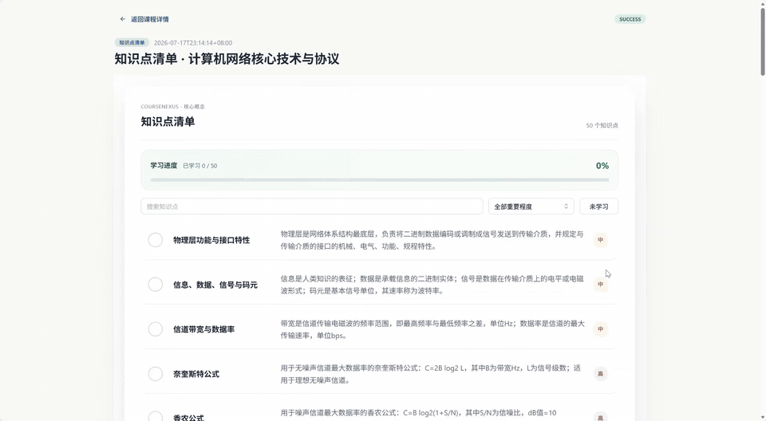
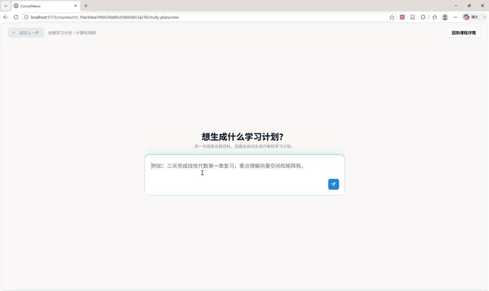
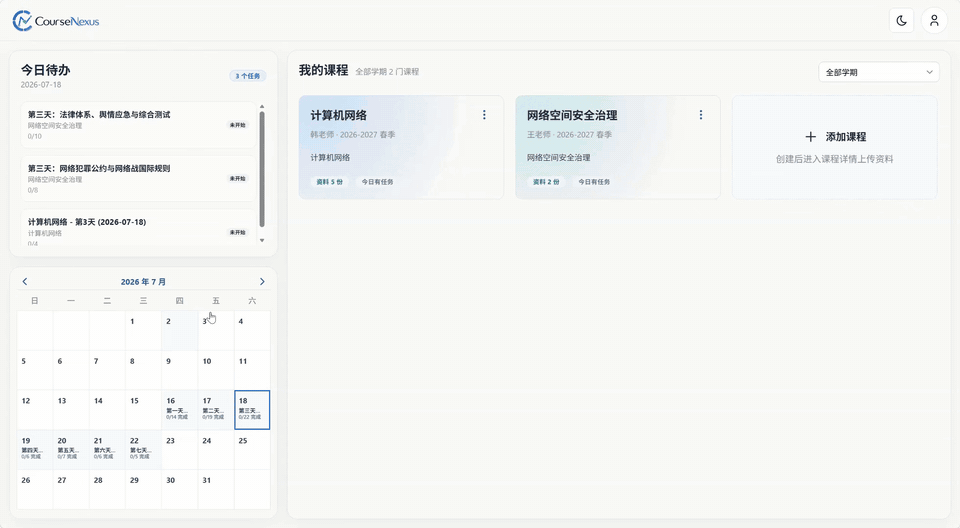
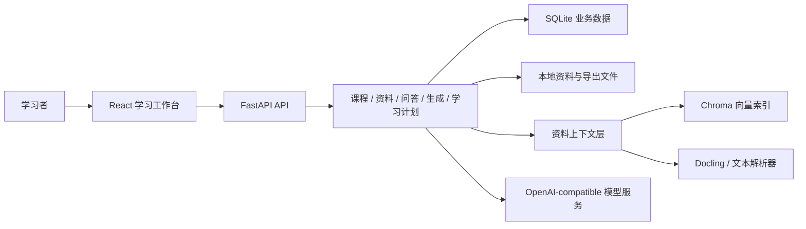

# CourseNexus 课枢

<p align="center">
  
</p>

<p align="center">
  面向大学生多课程学习场景的开源 AI 学习工作台。<br />
  把分散的课程资料，转化为可追溯的问答、可复习的内容和可执行的学习计划。
</p>

<p align="center">
  <a href="https://github.com/cyruan815/CourseNexus/releases"></a>
  <a href="LICENSE"></a>
  
  
</p>

<p align="center">
  <a href="#why-coursenexus">产品理念</a> ·
  <a href="#features">核心能力</a> ·
  <a href="#interface-overview">界面概览</a> ·
  <a href="#quick-start">快速开始</a> ·
  <a href="#roadmap">项目路线</a> ·
  <a href="#contributing">参与贡献</a>
</p>

> [!IMPORTANT]
> CourseNexus 当前处于 `v0.1.0` 本地 POC 阶段，适合学习、体验和共同开发，尚未面向生产环境部署。项目正在快速迭代，接口与数据结构可能继续调整。

<a id="contents"></a>

## 📖 目录

- [🎯 为什么是 CourseNexus](#why-coursenexus)
- [✨ 核心能力](#features)
- [📸 界面概览](#interface-overview)
- [📁 项目结构](#project-structure)
- [🚀 快速开始](#quick-start)
- [🏗️ 系统架构](#architecture)
- [🗺️ 项目路线](#roadmap)
- [📚 项目文档](#documentation)
- [🤝 参与贡献](#contributing)
- [🏷️ 版本与反馈](#releases-and-feedback)
- [📄 License](#license)

<a id="why-coursenexus"></a>

## 🎯 为什么是 CourseNexus

一门课程的资料往往散落在 PDF、课件、笔记和图片中；问答、复习、计划和执行又分布在不同工具里。CourseNexus 希望把这些环节放回同一个以“课程”为中心的工作台：

- **资料是知识来源**：上传的材料经过解析、切块和索引后，成为问答与生成内容的依据。
- **回答可以追溯**：课程问答尽量回到具体材料与内容片段，降低无法核验的回答。
- **内容可以复习**：从指定资料生成测验、闪卡、思维导图、提纲、知识点清单和讲义。
- **计划可以执行**：把学习目标拆成日期、任务和二级任务，并通过待办、日历和打卡持续推进。
- **数据优先本地**：POC 默认使用 SQLite、本地文件存储和本地 Chroma，便于个人体验与二次开发。

<a id="features"></a>

## ✨ 核心能力

| 能力 | 当前 POC 提供的体验 |
| --- | --- |
| 课程工作台 | 管理学期、课程、资料、生成内容和学习计划 |
| 多格式资料 | 支持文本、Markdown、PDF、DOCX、PPTX 和常见图片格式，提供解析状态与失败重试 |
| 课程资料问答 | 基于资料范围进行 RAG 检索，保存会话、消息和来源引用 |
| AI 学习内容 | 生成 Quiz、Flashcard、Mindmap、复习提纲、知识点清单、讲义和任务测试题 |
| 学习计划 | 通过自然语言配置、学前诊断和预览生成单课程学习计划，支持调整、重生成与保存 |
| 学习执行 | 提供今日待办、月历、任务执行、完成状态、打卡与连续学习统计 |
| 内容导出 | 将支持的生成内容导出为 Markdown 或 PDF |

<h2 id="interface-overview" align="center">📸 界面概览</h2>

<p align="center">以下界面均来自 CourseNexus 的实际运行版本，覆盖课程资料管理、智能问答、内容生成和学习计划等核心场景。</p>

| 首页与课程管理 | 课程详情与资料管理 |
| :---: | :---: |
|  |  |
| **课程智能问答与来源引用** | **Quiz 测验与解析** |
|  |  |
| **知识闪卡** | **思维导图** |
|  |  |
| **知识点清单与学习进度** | **学习计划诊断** |
|  |  |
| **学习计划日历** | **任务执行、讲义与 AI 助教** |
|  |  |

<a id="project-structure"></a>

## 📁 项目结构

以下仅展示理解和参与 CourseNexus 所需的核心目录：

```text
CourseNexus/
├── assets/                    # README 品牌图片与产品截图
├── frontend/                  # React + TypeScript 前端
│   ├── src/
│   │   ├── api/               # 后端 API 客户端
│   │   ├── components/        # 通用界面组件
│   │   └── features/          # 按业务领域组织的功能模块
│   └── tests/                 # 前端测试
├── backend/                   # FastAPI 后端
│   ├── app/
│   │   ├── api/               # HTTP 路由与接口入口
│   │   ├── modules/           # 课程、资料、问答和学习计划等领域模块
│   │   └── integrations/      # 模型、解析和外部能力集成
│   ├── migrations/            # Alembic 数据库迁移
│   └── tests/                 # 后端测试
├── docs/                      # 产品、架构、工程和领域知识库
├── .env.example               # 本地环境变量示例
├── package.json               # 根目录开发脚本
└── pnpm-workspace.yaml        # pnpm 工作区配置
```

<a id="quick-start"></a>

## 🚀 快速开始

### 环境要求

- Node.js 24 或兼容版本
- pnpm 11
- Python 3.12
- Conda（推荐）

项目目前以 Windows PowerShell 作为主要本地开发环境。Linux 和 macOS 也可以运行，但部分脚本可能需要按 shell 调整。

### 1. 获取代码并安装前端依赖

```powershell
git clone https://github.com/cyruan815/CourseNexus.git
Set-Location CourseNexus
corepack enable
corepack prepare pnpm@11.7.0 --activate
pnpm install
```

### 2. 创建后端环境

```powershell
conda env create -f backend/environment.yml
conda run -n course-nexus python -m playwright install chromium
```

Chromium 用于 PDF 导出；只安装 Python 包不会自动安装浏览器二进制。

### 3. 配置本地环境

```powershell
Copy-Item .env.example .env
notepad .env
```

仅体验账号、课程和基础页面时，可以暂不配置模型服务。启用资料问答和 AI 生成功能时，请在 `.env` 中填写对应的 OpenAI-compatible 服务配置：

| 功能 | 环境变量前缀 |
| --- | --- |
| 向量索引 | `EMBEDDING_*` |
| 课程问答 | `COURSE_QA_*` |
| 测验、闪卡、导图、提纲、知识点 | `QUIZ_*`、`FLASHCARD_*`、`MINDMAP_*`、`OUTLINE_*`、`KNOWLEDGE_LIST_*` |
| 学习计划 | `STUDY_PLAN_PARSER_*`、`STUDY_PLAN_GENERATOR_*` |
| 讲义与任务测试 | `HANDOUT_*`、`TASK_TEST_*` |

每组配置包含 `API_KEY`、`BASE_URL` 和 `MODEL`。完整说明见 [.env.example](./.env.example)，真实密钥不要提交到 Git，也不要放入 `VITE_` 开头的变量。

### 4. 初始化数据库

```powershell
pnpm backend:migrate
```

### 5. 启动应用

分别打开两个终端，并在仓库根目录运行：

```powershell
pnpm backend:dev
```

```powershell
pnpm frontend:dev
```

启动后可访问：

- Web 应用：<http://localhost:5173>
- OpenAPI 文档：<http://localhost:8000/docs>
- 健康检查：<http://localhost:8000/api/v1/health>

<a id="architecture"></a>

## 🏗️ 系统架构



### 技术栈

- **前端**：React 19、TypeScript、Vite、Mantine、TanStack Query、Vitest
- **后端**：Python 3.12、FastAPI、SQLAlchemy 2、Alembic、Pydantic、pytest
- **AI 与资料处理**：OpenAI-compatible API、Docling、LlamaIndex、Chroma
- **内容渲染**：Markmap、Mermaid、KaTeX、Playwright
- **本地存储**：SQLite、本地文件系统、Chroma PersistentClient

<a id="roadmap"></a>

## 🗺️ 项目路线

已具备的 POC 链路：

- [x] 账号、课程与多格式资料管理
- [x] 资料解析、切块、向量索引与课程问答
- [x] 多类型 AI 学习内容生成与详情展示
- [x] 单课程学习计划、今日待办、日历和任务执行
- [x] 讲义、任务测试题及 Markdown / PDF 导出
- [ ] 补齐真实课程资料的质量评测与回归基线
- [ ] 完善测试题作答历史、反馈闭环和长期复习调度
- [ ] 引入异步任务、对象存储和生产级可观测性
- [ ] 提供容器化部署与 PostgreSQL 迁移方案

更完整的产品规划见 [PRD](./docs/product/prd.md) 和 [实现路线图](./docs/planning/implementation-roadmap.md)。

<a id="documentation"></a>

## 📚 项目文档

| 文档 | 适合谁阅读 |
| --- | --- |
| [文档总入口](./docs/index.md) | 希望系统了解项目的人 |
| [产品需求](./docs/product/prd.md) | 产品设计、功能范围与用户流程贡献者 |
| [架构说明](./docs/architecture/index.md) | 后端、基础设施和跨模块贡献者 |
| [API 与数据契约](./docs/api-data/index.md) | 前后端联调与集成开发者 |
| [工程规范](./docs/engineering/index.md) | 准备提交代码或文档的贡献者 |
| [领域实现文档](./docs/domains/index.md) | 希望深入具体业务模块的贡献者 |

<a id="contributing"></a>

## 🤝 参与贡献

欢迎提交 Issue、讨论想法或贡献代码。开始前请先阅读 [AGENTS.md](./AGENTS.md) 和 [协作规范](./docs/engineering/collaboration.md)。

推荐流程：

1. 在 Issue 中说明问题、需求或设计动机。
2. Fork 仓库，并从最新 `dev` 创建短期分支，例如 `feature/<name>` 或 `fix/<name>`。
3. 完成实现、测试和必要的文档更新，保持提交小而清晰。
4. 创建目标为 `dev` 的 Pull Request，说明影响范围、验证结果和已知问题。

涉及数据库、公共 API、共享 schema、架构边界或核心依赖的改动，请在实现前先发起讨论。

<a id="releases-and-feedback"></a>

## 🏷️ 版本与反馈

- [Releases](https://github.com/cyruan815/CourseNexus/releases)：下载或查看已发布版本
- [Issues](https://github.com/cyruan815/CourseNexus/issues)：报告缺陷或提出功能建议

<a id="license"></a>

## 📄 License

CourseNexus 使用 [MIT License](./LICENSE) 开源。
