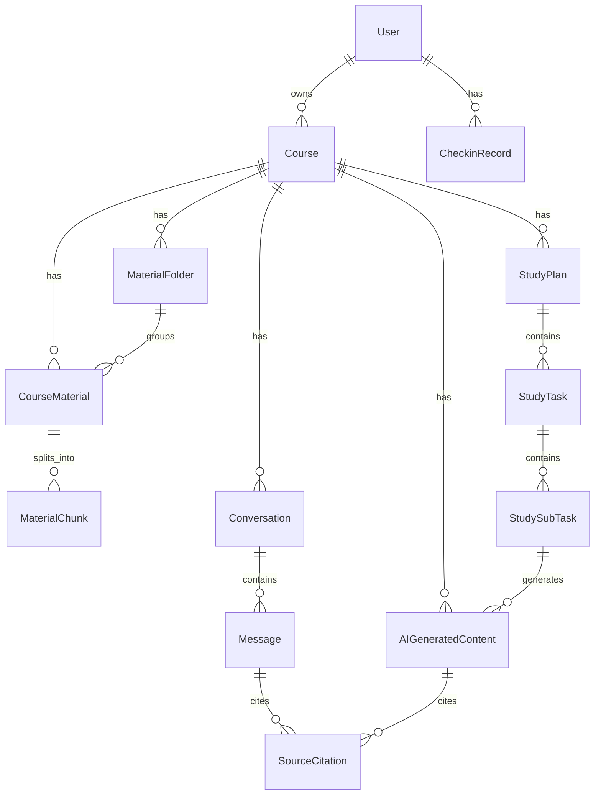

# Data Model v0.1

> 本文说明核心实体、关系和数据规则；后端实际建表字段、约束和索引见 [table-schema.md](table-schema.md)。

## 核心实体草案

| 实体 | 说明 | 归属 |
| --- | --- | --- |
| `User` | 用户账号与数据归属根对象。 | 根对象 |
| `Course` | 课程基础对象。 | `user_id` |
| `MaterialFolder` | 课程资料一级目录。 | `user_id`、`course_id` |
| `CourseMaterial` | 文件或链接资料。 | `user_id`、`course_id` |
| `MaterialChunk` | 资料解析后的可检索片段。 | `material_id`、`course_id` |
| `Conversation` | 课程问答会话。 | `user_id`、`course_id` |
| `Message` | 用户消息或助手消息。 | `conversation_id`、`course_id` |
| `SourceCitation` | 引用来源。 | `material_id`，并关联消息或生成内容 |
| `AIGeneratedContent` | AI 生成内容统一记录。 | `user_id`、`course_id` |
| `StudyPlan` | 单课程学习计划。 | `user_id`、`course_id` |
| `StudyTask` | 每日一级任务。 | `plan_id`、`course_id` |
| `StudySubTask` | 二级任务。 | `task_id`、`plan_id`、`course_id` |
| `CheckinRecord` | 学习完成记录。 | `user_id`、`checkin_date` |

`AIGeneratedContent` 统一承载 `quiz`、`flashcard`、`mindmap`、`outline`、`knowledge_list`、`note`、`handout` 和 `task_test`。结构化内容可先保存在 `content_json`，后续复杂度上升后再拆独立表。

## 实体关系草案

关系规则：

- 一个用户可以拥有多门课程。
- 一门课程可以有多份资料、多个对话、多个 AI 生成内容和多个学习计划。
- 本期一个学习计划只绑定一门课程。
- 多门课程计划通过创建多个 `StudyPlan` 实现。
- 首页今日待办和首页大日历按日期合并展示多个单课程计划的任务。
- `SourceCitation` 可关联 `Message` 或 `AIGeneratedContent`，并保留资料名快照。

## 数据归属原则

- 所有可访问数据必须能直接或间接追溯到当前 `user_id`。
- 后端不能只根据资源 ID 查询并返回数据，必须校验资源归属。
- 跨用户访问返回 `FORBIDDEN` 或不暴露存在性的 `NOT_FOUND`。
- 课程删除后，关联资料、对话、生成内容、计划和任务默认对用户隐藏。

## 状态字段约定

| 枚举 | 值 |
| --- | --- |
| `parse_status` | `uploaded`、`parsing`、`parsed`、`parse_failed`、`deleted` |
| `generation_status` | `pending`、`generating`、`success`、`failed` |
| `content_type` | `quiz`、`flashcard`、`mindmap`、`outline`、`knowledge_list`、`note`、`handout`、`task_test` |
| `task_status` | `not_started`、`in_progress`、`completed` |
| `subtask_type` | `learn`、`review`、`quiz`、`test` |
| `plan_status` | `draft`、`active`、`completed`、`deleted` |

状态规则：

- 只有 `parse_status = parsed` 的资料可进入检索、问答、生成和计划上下文。
- 生成失败必须保留失败状态和错误码，前端可展示重试入口。
- 一级任务状态由二级任务状态汇总得出。
- 二级任务完成状态更新必须幂等。

## 软删除与审计字段

- 主要业务表保留 `created_at`、`updated_at`、`deleted_at`。
- 删除课程：课程及关联资料、对话、生成内容、计划、任务默认隐藏。
- 删除资料：资料退出新的检索范围；历史引用保留资料名快照，可提示资料已删除。
- 删除目录：目录软删除，目录下资料回到未分类。
- 删除计划：计划与任务从日历和今日待办隐藏。
- 重新解析资料：新切片替换旧切片；历史引用定位失败时要可降级展示。

## 后续数据库迁移规则

- 表结构变化必须通过 migration 机制管理，默认采用 Alembic。
- 迁移应优先向前兼容：先加 nullable 字段，再回填，再收紧约束。
- 枚举新增要同步前后端兜底；枚举删除或语义变化视为破坏性变更。
- migration 不承载业务生成逻辑；资料重切片、索引刷新等应设计为可重试后台任务。
- 模型设计避免依赖 SQLite 专有能力，保留迁移 PostgreSQL 的空间。
