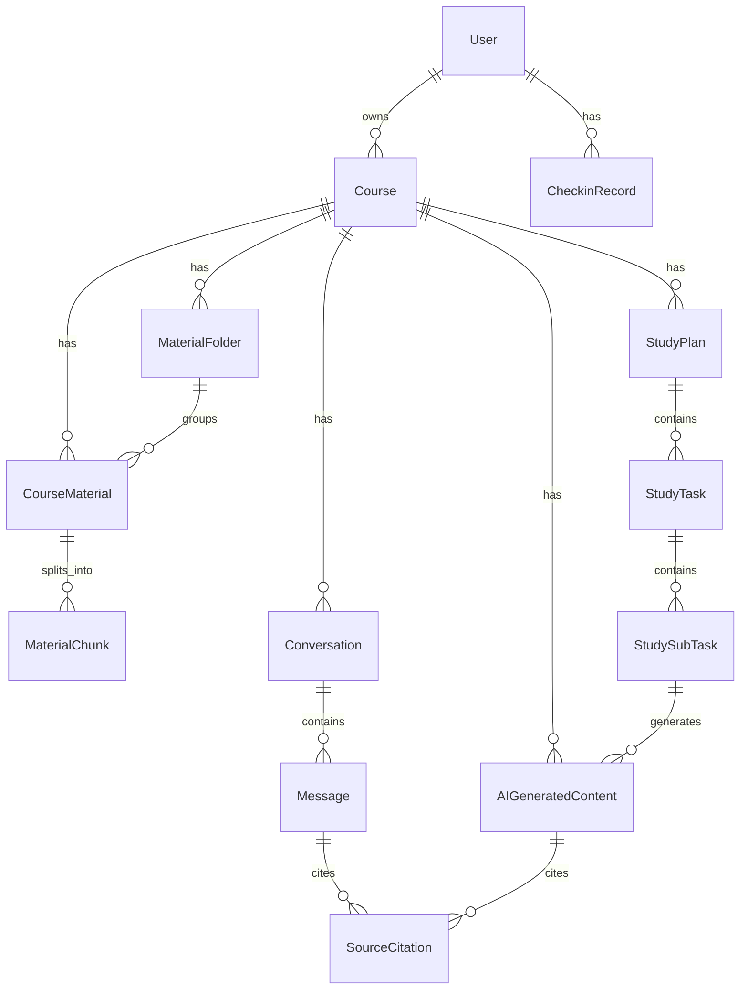

# Data Model v0.1

> 本文说明核心实体、关系和数据规则；后端实际建表字段、约束和索引见 [table-schema.md](table-schema.md)。

## 核心实体草案

| 实体 | 说明 | 归属 |
| --- | --- | --- |
| `User` | 用户账号与数据归属根对象。 | 根对象 |
| `Course` | 课程基础对象。 | `user_id` |
| `MaterialFolder` | 课程资料一级目录。 | `user_id`、`course_id` |
| `CourseMaterial` | 文件或链接资料。 | `user_id`、`course_id` |
| `MaterialChunk` | 资料解析后的可检索片段。 | `material_id`、`course_id` |
| `Conversation` | 课程问答会话。 | `user_id`、`course_id` |
| `Message` | 用户消息或助手消息。 | `conversation_id`、`course_id` |
| `SourceCitation` | 引用来源。 | `material_id`，并关联消息或生成内容 |
| `AIGeneratedContent` | AI 生成内容统一记录。 | `user_id`、`course_id` |
| `StudyPlan` | 单课程学习计划。 | `user_id`、`course_id` |
| `StudyTask` | 每日一级任务。 | `plan_id`、`course_id` |
| `StudySubTask` | 二级任务。 | `task_id`、`plan_id`、`course_id` |
| `CheckinRecord` | 学习完成记录。 | `user_id`、`checkin_date` |

`AIGeneratedContent` 统一承载 `quiz`、`flashcard`、`mindmap`、`outline`、`knowledge_list`、`note`、`handout` 和 `task_test`。结构化内容可先保存在 `content_json`，后续复杂度上升后再拆独立表。

## 计划学习模式 S01 数据审计结论

S01 已确认计划学习模式第一阶段复用当前 13 张核心表，不新增业务表，不修改 baseline migration：

- 计划主记录复用 `study_plans`，用户确认配置、偏好、材料范围和自然语言解析结果写入 `parsed_config_json`。
- 日期级一级任务复用 `study_tasks`，日历和今日待办从 `task_date`、`status`、`sort_order` 只读聚合。
- 二级执行任务复用 `study_subtasks`，完成事实、任务类型和关联资料 ID 都以该表为准。
- 今日讲义和任务测试题复用 `ai_generated_contents`，通过 `content_type = handout|task_test` 和 `study_subtask_id` 绑定二级任务。
- 引用快照复用 `source_citations`，必须保留真实资料 ID、资料名快照、页码或页序号和命中文本。
- 学习打卡复用 `checkin_records`，每个用户自然日最多一条记录，由二级任务完成比例派生。

以下对象在 S01 结论中不建独立表：

| 能力 | 禁止新增的独立表 | 当前表达方式 |
| --- | --- | --- |
| 今日待办 / 日历 | `todos`、`calendar_events` | 从 `study_tasks` 和 `study_subtasks` 按日期只读聚合。 |
| 今日讲义 | `handouts` | `ai_generated_contents.content_type = handout`，关联 `study_subtask_id`。 |
| 任务测试题 | `task_tests` | `ai_generated_contents.content_type = task_test`，题目写入 `content_json`。 |
| PDF 导出 | `export_records` | 基于已生成内容请求时流式导出，不保存导出历史。 |

只有现有列无法表达且通过共享契约评审的持久化需求，才允许创建后续兼容 migration；不得修改 `20260709_0001_create_core_tables.py` baseline migration。
## 实体关系草案



关系规则：

- 一个用户可以拥有多门课程。
- 一门课程可以有多份资料、多个对话、多个 AI 生成内容和多个学习计划。
- 本期一个学习计划只绑定一门课程。
- 多门课程计划通过创建多个 `StudyPlan` 实现。
- 首页今日待办和首页大日历按日期合并展示多个单课程计划的任务。
- `SourceCitation` 可关联 `Message` 或 `AIGeneratedContent`，并保留资料名快照。
- 生成内容与其`SourceCitation`必须在一个事务中提交；失败记录不允许保留部分结构或引用。
- 当前引用位置数据库约束保持不变；无分页来源使用`page_index=0`表示未知位置，API调用方不得将其解释为真实页码。

## 数据归属原则

- 所有可访问数据必须能直接或间接追溯到当前 `user_id`。
- 后端不能只根据资源 ID 查询并返回数据，必须校验资源归属。
- 跨用户访问返回 `FORBIDDEN` 或不暴露存在性的 `NOT_FOUND`。
- 课程删除后，关联资料、对话、生成内容、计划和任务默认对用户隐藏。

## 状态字段约定

| 枚举 | 值 |
| --- | --- |
| `parse_status` | `uploaded`、`parsing`、`parsed`、`parse_failed`、`deleted` |
| `generation_status` | `pending`、`generating`、`success`、`failed` |
| `content_type` | `quiz`、`flashcard`、`mindmap`、`outline`、`knowledge_list`、`note`、`handout`、`task_test` |
| `task_status` | `not_started`、`in_progress`、`completed` |
| `subtask_type` | `learn`、`review`、`quiz`、`test` |
| `plan_status` | `draft`、`active`、`completed`、`deleted` |

状态规则：

- 只有 `parse_status = parsed` 的资料可进入检索、问答、生成和计划上下文。
- 生成失败必须保留失败状态和错误码，前端可展示重试入口。
- 一级任务状态由二级任务状态汇总得出。
- 二级任务完成状态更新必须幂等。

## 删除与审计字段

- 主要业务表保留 `created_at`、`updated_at`、`deleted_at`。
- 删除课程：课程及关联资料、对话、生成内容、计划、任务默认隐藏。
- 删除资料：物理删除 `CourseMaterial`、`MaterialChunk`、RAG 向量和原始上传文件，不提供恢复；历史引用保留资料名、页码和命中文本快照，并将 `material_id`、`chunk_id` 置空。
- 删除目录：物理删除目录及其中全部资料；问答、生成内容和历史引用快照不随资料删除。
- 删除计划：计划与任务从日历和今日待办隐藏。
- 重新解析资料：新切片替换旧切片；历史引用定位失败时要可降级展示。

## 后续数据库迁移规则

- 表结构变化必须通过 migration 机制管理，默认采用 Alembic。
- 迁移应优先向前兼容：先加 nullable 字段，再回填，再收紧约束。
- 枚举新增要同步前后端兜底；枚举删除或语义变化视为破坏性变更。
- migration 不承载业务生成逻辑；资料重切片、索引刷新等应设计为可重试后台任务。
- 模型设计避免依赖 SQLite 专有能力，保留迁移 PostgreSQL 的空间。

## S02 学习计划生命周期落库规则

S02 继续复用 `study_plans`、`study_tasks`、`study_subtasks`，不新增业务表；为保存计划幂等性新增 `study_plans.idempotency_key_hash` 和 `(user_id, course_id, idempotency_key_hash)` 唯一索引，baseline migration 不回改。

`StudyPlan.parsed_config_json` 在 S02 中保存以下结构化信息：

```json
{
  "material_scope": {"include_all_parsed_materials": true, "material_ids": []},
  "daily_available_minutes": 60,
  "preference": "fast_track",
  "tasks_source": "confirmed",
  "coverage": {
    "expected_material_ids": ["mat_1"],
    "processed_material_ids": ["mat_1"],
    "batch_count": 1
  },
  "idempotency": {
    "key_hash": "sha256(...) ",
    "request_hash": "sha256(...)"
  }
}
```

保存计划只创建计划、一级任务和二级任务结构。重生成 preview 不落库；替换计划会在一次事务中删除旧任务树并写入新任务树；删除计划写 `status = deleted` 和 `deleted_at`。

保存计划携带 `Idempotency-Key` 时，key hash 写入 `study_plans.idempotency_key_hash`，request hash 仍写入 `parsed_config_json.idempotency.request_hash`。同 key 同请求返回原计划；同 key 不同请求、并发唯一约束冲突且 request hash 不一致、或旧计划已软删除但 key 被占用时，均返回 `IDEMPOTENCY_CONFLICT`。

## S04/S05 派生状态规则

`study_subtasks.status` 是学习执行的事实来源。S04 completion 只写 `completed` 或 `not_started`，不直接写二级任务 `in_progress`。

`study_tasks.status` 由同一父任务下二级任务派生：全部完成为 `completed`，全部未开始为 `not_started`，其他组合为 `in_progress`。

`study_plans.status` 由计划下一级任务派生：全部一级任务完成为 `completed`，否则为 `active`；`deleted` 计划不可操作。

`checkin_records` 是按用户和日期从未删除课程、未删除计划下的二级任务状态重算得到的派生记录。同一用户同一天只保留一行，不做增量累计。
