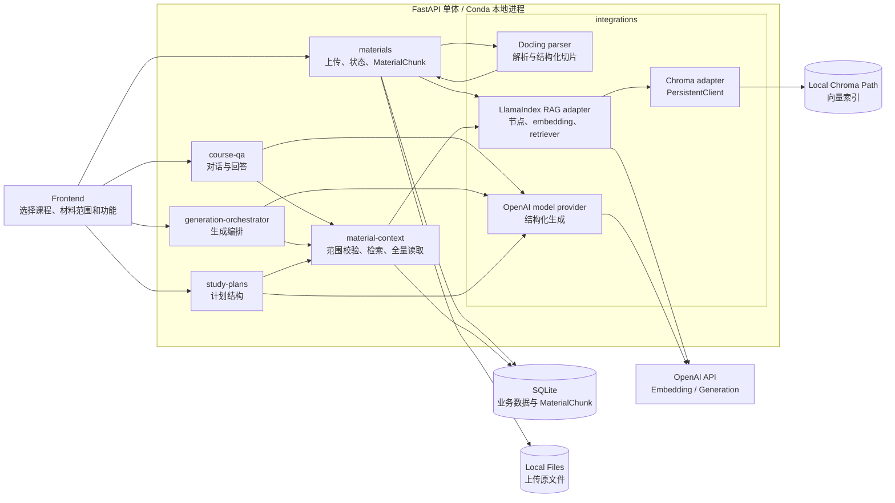
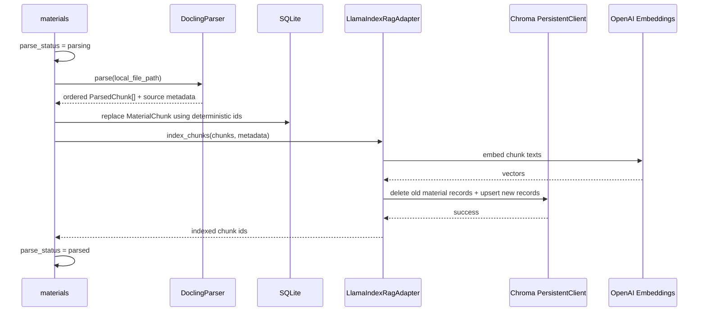
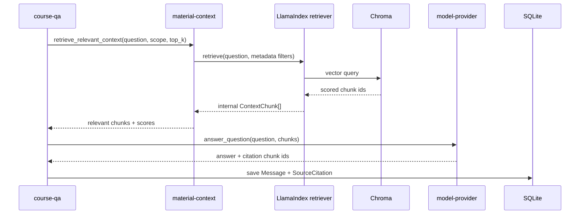
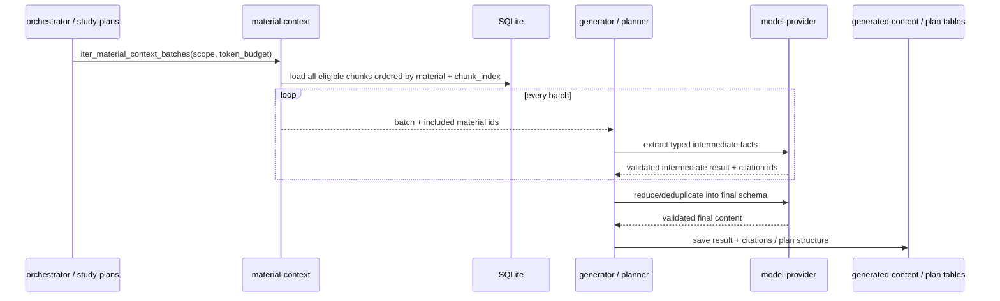

# Material Context and RAG Architecture

> 本文定义资料上传、解析、切片、索引、检索和引用如何嵌入现有 FastAPI 单体，并区分“选定范围问答”和“指定材料生成”两条消费链路。产品口径见 [../product/ai-material-business.md](../product/ai-material-business.md)，技术决策见 [adr/0003-local-rag-stack.md](adr/0003-local-rag-stack.md)。

## 1. 架构结论

当前采用模式一，由 CourseNexus 自建资料上下文与 RAG 能力：

```text
FastAPI + LlamaIndex + Docling + Chroma + OpenAI API
```

这套能力直接嵌入现有 FastAPI 单体，不新增 AI 微服务，不运行 Chroma Server，不使用 Docker。Docling、LlamaIndex 和 Chroma `PersistentClient` 都在后端 Python 进程内调用；SQLite、上传文件和 Chroma 索引分别持久化到本地目录。OpenAI API 负责 embedding 和生成，是当前唯一需要网络访问的 AI 能力。

现有架构无需推翻：

- `materials` 继续拥有上传记录、解析状态和 `MaterialChunk`。
- `material-context` 从“顺序读取 chunk 的基础接口”升级为资料范围校验、语义检索和全材料读取的统一入口。
- `course-qa` 只调用问答检索接口。
- `generation-orchestrator`、学习计划和各 generator 只调用全材料上下文接口。
- `model-provider` 继续统一封装 OpenAI 生成调用。
- `generated-content` 和 `SourceCitation` 继续保存结果和引用。

## 2. 组件拓扑



依赖只能从业务模块指向项目内部上下文接口或 integration 协议。`course-qa`、generator 和 `study-plans` 不得 import `llama_index`、`chromadb`、`docling` 或 `openai`。

## 3. 组件职责

| 组件 | 负责 | 不负责 |
| --- | --- | --- |
| `materials` | 文件安全校验、解析状态、触发解析和索引、保存 `MaterialChunk`。 | 不回答问题，不生成学习内容。 |
| Docling parser adapter | 解析 PDF、DOCX、PPTX、Markdown、文本和图片；保留标题、页码、表格等结构；输出项目内部 `ParsedDocument`。 | 不写数据库，不判断用户权限。 |
| LlamaIndex RAG adapter | 把内部 chunk 转为 node，调用 embedding，写入 Chroma，构造带 metadata filter 的 retriever。 | 不暴露 LlamaIndex 类型给业务层，不生成业务内容。 |
| Chroma adapter | 用本地 `PersistentClient` 持久化向量，按 chunk upsert/delete/query。 | 不保存用户、课程、计划或生成记录。 |
| `material-context` | 校验课程和材料范围；提供相关性检索与全材料覆盖读取；把结果统一为 `ContextChunk`。 | 不调用生成模型，不保存生成结果。 |
| `model-provider` | 调用 OpenAI 生成模型，返回项目内部 DTO 或经过 schema 校验的结构化结果。 | 不检索资料，不拼材料权限过滤条件。 |
| `course-qa` | 调用相关性检索，生成并保存回答、会话和引用。 | 不读取全部 chunk，不生成其他内容类型。 |
| `generation-orchestrator` / generators | 调用全材料读取，分批生成和汇总目标结构，保存生成结果与引用。 | 不直接查询 Chroma 或 SQL chunk。 |
| `study-plans` | 使用全材料摘要生成计划预览并保存计划 / 任务结构。 | 不写 `AIGeneratedContent`，不提前生成讲义或测试题。 |

## 4. 存储和标识

### 4.1 权威数据

- SQLite 的 `CourseMaterial` 是资料元数据和解析状态的权威来源。
- SQLite 的 `MaterialChunk` 是 chunk 文本、顺序和引用定位的权威来源。
- Chroma 只保存检索索引及查询所需 metadata，可从 SQLite 重建。
- 上传原文件保存在现有本地文件存储目录。

Chroma 不替代 SQLite，不能成为业务记录的唯一来源。删除、重试解析和重建索引都以 `CourseMaterial` / `MaterialChunk` 为准。

### 4.2 Chroma collection

当前只使用一个 collection：`course_nexus_material_chunks`。以 `MaterialChunk.id` 作为 Chroma record id，避免维护第二套 chunk 标识。

每个 record 至少包含：

| metadata | 用途 |
| --- | --- |
| `user_id` | 强制用户隔离。 |
| `course_id` | 强制单课程范围。 |
| `material_id` | 指定资料过滤、删除和重建。 |
| `folder_id` | 指定目录过滤。 |
| `chunk_id` | 回查 SQLite 和保存引用。 |
| `chunk_index` | 恢复资料内顺序。 |
| `page` / `page_index` | 引用定位。 |
| `heading` | 检索上下文和引用展示。 |

查询过滤条件必须始终包含 `user_id` 和 `course_id`，再叠加 `material_scope` 中的 `material_id` / `folder_id`。材料范围是硬过滤，不是 prompt 提示。

## 5. 资料摄取链路



实现规则：

- Docling 负责文档结构识别，优先使用 `HybridChunker` 生成 token-aware chunk；LlamaIndex 不再次切分这些 chunk。
- LlamaIndex 负责 node / metadata 组织、OpenAI embedding 和 Chroma retriever 编排。
- chunk id 必须对同一轮解析稳定；重试解析先按 `material_id` 删除旧向量，再幂等 upsert。
- 只有 SQLite chunk 和 Chroma 索引都成功后才写 `parse_status = parsed`。
- 索引失败写 `parse_status = parse_failed` 和稳定错误 `INDEXING_FAILED`；清理本轮部分向量后允许重试。
- 删除资料时同时软删除业务记录并按 `material_id` 删除 Chroma records。

当前 `.txt` / `.md` parser 可保留为快速路径和测试替身；PDF、DOCX、PPTX、图片等进入 Docling adapter。

## 6. 两类上下文接口

`material-context` 对业务层暴露两种语义不同的接口，不能继续用一个模糊的 `resolve_context()` 同时承担两类任务。

```python
def retrieve_relevant_context(
    *,
    user_id: str,
    course_id: str,
    query: str,
    material_scope: MaterialScope,
    top_k: int,
) -> MaterialContextResult: ...

def iter_material_context_batches(
    *,
    user_id: str,
    course_id: str,
    material_scope: MaterialScope,
    max_tokens: int,
) -> Iterator[MaterialContextBatch]: ...
```

二者都返回项目内部 `ContextChunk`，并统一执行权限、解析状态和材料范围校验。`resolve_context()` 在迁移期间可保留为兼容入口，调用方迁移完成后删除。

## 7. 问答类链路：相关性检索



问答默认 `top_k = 8`，配置可调。命中结果按相似度排序，并回查 SQLite 取得权威文本和定位信息。模型只能引用本次返回的 chunk id；无可用资料、无检索命中或模型没有依据时返回 `no_source`。

## 8. 指定材料生成链路：全材料覆盖



这条链路不调用普通 Top-K retriever。实现必须满足：

- 每个选中的已解析资料至少进入一个 batch。
- batch 按 `material_id`、`chunk_index` 保持稳定顺序，避免跨页内容随机排列。
- map 阶段生成带 `chunk_id` 的中间结果，reduce 阶段只基于中间结果去重、组织和裁剪。
- 最终输出采用各功能的 Pydantic schema；校验失败可进行有限次数修复，仍失败则标记生成失败。
- 最终引用是所有保留内容所使用 chunk 的并集，不是默认取第一个 chunk。

不同功能的输出归属：

| 功能 | 上下文策略 | 保存位置 |
| --- | --- | --- |
| Flashcard / Quiz / Mindmap / Outline / Knowledge List | 全材料分批 map-reduce | `AIGeneratedContent` + `SourceCitation` |
| 学习计划 | 全材料分批提取章节、难度、任务候选后汇总 | `StudyPlan` / `StudyTask` / `StudySubTask` |
| 今日讲义 / 任务测试题 | 对任务关联材料做全覆盖；任务参数决定生成重点 | `AIGeneratedContent` + `SourceCitation` |

## 9. 配置与本地运行

建议新增配置：

```dotenv
CHROMA_PERSIST_PATH=./data/chroma
CHROMA_COLLECTION=course_nexus_material_chunks
OPENAI_EMBEDDING_MODEL=text-embedding-3-small
RAG_SIMILARITY_TOP_K=8
RAG_CHUNK_MAX_TOKENS=800
GENERATION_CONTEXT_MAX_TOKENS=12000
```

本地运行方式：

1. 在现有 `course-nexus` Conda 环境安装 Python 依赖。
2. 使用现有命令启动 FastAPI；第一次使用 Docling 时允许其下载所需模型文件。
3. Chroma 由后端进程通过 `PersistentClient` 打开 `CHROMA_PERSIST_PATH`，不单独启动端口。
4. SQLite、上传目录和 Chroma 目录都保留在开发机本地，并加入 `.gitignore`。
5. 配置 `OPENAI_API_KEY` 后才能执行真实 embedding 和生成；单元测试使用 fake embedding、fake retriever 和 mock model provider，不访问网络。

## 10. 错误与一致性

| 场景 | 处理 |
| --- | --- |
| 不支持的文件或 Docling 解析失败 | `parse_status = parse_failed`，记录 `PARSING_FAILED`。 |
| OpenAI embedding 失败 | 清理本轮部分向量，记录 `INDEXING_FAILED`，资料不可进入问答。 |
| Chroma 目录损坏或记录缺失 | 返回 `RETRIEVAL_FAILED`；提供按 SQLite 全量重建索引命令。 |
| 材料范围包含无权或不存在资料 | 返回 `NOT_FOUND`，不泄露资源存在性。 |
| 问答无命中 | 返回 `answer_type = no_source`，不调用或不采信无依据回答。 |
| 指定材料生成中单个 batch 失败 | 整次生成标记失败，保留可重试状态，不输出“已覆盖全部材料”的部分结果。 |
| 结构化输出校验失败 | 有限修复后写 `GENERATION_SCHEMA_INVALID`。 |

Chroma 是可重建派生存储。系统需要提供 `reindex material` 和 `rebuild collection` 两级维护入口，但当前不引入后台队列；本地 POC 可同步执行并通过状态字段反映过程。

## 11. 测试与验收重点

- Docling fixture 能保留 PDF / DOCX / PPTX 的标题、页码和有序文本。
- Chroma 使用临时目录持久化，重启 client 后仍可检索。
- 同一 query 在两个课程或两个用户之间不会串数据。
- `material_scope` 指定资料后，检索结果不包含范围外 chunk。
- 问答只向模型传 Top-K 命中片段，引用只来自这些片段。
- 指定材料生成的测试记录每个选中 `material_id` 都进入 map 阶段。
- 超长资料触发多个 batch，最终 schema 合法且引用并集正确。
- 删除和重试解析不会留下可检索的旧 chunk。
- 无 OpenAI key 的单元测试和基础开发仍可运行。

## 12. 技术资料

- [FastAPI 官方文档](https://fastapi.tiangolo.com/)
- [LlamaIndex Ingestion Pipeline](https://developers.llamaindex.ai/python/framework/module_guides/loading/ingestion_pipeline/)
- [LlamaIndex Retriever](https://developers.llamaindex.ai/python/framework/module_guides/querying/retriever/)
- [LlamaIndex Chroma integration](https://developers.llamaindex.ai/python/framework/integrations/vector_stores/chromaindexdemo/)
- [Docling 官方文档](https://docling-project.github.io/docling/)
- [Docling 支持格式](https://docling-project.github.io/docling/usage/supported_formats/)
- [Docling Chunking](https://docling-project.github.io/docling/concepts/chunking/)
- [Chroma Python Client / PersistentClient](https://docs.trychroma.com/reference/python/client)
- [Chroma Metadata Filtering](https://docs.trychroma.com/docs/querying-collections/metadata-filtering)
- [OpenAI Embeddings](https://platform.openai.com/docs/api-reference/embeddings)
- [OpenAI Structured Outputs](https://developers.openai.com/api/docs/guides/structured-outputs)
- [RAGFlow GitHub](https://github.com/infiniflow/ragflow)：future 方案，仅在重新评估 ADR 后接入。

## 13. Future：RAGFlow

RAGFlow 不参与当前代码和本地运行。只有出现下列情况时才重新评估：

- 多人需要共享一套常驻资料索引服务；
- 资料解析、OCR 或检索调优已成为主要开发负担；
- 单机 Chroma 的规模、并发或维护能力不足；
- 团队能够承担 RAGFlow 服务及其依赖的部署成本。

届时 CourseNexus 仍保留 `material-context` 的内部接口，由新的 RAGFlow integration 实现摄取和检索；业务模块不直接调用 RAGFlow SDK。
