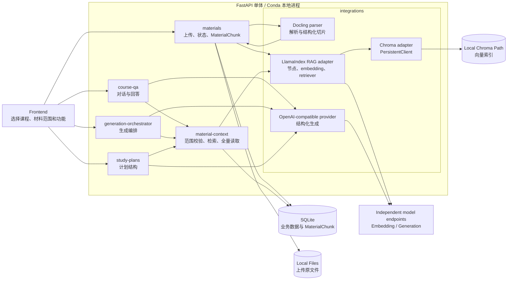
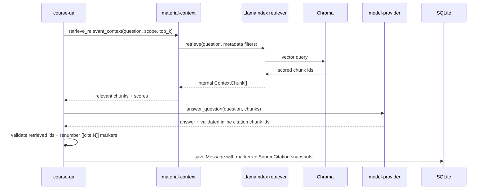
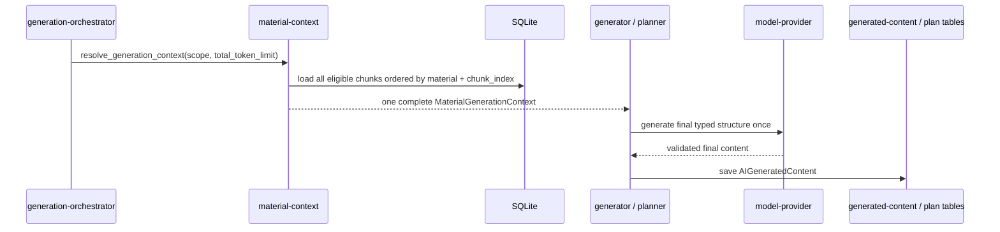

# Material Context and RAG Architecture

> 本文定义资料上传、解析、切片、索引、检索和引用如何嵌入现有 FastAPI 单体，并区分“选定范围问答”和“指定材料生成”两条消费链路。产品口径见 [../product/ai-material-business.md](../product/ai-material-business.md)，技术决策见 [adr/0003-local-rag-stack.md](adr/0003-local-rag-stack.md)。

## 1. 架构结论

当前采用模式一，由 CourseNexus 自建资料上下文与 RAG 能力：

```text
FastAPI + LlamaIndex + Docling + Chroma + OpenAI-compatible APIs
```

这套能力直接嵌入现有 FastAPI 单体，不新增 AI 微服务，不运行 Chroma Server，不使用 Docker。Docling、LlamaIndex 和 Chroma `PersistentClient` 都在后端 Python 进程内调用；SQLite、上传文件和 Chroma 索引分别持久化到本地目录。Embedding 和各类生成调用通过 OpenAI SDK 接口规范访问外部模型服务，不要求使用同一供应商、账号、密钥、地址或模型。

现有架构无需推翻：

- `materials` 继续拥有上传记录、解析状态和 `MaterialChunk`。
- `material-context` 从“顺序读取 chunk 的基础接口”升级为资料范围校验、语义检索和全材料读取的统一入口。
- `course-qa` 只调用问答检索接口。
- `generation-orchestrator` 调用完整材料上下文接口；学习计划和任务内容调用全材料批次接口。
- `model-provider` 继续统一封装 OpenAI-compatible 生成调用。
- `generated-content` 保存统一生成结果；Course QA、handout 和 task_test 等需要追溯的能力继续保存 `SourceCitation`，五类独立 POC 不保存逐条引用。

### 1.1 当前交付边界

当前共享能力已经被问答、五类独立生成、学习计划和任务内容消费。公共层提供：

- Docling 解析、结构化切片、LlamaIndex embedding 编排和 Chroma 本地索引；
- 资料上传、重试解析、删除和重建索引的一致性链路；
- `retrieve_relevant_context()` 问答相关性检索契约；
- `resolve_generation_context()` 五类独立 POC 完整上下文契约；
- `iter_material_context_batches()` 指定材料全覆盖契约；
- 通用结构化模型 provider 协议和材料覆盖执行器；
- fake index、mock provider、契约测试和接入指南。

## 2. 组件拓扑



依赖只能从业务模块指向项目内部上下文接口或 integration 协议。`course-qa`、generator 和 `study-plans` 不得 import `llama_index`、`chromadb`、`docling` 或 `openai`。

## 3. 组件职责

| 组件 | 负责 | 不负责 |
| --- | --- | --- |
| `materials` | 文件安全校验、解析状态、触发解析和索引、保存 `MaterialChunk`。 | 不回答问题，不生成学习内容。 |
| Docling parser adapter | 解析 PDF、DOCX、PPTX、Markdown、文本和图片；保留标题、页码、表格等结构；输出项目内部 `ParsedDocument`。 | 不写数据库，不判断用户权限。 |
| LlamaIndex RAG adapter | 把内部 chunk 转为 node，调用 embedding，写入 Chroma，构造带 metadata filter 的 retriever。 | 不暴露 LlamaIndex 类型给业务层，不生成业务内容。 |
| Chroma adapter | 用本地 `PersistentClient` 持久化向量，按 chunk upsert/delete/query。 | 不保存用户、课程、计划或生成记录。 |
| `material-context` | 校验课程和材料范围；提供相关性检索与全材料覆盖读取；把结果统一为 `ContextChunk`。 | 不调用生成模型，不保存生成结果。 |
| `model-provider` | 通过 OpenAI SDK 规范调用当前业务用途配置的生成模型，返回项目内部 DTO 或经过 schema 校验的结构化结果。 | 不检索资料，不拼材料权限过滤条件，不复用其他用途的模型配置。 |
| `course-qa` | 调用相关性检索，生成并保存回答、会话和引用。 | 不直接读取资料表或向量库，不生成 Flashcard、Mindmap、Quiz 或学习计划。 |
| `generation-orchestrator` / generators（后续消费者） | 后续调用全材料读取，分批生成和汇总目标结构。 | 本轮不实现具体生成器、schema 或提示词。 |
| `study-plans`（后续消费者） | 后续使用全材料上下文生成计划预览。 | 本轮不实现 AI 计划算法，不改变当前计划行为。 |

## 4. 存储和标识

### 4.1 权威数据

- SQLite 的 `CourseMaterial` 是资料元数据、当前操作状态和 `active_parse_version_id` 生效指针的权威来源。
- SQLite 的 `MaterialParseVersion` 记录每轮解析的候选、生效、失败和退休状态；同一资料最多有一个 `building` 版本。
- SQLite 的 `MaterialChunk` 是 chunk 文本、顺序和引用定位的权威来源，每个 chunk 必须属于一个解析版本。
- Chroma 只保存检索索引及查询所需 metadata，可从 SQLite 重建。
- 上传原文件保存在现有本地文件存储目录。

Chroma 不替代 SQLite，不能成为业务记录的唯一来源。删除、重试解析和重建索引都以 `CourseMaterial` / `MaterialParseVersion` / `MaterialChunk` 为准。

### 4.2 Chroma collection

当前只使用一个 collection：`course_nexus_material_chunks`。以 `MaterialChunk.id` 作为 Chroma record id，避免维护第二套 chunk 标识。

每个 record 至少包含：

| metadata | 用途 |
| --- | --- |
| `user_id` | 强制用户隔离。 |
| `course_id` | 强制单课程范围。 |
| `material_id` | 指定资料过滤、删除和重建。 |
| `parse_version_id` | 隔离候选、生效和退休版本，并支持候选完整性校验。 |
| `folder_id` | 保留资料归类元数据；移动资料时同步更新。删除目录会清理其中资料的整组向量，不把目录作为 Agent 范围选择条件。 |
| `chunk_id` | 回查 SQLite 和保存引用。 |
| `chunk_index` | 恢复资料内顺序。 |
| `page` / `page_index` | 引用定位。 |
| `heading` | 检索上下文和引用展示。 |

查询过滤条件必须始终包含 `user_id` 和 `course_id`，显式范围只叠加 `material_scope.material_ids`。检索前从 SQLite 解析当前 scope 的生效 chunk ID，并作为向量查询硬过滤；候选或退休版本即使仍有向量也不能进入结果。文件夹只负责归类，不能转换为批量资料选择。材料范围和生效版本都是硬过滤，不是 prompt 提示。

## 5. 资料摄取链路

```mermaid
sequenceDiagram
    participant M as materials
    participant D as DoclingParser
    participant DB as SQLite
    participant R as LlamaIndexRagAdapter
    participant C as Chroma PersistentClient
    participant O as Embedding Endpoint

    M->>DB: create building MaterialParseVersion
    M->>M: parse_status = parsing; keep old active pointer
    M->>D: parse(local_file_path)
    D-->>M: ordered ParsedChunk[] + source metadata
    M->>DB: insert candidate MaterialChunk[]
    M->>R: index candidate chunks with parse_version_id
    R->>O: embed chunk texts
    O-->>R: vectors
    R->>C: upsert candidate records
    C-->>R: candidate chunk ids
    M->>M: verify SQLite ids == Chroma ids
    M->>DB: retire old active + activate candidate + switch pointer
    M->>M: parse_status = parsed; parse_error = null
```

实现规则：

- Docling 负责文档结构识别，优先使用 `HybridChunker` 生成 token-aware chunk；LlamaIndex 不再次切分这些 chunk。
- LlamaIndex 负责 node / metadata 组织、OpenAI-compatible embedding 和 Chroma retriever 编排。
- chunk id 包含 `parse_version_id`，同一候选内稳定，不同解析版本之间不冲突。
- 重解析不先删除旧内容。只有候选 SQLite chunk、Chroma 向量和两端 ID 完整性校验都成功后，才在数据库事务中把候选切换为 `active`，旧生效版本改为 `retired`。
- 解析、索引、完整性校验或切换失败时，只清理候选 chunk 和候选向量并把候选标为 `failed`。已有 `active_parse_version_id` 时旧版本继续可学习，`parse_error` 记录本次更新失败；首次失败才进入 `parse_failed`。
- `parse_status = parsing` 表示当前有候选正在构建，不表示旧版本不可用；是否可学习以 `active_parse_version_id` / `is_learning_ready` 为准。
- 退休和失败版本本轮不自动清理；全量索引重建只从 SQLite 写入当前生效版本。
- 删除单份资料时物理删除业务记录、chunk、原始文件并按 `material_id` 删除 Chroma records；删除文件夹时对其中全部资料执行同一清理。历史问答和生成内容保留，引用只保留去关联的快照字段。
- 用户原始文件名只作为 `CourseMaterial.name` 展示；本地存储路径使用 ASCII `source.<ext>`。Docling adapter 通过 ASCII `DocumentStream` 读取文件内容，避免 Windows 非 ASCII 路径触发底层 PDF backend 解析失败。

当前 `.txt` / `.md` parser 保留为快速路径和测试替身；`.pdf`、`.docx`、`.pptx`、`.png`、`.jpg`、`.jpeg` 进入 Docling adapter。图片 OCR 已纳入路由和基础错误映射，但 OCR 质量、复杂版面和跨页结构回归夹具后置。

PDF 采用资源受限的两阶段解析：首轮关闭 OCR、强制使用 PDF backend 文本、关闭高级表格结构模型，并把 OCR / layout / table batch 固定为 1、队列固定为 4、CPU thread 固定为 1；只有首轮没有产生任何有效 chunk 时才使用同等资源限制的 OCR profile 整份重试。DOCX、PPTX 和图片继续使用 Docling 默认格式 converter，不改变非 PDF 行为。

Docling conversion 使用 `raises_on_error = false` 获取 `status`、`errors`、处理页和输入页数。`partial_success` 的有效 chunk 必须保留，失败页和稳定 warning 由项目内部 `ParseDiagnostics` 返回，不能因部分失败静默标记为无诊断成功。关闭高级表格结构模型是本地 POC 的稳定性取舍；PDF backend 和 layout 仍提取表格文字，但高级单元格结构恢复不属于本次修复。

## 6. 三类上下文接口

`material-context` 对业务层暴露三种语义不同的接口，不能继续用一个模糊的 `resolve_context()` 同时承担全部任务。

```python
def retrieve_relevant_context(
    *,
    user_id: str,
    course_id: str,
    query: str,
    material_scope: MaterialScope,
    rag_index: RagIndex,
    top_k: int,
) -> MaterialContextResult: ...

def resolve_generation_context(
    *,
    user_id: str,
    course_id: str,
    material_scope: MaterialScope,
    max_tokens: int,
) -> MaterialGenerationContext | None: ...

def iter_material_context_batches(
    *,
    user_id: str,
    course_id: str,
    material_scope: MaterialScope,
    max_tokens: int,
) -> Iterator[MaterialContextBatch]: ...
```

三者都使用项目内部 `ContextChunk`，并统一执行权限、解析状态和材料范围校验。`resolve_generation_context()` 额外合并稳定完整文本并执行总 token 检查；`resolve_context()` 仅作为兼容入口保留。

## 7. 问答类链路：相关性检索

本节是问答模块的接入契约。`course-qa` 生产流程已按该链路接入：问题文本作为检索 query，`material_scope` 转为硬过滤，模型只接收本次检索命中的 chunk。



问答默认 `top_k = 8`，配置可调。命中结果按相似度排序，并回查 SQLite 取得权威文本和定位信息。prompt 使用上下文序号要求模型在相关论述后输出 `[[cite:N]]`；model-provider 将合法上下文序号映射为内部 chunk id，course-qa 再与本次检索结果取交集、去重并转换为从 1 开始的稳定引用序号。模型返回越界序号、未检索 chunk 或伪造标记时删除标记且不保存 fallback 引用。合法引用除资料和 chunk 快照外还保存 `material_version_id`，使重解析后的历史回答仍能指向原输入版本。无可用资料或无检索命中时返回 `no_source` 且不调用模型。

## 8. 指定材料生成链路：两种全材料策略

五类独立 POC 使用完整上下文单次生成；学习计划、handout 和 task_test 等消费者可保留批处理、覆盖核算与引用策略。两种策略都必须覆盖全部选中资料，不能退化为普通 Top-K。

所有生成消费者保存实际读取的 `{material_id, version_id}` 范围快照。五类独立生成和任务内容写入 `material_scope_json.material_versions`；学习计划写入 `parsed_config_json.material_snapshot.material_versions`。快照描述本次输入事实，不会因材料后续重解析而改写。



五类独立 POC 链路不调用普通 Top-K retriever，并满足：

- 所选 parsed chunk 按 `material_id`、`chunk_index` 保持稳定顺序并合并为一个上下文。
- 总 token 超限时在模型调用前返回 `MATERIAL_CONTEXT_TOO_LARGE`，不截断、不改用 Top-K。
- 每个请求只调用一次对应功能模型，最终输出采用各功能的 Pydantic schema。
- 业务 JSON 不包含 chunk/citation ID，成功时只写 `AIGeneratedContent`。

不同功能的输出归属：

| 功能 | 上下文策略 | 保存位置 |
| --- | --- | --- |
| Flashcard / Quiz / Mindmap / Outline / Knowledge List | 完整材料上下文、总 token 检查、单次结构化生成 | `AIGeneratedContent` |
| 学习计划 | 全材料分批提取章节、难度、任务候选后汇总 | `StudyPlan` / `StudyTask` / `StudySubTask` |
| 今日讲义 / 任务测试题 | 对任务关联材料做全覆盖；任务参数决定生成重点 | `AIGeneratedContent` + `SourceCitation` |

## 9. 配置与本地运行

模型配置遵循“一个业务用途一个 endpoint”原则。每个 endpoint 必须分别声明 `*_API_KEY`、`*_BASE_URL` 和 `*_MODEL`；OpenAI SDK 只作为统一调用协议，不代表这些用途共用供应商或凭证。当前用途前缀如下：

| 用途 | 配置前缀 |
| --- | --- |
| 向量化与语义检索 | `EMBEDDING` |
| 课程智能体问答 | `COURSE_QA` |
| Quiz / Flashcard / Mindmap | `QUIZ` / `FLASHCARD` / `MINDMAP` |
| Outline / Knowledge List | `OUTLINE` / `KNOWLEDGE_LIST` |
| 学习计划输入解析 / 计划生成 | `STUDY_PLAN_PARSER` / `STUDY_PLAN_GENERATOR` / `STUDY_PLAN_MAP` |
| 任务讲义 / 任务测试 | `HANDOUT` / `TASK_TEST` |

RAG 相关示例配置：

```dotenv
EMBEDDING_API_KEY=
EMBEDDING_BASE_URL=
EMBEDDING_MODEL=text-embedding-3-small
COURSE_QA_API_KEY=
COURSE_QA_BASE_URL=
COURSE_QA_MODEL=gpt-5.4-mini
CHROMA_PERSIST_PATH=./data/chroma
CHROMA_COLLECTION=course_nexus_material_chunks
RAG_SIMILARITY_TOP_K=8
RAG_CHUNK_MAX_TOKENS=800
MATERIAL_BATCH_MAX_TOKENS=12000
```

学习计划 `generator` 和 `map` 还可分别配置 `STUDY_PLAN_GENERATOR_API_STYLE`、`STUDY_PLAN_MAP_API_STYLE`（`auto`、`responses` 或 `chat`）。`auto` 对 OpenAI 地址使用 Responses API，对 DeepSeek 地址使用 Chat Completions；显式配置只覆盖对应的学习计划 provider，不影响其他模型用途。

本地运行方式：

1. 在现有 `course-nexus` Conda 环境安装 Python 依赖。
2. 使用现有命令启动 FastAPI；第一次使用 Docling 时允许其下载所需模型文件。
3. Chroma 由后端进程级 `RagIndexManager` 通过 `PersistentClient` 打开 `CHROMA_PERSIST_PATH`，不单独启动端口；请求复用同一实例，应用退出只释放引用，不重置持久化数据。
4. SQLite、上传目录和 Chroma 目录都保留在开发机本地，并加入 `.gitignore`；相对路径统一相对仓库配置根目录解析，API、Alembic 与维护命令不得随启动目录改变数据位置。
5. 真实 embedding 至少配置 `EMBEDDING_API_KEY`；真实课程问答至少配置 `COURSE_QA_API_KEY`。各自的 `*_BASE_URL` 和 `*_MODEL` 只作用于对应用途。单元测试使用 fake embedding、fake retriever 和 mock model provider，不访问网络。

旧版本若在 `backend/` 等启动目录遗留 SQLite、上传或 Chroma 数据，规范位置为空时运行入口会拒绝继续并报告迁移目标。程序不自动移动或删除旧数据；备份、迁移和 SQLite 连接基线见 [本地存储运行与迁移](../engineering/local-runtime-storage.md)。

## 10. 错误与一致性

| 场景 | 处理 |
| --- | --- |
| 首次解析遇到不支持文件或 Docling 失败 | 候选标记 `failed`，`parse_status = parse_failed`，记录 `UNSUPPORTED_FILE_TYPE` 或 `PARSE_FAILED`。 |
| 已有生效版本的重解析或 Embedding 失败 | 清理候选 chunk / 向量并记录稳定错误；旧生效版本保持可学习。 |
| 候选 SQLite / Chroma ID 不一致 | 返回 `INDEXING_INCOMPLETE`，候选失败，旧生效版本不变。 |
| 生效切换失败 | 返回 `PARSE_VERSION_SWITCH_FAILED`，删除候选向量和切片，旧生效版本不变。 |
| Chroma 目录损坏或记录缺失 | 返回 `RETRIEVAL_FAILED`；提供按 SQLite 全量重建索引命令。 |
| 资料或文件夹物理删除时 RAG 或 SQLite 提交失败 | SQLite 回滚；暂存文件移回原路径，并用删除前的 SQLite chunk 快照重新索引已解析资料。补偿失败返回 `DELETE_COMPENSATION_FAILED`。 |
| 材料范围包含无权或不存在资料 | 返回 `NOT_FOUND`，不泄露资源存在性。 |
| 问答无命中 | 返回 `answer_type = no_source`，不调用或不采信无依据回答。 |
| 五类独立生成完整上下文超限 | 返回 `MATERIAL_CONTEXT_TOO_LARGE`，不调用模型、不创建历史。 |
| 批处理消费者中单个 batch 失败 | 整次生成标记失败，保留可重试状态，不输出“已覆盖全部材料”的部分结果。 |
| 结构化输出校验失败 | 有限修复后写 `GENERATION_SCHEMA_INVALID`。 |

Chroma 是可重建派生存储。系统提供 `--material-id` 和 `--all` 两级维护入口，但当前不引入后台队列；本地 POC 可同步执行并通过进程退出码和输出计数反映结果。

```powershell
cd backend
python -m app.commands.rebuild_rag_index --all
python -m app.commands.rebuild_rag_index --material-id <material_id>
```

`--all` 只重建当前配置的 CourseNexus Chroma collection，并且只索引每份资料 `active_parse_version_id` 对应的切片；不删除 SQLite 业务数据、上传文件或其他 Chroma collection。`--material-id` 只删除并重建单个资料当前生效版本的派生向量；没有生效版本的资料会清理旧向量并返回 0 个索引 chunk。

## 11. 测试与验收重点

- Docling fixture 能保留 PDF / DOCX / PPTX 的标题、页码和有序文本。
- Chroma 使用临时目录持久化，重启 client 后仍可检索。
- 同一 query 在两个课程或两个用户之间不会串数据。
- `material_scope` 指定资料后，检索结果不包含范围外 chunk。
- 参考问答消费者只暴露 Top-K 命中片段，并将可用引用限制在这些片段内。
- 参考消费者记录每个选中 `material_id` 都进入 map 阶段。
- 超长资料触发多个 batch，覆盖执行器能校验处理材料集合和引用 chunk 集合。
- 候选和退休版本即使保留 SQLite chunk 或 Chroma 向量，也不能被当前上下文或 Top-K 检索命中。
- 解析、索引、完整性校验和生效切换分别注入故障后，旧生效版本仍可问答、生成和制定计划。
- 并发重解析只有一个 `building` 候选可以进入构建。
- 无真实模型 API key 的单元测试和基础开发仍可运行。
- 公共材料上下文测试不替代 Flashcard、Quiz、Mindmap 或 AI 学习计划各自的业务质量验收。
- 图片格式已进入 Docling adapter 路由；OCR 质量、复杂版面和跨页结构回归夹具后置。

## 12. 技术资料

- [FastAPI 官方文档](https://fastapi.tiangolo.com/)
- [LlamaIndex Ingestion Pipeline](https://developers.llamaindex.ai/python/framework/module_guides/loading/ingestion_pipeline/)
- [LlamaIndex Retriever](https://developers.llamaindex.ai/python/framework/module_guides/querying/retriever/)
- [LlamaIndex Chroma integration](https://developers.llamaindex.ai/python/framework/integrations/vector_stores/chromaindexdemo/)
- [Docling 官方文档](https://docling-project.github.io/docling/)
- [Docling 支持格式](https://docling-project.github.io/docling/usage/supported_formats/)
- [Docling Chunking](https://docling-project.github.io/docling/concepts/chunking/)
- [Chroma Python Client / PersistentClient](https://docs.trychroma.com/reference/python/client)
- [Chroma Metadata Filtering](https://docs.trychroma.com/docs/querying-collections/metadata-filtering)
- [OpenAI Embeddings](https://platform.openai.com/docs/api-reference/embeddings)
- [OpenAI Structured Outputs](https://developers.openai.com/api/docs/guides/structured-outputs)
- [RAGFlow GitHub](https://github.com/infiniflow/ragflow)：future 方案，仅在重新评估 ADR 后接入。

## 13. Future：RAGFlow

RAGFlow 不参与当前代码和本地运行。只有出现下列情况时才重新评估：

- 多人需要共享一套常驻资料索引服务；
- 资料解析、OCR 或检索调优已成为主要开发负担；
- 单机 Chroma 的规模、并发或维护能力不足；
- 团队能够承担 RAGFlow 服务及其依赖的部署成本。

届时 CourseNexus 仍保留 `material-context` 的内部接口，由新的 RAGFlow integration 实现摄取和检索；业务模块不直接调用 RAGFlow SDK。
