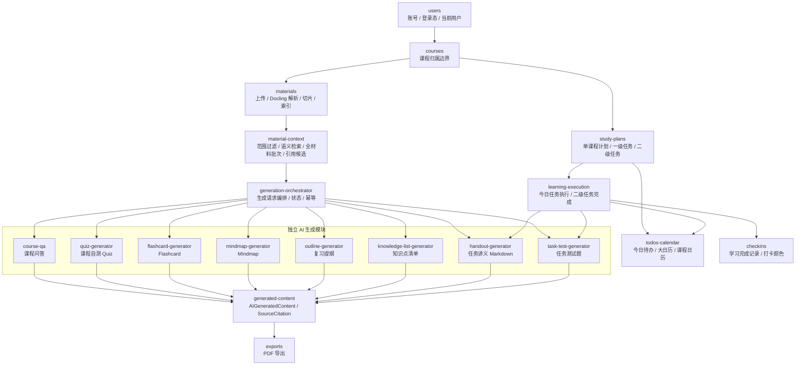
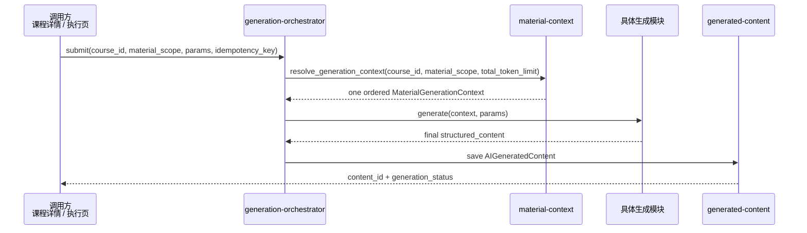

# Module Topology and Boundaries v0.1

## 2026-07-13 Generation Boundary Override

`generation-orchestrator` consumes `material-context.resolve_generation_context`, not Top-K retrieval or batch coverage. A concrete generator sees one `MaterialGenerationContext`, calls only its own model once, and returns final business JSON. Citation persistence is outside the five-module POC. Mindmap may call the `integrations.markmap` adapter after graph validation.

> 本文合并记录功能模块拓扑和模块边界。它回答“系统拆成哪些模块、模块之间怎么依赖、每个模块拥有哪类数据、哪些耦合被禁止”。关键流程见 [runtime-flows.md](runtime-flows.md)，数据字段以 [../api-data/data-model.md](../api-data/data-model.md) 为准。

## 1. 拆分原则

CourseNexus 后端采用 FastAPI 单体应用，但单体不等于随意耦合。模块按“业务能力 + 数据所有权 + 状态流转”划分，而不是按页面或数据库表机械拆分。

核心原则：

- `users` 提供用户身份，`courses` 提供课程归属边界。
- `materials` 是所有 AI 能力的上下文来源，不负责生成。
- `generation-orchestrator` 只编排生成请求，不拥有具体生成能力的内部规则。
- Quiz、Flashcard、Mindmap、复习提纲、知识点清单、今日讲义、任务测试题都是独立生成模块。
- `generated-content` 是生成结果的统一存储，不负责生成逻辑。
- `study-plans` 生成计划和任务结构，不负责日历聚合和任务执行 UI 状态。
- `todos-calendar` 是只读聚合，不拥有写模型。
- `learning-execution` 负责任务执行状态，并作为 S06 任务内容按需生成入口；它不负责计划生成。
- `checkins` 只根据任务完成事实维护学习打卡记录。

## 1.1 当前已落地边界（2026-07-09）

当前基础设施阶段已经落地以下模块边界：

- `users` / `courses`：提供本地账号、token 校验、当前用户依赖和课程归属校验。
- `materials`：拥有资料元数据、本地文件存储、上传校验、解析状态和 `MaterialChunk` 写入。
- `material-context`：作为问答、生成、学习计划共用的资料范围与上下文入口；已提供相关性检索、五类独立生成完整上下文和全材料分批读取三个接口。调用方不得绕过它直接查询 Chroma 或拼装 chunk。
- `course-qa`：拥有会话、消息和课程问答引用保存；已通过 `retrieve_relevant_context()` 接入课程资料相关性检索，不负责 Flashcard、Mindmap、Quiz 或学习计划。
- `model-provider`：所有需要调用 LLM 的地方必须通过 provider 边界；OpenAI-compatible 调用统一集中在 OpenAI SDK provider 实现中，并读取当前业务用途的独立 endpoint 配置。
- `generation-orchestrator`：负责课程归属与注册类型校验、用途模型注入、完整材料上下文交付、总 token 检查、生成器工厂调用和 `AIGeneratedContent` 保存；五类 POC 不创建 `SourceCitation`，具体题型、卡片、导图、提纲或知识点规则仍由各生成器拥有。
- `study-plans`：当前负责单课程计划配置回填、学前诊断题生成、diagnostic_profile 归纳、计划预览、保存和任务结构写入；诊断题使用独立 `study_plan_diagnostic` 模型 purpose，但不负责执行页、日历聚合、打卡或讲义 / 任务测试题生成。
- `todos-calendar`：已实现 S03 五个只读聚合接口，读取学习计划任务树生成首页今日待办、全局月历、全局当日待办、课程月历和课程当日任务；不拥有写模型。
- `study-mode S01`：已固定计划学习模式第一阶段契约和无 migration 结论；S02-S07 只允许复用 13 张核心表，不得创建待办、日历、讲义、任务测试题或导出历史独立表。
- `frontend`：当前只承担最小集成验证工作台，不承载完整资料上传 UI、资料范围选择 UI 或课程问答 UI。

## 2. 模块拓扑图

一句话读图：课程和资料提供上下文；生成编排把上下文交给各独立 AI 生成模块；结果统一落到 `AIGeneratedContent`，需要追溯的能力额外保存 `SourceCitation`；学习计划和执行链路使用生成能力，但不把生成逻辑内嵌到计划模块。

## 3. 模块分层

| 层级 | 模块 | 架构角色 |
| --- | --- | --- |
| 身份与归属层 | `users`、`courses` | 定义“当前用户是谁”和“这份数据属于哪门课程”。 |
| 资料上下文层 | `materials`、`material-context` | 把资料转成可检索、可引用的上下文。 |
| 生成编排层 | `generation-orchestrator` | 处理生成请求、幂等、状态、失败重试和调用独立生成模块。 |
| 独立生成能力层 | `course-qa`、`quiz-generator`、`flashcard-generator`、`mindmap-generator`、`outline-generator`、`knowledge-list-generator`、`handout-generator`、`task-test-generator` | 每个能力只关心自己的输入、生成规则和输出结构。 |
| 内容存储层 | `generated-content` | 统一保存 AI 生成内容和引用来源。 |
| 计划任务层 | `study-plans`、`learning-execution` | 生成任务结构并驱动任务执行状态。 |
| 只读聚合层 | `todos-calendar` | 聚合今日待办、大日历和课程日历视图。 |
| 派生记录层 | `checkins`、`exports` | 根据任务或内容生成派生结果。 |

## 4. 模块边界表

| 模块 | 负责什么 | 拥有 / 主要写入 | 对外输出 | 不负责什么 |
| --- | --- | --- | --- | --- |
| `users` | 注册、登录、退出、修改密码、当前用户识别。 | `User`、登录态。 | 当前用户上下文、登录状态。 | 不查询课程、资料、计划等业务对象。 |
| `courses` | 课程创建、编辑、删除、列表、详情、课程归属校验，以及首页课程卡片的只读摘要。 | `Course`。 | 可访问课程、课程基础信息、课程归属判断、资料数量与今日任务三态摘要。 | 不解析资料，不生成内容，不处理任务状态或写入计划 / 任务数据。 |
| `materials` | 文件 / 链接资料、一级目录归类、上传状态、Docling 解析、资料切片、Chroma 索引编排和资料预览定位。 | `MaterialFolder`、`CourseMaterial`、`MaterialChunk`；触发可重建向量索引。 | 已解析且已索引资料、逐文件资料范围、切片定位信息。 | 不生成回答、卡片、导图或计划；文件夹不作为 Agent 资料范围。 |
| `material-context` | 校验课程和资料范围；为问答执行带硬过滤的语义检索；为五类独立 POC 提供完整上下文；为其他消费者提供全量批次。 | 不单独拥有业务表，读取 `MaterialChunk` 和 Chroma 派生索引。 | `retrieve_relevant_context()`、`resolve_generation_context()`、`iter_material_context_batches()`、`ContextChunk`。 | 不调用生成模型，不保存生成内容，不向业务层暴露 LlamaIndex / Chroma 类型。 |
| `generation-orchestrator` | 接收生成请求、校验权限、校验资料范围、处理幂等、维护生成状态、调用具体生成模块。 | 生成请求状态，可复用 `AIGeneratedContent.generation_status`。 | 生成任务状态、错误码、生成模块调用结果。 | 不写具体业务算法，不直接渲染结果。 |
| `course-qa` | 基于课程资料问答，保存对话消息和引用来源。 | `Conversation`、`Message`、`SourceCitation`。 | `answer_text`、`answer_type`、引用列表。 | 不生成 Flashcard、Mindmap 或学习计划。 |
| `quiz-generator` | 基于完整资料上下文生成课程自测 Quiz。 | `AIGeneratedContent(content_type=quiz)`。 | 题目、选项、答案、解析。 | 不处理任务测试题入口，不保存逐题引用。 |
| `flashcard-generator` | 基于完整资料上下文生成记忆卡片。 | `AIGeneratedContent(content_type=flashcard)`。 | 卡片正面、背面、标签。 | 不处理 Mindmap、Quiz、计划任务，不保存逐卡引用。 |
| `mindmap-generator` | 基于完整资料上下文生成知识结构图。 | `AIGeneratedContent(content_type=mindmap)`。 | 节点、边、层级、Markmap 数据。 | 不保存逐节点引用。 |
| `outline-generator` | 基于完整资料上下文生成复习提纲。 | `AIGeneratedContent(content_type=outline)`。 | 章节化提纲、重点、复习建议。 | 不生成计划任务，不保存逐节引用。 |
| `knowledge-list-generator` | 基于完整资料上下文生成知识点清单。 | `AIGeneratedContent(content_type=knowledge_list)`。 | 知识点、解释、重要程度。 | 不维护学习掌握度模型，不保存逐条引用。 |
| `handout-generator` | 基于当前二级任务和关联资料生成 Markdown 任务讲义。 | `AIGeneratedContent(content_type=handout)`；新生成 handout 不写 `SourceCitation`。 | 完整 Markdown 正文、顶部来源说明、讲义标题。 | 不更新二级任务完成状态，不输出结构化 handout JSON。 |
| `task-test-generator` | 基于测试类二级任务和关联资料生成任务测试题。 | `AIGeneratedContent(content_type=task_test)`、`SourceCitation`。 | 测试题、答案、解析、引用。 | 不等同课程自测 Quiz。 |
| `generated-content` | 统一保存和查询 AI 生成内容、内容类型、生成状态、正文/结构化 JSON 和引用。 | `AIGeneratedContent`、`SourceCitation`。 | 生成内容详情、历史记录、引用来源。 | 不决定具体生成算法，不更新任务完成状态。 |
| `study-plans` | 自然语言配置回填、学前诊断题生成、diagnostic_profile 归纳、计划预览、保存单课程计划、生成一级任务和二级任务。 | `StudyPlan`、`StudyTask`、`StudySubTask`；诊断题/profile 不新增表。 | 诊断问题、diagnostic_profile、计划结构、任务结构。 | 不把配置补问交给诊断模型，不提前生成讲义、任务测试题或学习笔记。 |
| `todos-calendar` | 首页今日待办、首页大日历、全局当日待办弹窗、课程详情页今日任务和课程月历查询。 | 不拥有主写模型，读取 `StudyPlan`、`StudyTask`、`StudySubTask`。 | 日期摘要、最多 3 条任务摘要、课程分组、二级任务数组、执行跳转 ID 和计划详情 `plan_id`。 | 不创建、编辑、删除或重新生成学习计划；不创建 `todos` 或 `calendar_events` 表；不实现 S04-S07。 |
| `learning-execution` | 查询今日任务、展示执行上下文、更新二级任务完成状态，并编排 S06 任务内容按需生成。 | `StudySubTask.status`、派生更新 `StudyTask.status`；S06 写入 `AIGeneratedContent(content_type=handout/task_test)`；`task_test` 继续写 `SourceCitation`，新生成 `handout` 不写逐条引用。 | 今日任务、任务完成结果、执行页上下文、任务讲义和任务测试题生成结果。 | 不生成计划，不管理资料，不直接修改打卡算法。 |
| `checkins` | 根据当日二级任务完成比例维护学习完成记录和颜色等级。 | `CheckinRecord`。 | `completion_ratio`、`color_level`。 | 不做完整统计报表，不做手动打卡。 |
| `exports` | 将已生成 handout Markdown 导出 Markdown/PDF，将 task_test 导出 Markdown。 | 不拥有业务表，读取 `AIGeneratedContent`；task_test 导出可读取 `SourceCitation`。 | Markdown 或 PDF 文件流。 | 不生成讲义正文或测试题正文；不创建 `export_records` 表。 |

## 5. 独立生成模块的统一契约

所有独立生成模块都遵守同一条最小契约：

统一约束：

- 生成模块不能直接读未校验权限的数据。
- 生成模块不能绕过 `material-context` 使用资料。
- 问答调用 `retrieve_relevant_context()`；五类独立 POC 调用 `resolve_generation_context()`；学习计划和任务内容等批处理消费者调用 `iter_material_context_batches()`。任何路径都不能用普通 Top-K 检索替代全材料覆盖。
- 生成模块不能直接写其他模块状态。
- 生成结果必须结构化保存，不能只返回临时文本。
- 声明提供引用的能力必须把真实来源保存到 `SourceCitation`；五类独立 POC 当前不声明逐条引用。资料被用户永久删除后只清空外键，保留历史引用快照。
- 生成失败必须保存或返回 `generation_status = failed` 和稳定错误码。

## 6. 依赖方向

允许的依赖方向：

- `users -> courses -> materials -> material-context -> generation-orchestrator -> generator -> generated-content`
- `materials -> integrations/docling + integrations/rag(llama-index/chroma)`
- `materials -> course-qa.citations.detach_material_references`（仅用于资料物理删除前解除历史引用外键，不删除问答或生成内容）
- `course-qa -> material-context.retrieve_relevant_context`
- `generation-orchestrator -> material-context.resolve_generation_context`
- `study-plans -> material-context.iter_material_context_batches`
- `study-plans -> model-provider(study_plan_parser / study_plan_diagnostic / study_plan_generator)`
- `courses -> study-plans -> learning-execution -> checkins`
- `learning-execution -> material-context.iter_material_context_batches -> handout-generator / task-test-generator -> generated-content`
- `study-plans -> todos-calendar`
- `learning-execution -> todos-calendar`
- `generated-content -> exports`

禁止的依赖方向：

- 具体生成模块互相依赖，例如 Flashcard 调 Mindmap 或 Mindmap 读 Quiz。
- 生成模块直接修改学习计划或任务完成状态。
- 日历聚合模块写 `StudyPlan` 或 `StudySubTask`。
- 前端绕过 API 直接依赖数据库字段细节。
- 任意模块绕过 `user_id` 和 `course_id` 归属校验。

## 7. 数据归属原则

- `User` 是数据隔离根对象。
- `Course` 是学习上下文根对象。
- `CourseMaterial`、`Conversation`、`AIGeneratedContent`、`StudyPlan`、`StudyTask`、`StudySubTask` 必须能追溯到 `Course` 和 `User`。
- `StudyPlan` 本期只绑定一个 `course_id`，不使用 `course_ids`。
- 今日待办和日历是查询投影，不使用 `todos` 或 `calendar_events` 写模型。
- 今日讲义和任务测试题统一落到 `AIGeneratedContent`，不使用 `handouts` 或 `task_tests` 独立表。
- PDF 导出是请求派生文件，不使用 `export_records` 导出历史表。
- `SourceCitation` 创建时必须关联真实资料，并保留资料名、页码或页序号、命中文本片段；来源资料永久删除后允许 `material_id`、`chunk_id` 为空。
- 软删除数据默认不进入前端列表、检索上下文、日历聚合或今日待办。

## 8. 禁止越界事项

- 禁止业务接口只凭前端传入的 ID 查询数据而不校验当前用户归属。
- 禁止 Agent 或生成模块生成没有 `material_id` 的伪引用。
- 禁止 `StudyPlan` 在本期绑定多门课程。
- 禁止首页今日待办和首页大日历承担计划创建、编辑或重新生成能力。
- 禁止计划保存阶段提前生成今日讲义或任务测试题正文。
- 禁止把 Flashcard、Mindmap、Quiz 等能力写成一个互相耦合的大生成模块。
- 禁止为了短期实现绕开 [../api-data/index.md](../api-data/index.md) 中定义的状态、错误码和契约。

## 9. 后续分工方式

当项目基座完成并进入具体模块开发时，应基于本文拆分任务：

1. 先确认模块负责人和模块边界是否稳定。
2. 再确认该模块涉及的 API、数据对象、状态枚举和验收标准。
3. 如果模块需要长期独立维护，按 [../domains/index.md](../domains/index.md) 的规则创建模块文档。
4. 模块开发任务只能细化本模块职责，不应把其他模块内部实现写入自己的任务范围。

## S04/S05 模块边界补充

`learning_execution` 负责学习执行页上下文和二级任务 completion 写事务。它可以读取 `study_plans`、`materials`、`courses`，并在 completion 事务中调用 `checkins.service.recalculate_checkin(..., flush_only=True)`。

`checkins` 负责打卡颜色、比例和 streak 规则。其他模块不得复制颜色阈值或 streak 算法。

`todos_calendar` 保持只读派生查询，不被 S04 调用，也不维护缓存。S04 完成状态变化后，S03 下一次查询自然从 `study_tasks` / `study_subtasks` 读取最新状态。

## S06 模块边界补充

S06 的 public API 放在 `learning_execution`，因为入口是二级任务执行页，而不是课程级生成中心。`learning_execution` 负责校验当前用户、课程、计划、一级任务、二级任务和任务类型，再根据 `StudySubTask.related_material_ids_json` 构造严格材料范围。

S06 不复用通用 `generation-orchestrator` service 的 Top-K / `resolve_context()` 路径；它只复用公共 `Generator` 协议、`GeneratorRegistry`、`ModelProvider`、`iter_material_context_batches()` 和 `run_material_coverage()`。这样可以保证任务内容覆盖二级任务绑定资料，并禁止无来源 fallback 引用。

`handout-generator` 负责输出完整 Markdown 讲义正文，不输出逐条引用；公式分隔符由 handout prompt 约束，前端/PDF 渲染模块负责数学排版，后端生成器不做正则公式改写。`task-test-generator` 继续负责结构化题目和引用 chunk id。两者都不更新 `StudySubTask.status`、不汇总 `StudyTask.status`、不写 `checkin_records`。生成成功或进入生成流程后的失败由 `learning_execution` 保存到 `AIGeneratedContent`。
