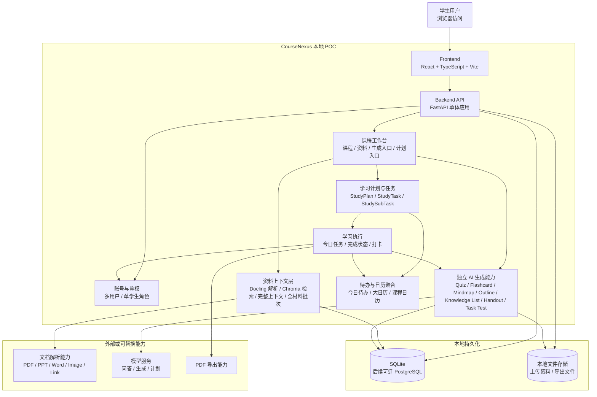

# Architecture Overview v0.1

> 产品架构 L1：系统上下文、能力分层和架构原则。本文回答“CourseNexus 对外是什么系统、内部由哪些能力层组成、为什么这样拆”。技术部署与信任边界见 [topology.md](topology.md)，功能模块拓扑与边界见 [module-boundaries.md](module-boundaries.md)。

## 1. 系统定位

CourseNexus 课枢是面向大学生多课程学习场景的 Agent 学习助手平台。系统围绕“课程资料”构建个人学习工作台，把分散的课件、笔记、教材、链接和复习材料转化为可追溯、可执行的学习路径。

PRD 中的核心闭环可以概括为：

1. 学生创建课程。
2. 学生上传或添加课程资料。
3. 系统解析资料、切片并建立可检索上下文。
4. Agent 基于课程资料进行问答，并展示引用来源。
5. 学生按资料范围生成独立学习辅助内容，例如 Quiz、Flashcard、Mindmap、复习提纲、知识点清单。
6. 学生基于单门课程生成学习计划。
7. 系统把计划拆为每日一级任务和二级任务，并在首页今日待办和大日历中聚合展示。
8. 学生进入计划执行页学习，按需生成今日讲义和任务测试题，完成二级任务后同步打卡颜色。

## 2. 为什么系统不是一个“大 Agent 模块”

CourseNexus 的 AI 能力很多，但它们不是一个混在一起的大 Agent。PRD 中的能力天然分成两类：

- **选定材料范围内的 RAG 问答**：把问题作为检索 query，在用户选定范围内获取最相关片段，再生成带真实引用的回答。
- **指定材料生成**：所有能力都按顺序覆盖全部选中资料；五类独立 POC 合并完整上下文后单次生成，学习计划、今日讲义和任务测试题保留各自的批处理与引用策略。

两类业务共享资料上传、Docling 解析、切片和权限能力，但消费上下文的方式不同：问答追求相关性，使用 Chroma Top-K 检索；指定材料生成追求覆盖率，从 SQLite `MaterialChunk` 读取全部选定内容，再由具体业务决定单次完整上下文或分批处理。

因此架构上采用“课程工作台 + 资料上下文层 + 多个独立生成模块 + 计划执行闭环”的形状：

- 课程工作台负责组织用户、课程、资料、页面入口和归属边界。
- 资料上下文层负责把资料变成可检索、可引用的上下文。
- 每个生成模块都是独立能力单元，只通过统一生成编排和统一内容存储接入主系统。
- 学习计划和任务执行使用生成能力，但不把生成能力嵌进计划模块内部。

这能保证 Flashcard、Mindmap 等模块独立演进：替换提示词、模型、输出结构或渲染方式时，不影响课程、资料、计划和其他生成模块。

## 3. 系统上下文图

一句话读图：学生只接触前端；前端只通过 API 访问后端；后端用账号与课程归属保护所有业务数据；资料上下文层是所有 Agent 与生成能力的共同输入；各生成模块通过统一生成结果回写主系统，需要追溯的能力再保存真实引用。

## 4. 能力分层

| 层级 | 架构角色 | 典型能力 |
| --- | --- | --- |
| 交互层 | 承接学生操作，展示课程、资料、生成内容、计划和任务状态。 | 登录、首页、课程详情、生成内容页面、学习计划页、大日历、计划执行页、个人中心。 |
| API 层 | 暴露 `/api/v1`，处理鉴权、请求校验、错误码和响应结构。 | FastAPI 路由、依赖注入、统一异常处理、请求 ID。 |
| 应用服务层 | 编排业务流程，保持模块边界。 | 课程服务、资料服务、生成编排、计划服务、日历聚合、任务执行。 |
| 资料上下文层 | 把课程资料转成可检索、可合并或可按全材料分批消费的上下文。 | Docling 解析、结构化切片、LlamaIndex 编排、Chroma 索引、资料范围、完整上下文和引用快照。 |
| 独立生成能力层 | 只消费上下文与参数，产出结构化生成结果。 | Agent 问答、Quiz、Flashcard、Mindmap、复习提纲、知识点清单、讲义、任务测试题。 |
| 数据层 | 保存用户、课程、资料、生成内容、计划、任务和打卡记录。 | SQLite、SQLAlchemy、Alembic、文件存储。 |
| 只读聚合层 | 为页面提供可展示的聚合视图，不拥有业务写模型。 | 今日待办、大日历、课程内日历、全局当日待办弹窗。 |

## 5. 核心设计原则

### 5.1 Course 是学习上下文根对象

课程是资料、问答、生成内容、学习计划和任务的基础归属对象。任何业务数据都必须能直接或间接追溯到当前用户拥有的课程。

### 5.2 User 是数据隔离根对象

本期支持多用户，但不做多角色权限。所有业务接口必须校验当前登录用户是否拥有目标课程、资料、对话、生成内容、计划或任务。

### 5.3 资料上下文先于所有 AI 能力

只有 `parse_status = parsed` 的资料可以进入检索、问答、学习辅助生成和学习计划生成。解析失败不能阻塞课程本身，但必须阻止失败资料进入上下文。

### 5.4 AI 生成模块必须独立

Flashcard、Mindmap、Quiz、复习提纲、知识点清单、今日讲义、任务测试题是独立能力模块。它们的共同协议是：

1. 接收 `course_id`、`material_scope` 和模块自己的生成参数。
2. 通过资料上下文层读取可用资料片段。
3. 调用模型或生成器。
4. 输出结构化内容。
5. 保存到 `AIGeneratedContent`。
6. 仅在能力契约要求来源追溯时保存真实 `SourceCitation`；五类独立 POC 当前不保存逐条引用。

它们之间不互相调用，不共享内部状态，不直接修改学习计划或任务状态。

### 5.5 StudyPlan 只绑定单课程

本期一个学习计划只绑定一门课程。首页今日待办和首页大日历可以聚合多个单课程计划，但不能把计划模型改成多课程联合计划。

### 5.6 日历和今日待办是只读聚合

首页今日待办、首页大日历、全局当日待办弹窗和课程内计划学习模式日历只读取计划任务并提供跳转，不负责创建、编辑或重新生成学习计划。

### 5.7 计划执行按需生成

计划保存时只生成任务结构，不提前生成今日讲义、任务测试题或学习笔记。今日讲义和任务测试题在计划执行页或任务测试题页面按需生成。

## 6. 非目标

- 不做教师端、管理员端、班级空间或共享课程空间。
- 不做多角色权限；本期只有学生用户角色。
- 不做多课程联合计划或多课程冲突优化。
- 不做复杂推荐、完整错题本、教学资源市场或大型统计报表。
- 不引入微服务、缓存、复杂队列基础设施、复杂发布体系或大型团队治理。

## 7. 架构阅读路径

- 看系统全局：读本文。
- 看技术组件怎么部署和连线：读 [topology.md](topology.md)。
- 看功能模块怎么拆、模块能做什么和不能做什么：读 [module-boundaries.md](module-boundaries.md)。
- 看主流程怎么跑：读 [runtime-flows.md](runtime-flows.md)。
- 看数据契约：读 [../api-data/index.md](../api-data/index.md)。
