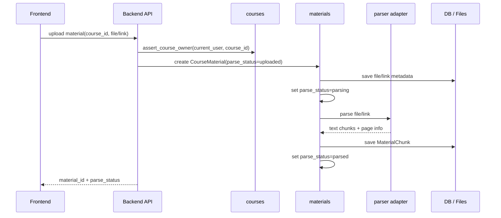
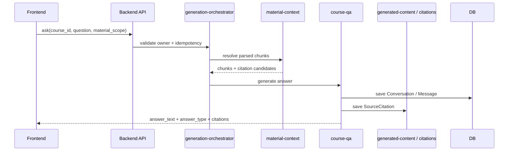
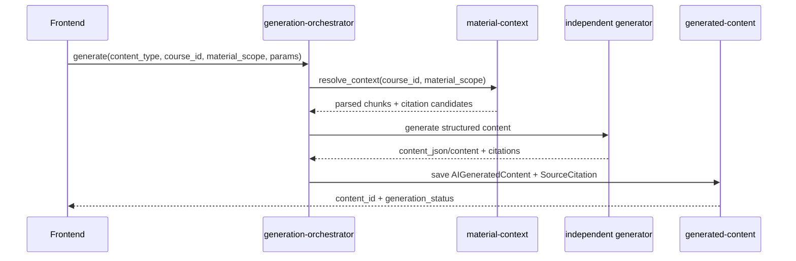
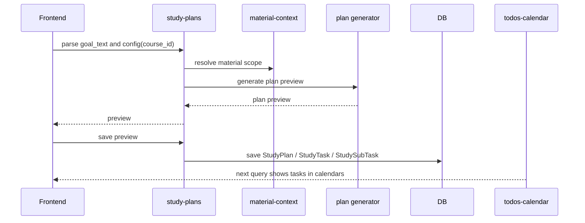
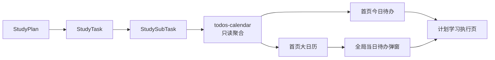
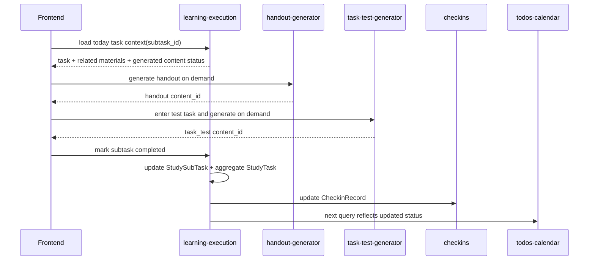
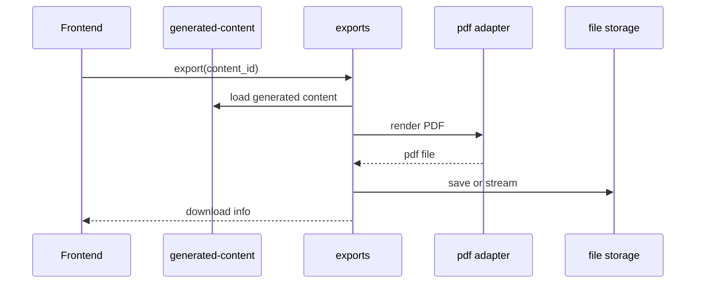

# Runtime Flows v0.1

> 本文记录 CourseNexus 的关键运行链路。它关注模块如何协作，不展开具体 API 字段；字段和响应格式见 [../api-data/index.md](../api-data/index.md)。

## 1. 资料上传与解析链路

失败规则：

- 上传失败不创建可用资料。
- 课程创建成功但资料上传失败时，不回滚课程。
- 解析失败写 `parse_status = parse_failed` 和 `parse_error`。
- 失败资料不得进入检索、问答、生成或计划上下文。

## 2. 课程 Agent 问答链路

规则：

- 默认使用当前课程全部 `parsed` 资料。
- 用户选择资料范围后，只能在该范围内检索。
- 无资料命中时返回 `answer_type = no_source`，并明确提示当前课程资料中未找到直接答案。
- 不允许生成没有真实资料关联的伪引用。

## 3. 独立 AI 生成链路

适用于 Quiz、Flashcard、Mindmap、复习提纲、知识点清单。

解耦规则：

- Flashcard、Mindmap、Quiz 等模块互不依赖。
- 每个模块只关心自己的输出结构。
- 前端渲染方式不影响后端生成模块边界。
- 生成内容统一进入 `AIGeneratedContent`，历史列表按 `content_type` 区分。

## 4. 学习计划生成链路

规则：

- `StudyPlan` 只绑定一个 `course_id`。
- 计划保存只生成任务结构。
- 今日讲义、任务测试题、学习笔记不在计划保存时生成。
- 首页今日待办和大日历通过查询聚合多个单课程计划。

## 5. 今日待办与大日历聚合链路

规则：

- 首页今日待办和首页大日历只负责查看与跳转。
- 日期格展示摘要，不展示完整任务树。
- 点击日期后按课程分组展示当天任务。
- 跳转执行页必须携带 `course_id`、`plan_id`、`task_id`、`subtask_id`。

## 6. 计划学习执行链路

规则：

- 执行页左侧只展示今日任务，不展示整个计划树。
- 讲义和任务测试题按需生成。
- 二级任务完成状态是用户可操作状态。
- 一级任务状态由二级任务汇总。
- 二级任务状态变化必须幂等，并同步打卡记录。

## 7. PDF 导出链路

规则：

- 只导出已生成内容。
- 导出失败不影响内容查看。
- 导出失败返回稳定错误码并允许重试。
