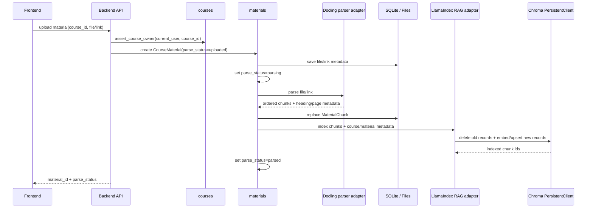
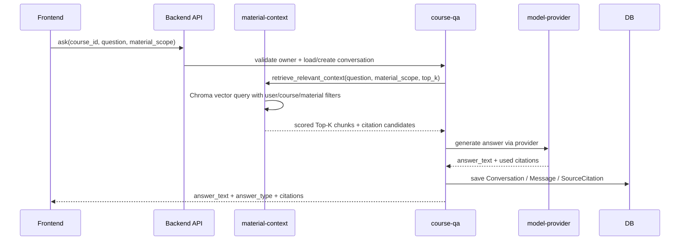
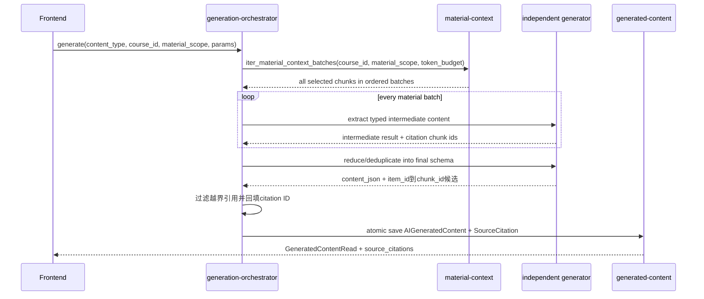
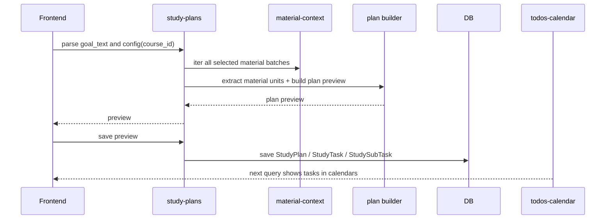
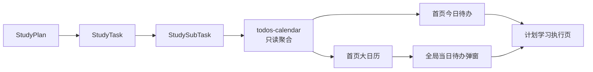
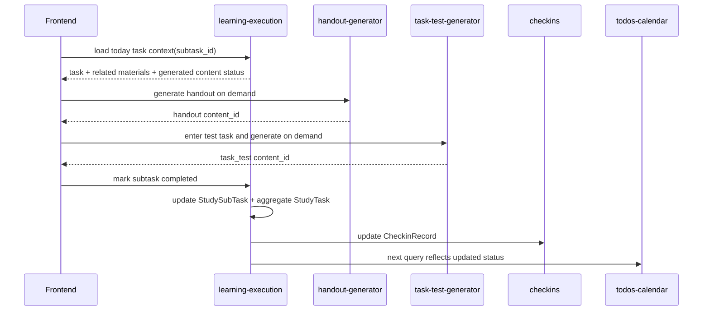
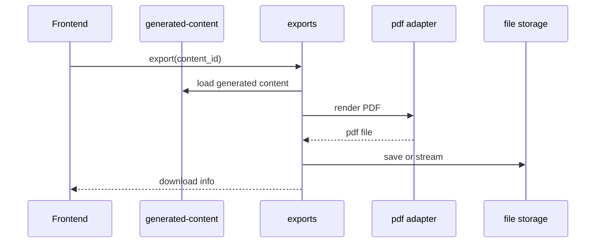
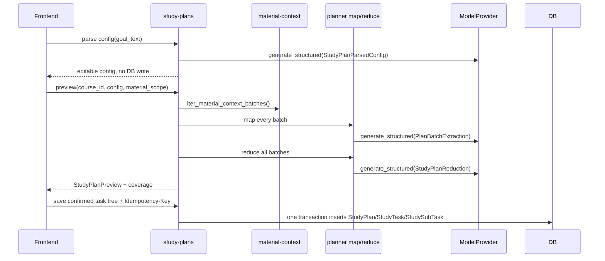

# Runtime Flows v0.1

> 本文记录 CourseNexus 的关键运行链路。它关注模块如何协作，不展开具体 API 字段；字段和响应格式见 [../api-data/index.md](../api-data/index.md)。

## 当前基础设施落地范围（2026-07-10）

当前已落地的 POC 基础链路以稳定后端接口为主：

```text
注册 / 登录 -> 创建课程 -> 上传资料 -> 解析 -> 写入 MaterialChunk -> Chroma 索引 -> retrieve_relevant_context() -> ask_question() -> 保存回答和引用
```

前端在本阶段只承担最小集成验证：API client、token 管理、路由壳、课程列表和课程详情空工作台。资料上传 UI、资料范围选择 UI 和问答 UI 不属于当前基础设施主线验收条件。

当前后端已使用 FastAPI + LlamaIndex + Docling + Chroma + OpenAI-compatible APIs 实现本地 RAG，各模型用途独立配置服务 endpoint。详细设计见 [material-context-rag.md](material-context-rag.md)。

## 1. 资料上传与解析链路



失败规则：

- 上传失败不创建可用资料。
- 课程创建成功但资料上传失败时，不回滚课程。
- 解析失败写 `parse_status = parse_failed` 和 `parse_error`。
- embedding 或 Chroma 写入失败写稳定错误 `INDEXING_FAILED`，并清理本轮部分索引。
- 只有 SQLite `MaterialChunk` 和 Chroma 索引都成功后才进入 `parsed`。
- 删除或重试解析资料时，必须按 `material_id` 删除旧 Chroma records。
- 失败资料不得进入检索、问答、生成或计划上下文。

## 2. 课程 Agent 问答链路



规则：

- 默认使用当前课程全部 `parsed` 资料。
- 用户选择资料范围后，只能在该范围内检索。
- `user_id`、`course_id` 和 `material_scope` 必须转换为 Chroma metadata 硬过滤条件，不能只写进 prompt。
- 无资料命中时返回 `answer_type = no_source`，并明确提示当前课程资料中未找到直接答案。
- 不允许生成没有真实资料关联的伪引用。

## 3. 独立 AI 生成链路

适用于 Quiz、Flashcard、Mindmap、复习提纲、知识点清单。

G01已落地用途模型注入、全材料批次、生成器工厂、引用allow-list与ID回填、原子存储和引用响应。五类真实LLM提示词、map/reduce业务规则和质量验收仍属于G02-G06；在对应任务完成前使用占位fallback。



解耦规则：

- Flashcard、Mindmap、Quiz 等模块互不依赖。
- 每份选中且已解析资料都必须进入至少一个 batch；这条链路不使用普通 Top-K 检索。
- 超长材料使用 map-reduce，不能静默截断后宣称已使用全部材料。
- 每个模块只关心自己的输出结构。
- 前端渲染方式不影响后端生成模块边界。
- 生成内容统一进入 `AIGeneratedContent`，历史列表按 `content_type` 区分。
- 参数、权限和无资料错误不落库；模型、schema和材料覆盖错误保存无部分JSON/引用的failed记录。

## 4. 学习计划生成链路



规则：

- `StudyPlan` 只绑定一个 `course_id`。
- 学习计划属于指定材料生成类，所有选中资料都参与章节、难度和任务候选提取。
- 计划保存只生成任务结构。
- 今日讲义、任务测试题、学习笔记不在计划保存时生成。
- 首页今日待办和大日历通过查询聚合多个单课程计划。

## 5. 今日待办与大日历聚合链路



规则：

- 首页今日待办和首页大日历只负责查看与跳转。
- 日期格展示摘要，不展示完整任务树。
- 点击日期后按课程分组展示当天任务。
- 跳转执行页必须携带 `course_id`、`plan_id`、`task_id`、`subtask_id`。

## 6. 计划学习执行链路



规则：

- 执行页左侧只展示今日任务，不展示整个计划树。
- 讲义和任务测试题按需生成。
- 二级任务完成状态是用户可操作状态。
- 一级任务状态由二级任务汇总。
- 二级任务状态变化必须幂等，并同步打卡记录。

## 7. PDF 导出链路



规则：

- 只导出已生成内容。
- 导出失败不影响内容查看。
- 导出失败返回稳定错误码并允许重试。

## 4.1 S02 学习计划生命周期补充

S02 已把学习计划从占位轮转升级为真实全材料生成：



替换计划使用 `PUT /study-plans/{plan_id}`，先校验 `expected_updated_at`、无进度和无绑定生成内容，再在一次事务中替换任务树。重生成预览只返回 preview，不写数据库。删除计划写软删除状态，默认聚合查询隐藏。