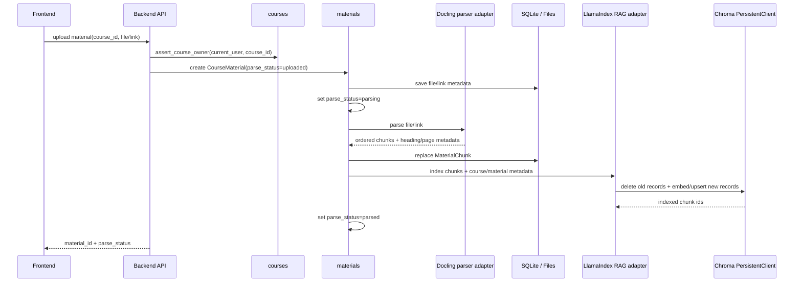
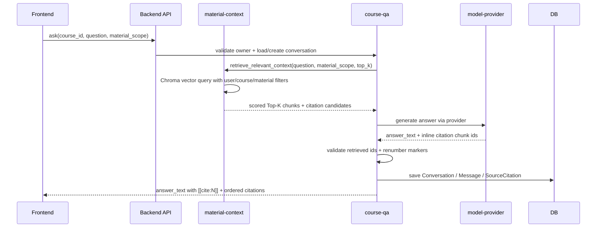
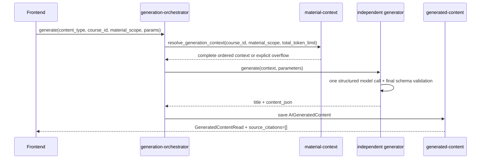
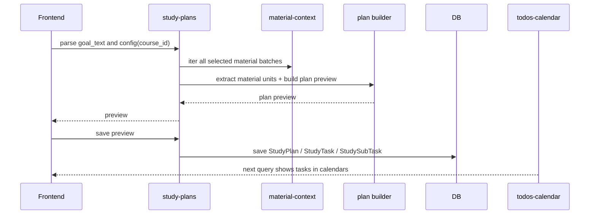
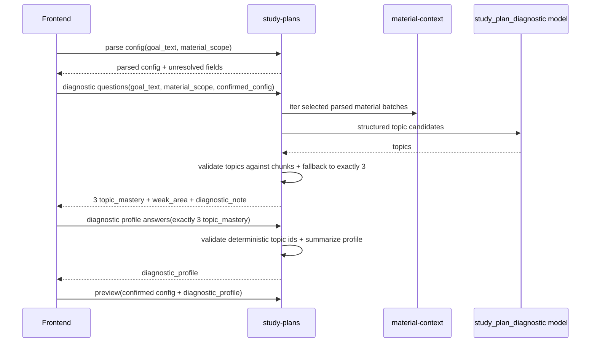
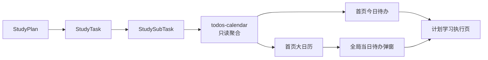
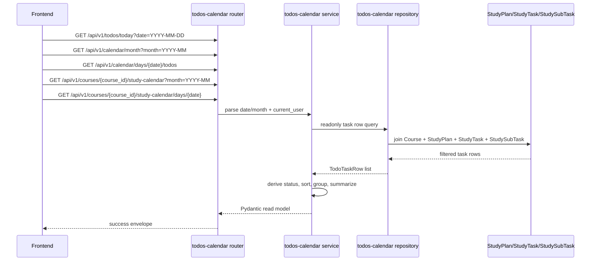
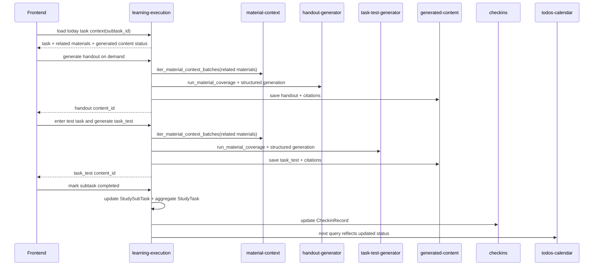
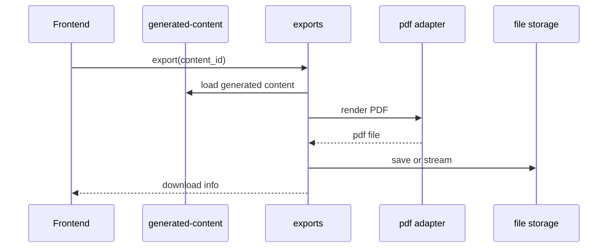
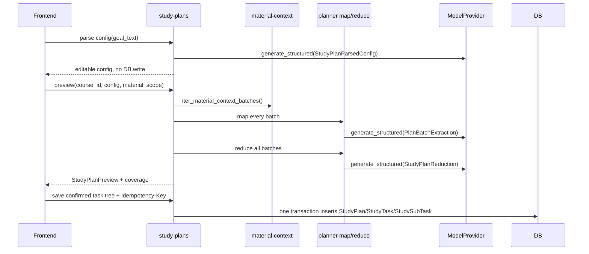

# Runtime Flows v0.1

## 2026-07-13 Independent Generation POC Flow

The five independent generated-content modules use: scope validation -> all parsed chunks in stable order -> one merged context -> total token check -> one structured LLM call -> final schema validation -> stable IDs/order -> `ai_generated_contents`. They do not use batch map/reduce or write citations. Other subsystems may retain their own retrieval or batching flow.

> 本文记录 CourseNexus 的关键运行链路。它关注模块如何协作，不展开具体 API 字段；字段和响应格式见 [../api-data/index.md](../api-data/index.md)。

## 当前基础设施落地范围（2026-07-10）

当前已落地的 POC 基础链路以稳定后端接口为主：

```text
注册 / 登录 -> 创建课程 -> 上传资料 -> 解析 -> 写入 MaterialChunk -> Chroma 索引 -> retrieve_relevant_context() -> ask_question() -> 保存回答和引用
```

前端已承载 V1 浏览器闭环，并通过共享 API client 调用受信 `/api/v1/...` 路径；资料上传、显式范围选择、课程问答、引用定位、内容生成、学习计划、执行与导出均已接入。后端接口、测试与维护命令仍是独立验收边界。

当前后端已使用 FastAPI + LlamaIndex + Docling + Chroma + OpenAI-compatible APIs 实现本地 RAG，各模型用途独立配置服务 endpoint。详细设计见 [material-context-rag.md](material-context-rag.md)。

## 1. 资料上传与解析链路



失败规则：

- 上传失败不创建可用资料。
- 课程创建成功但资料上传失败时，不回滚课程。
- 解析失败写 `parse_status = parse_failed` 和 `parse_error`。
- embedding 或 Chroma 写入失败写稳定错误 `INDEXING_FAILED`，并清理本轮部分索引。
- 只有 SQLite `MaterialChunk` 和 Chroma 索引都成功后才进入 `parsed`。
- 删除或重试解析资料时，必须按 `material_id` 删除旧 Chroma records。
- 失败资料不得进入检索、问答、生成或计划上下文。

## 2. 课程 Agent 问答链路



规则：

- 默认使用当前课程全部 `parsed` 资料。
- 用户选择资料范围后，只能在该范围内检索。
- `user_id`、`course_id` 和 `material_scope` 必须转换为 Chroma metadata 硬过滤条件，不能只写进 prompt。
- 无资料命中时返回 `answer_type = no_source`，并明确提示当前课程资料中未找到直接答案。
- 不允许生成没有真实资料关联的伪引用。
- 新回答和历史消息都返回有序 `source_citations`；`answer_text` 中的 `[[cite:N]]` 只引用该数组第 `N-1` 项。

## 3. 独立 AI 生成链路

适用于 Quiz、Flashcard、Mindmap、复习提纲、知识点清单。

G01-G06 已落地用途模型注入、完整选定材料上下文、总 token 检查、生成器工厂、单次结构化模型调用、最终业务 schema 校验、稳定 ID/顺序和 `AIGeneratedContent` 保存。五类链路不创建生成内容引用；Mindmap 在保存前额外调用后端 `markmap-lib` 预处理 Markdown。



解耦规则：

- Flashcard、Mindmap、Quiz 等模块互不依赖。
- 每份选中且已解析资料的全部 chunk 都进入一个完整上下文；这条链路不使用普通 Top-K 检索。
- 超长材料返回 `MATERIAL_CONTEXT_TOO_LARGE`，不能静默截断后宣称已使用全部材料。
- 每个模块只关心自己的输出结构。
- 前端渲染方式不影响后端生成模块边界。
- 生成内容统一进入 `AIGeneratedContent`，历史列表按 `content_type` 区分。
- 参数、权限、无资料和上下文超限错误不落库；模型、最终 schema 和 Markmap 预处理错误保存无部分 JSON 的 failed 记录。

## 4. 学习计划生成链路



### 4.1 学前诊断题 v2 链路

学习计划新建流程中，配置回填和学前诊断分属两个模型 purpose。前端可以把它们展示在同一个“开始前设置”页面，但后端不能把配置补问交给诊断模型处理。



该链路不新增数据库表，不持久化诊断 session。题目生成正常路径调用一次 `study_plan_diagnostic` 模型；模型失败或输出无法映射到资料时，后端基于当前资料内容 fallback 补足 3 道 topic，并在 `generation_metadata.diagnostic_questions` 中记录来源。
规则：

- `StudyPlan` 只绑定一个 `course_id`。
- 学习计划属于指定材料生成类，所有选中资料都参与章节、难度和任务候选提取。
- 计划保存只生成任务结构。
- 今日讲义、任务测试题、学习笔记不在计划保存时生成。
- 首页今日待办和大日历通过查询聚合多个单课程计划。

## 5. 今日待办与大日历聚合链路



规则：

- 首页今日待办和首页大日历只负责查看与跳转。
- 日期格展示摘要，不展示完整任务树。
- 点击日期后按课程分组展示当天任务。
- 跳转执行页必须携带 `course_id`、`plan_id`、`task_id`、`subtask_id`。
### 5.1 S03 今日待办与日历只读查询流

S03 将 S02 已保存的 `StudyPlan -> StudyTask -> StudySubTask` 任务树投影为五类只读查询：



查询规则：

- repository 只读联表查询，固定过滤 `user_id`、课程归属、课程软删除、计划软删除和目标日期或月份。
- service 只负责日期/月解析、派生状态校验、课程分组、月历摘要和稳定排序，不执行 `add`、`delete`、`flush` 或 `commit`。
- 首页今日待办返回一级任务和嵌套二级任务，前端默认折叠；二级任务点击进入 S04 执行页。
- 全局月历只返回日期摘要、计数、最多 3 条一级任务摘要和 `hidden_task_count`，不返回完整二级任务树。
- 全局当日待办按课程分组；课程月历和课程当日任务只读取路径中的 `course_id`，跨用户或已删除课程返回 `NOT_FOUND`。
- 一级任务详情不由 S03 新增接口实现；前端使用返回的 `plan_id` 复用 `GET /api/v1/study-plans/{plan_id}`。
- S03 不创建 `todos`、`calendar_events` 或任何日历写模型，不更新任务状态，不写打卡；S04 后续提交状态后，下一次查询自然反映最新任务状态。

## 6. 计划学习执行链路



规则：

- 执行页左侧只展示今日任务，不展示整个计划树。
- 讲义和任务测试题按需生成，并统一写入 `ai_generated_contents`。
- S06 生成只读取二级任务 `related_material_ids_json`，不使用 Top-K 或 `resolve_context()`。
- 生成内容不会改变任务完成状态，也不会写打卡。
- 二级任务完成状态是用户可操作状态。
- 一级任务状态由二级任务汇总。
- 二级任务状态变化必须幂等，并同步打卡记录。

## 7. PDF 导出链路



规则：

- 只导出已生成内容。
- 导出失败不影响内容查看。
- 导出失败返回稳定错误码并允许重试。

## 4.1 S02 学习计划生命周期补充

S02 已把学习计划从占位轮转升级为真实全材料生成：



替换计划使用 `PUT /api/v1/study-plans/{plan_id}`，先校验 `expected_updated_at`、无进度和无绑定生成内容，再在一次事务中替换任务树；重生成预览使用 `POST /api/v1/study-plans/{plan_id}/regeneration-previews`，只返回 preview，不写数据库；删除计划使用 `DELETE /api/v1/study-plans/{plan_id}` 写软删除状态，默认聚合查询隐藏。

### S04/S05 学习执行与打卡运行流

执行上下文流：客户端携带 `subtask_id` 请求 execution context；后端从二级任务追溯父任务、计划和课程，校验用户归属，只返回父任务业务日期当天的同计划任务列表和关联资料摘要。

完成事务流：客户端提交 `{completed: boolean}`；后端在单事务中写二级任务、汇总父任务、汇总计划、调用 S05 重算父任务日期打卡，最后统一 commit。任一步失败都会 rollback。

打卡查询流：单日查询优先读取持久化记录，记录不存在时只读计算 DTO；范围查询只返回已形成记录并派生 streak summary。

### S06 任务内容生成运行流

任务内容生成流：客户端对二级任务调用 handout 或 task-test endpoint；后端先校验用户和任务归属，再校验二级任务类型是否匹配内容类型。`learn` / `review` 只能生成 handout；`quiz` / `test` 只能生成 task_test。

材料上下文流：后端只读取 `StudySubTask.related_material_ids_json`，构造 `MaterialScope(include_all_parsed_materials=false)`，通过 `iter_material_context_batches()` 获取全材料批次，再用 `run_material_coverage()` 确认所有关联资料都被覆盖。

落库流：生成器返回结构化 `GeneratorOutput` 和引用 chunk id 后，`learning_execution` 写入 `AIGeneratedContent` 与 `SourceCitation`。成功记录的 id 会在后续 execution context 中作为最近成功 `handout_content_id` 或 `task_test_content_id` 返回。进入生成流程后的失败也会保存 `generation_status=failed` 和稳定 `error_code`。
