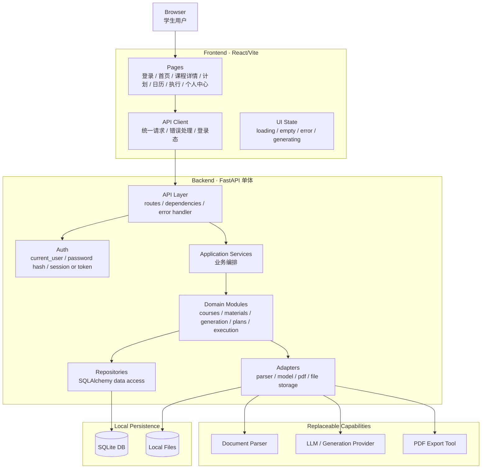
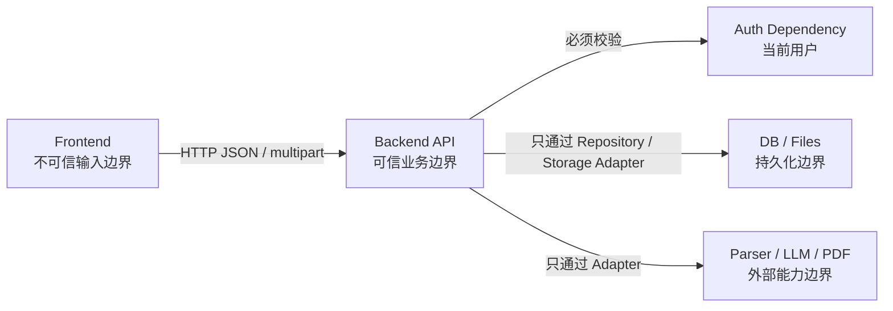

# Technical Topology v0.1

> 技术架构 L1：部署形态、组件拓扑、信任边界和数据流向。本文回答“CourseNexus 本地 POC 实际怎么跑、前后端怎么连、后端内部怎么分层、哪些边界不能被绕过”。

## 1. 部署形态

v0.1 是本地 POC，采用前后端分离部署：

| 组件 | 技术 | 运行方式 | 职责 |
| --- | --- | --- | --- |
| Frontend | React + TypeScript/TSX + Vite | pnpm 启动本地开发服务 | 页面、路由、交互状态、API 调用。 |
| Backend API | Python + FastAPI | conda 环境启动本地服务 | 鉴权、API、业务编排、资料解析编排、AI 生成编排、数据读写。 |
| Database | SQLite | 本地文件 | POC 数据持久化，后续可迁 PostgreSQL。 |
| File Storage | 本地目录 | 本地文件系统 | 上传资料、解析中间产物、导出文件。 |
| Model / Parser / Export Adapters | Python 适配层 | 后端内调用或可替换外部能力 | 文档解析、模型生成、PDF 导出。 |

当前不引入 Redis、独立队列、微服务、Kubernetes 或复杂发布体系。

## 2. 技术拓扑图

## 3. 后端分层

| 层 | 职责 | 不做什么 |
| --- | --- | --- |
| API Layer | 路由、请求校验、依赖注入、统一错误响应、HTTP 状态码。 | 不写复杂业务流程，不直接拼 SQL。 |
| Auth / Core | 配置、当前用户、密码哈希、登录态、错误码、日志。 | 不拥有课程或资料业务。 |
| Application Services | 编排跨模块流程，例如“上传资料后进入解析状态”、“生成内容后保存引用”。 | 不直接处理 HTTP 细节。 |
| Domain Modules | 模块内部规则和状态流转。 | 不越权修改其他模块内部状态。 |
| Repositories | SQLAlchemy 查询和持久化。 | 不做业务决策。 |
| Adapters | 文件解析、模型调用、PDF 导出、文件存储等可替换能力。 | 不保存业务状态。 |

## 4. 信任边界

边界规则：

- 前端是用户输入边界，不能承担权限判断的最终责任。
- 后端 API 是业务可信边界，所有资源访问必须校验当前用户归属。
- 数据库和文件系统只能通过 repository / storage adapter 访问。
- 模型、解析器和 PDF 工具是可替换能力，不能直接拥有业务数据。
- 外部能力返回的内容必须经过后端校验、状态记录和错误处理后再进入业务存储。

## 5. 数据与文件流向

| 流向 | 说明 |
| --- | --- |
| 上传资料 | 前端 multipart 上传到后端；后端保存文件和 `CourseMaterial`；解析过程写 `parse_status`。 |
| 资料解析 | parser adapter 读取文件，输出文本、页码或页序号；后端写 `MaterialChunk`。 |
| Agent / 生成 | generation-orchestrator 从 `material-context` 取切片，调用模型 adapter，写 `AIGeneratedContent` 和 `SourceCitation`。 |
| 学习计划 | study-plans 调用模型或规则生成计划结构，写 `StudyPlan`、`StudyTask`、`StudySubTask`。 |
| 日历聚合 | todos-calendar 只读查询 `StudyTask`、`StudySubTask`，按日期和课程聚合。 |
| 任务完成 | learning-execution 更新 `StudySubTask`，汇总 `StudyTask`，触发 checkins 更新。 |
| PDF 导出 | exports 读取已生成内容，调用 PDF adapter，写出文件或返回下载信息。 |

## 6. 本地 POC 的可替换点

- SQLite 可替换为 PostgreSQL；SQLAlchemy 模型和 Alembic migration 应避免 SQLite 专有能力。
- 本地文件存储可替换为对象存储。
- 文档解析 adapter 可替换实现。
- LLM / 生成 provider 可替换。
- PDF 导出 adapter 可替换。
- 长耗时任务当前可用状态字段表达，后续可引入后台任务队列，但必须新增 ADR。

## 7. 拓扑约束

- 不允许前端直连数据库或文件系统。
- 不允许具体生成模块直接访问未校验权限的资料。
- 不允许 adapter 写业务表，业务状态必须由 domain service 统一保存。
- 不允许日历聚合模块写计划或任务主状态。
- 不允许把外部模型返回直接作为可信数据写入引用来源；引用必须能回到真实 `CourseMaterial` / `MaterialChunk`。
