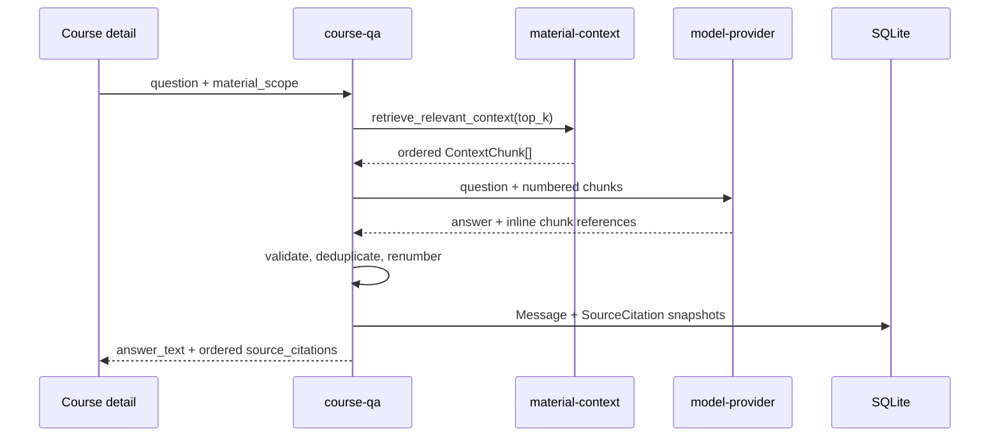

# Course QA 课程资料问答

## 目标与范围

课程资料问答在当前用户、单课程和显式资料范围内执行 Top-K 检索，生成基于命中资料的回答，并保存可追溯的行内引用。当前范围包含会话、消息、引用快照、新回答和历史消息接口；不包含资料原文预览、PDF 页内跳转和会话管理完整前端。

## 代码入口与边界

- HTTP：`backend/app/modules/course_qa/router.py`
- 编排与引用校验：`backend/app/modules/course_qa/service.py`
- 查询与持久化：`backend/app/modules/course_qa/repository.py`
- API schema：`backend/app/modules/course_qa/schemas.py`
- 模型协议：`backend/app/integrations/model_provider/base.py`
- OpenAI-compatible 实现：`backend/app/integrations/model_provider/openai.py`

`course-qa` 只能通过 `material-context.retrieve_relevant_context()` 获取资料，不能直接查询资料 chunk 或向量库；model-provider 不负责用户、课程或资料范围权限。

## 请求与数据流



历史消息查询先按时间读取 `Message`，再批量读取这些消息的 `SourceCitation`，按 `message_id`、`sort_order`、`id` 稳定排序后组装，避免逐消息 N+1 查询。

## 行内引用算法

1. prompt 将检索 chunk 标为从 1 开始的上下文序号，并要求模型在相关论述后输出 `[[cite:N]]`。
2. model-provider 只把落在本次上下文范围内的 `N` 映射为内部 chunk id；越界标记直接删除。模型偶发输出的单层 `[cite:N]` 也会先按同一范围校验并规范化，避免原始标记泄漏。
3. course-qa 将 provider 返回的 chunk id 与本次检索结果取交集，按首次出现去重。
4. 内部 chunk 标记转换为连续的 `[[cite:1]]`、`[[cite:2]]`，并以同序保存 `SourceCitation`。
5. provider 返回了有效引用 id 但没有行内标记时，兼容路径把引用角标附加到回答末尾；未检索或伪造 id 不生成引用。

不变量：`answer_text` 中每个合法 `[[cite:N]]` 都满足 `1 <= N <= len(source_citations)`，每条引用都来自本次实际检索结果。前端对历史消息中的 `[cite:N]` 做同范围的防御性渲染，但不会为越界序号创建引用。

## 复杂度与资源预算

- 检索结果最多为配置的 `RAG_SIMILARITY_TOP_K`，默认 8。
- 引用校验和编号对命中 chunk 与回答文本近似为 `O(K + T)`，`K` 为命中数、`T` 为回答长度。
- 历史消息使用两次查询组装，时间复杂度 `O(M + C)`，其中 `M` 为消息数、`C` 为引用数。
- 每条引用快照的 `hit_text` 最多保存 chunk 前 500 个字符，避免重复保存完整资料。

## 失败与补偿

- 没有 parsed 资料或没有检索命中：保存 `no_source` 回答，不调用模型，不保存引用。
- 模型失败：保存失败消息并返回稳定生成错误；不会保存部分引用。
- 越界或伪造引用：删除标记，不保存 fallback 引用。
- 来源资料物理删除：引用外键置空，但保留资料名、位置与片段快照供历史回答展示。

## 测试入口

- `backend/tests/modules/course_qa/test_course_qa_service.py`
- `backend/tests/modules/course_qa/test_course_qa_api.py`
- `backend/tests/integrations/test_openai_model_provider.py`

定向验证：

```powershell
cd backend
conda run -n course-nexus python -m pytest tests/integrations/test_openai_model_provider.py tests/modules/course_qa/test_course_qa_service.py tests/modules/course_qa/test_course_qa_api.py -q
```
