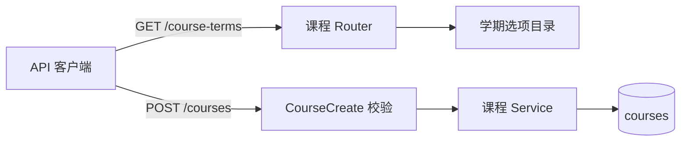

# 课程领域

## 1. 业务定位

课程是资料、问答、生成内容和学习计划的基础归属对象。当前后端支持当前用户创建、读取、更新和软删除课程。

学期是可选字段。用户只能从后端统一选项中选择，默认“未选择”并保存为 `null`，不能输入自由文本。

## 2. 所有权与代码地图

- 后端入口：`backend/app/modules/courses/router.py`。
- 请求与响应 schema：`backend/app/modules/courses/schemas.py`。
- 学期标准值目录：`backend/app/modules/courses/terms.py`。
- 课程服务与持久化：`backend/app/modules/courses/service.py`、`repository.py`、`models.py`。
- 后端 API 测试：`backend/tests/modules/courses/test_courses_api.py`。

课程模块拥有课程基础字段，其他模块只能通过 `course_id` 引用课程并遵守用户归属与软删除边界。

## 3. 实现架构

选项读取不访问数据库；创建和更新请求先经过 Pydantic 枚举校验，通过后才进入服务和持久化。课程写入沿用现有同步事务边界。

## 4. 数据、状态与接口

- `term` 数据库列为可空字符串，默认 `null`。
- 创建和更新 API 只接受 `GET /api/v1/course-terms` 返回的 `value` 或 `null`。
- 选项响应为 `{value, label}`；`value` 用于存储和筛选，`label` 用于展示。
- 首批覆盖 `2024-2025` 至 `2027-2028` 学年的秋季和春季。
- 非标准值由请求校验返回 `422 VALIDATION_ERROR`，不会写入数据库。
- 课程状态继续使用 `active`、`archived`、`deleted`；删除为软删除。

## 5. 核心算法

### 5.1 输入、输出与不变量

输入 `term` 为选项目录中的稳定值或 `null`。输出课程保持原值；任何新写入的非空学期都必须能在选项目录中找到。

### 5.2 算法步骤

1. 客户端加载后端学期选项，并把“未选择”转换成 JSON `null`。
2. 后端 schema 校验 `term`；非法值在服务调用前失败。
3. 服务把通过校验的值原样写入课程记录。

选项读取保持声明顺序，无查询、去重、重试或补偿步骤。

### 5.3 复杂度与资源预算

学期选项是固定小目录，读取和序列化的时间、空间复杂度均为 `O(n)`，当前 `n = 8`。创建和更新课程仍为单条记录写入，不增加数据库查询。

失败发生在数据库写入前，无部分写入和补偿需求。

## 6. 测试与验收

- 后端：验证选项内容、鉴权、默认 `null`、标准值写入，以及创建和更新拒绝自由文本。
- 验证命令：`conda run -n course-nexus python -m pytest tests/modules/courses`。

## 7. 决策、限制与演进

- 数据库不使用原生枚举或固定 `CHECK`，避免增加学期选项时必须迁移数据库；API 是规范写入边界。
- `CourseRead.term` 保持可空字符串，以便读取已有 POC 数据；新的创建和更新请求执行严格校验。
- 后续增加学年、夏季或小学期时，应同步扩展后端目录和 API 契约测试；客户端应通过选项接口获取列表，不硬编码选项。
- 本次只实现后端能力和契约文档，前端下拉框由前端任务接入。

最后更新：2026-07-12。
