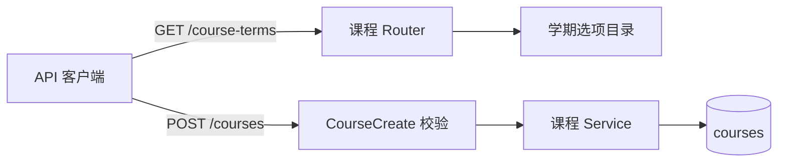

# Courses Domain

## 概述

课程领域负责系统首页课程工作台、课程基础信息管理，以及课程学期选项契约。课程是资料、问答、生成内容和学习计划的基础归属对象。

当前实现同时包含：

- 后端课程 CRUD：当前用户可创建、读取、更新和软删除课程。
- 后端统一学期选项：`GET /api/v1/course-terms` 返回可写入的学期 `value` 和展示 `label`。
- 前端首页课程工作台：读取真实课程列表，支持创建、编辑、删除、学期筛选和课程卡片进入详情页。

首页今日待办和日历仍保持真实空态；在后端聚合接口落地前，不展示伪造任务、统计、推荐或计划进度。首页采用固定高度工作台布局，课程概览区域内部滚动。

## 业务目标

- 帮助学生进入系统后快速看到课程列表，并进入对应课程详情工作台。
- 让课程基础信息的创建、编辑、删除和学期筛选与后端接口一致。
- 在没有学习计划聚合数据时展示清晰空态，不伪造待办、日历或进度。
- 让学期字段使用统一枚举，避免前端自由输入或不同页面各自硬编码。

## 当前范围

- 已实现：`GET /api/v1/courses` 读取当前登录用户课程列表，覆盖 loading、empty、error、ready 状态。
- 已实现：`POST /api/v1/courses`、`PATCH /api/v1/courses/{course_id}`、`DELETE /api/v1/courses/{course_id}`。
- 已实现：创建课程弹窗只负责课程基础信息；创建成功后进入新课程详情页，并自动弹出可关闭的上传资料提示。
- 已实现：编辑课程通过首页课程卡片菜单打开弹窗，只修改名称、简介、教师、学期；保存成功后停留在首页并更新卡片。
- 已实现：删除课程通过首页课程卡片菜单打开确认弹窗；确认成功后停留在首页并移除卡片。
- 已实现：课程卡片整体可点击进入 `/courses/{id}`；卡片菜单独立处理编辑和删除，不触发详情页跳转。
- 已实现：后端统一课程学期选项，前端应通过 `GET /api/v1/course-terms` 获取选项，不再硬编码正式选项。
- 已实现：首页日历支持切换月份、在月份标题下方打开内联年月选择、点击日期进入 `/calendar` 大日历占位页；占位页不展示伪造任务。
- 未实现：创建课程弹窗内同步上传初始资料或添加链接；资料上传统一放在课程详情页处理。
- 未实现：资料数量聚合、今日待办聚合、首页大日历聚合、计划生成页跳转。

## 代码入口

- 首页页面入口：`frontend/src/pages/HomePage.tsx`
- 首页课程工作台：`frontend/src/features/courses/HomeWorkbench.tsx`
- 首页样式：`frontend/src/features/courses/home-workbench.css`
- 前端课程 API adapter：`frontend/src/features/courses/api.ts`
- 后端课程 Router：`backend/app/modules/courses/router.py`
- 后端课程 schema：`backend/app/modules/courses/schemas.py`
- 后端学期选项目录：`backend/app/modules/courses/terms.py`
- 后端课程服务与持久化：`backend/app/modules/courses/service.py`、`backend/app/modules/courses/repository.py`、`backend/app/modules/courses/models.py`

## 模块边界

- `HomePage` 只负责挂载首页工作台。
- `features/courses/HomeWorkbench.tsx` 承载首页 UI 状态、课程列表、创建/编辑弹窗、删除确认、学期筛选和卡片跳转。
- `features/courses/api.ts` 负责课程接口与后端契约适配；UI 组件不得直接拼接课程 API 请求。
- 首页课程卡片只消费 `CourseRead` 中已有字段；资料数量、今日任务数量和计划进度在对应后端聚合接口落地前不伪造。
- 今日待办、日历和学习计划真实状态属于 `study-mode` / `todos-calendar` 相关领域；课程首页只能展示后端聚合结果。
- 其他模块只能通过 `course_id` 引用课程，并遵守用户归属与软删除边界。

## 学期契约

- `GET /api/v1/course-terms` 返回 `{ value, label }[]`。
- `value` 用于保存、更新和筛选，例如 `2025-2026-spring`。
- `label` 用于界面展示，例如 `2025-2026 春季`。
- “未选择”在请求中保存为 `null`。
- 当前首批后端选项覆盖 `2024-2025` 至 `2027-2028` 学年的秋季和春季。
- 创建和更新接口只接受后端选项目录中的 `value` 或 `null`；非法非空值由请求校验返回 `422 VALIDATION_ERROR`。
- `CourseRead.term` 仍保持可空字符串，以便读取已有 POC 数据；新的写入由 schema 严格校验。
- 后续增加学年、夏季或小学期时，应扩展后端目录和 API 契约测试，前端通过选项接口自动获取。

## 状态流转

- 课程概览 loading：显示课程加载文案和课程卡片骨架。
- 课程概览 ready：展示后端返回的当前用户课程，课程详情链接使用后端课程 `id`。
- 课程概览 empty：后端返回空列表时只展示添加课程入口，不额外展示“还没有课程”说明卡片。
- 课程概览 error：展示后端错误文案和“重试加载课程”按钮，不回退到 mock 课程。
- 加载学期选项：前端请求 `GET /api/v1/course-terms`；失败时不允许提交非标准学期，并显示待重试状态。
- 创建课程：点击添加课程入口打开弹窗；课程名称必填，简介、教师、学期可选；提交时调用 `POST /api/v1/courses`；成功后跳转到 `/courses/{id}` 并请求详情页自动弹出上传资料提示。
- 编辑课程：课程卡片菜单打开编辑弹窗；保存时调用 `PATCH /api/v1/courses/{course_id}`；成功后替换当前首页列表中的课程卡片，不跳转。
- 删除课程：课程卡片菜单打开删除确认弹窗；确认后调用 `DELETE /api/v1/courses/{course_id}`；成功后从首页列表移除课程，不跳转。
- 今日待办：在后端计划聚合接口落地前只展示无计划占位，不展示具体任务、任务数量或计划生成入口。
- 日历：展示当前月份空日历，不展示虚构任务圆点或任务日期；左右箭头只切换本地月份视图，点击日期进入 `/calendar` 占位页等待真实聚合接口。

## 关键决策

- 首页采用 Mantine 组件和局部 CSS，遵守工作台视觉规范，不做营销型 hero。
- 创建课程弹窗只创建课程基础信息，不同步上传资料或添加链接；资料上传统一在课程详情页资料工作台处理。
- 首次创建课程成功进入课程详情页后，前端自动弹出可关闭的上传资料提示，引导用户继续上传资料但不阻塞课程创建结果。
- 学期字段以后端 `GET /api/v1/course-terms` 为唯一正式来源，前端不维护独立正式枚举。
- 课程卡片颜色使用固定调色板按课程顺序循环分配；后端当前没有课程颜色字段。
- 后端课程对象当前没有资料数量、今日任务数量或首页计划进度字段；首页只显示“资料待接入 / 今日任务待接入”等明确待接入标记。
- 日历日期格保留任务圆点容器，但当前后端没有首页日历聚合数据，所以不填充圆点；未来任务圆点颜色应来自对应课程卡片主题色或后端颜色字段。
- 主题切换已具备前端功能骨架，会把浅色 / 深色模式写入本地存储并标记到 `documentElement`；当前已补充按钮、菜单、弹窗、输入框和资料区的基础暗色对比度，视觉细节可在后续统一优化。

## 后端实现说明



学期选项读取不访问数据库；创建和更新请求先经过 Pydantic 枚举校验，通过后才进入服务和持久化。课程写入沿用现有同步事务边界。

学期选项是固定小目录，读取和序列化时间、空间复杂度均为 `O(n)`，当前 `n = 8`。非法学期值在数据库写入前失败，无部分写入和补偿需求。

## 测试与验证

- 前端首页测试：`frontend/tests/pages/home-page.test.tsx`
- 前端课程 API adapter 测试：`frontend/tests/features/courses/api.test.ts`
- 前端路由测试：`frontend/tests/pages/app-router.test.tsx`
- 后端课程 API 测试：`backend/tests/modules/courses/test_courses_api.py`
- 前端验证命令：

```powershell
pnpm frontend:test
pnpm frontend:build
```

- 后端验证命令：

```powershell
conda run -n course-nexus python -m pytest tests/modules/courses
```

## 已知限制

- 首页已读取真实课程列表，并接入课程创建、编辑和删除；但仍不读取真实计划或日历聚合数据。
- 创建课程弹窗不再承载初始资料上传；PRD 中“创建时可选添加初始资料 / 链接”的原始口径如需长期调整，应同步更新产品文档。
- 主题切换按钮已接入前端本地状态；个人中心入口仍为待接入禁用态。
- 历史课程如果含有旧的自由文本学期值，读取时可以展示原值；再次编辑保存时必须选择后端标准选项或清空为 `null`。

最后更新：2026-07-12
