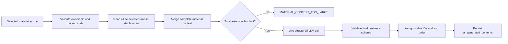

# Generated Content POC Architecture

The five independent generators share one endpoint and one simplified execution path:

Generation does not use Top-K retrieval, batching, map/reduce, cross-batch merging, chunk IDs, or item-level citations. `material_scope_json` records which materials were selected, but it is not a citation contract.

`Generator.generate` receives one `MaterialGenerationContext`. `GeneratorOutput` contains only `title`, optional `content`, and `content_json`. Model/schema failures create a failed history record. Invalid parameters, no parsed material, and total-context overflow fail before history creation.

Successful generation writes only `ai_generated_contents`. It does not create `source_citations`; list/detail/POST responses retain the top-level `source_citations` field as `[]` for API compatibility.

The total context limit is configured by `MATERIAL_CONTEXT_MAX_TOKENS`, default `120000`. Overflow is never silently truncated.
