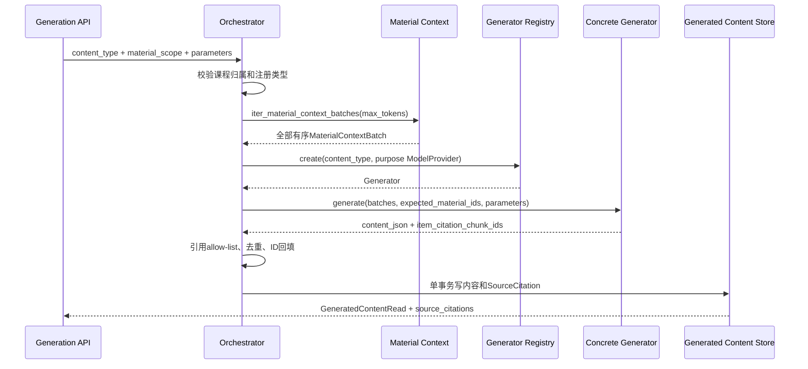

# Generated Content 公共生成架构

## 1. 所有权与边界

`generation-orchestrator`拥有请求校验、生成器工厂调用、全材料批次交付、引用允许集合、错误分类和事务边界。具体生成器拥有自己的参数、prompt、map/reduce 和最终 schema。`generated-content`拥有历史、详情和引用响应装配。

生成模块只读取`material-context`公开DTO，只调用统一`ModelProvider`，不得直接访问OpenAI、Docling、LlamaIndex、Chroma或资料表内部实现。具体生成器不得相互调用，也不得更新学习计划和任务状态。

## 2. 运行数据流

## 3. 公共合同

- `GenerateContentRequest`固定包含`content_type`、`MaterialScope`和类型专属`parameters`。
- `GeneratorRegistry`保存`GeneratorFactory`，支持显式注册、冲突检测、替换和稳定类型列表。
- 内建模块通过`<type>/generator.py:build_generator`自动发现；文件尚未落地时使用placeholder fallback，已存在模块的内部导入错误不会被吞掉。
- `Generator.generate()`接收不可变批次元组、预期资料ID集合和参数字典。
- `GeneratorOutput.item_citation_chunk_ids`使用最终业务条目ID作为键；值只能声明本次批次中的chunk ID候选。

用途模型由路由根据`content_type`读取独立endpoint配置。无API key时使用`MockModelProvider`；测试固定覆盖provider依赖，禁止因本地`.env`触发网络。

## 4. 全材料覆盖

生成服务调用`iter_material_context_batches()`，不使用`resolve_context()`或Top-K替代完整材料。所有选定且已解析资料必须进入批次；批次为空返回`NO_PARSED_MATERIAL`且不落库。资料被标记为可用但缺少chunk时，`MATERIAL_COVERAGE_INCOMPLETE`保存为失败记录。

具体生成器必须在自己的map/reduce中调用`run_material_coverage()`。G01只计算批次实际包含的预期资料集合，不包含题型、卡片、节点、章节或知识点规则。

## 5. 引用算法

1. 按批次和chunk顺序建立允许的`chunk_id -> ContextChunk`映射。
2. 递归收集最终`content_json`中的业务条目ID。
3. 只处理仍存在于最终JSON中的binding；伪造、越界和已裁剪条目的chunk ID全部丢弃。
4. 每个条目按声明顺序去重；全局引用按原始chunk顺序去重。
5. 每个唯一chunk只创建一条`SourceCitation`，多个条目复用同一citation ID。
6. 递归复制JSON并替换条目的`source_citation_ids`；生成器提供的旧citation ID不可信，缺失或非法binding回填`[]`。

`hit_text`最多保存500字符。当前数据库保留`page is not null or page_index is not null`约束；无分页Text/Markdown来源使用`page=null,page_index=0`兼容存储，0仅表示“未知页序号”，前端不得显示为真实第0页。

## 6. 事务与失败

成功内容和引用先`flush`，再执行一次`commit`；引用约束或主键冲突会回滚内容与引用。参数错误`VALIDATION_ERROR`、权限错误、无资料和非法scope不创建记录。

以下生成错误保存可查询failed记录，`content`、`content_json`为空且不保存引用：

- `GENERATION_FAILED`
- `GENERATION_SCHEMA_INVALID`
- `MATERIAL_COVERAGE_INCOMPLETE`

失败记录保留`content_type`和`material_scope_json`，供历史展示和重新发起新请求。当前没有retry-by-id；重试是新的generation请求。

## 7. 复杂度与资源预算

设交付chunk数为`C`、最终JSON对象数为`J`、binding引用数为`R`：

- 批次装配由material-context负责；G01引用处理时间为`O(C + J + R)`。
- 引用、允许集合和JSON复制空间为`O(C + J + R)`。
- 单批token上限读取`settings.material_batch_max_tokens`，当前默认12000。
- 同一课程历史引用通过一次`IN`查询批量读取，避免N+1；排序固定为生成内容ID、`sort_order ASC NULLS LAST`、引用ID。

## 8. 测试与验收

公共测试位于：

- `backend/tests/modules/generation/test_orchestrator_contract.py`
- `backend/tests/modules/generation/test_orchestrator_service.py`
- `backend/tests/modules/generation/test_generation_api.py`
- `backend/tests/modules/generated_content/test_generated_content_service.py`
- `backend/tests/modules/generation/conftest.py`

覆盖注册、provider注入、全批次、跨用户权限、真实/伪造引用、去重回填、未知位置兼容、事务回滚、失败记录、POST/历史/详情引用和重复请求。2026-07-12最终后端全量验证为256 passed。

## 9. 后续演进

G02-G06落地后，各自在本目录增加业务文档，不修改G01公共合同。需要队列、持久化幂等、取消或进度查询时另立任务和契约。若未来放宽引用位置数据库约束，必须通过共享模型评审和Alembic migration，并同步移除`page_index=0`兼容语义。
