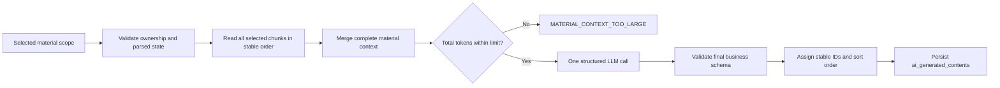

# Generated Content POC Architecture

The five independent generators share one endpoint and one simplified execution path:

Generation does not use Top-K retrieval, batching, map/reduce, cross-batch merging, chunk IDs, or item-level citations. `material_scope_json` records the requested range and a `source_materials` snapshot built by deduplicating the actual `MaterialGenerationContext.chunks`; each snapshot item contains `material_id` and the material name at generation time. This lets the UI show the real input range without turning the range into an item-level citation contract or trusting model-authored filenames.

`Generator.generate` receives one `MaterialGenerationContext`. `GeneratorOutput` contains only `title`, optional `content`, and `content_json`. Model/schema failures create a failed history record. Invalid parameters, no parsed material, and total-context overflow fail before history creation.

Successful generation writes only `ai_generated_contents`. It does not create `source_citations`; list/detail/POST responses retain the top-level `source_citations` field as `[]` for API compatibility.

The frontend renders `material_scope_json.source_materials` as a compact “生成使用的资料” panel above Quiz, Flashcard, Mindmap, Outline, and Knowledge List results. Missing snapshots on legacy rows degrade to no panel. This display is intentionally separate from `source_citations`: it proves which materials actually entered generation, but does not claim which item came from which chunk.

The total context limit is configured by `MATERIAL_CONTEXT_MAX_TOKENS`, default `120000`. Overflow is never silently truncated.

## Permanent deletion

`DELETE /api/v1/generated-contents/{id}` first loads an active record under the current user and assembles the response snapshot. In one database transaction it then deletes every `source_citations` row whose `generated_content_id` matches before deleting the `ai_generated_contents` row. There are no generated-content files, vector entries, or external jobs to clean up.

For `C` associated citations, deletion is `O(C)` with two delete statements and one commit. Any database failure rolls back both deletes, so the main record and its citations cannot be partially removed. The irreversible migration `20260715_0005` applies the same order to purge records left by the earlier soft-delete behavior; downgrade cannot reconstruct deleted user data.

The course-level generated-content history applies its ownership, course, active-row, and task-handout visibility predicates in one database query. Records with `content_type = handout` and a non-null `study_subtask_id` remain stored for study-task detail and export flows but are excluded from this history. For `R` visible records and `C` returned citations, response assembly remains `O(R + C)`; the frontend repeats the handout predicate defensively without issuing extra requests.
