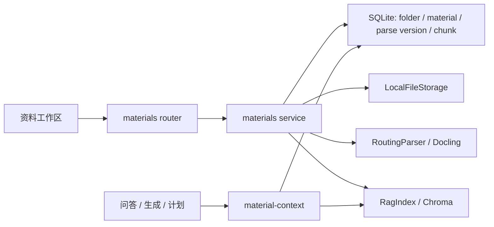

# Materials 资料领域实现

## 1. 业务定位

`materials` 负责把用户资料绑定到课程，完成上传、重命名、一级文件夹归类、解析、切片、索引和删除，并向 Agent 消费者提供可追溯的逐文件资料范围。

一级文件夹只帮助用户整理和浏览资料，不代表 Agent 上下文。用户可以使用课程全部已解析资料，或选择一个、多个具体资料；不能选择整个文件夹。

当前非目标包括嵌套目录、Office 编辑与动画播放、像素级还原桌面 Office、后台解析队列和链接内容抓取。2026-09-30 起 URL 链接资料入口已停止支持：不再提供新增入口，历史 `source_type=url` 记录只读、可重命名、可删除，标记“已停止支持”，不进入解析和学习上下文。

## 2. 所有权与代码地图

- 后端入口：`backend/app/modules/materials/{router,schemas,service,repository,models}.py`。
- 历史引用脱钩边界：`backend/app/modules/course_qa/citations.py`，只允许资料删除流程清空引用外键，不删除问答或生成内容。
- 解析和索引：`backend/app/integrations/parsers/`、`backend/app/integrations/rag/`。
- 本地数据路径与连接生命周期：`backend/app/core/paths.py`、`backend/app/db/session.py`、`backend/app/integrations/rag/manager.py` 和 `backend/app/main.py` lifespan。
- 资料范围：`backend/app/modules/material_context/`。
- 基础前端：`frontend/src/features/materials/`，由第一阶段前端负责人继续完善。`MaterialWorkspace` 支持课程详情页传入创建后上传提示开关，用于课程创建成功后引导用户上传资料；当前提供资源管理器式资料区，并支持点击上传资料名称在页面悬浮弹窗中预览原文件。跨页面格式渲染统一进入 `frontend/src/components/file-preview/UniversalFilePreview`，PDF、图片和文本使用浏览器能力，DOCX 使用 `docx-preview`，PPTX 使用 `@aiden0z/pptx-renderer`。`course-qa/CitationLocator` 复用资料详情与原文件接口完成 PDF 引用页码定位，非 PDF 或不可定位来源只展示保存的引用快照。
- 后端测试：`backend/tests/modules/materials/`、`backend/tests/modules/material_context/`、`backend/tests/integrations/test_llama_index_chroma.py`。
- 前端测试：`frontend/tests/features/materials/`。

`materials` 拥有 `MaterialFolder`、`CourseMaterial`、`MaterialParseVersion` 和 `MaterialChunk`。问答、生成和计划模块只能通过 `material-context` 使用资料，不得直接写这些对象。`material-context` 还提供同一资料范围内生效版本的只读解析质量摘要，用于下游展示 warning；下游不得直接读取 parser 或 materials 表。

Parser 只向 materials 返回项目内部的 `ParsedDocument`、`ParsedChunk` 和 `ParseDiagnostics`，不得把 Docling 类型暴露到业务模块。诊断页码统一使用一基页码；非分页文本的 `page_count = null` 是正常结果，不表示解析不完整。

## 3. 实现架构



文件夹和资料 API 同步执行。上传先写文件和 `CourseMaterial`；解析接口同步构建候选版本、写候选 chunk 与向量，校验完整性后原子切换生效指针。移动存在生效版本的资料时，只更新 Chroma 的 `folder_id` metadata，不重新计算 embedding。删除资料或文件夹时，原始文件目录先移入同盘暂存区，后端从 SQLite 版本化 chunk 构造 RAG 补偿快照，再物理删除数据库记录和向量；失败时恢复数据库、文件和向量，成功后清空暂存文件。

SQLite、上传文件和 Chroma 的相对位置统一从仓库配置根目录解析。FastAPI lifespan 持有进程级 `RagIndexManager`，所有资料请求复用同一个延迟创建的 Chroma 索引；进程退出只释放引用，不删除派生索引。Alembic 和重建命令复用同一配置与旧路径冲突保护，详细运行及迁移规则见 [本地存储运行与迁移](../../engineering/local-runtime-storage.md)。

## 4. 数据、状态与接口

- `MaterialFolder`：课程内一级文件夹，`sort_order` 从 1 开始；用户确认删除后物理移除。
- `CourseMaterial.folder_id`：可空，`null` 表示未分类。
- `CourseMaterial.name`：用户可见展示名，可以重命名；`file_url` 是不可由重命名改变的内部存储路径。
- `CourseMaterial.active_parse_version_id`：当前学习可用版本指针；`is_learning_ready` 由该指针、资料未删除和非 `deleted` 状态派生。
- `MaterialParseVersion.status`：`building`、`active`、`failed`、`retired`；同一资料最多一个 `building`。
- `MaterialChunk.parse_version_id`：非空，切片只能属于一个解析版本；唯一序号约束为 `(parse_version_id, chunk_index)`。
- 上传资料原文件通过受 Bearer token 保护的 `GET /api/v1/materials/{material_id}/content` 读取；接口校验资料所有权、文件型来源、实际文件存在性和解析后路径仍在存储根目录内，并按资料 MIME 类型返回。
- 引用定位先通过 `GET /api/v1/materials/{material_id}` 读取资料元数据并复核当前用户所有权；只有仍可访问的 PDF 且引用有可靠页码时才继续读取原文。
- 删除文件夹会级联物理删除其中全部资料、解析版本、`MaterialChunk`、RAG 向量和原始上传目录，不提供回收站或恢复能力。
- 问答、生成内容和学习结果不随资料删除；其 `SourceCitation.material_id`、`material_version_id`、`chunk_id` 置空，继续使用 `material_name`、页码和 `hit_text` 快照展示历史引用。
- 首次解析状态为 `uploaded -> parsing -> parsed`，首次失败进入 `parse_failed`。已有生效版本重解析时暂时为 `parsing`，失败后回到 `parsed` 并保留 `parse_error`，旧版本继续可用。删除响应快照进入 `deleted`。历史 `source_type=url` 资料不参与该流转：解析重试接口对其返回 `409 MATERIAL_LINK_REMOVED`，状态保持不变；创建端点 `POST /courses/{course_id}/material-links` 返回 `410 MATERIAL_LINK_REMOVED` 兼容反馈。
- `material_context.summarize_material_quality_for_scope()` 只读取当前 scope 的生效解析版本，把版本上的 `parse_quality` 和 `parse_diagnostics_json` 规整为 `MaterialQualitySummary.warnings`；`severity = "info"` 的 parser 诊断不升级为 warning。
- `parse_quality` 是全局解析质量信号：`complete` 表示本轮未观察到失败，`partial` 表示有可用 chunk 但存在失败页或 warning，`unknown` 表示证据不足。
- 生效版本的 `parse_quality = partial` 仍可消费，但下游不能把它解释为完整覆盖。
- 文件夹、资料和课程必须属于当前用户；跨用户或跨课程统一返回 `NOT_FOUND`。
- 公开接口和请求字段见 [../../api-data/frontend-integration.md](../../api-data/frontend-integration.md)。

`MaterialScope` 仅包含：

```json
{
  "include_all_parsed_materials": false,
  "material_ids": ["mat_1", "mat_2"]
}
```

额外传入文件夹范围字段会被 schema 拒绝。

## 5. 核心算法

### 5.1 输入、输出与不变量

- 文件夹 ID 必须属于资料所在课程和当前用户。
- 只有 `active_parse_version_id` 非空且未删除资料可以进入 Agent 范围；候选、失败和退休版本不得进入当前上下文。
- 文件夹创建、重命名和排序不得隐式改变当前选中的 `material_ids`；删除文件夹后，前端必须从当前 `MaterialScope` 移除已删除资料 ID。
- 资料重命名不得改变文件路径、解析状态、chunk、向量或历史引用快照。
- SQLite 的 `folder_id` 与 Chroma metadata 保持一致，但检索硬范围始终使用具体 `material_ids`。

### 5.2 算法步骤

PDF 解析：

1. 使用 `pdf_text_first` profile，关闭 OCR 并强制读取 PDF 文本层。
2. 把 OCR、layout、table batch 限制为 1，队列限制为 4，CPU thread 限制为 1。
3. 首轮存在有效 chunk 时直接返回，不初始化 OCR converter。
4. 首轮零 chunk 时使用 `pdf_ocr_fallback` profile 整份重试，并记录 `OCR_FALLBACK_USED` info。
5. Docling 返回 `partial_success` 时保留有效 chunk，同时记录失败页和 warning；零 chunk 才映射为 `PARSE_FAILED`。
6. 创建 `building` 候选，把 diagnostics、`page_count`、`parse_quality` 和版本化 chunk 写到候选版本，并以版本化 ID 写入向量。
7. 比较候选 SQLite chunk ID 与 Chroma 候选 ID；完全一致后，在一个数据库事务中退休旧版本、激活候选并切换 `active_parse_version_id`。
8. 任一候选阶段失败时删除候选 chunk 与向量并标记 `failed`。已有生效版本时保留旧 diagnostics、quality、chunk 和向量；首次失败才清空材料镜像并进入 `parse_failed`。

创建文件夹：

1. 校验课程所有权。
2. 未提供 `sort_order` 时查询当前最大值并加 1。
3. 写入 `MaterialFolder` 并返回完整对象。

移动资料：

1. 校验资料所有权及目标文件夹同课程归属。
2. 如果资料有生效解析版本，调用 `RagIndex.update_material_folder()` 原位更新 metadata；即使候选正在构建，旧版本仍同步目录元数据。
3. 更新 SQLite `CourseMaterial.folder_id` 和 `updated_at`。

删除文件夹：

1. 校验文件夹属于当前用户，并查询其中全部资料。
2. 读取有生效版本资料的版本化 SQLite chunk，携带 `parse_version_id` 构造可重新索引的 `RagChunk` 补偿快照。
3. 把文件型资料目录原子移动到同盘 `.trash` 暂存区；链接资料没有本地文件。
4. 将历史 `SourceCitation.material_id`、`material_version_id`、`chunk_id` 置空，并在同一 SQLite 事务中删除 chunk、解析版本、资料和文件夹记录。
5. 调用 `RagIndex.delete_materials()` 批量清理全部派生向量，随后提交 SQLite。
6. RAG 清理或数据库提交失败时执行 `rollback()`，恢复暂存文件并用步骤 2 的快照重新索引；补偿失败返回 `DELETE_COMPENSATION_FAILED`。
7. 数据库成功后彻底清空暂存文件；前端移除文件夹及资料并清理 scope。问答与生成内容及其引用快照不删除。

重命名资料：

1. 按当前用户读取未删除资料，跨用户或不存在统一返回 `NOT_FOUND`。
2. schema 去除名称首尾空格并校验长度为 1-255。
3. 只更新 `CourseMaterial.name` 和 `updated_at`，不调用文件存储、Parser 或 RagIndex。
4. 历史 `SourceCitation.material_name` 作为生成时快照保留原值，新问答使用重命名后的资料名。

资料原文件预览：

1. 按当前用户读取未删除资料，先完成所有权隔离，再校验 `source_type = file` 且存在内部文件路径；历史链接资料等没有原文件的记录不进入预览。
2. 将内部 `file_url` 拼接到存储根目录并解析真实路径；路径逃逸存储根目录或文件不存在时返回 `PREVIEW_FILE_UNAVAILABLE`。
3. 后端以资料 MIME 类型、`inline` 和 `private, no-store` 流式返回原文件；该只读链路不修改数据库、解析状态或索引，因此失败时不需要补偿。
4. 前端带 Bearer token 拉取完整 Blob，交给统一文件预览器按格式选择浏览器原生、DOCX 或 PPTX 适配器；关闭、替换预览或组件卸载时释放对象 URL 和渲染器资源，过期异步请求的结果也会立即丢弃。

引用来源定位：

1. 前端从持久化 `SourceCitation` 读取资料名快照、`material_id`、`page` / `page_index` 和 `hit_text`，不按当前 chunk 序号重新推断历史来源。
2. `page` 是可转换为正整数的一基页码时优先使用；否则仅当 `page_index > 0` 时转换为 `page_index + 1`。`page_index = 0` 表示未知位置，不得解释为第一页。
3. 可访问 PDF 只有在步骤 2 得到可靠页码时才下载原文并定位；Text / Markdown 以及没有页码的来源展示保存片段。
4. 资料物理删除后 `material_id` 为空，或详情 / 原文读取失败时，前端显示“来源不可用”并继续展示 `material_name` 与 `hit_text` 快照。

### 5.3 复杂度与资源预算

- 创建目录、重命名资料或目录、移动单份资料为常数次查询；目录列表排序由数据库索引辅助。
- 一次解析写入 `c` 个候选 chunk 和同量向量，完整性检查读取候选 ID 集合，时间与额外内存均为 `O(c)`。解析版本按次增长，旧版本默认保留；本轮不提供自动清理，磁盘预算需同时计入退休版本的 SQLite chunk 与 Chroma 向量。
- 删除文件夹读取 `n` 份资料和 `c` 个 chunk，数据库与应用层工作量为 `O(n + c)`；RAG 使用一次批量 material-id 删除。文件目录使用同盘重命名暂存，正常路径不把文件内容载入内存。
- metadata 更新不重新调用 Embedding 服务，不产生模型 token 成本。
- 正常级联删除不调用 Embedding；只有 RAG 或数据库失败后的补偿恢复才会重新计算被恢复 chunk 的 embedding。补偿仍失败时必须使用 `rebuild_rag_index` 运维命令恢复派生索引。
- Chroma 客户端的进程内数量为 `O(1)`；并发资料请求共享管理器实例。多进程部署仍会各自持有一个客户端，当前单机 V1 不提供跨进程写入协调。
- 上传文件大小上限由 `MAX_UPLOAD_FILE_SIZE_BYTES` 控制，默认 50 MiB。
- PDF parser 同时只让每个模型阶段处理 1 个 batch，空间预算以单页 layout/OCR 推理为主，不随磁盘压缩体积线性变化。
- 预览大小为 `s` 字节的上传文件时，后端按文件响应流传输，应用层不主动读取整份文件；前端 Blob 的网络和内存预算为 `O(s)`，DOCX/PPTX 适配器还会在浏览器内读取完整 `ArrayBuffer` 并构造渲染节点。上传上限使单份预览原文件当前不超过 50 MiB，预览不调用 Parser、RAG、Embedding 或模型。

## 6. 测试与验收

- 文件夹 CRUD、资料重命名、资料移动、级联物理删除、历史引用脱钩、文件/RAG 清理、数据库回滚、索引与文件补偿和权限：`backend/tests/modules/materials/`。
- 候选解析版本覆盖首次解析、成功重解析、解析/索引/完整性检查/切换故障、旧版本回退和同材料并发保护：`backend/tests/modules/materials/test_material_api.py`、`backend/tests/modules/materials/test_material_service.py`。
- 历史材料、chunk 和引用的版本回填、异常空解析迁移与非空版本约束：`backend/tests/db/test_migrations.py`、`backend/tests/db/test_schema.py`。
- metadata 原位更新：`backend/tests/integrations/test_llama_index_chroma.py`。
- 规范路径、SQLite 连接参数、FastAPI 索引生命周期与并发单例：`backend/tests/core/test_paths.py`、`backend/tests/db/test_session.py`、`backend/tests/api/test_lifespan.py`、`backend/tests/integrations/test_rag_index_manager.py`。
- 文件夹范围字段拒绝和逐文件范围：`backend/tests/modules/material_context/`。
- 基础前端归类与逐文件复选、上传资料名称点击统一预览、PDF/DOCX/PPTX 分发、创建后上传提示、文件夹折叠、右键菜单关闭、删除文件夹及其资料后立即移除、删除资料后立即移除、删除失败保留列表并展示错误、历史 URL 资料“已停止支持”展示与无解析入口、资料重命名和拖拽移动的前端状态回归：`frontend/tests/features/materials/`、`frontend/tests/components/file-preview/`。
- 引用定位覆盖 PDF 指定页、Text / Markdown 快照、未知页码和资料删除后快照：`frontend/tests/features/course-qa/inline-citation-answer.test.tsx`。
- 计网第七章 59 页 PDF 真实回归：[validation/net-chap7-pdf-parser-regression-2026-07-12.md](validation/net-chap7-pdf-parser-regression-2026-07-12.md)。
- 真实 PDF 从上传、Docling 解析、Chroma 写入到资料/文件夹物理删除的端到端验证：[validation/real-pdf-permanent-deletion-e2e-2026-07-13.md](validation/real-pdf-permanent-deletion-e2e-2026-07-13.md)。

验证命令：

```powershell
pnpm backend:test
pnpm frontend:test
pnpm frontend:build
```

## 7. 决策、限制与演进

- 2026-07-10 确认文件夹只用于归类，不作为 Agent 范围；该规则覆盖早期文档中的目录选择设计。
- 2026-07-12 前端确认课程创建成功后由课程详情页资料区弹出可关闭的上传提示；创建课程弹窗本身不承载资料上传。
- 2026-07-12 前端补齐资料区资源管理器式交互：页面不再同时展示旧侧栏和资料下拉视图，改为单一文件夹树列表；资料区底部空白区域右键可新建文件夹、上传资料或添加链接；资料右键可重命名、解析或删除；文件夹右键可重命名、上传到此文件夹或删除；资料可拖拽到文件夹或未分类完成移动；左键点击其他位置会关闭右键菜单。当前新建文件夹、添加链接、重命名和删除均使用 Mantine 弹窗，不使用浏览器原生 confirm / prompt；接口失败时保留现有列表并展示后端错误。
- 2026-07-13 资料删除统一为不可恢复的物理删除：删除资料记录、SQLite chunk、RAG 向量和原始文件；问答与生成内容保留，引用退化为无资料外键的快照。SQLite、Chroma 和文件系统不共享事务，因此使用文件暂存、RAG 快照和失败补偿保证同步请求的一致性。
- 2026-07-15 资料工作区支持点击 PDF 资料名称打开悬浮预览窗；前端使用鉴权请求获取 Blob 并在关闭或替换时释放 object URL，后端仅向当前用户返回位于存储根目录内的 PDF 原文。
- 2026-07-15 课程详情资料工作区按已确认的 Product Design 视觉目标完成重构：保留现有三栏宽度和全部资料接口，头部提供选择统计与新建文件夹、上传资料、添加链接三个明确入口，主体使用搜索、一级文件夹和逐文件状态组成的圆角局部滚动列表。课程详情页不保留常驻底部拖拽区；只有点击上传按钮或文件夹菜单中的上传入口后，上传弹窗才承载文件选择与拖拽，并继续沿用单文件上传后自动解析的既有流程。
- 2026-09-30 按负责人 V1 收尾审定下线 URL 链接资料入口：前端移除“添加链接”按钮与弹窗，后端 `material-links` 创建端点改为 `410 MATERIAL_LINK_REMOVED` 兼容占位，`parse_material` 对历史 URL 资料直接抛 `409 MATERIAL_LINK_REMOVED` 且不再改写状态。数据层保留 `source_type/source_url` 列和历史行；material-context 因始终过滤 `parse_status=parsed`，历史 URL 资料天然不进入检索、问答、生成与计划范围（有回归测试固化）。历史记录在前端标记“已停止支持”，保留查看、重命名与删除。
- 2026-09-30 引用角标支持打开来源阅读器：有可靠页码的 PDF 通过项目统一文件预览器定位到原文页，Text / Markdown 展示解析片段；未知页码不默认打开第一页，资料删除或权限失效时保留并展示生成时引用快照。
- 2026-10-01 资料工作区统一使用项目级原文件预览器：PDF、图片与文本使用浏览器原生能力，DOCX 使用 `docx-preview`，PPTX 使用 `@aiden0z/pptx-renderer` 并配置本地 PDF.js 矢量回退资源；Office 适配器按需加载，失败时保留原文件下载入口。该能力是只读查看，不提供编辑、动画播放或桌面 Office 像素级一致性承诺。
- 2026-10-01 本地业务数据统一使用仓库配置根目录：从不同当前目录启动不会生成第二套 SQLite、上传或 Chroma 数据；发现旧位置数据时先拒绝运行并要求人工备份迁移。Chroma 改为 FastAPI 进程级单例并由 lifespan 管理，退出不执行破坏性 reset。
- 2026-10-01 资料解析改为候选版本切换：新版本在 `building` 状态完成 chunk、向量与完整性检查后才成为 `active`，旧版本转为 `retired`；任何候选失败均不破坏旧可用版本。首次失败没有生效版本，资料不可学习；重解析失败则保留旧版本并显示更新失败。旧版本默认保留，后续清理必须另行设计引用保留期和运维策略。
- 如果未来需要嵌套目录、批量拖拽或异步解析，必须先更新 PRD、API 契约和本领域文档。
- 当前 PDF 首轮关闭高级表格结构模型以避免不必要的内存峰值；需要恢复单元格级结构时，应单独建立带资源预算和复杂表格夹具的任务。

## 8. Frontend Interaction Notes

- 2026-07-13: `MaterialWorkspace` keeps the course-creation upload prompt as a dismissible UI affordance, but `CourseDetailPage` clears the route state after the first render so browser refreshes do not reopen the upload dialog.
- 2026-07-13: The upload dialog exposes a top-right close button, removes the old "skip upload" action, supports selecting files by click or drag-and-drop, and uses copy that explains uploaded files enter parsing automatically.
- 2026-07-13: After a file upload returns `parse_status = uploaded`, the frontend immediately shows the material as `parsing` and calls the retry-parse API. Parse API failure keeps the uploaded material visible and surfaces the backend error.
- 2026-10-01: Material row actions are opened from a three-dot left-click button. Already-ready materials expose “重新解析”, a first failed parse exposes “重试解析”, and an in-flight parse hides both actions. Existing active content remains selectable while the row shows “正在更新” or “更新失败，当前版本仍可用”; only a first parse failure is learning-unavailable.
- 2026-07-13: Folder actions are also opened from a three-dot left-click button. The materials workspace no longer exposes custom business actions from right-clicking folders or the blank list area; top action buttons provide create folder and upload material entry points. Upload prompt copy shows the target folder on its own line and bolds the folder name.
- 2026-10-01: The redesigned resource rows expose file type, parse status, folder counts, search, selection, menus, drag-to-move, and unified preview. The selected-count summary only counts explicit checked learning-ready files; readiness comes from `is_learning_ready` / `active_parse_version_id`, with legacy `parse_status = parsed` only as a compatibility fallback.
- 2026-07-15: To prioritize the locally scrolling resource list in the fixed course-detail column, the three top actions are 40 px icon-only buttons aligned with the title and expose their labels through hover tooltips and accessible names. The selection row and search control use reduced vertical padding without changing their behavior.
- 2026-07-15: Individual file rows omit separators and file-size metadata, use a 20 px type badge aligned with the filename scale, and reduce the parse-status control to 22 px so the fixed-height resource list can show more files. The filename, selection state, preview, drag-to-move, and action menu remain unchanged.
- 2026-07-15: Folder rows follow the same density target: their minimum height is 48 px, the folder tile is 30 px, and the count badge is 23 px. Folder expand/collapse, drag target, count, and action-menu behavior remain unchanged.
- 2026-10-01: Every uploaded file name opens the same authenticated preview modal even before parsing completes. The modal passes the fetched Blob to `UniversalFilePreview`; DOCX pages and PPTX slides preserve their original document layout, while unsupported formats keep a clear download fallback.
