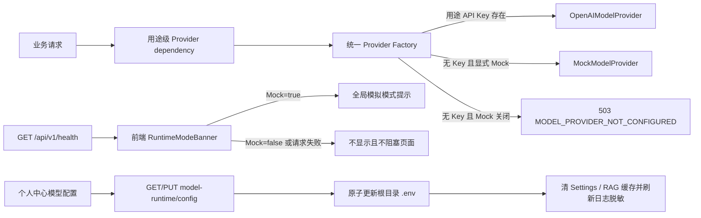

# 模型运行模式

## 1. 目标与边界

本领域负责把 CourseNexus 的模型配置解析、Provider 创建、显式 Mock、运行状态展示和凭据日志脱敏收敛为同一套规则。它不负责各业务 prompt、输出 schema、材料范围或生成结果持久化。

核心不变量：

- 真实 Provider 只能读取当前逻辑用途自己的端点配置。
- 缺少配置不会产生模拟结果，而是返回 `503 MODEL_PROVIDER_NOT_CONFIGURED`。
- Mock 必须显式开启，且只允许 `development` / `test`。
- `production` 在错误配置下拒绝启动。
- Health 和普通业务接口不得泄露凭据或模型端点；登录态配置接口只返回模型名、Base URL、Key 配置状态和至多前 4 位脱敏提示，永不回传完整 Key。

## 2. 实现入口

| 职责 | 入口 |
| --- | --- |
| 环境、Secret、模型用途与 Mock 校验 | `backend/app/core/config.py` |
| Provider 统一创建和稳定缺配置错误 | `backend/app/integrations/model_provider/factory.py` |
| OpenAI-compatible 适配 | `backend/app/integrations/model_provider/openai.py` |
| Deterministic Mock | `backend/app/integrations/model_provider/mock.py` |
| Health 运行状态 | `backend/app/api/router.py` |
| 登录态配置 API、两组 schema 与 `.env` 原子写入 | `backend/app/modules/model_runtime/router.py`、`schemas.py`、`service.py` |
| 凭据脱敏 | `backend/app/core/redaction.py`、`backend/app/core/logging.py` |
| 前端运行状态读取 | `frontend/src/api/system.ts` |
| 前端全局提示 | `frontend/src/components/RuntimeModeBanner.tsx` |
| 个人中心配置弹窗 | `frontend/src/features/profile/ModelConfigModal.tsx`、`frontend/src/features/profile/api.ts` |

业务 Router 只能依赖统一工厂，不直接实例化真实或 Mock Provider。测试可以通过 FastAPI dependency override 或直接向 service 注入 fake / mock provider。

## 3. 运行流程

学习计划 `study_plan_map` 是唯一的派生端点：没有 map 覆盖项时复用已创建的 generator Provider；存在 map 模型、地址、Key 或 API style 覆盖时，以 map 显式值优先，缺项才从 generator 继承。其他用途不允许类似回退。

## 4. 配置与状态规则

- `APP_ENV=development|test|production`，其他值由 Settings 校验拒绝。
- `ENABLE_MOCK_MODEL_PROVIDER=false` 为默认值。
- production 的 `SECRET_KEY` 去除首尾空白后必须非空、不同于开发默认值且长度至少 32。
- production 必须为 `MODEL_PURPOSES` 中所有当前 V1 用途配置非空 API Key；学习计划 map 不单独要求 Key，因为它按上述显式规则复用 generator。
- Health 只返回 `status`、`environment` 和 `mock_model_provider_enabled`。
- 个人中心只配置 `embedding` 和 `general` 两组。`general` 保存时统一展开到课程问答、五类课程级生成、学习计划 parser/diagnostic/generator/map、讲义和任务测试用途；Provider 运行时仍只读取自己用途的变量，不引入用途间回退。
- 模型配置属于单机服务实例，全体登录用户共享同一份根目录 `.env`。任一登录用户都可读取脱敏配置和保存新配置；当前没有管理员角色、按用户 Key 或租户隔离，升级共享部署前按 `TD-027` 治理。
- 已配置时请求省略 `api_key` 表示保留当前 Key；首次配置缺 Key 返回 `MODEL_API_KEY_REQUIRED`。GET/PUT 响应都不包含完整 Key。

仓库 `.env.example` 保留完整用途级配置格式，并为当前已验证的单机组合预填非敏感的 Base URL / Model：Embedding 使用 AIHubMix 的 OpenAI-compatible 端点与 `text-embedding-3-large`，其余模型用途使用 DeepSeek 端点与 `deepseek-flash`。所有 `*_API_KEY` 和 `SECRET_KEY` 示例继续留空或使用明确占位值，真实密钥只写入被 Git 忽略的本地 `.env`。这些值是可运行示例，不是 Provider Factory 的硬编码限制；替换服务时仍可为每个用途独立覆盖。

## 5. 脱敏、失败与资源预算

`SensitiveDataRedactor` 在统一 Formatter 输出完成后处理最终字符串，因此同时覆盖日志正文、`%s` 参数、异常摘要和文件 traceback。它屏蔽当前 Settings 中的签名密钥、全部用途 API Key、兼容 Key、Bearer Token，以及 `api_key=`、`secret_key=`、`authorization=` 形式的带标签凭据。页面保存后只替换现有 Formatter 的 redactor，不重开日志文件；请求校验错误还会按字段路径屏蔽 Key、密码、Secret、Authorization 和 Token 原始输入。

`.env` 更新算法在进程锁内读取原文件，逐行替换目标变量，保留无关变量和注释；缺失变量追加到托管段。候选内容写入项目 `tmp/` 后 `fsync` 并通过同文件系统 `os.replace` 原子替换，异常时删除临时文件，不创建含密钥的备份。保存成功后关闭已缓存 RAG 实例、清理 `get_settings()` 缓存并刷新日志脱敏器，使后续请求使用新配置。

Provider Factory 只做常数次配置读取和对象选择，时间与空间复杂度均为 `O(1)`；日志脱敏对文本长度和已配置凭据数近似为 `O(text_length * credential_count)`。`.env` 读写对文件长度为 `O(F)`，通用配置展开对固定用途数为 `O(P)`，额外空间为 `O(F + P)`；当前 `P=12` 且只允许单机低频人工配置，不增加数据库或任务队列。

Health 失败只隐藏前端提示，不影响应用壳。真实 Provider 的上游调用失败继续按业务链路映射为 `GENERATION_FAILED`；只有“没有可调用 Provider”使用 `MODEL_PROVIDER_NOT_CONFIGURED`，两者不得混用。配置写入前的字段错误返回 `VALIDATION_ERROR` 或 `MODEL_API_KEY_REQUIRED`，文件系统失败返回 `MODEL_CONFIG_WRITE_FAILED`；原子替换避免半份 `.env`，失败不清理现有 Settings/RAG 缓存。

## 6. 测试与验收入口

- 配置：`backend/tests/core/test_runtime_config.py`、`backend/tests/core/test_env_example.py`
- Factory：`backend/tests/integrations/test_model_provider_factory.py`
- Router 接入：各业务模块的 `test_*model_provider*` / `test_provider_config.py`
- Health：`backend/tests/test_health.py`
- 脱敏：`backend/tests/core/test_redaction.py`、`backend/tests/core/test_logging.py`
- 配置 API / 原子写入：`backend/tests/modules/model_runtime/`
- 前端：`frontend/tests/api/system.test.ts`、`frontend/tests/components/runtime-mode-banner.test.tsx`、`frontend/tests/features/profile/model-config-modal.test.tsx`

视觉验收需同时检查桌面与窄屏：Mock 开启时提示清晰且不遮挡主操作，关闭或 Health 失败时不出现；配置弹窗只出现两组配置，Key 输入不回填，重新打开只显示前缀。真实模型发布验收不能用 Mock 结果替代。
