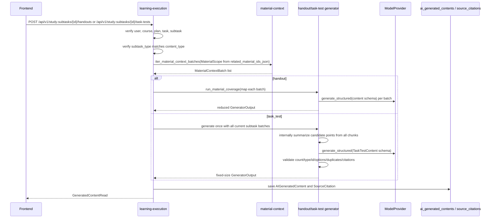

# S06 任务讲义与任务测试题实现

## 范围

S06 为计划学习模式的二级任务提供按需生成内容：

- `learn` / `review` 二级任务只能生成 `handout` 今日讲义。
- `quiz` / `test` 二级任务只能生成 `task_test` 任务测试题。
- `learn` 表示学习讲义和新内容；`review` 表示复习讲义，只回顾计划中此前已经安排学习过的内容；只有 `quiz` / `test` 可以携带 `generation_parameters.task_test` 和明确题量要求。
- `learn` 讲义使用计划阶段清理后的正文 chunk 引用；目录页、版权页、感谢页和章节小结页不得与正文 chunk 混合作为普通 `learn` 范围，避免提前混入后续主题。
- 生成内容统一写入 `ai_generated_contents`，通过 `study_subtask_id` 绑定二级任务。
- 不新增 `handouts`、`task_tests` 或其他业务表，不修改 migration，不修改前端。
- 当前只保存二级任务级 `related_material_ids_json`；P0 不新增 chunk 级任务范围字段，引用范围由当次材料上下文批次校验保证。

## 代码入口

- Handout schema：`backend/app/modules/generation/generators/handout/schemas.py`
- Handout generator：`backend/app/modules/generation/generators/handout/generator.py`
- Task test schema：`backend/app/modules/generation/generators/task_test/schemas.py`
- Task test generator：`backend/app/modules/generation/generators/task_test/generator.py`
- API：`backend/app/modules/learning_execution/router.py`
- Service：`backend/app/modules/learning_execution/service.py`
- Repository：`backend/app/modules/learning_execution/repository.py`
- Export API：`backend/app/modules/exports/router.py`
- Export service / renderer：`backend/app/modules/exports/service.py`、`backend/app/modules/exports/renderer.py`
- 前端 API：`frontend/src/features/study-plans/api.ts`
- 前端类型：`frontend/src/features/study-plans/types.ts`
- 前端页面：`frontend/src/pages/StudyTaskExecutionPage.tsx`
- 测试入口：`backend/tests/modules/generation/test_handout_generator.py`、`backend/tests/modules/generation/test_task_test_generator.py`、`backend/tests/modules/learning_execution/test_task_content_api.py`、`backend/tests/modules/exports/test_exports_api.py`、`backend/tests/integration/test_task_content_generation_flow.py`
- 前端测试入口：`frontend/tests/features/study-plans/api.test.ts`、`frontend/tests/pages/study-plan-pages.test.tsx`

## API

- `POST /api/v1/study-subtasks/{subtask_id}/handouts`
- `POST /api/v1/study-subtasks/{subtask_id}/task-tests`
- `GET /api/v1/study-subtasks/{subtask_id}/execution-context`
- `GET /api/v1/generated-contents/{generated_content_id}/exports/markdown`
- `GET /api/v1/generated-contents/{generated_content_id}/exports/pdf`

两个 POST 接口都返回统一成功 envelope，`data` 为 `GeneratedContentRead`。默认重复请求是幂等的：同一个 `study_subtask_id + content_type` 已存在未删除且 `generation_status=success` 的内容时，接口直接返回最近一次成功内容，不调用模型、不新增 `AIGeneratedContent`。请求体可传 `force_regenerate=true` 显式重新生成新内容；failed 记录不会作为幂等命中结果。执行上下文会返回最近一次成功生成的 `handout_content_id` 或 `task_test_content_id`；失败记录不会作为执行页内容 ID 返回。

前端 C9 只接入执行页中的按需生成入口：

- `learn` / `review` 二级任务显示“今日讲义”，默认调用 `POST /api/v1/study-subtasks/{subtask_id}/handouts`，请求 `{ "force_regenerate": false }`。
- `quiz` / `test` 二级任务显示“任务测试题”，默认调用 `POST /api/v1/study-subtasks/{subtask_id}/task-tests`，请求 `{ "force_regenerate": false }`；不传 `parameters` 时由后端读取计划快照中的默认测试题参数。
- 若 execution-context 已返回 `handout_content_id` 或 `task_test_content_id`，前端不自动重新生成，只显示查看入口和“重新生成”按钮。
- “重新生成”显式传 `force_regenerate=true`，由后端创建新的成功内容或失败记录。
- 生成成功后，执行页用返回的 `GeneratedContentRead.id/title/status` 局部更新内容面板，并通过 `/generated-contents/{id}` 跳转到同学 B 的现有生成内容详情页；前端不修改 generated-content 目录。
- 生成失败只展示错误提示，不修改二级任务完成状态，不触发 completion，也不写打卡。
- C9 不接入导出、测试题作答、判分、attempt 历史或反馈闭环；这些保留给后续上下文。
- 前端 C11 已接入执行页导出入口：`handout` 只显示“导出PDF”，调用 `GET /api/v1/generated-contents/{generated_content_id}/exports/pdf`；`task_test` 只显示“导出Markdown”，调用 `GET /api/v1/generated-contents/{generated_content_id}/exports/markdown`。导出入口只在 execution-context 或本次生成成功返回已有内容 ID 后显示；未生成、生成失败或内容类型不匹配时不展示假导出按钮。

任务测试题 Markdown 导出接口返回文件流，不包成功 envelope。它复用 `GeneratedContentRead` 的用户归属校验，只支持当前用户自己的成功 `task_test`；非 `task_test` 返回 `EXPORT_UNSUPPORTED_CONTENT_TYPE`，非 success 返回 `EXPORT_CONTENT_NOT_READY`，畸形 `content_json` 返回 `EXPORT_CONTENT_INVALID`。renderer 会把题目、选项、答案、解析和引用来源写入 Markdown；`source_citation_ids` 只和 `source_citations[].id` 匹配，缺失时写 `Sources: unavailable`，不伪造来源。

今日讲义 PDF 导出接口同样返回文件流，不包成功 envelope。它只支持当前用户自己的成功 `handout`，生成文件名为 `handout-{generated_content_id}.pdf`；非 `handout` 返回 `EXPORT_UNSUPPORTED_CONTENT_TYPE`，非 success 返回 `EXPORT_CONTENT_NOT_READY`，畸形 `content_json` 返回 `EXPORT_CONTENT_INVALID`。PDF renderer 使用 `markdown-it-py` + Jinja2 生成语义化 HTML，并通过 Playwright Chromium 按 A4 打印为 PDF；不保存导出历史，渲染异常返回 `EXPORT_FAILED`，不影响原 generated content。

## 幂等与重新生成

生成入口在完成用户、课程、计划、任务层级和二级任务类型校验后，先查询当前用户下同一 `study_subtask_id + content_type` 最近一次未删除成功内容：

- `force_regenerate=false` 或省略时，命中 success 直接返回该 `GeneratedContentRead`，不会创建新的 `gen_...` 记录，也不会调用 handout / task-test generator 或模型 provider。
- `force_regenerate=true` 时跳过幂等命中，按正常生成流程创建新的 `AIGeneratedContent(generation_status=success)` 和引用。
- `generation_status=failed` 只保留失败审计和错误码，不会阻止下一次请求重新生成，也不会被 execution-context 当作内容 ID。
- execution-context 通过相同的“最近未删除 success”查询返回内容 ID；如果最新记录是 failed，仍返回最近一次 success，若没有 success 则返回 `null`。

幂等命中路径只做一次生成内容查询，模型调用次数为 0。真正生成路径中，handout 仍按材料批次 map/reduce；task_test 会把当前二级任务允许的全部材料批次汇总为一次候选上下文，只调用一次 task-test generator 生成固定题量。

## 数据流



关键约束：

- 材料范围只能来自 `StudySubTask.related_material_ids_json`。
- `MaterialScope.include_all_parsed_materials = false`，`material_ids` 为二级任务关联资料 ID。
- S06 使用 `iter_material_context_batches()` 读取当前二级任务的全材料上下文，不使用 Top-K 检索，也不调用旧的 `resolve_context()`。
- Handout 使用 `run_material_coverage()` 覆盖每个材料批次，再合并讲义章节。
- Task test 不再“每个 batch 各生成一整套题再拼接”；它把当前二级任务的所有批次一次性传给 task-test generator，由 prompt 要求先在内部汇总候选考点，再只输出最终 `question_count` 道题。
- Task test 的 `question_count` 是最终硬约束；当参数包含 `question_type_counts` 时，每种 `question_type` 的输出数量也是硬约束。输出多题、少题、每种题型数量不匹配、题型越界、`id` / `sort_order` 不连续、选项答案不自洽、重复或高度相似题干都会返回 `GENERATION_SCHEMA_INVALID`。
- 引用必须来自本次材料上下文的 chunk id，不允许伪造 fallback 引用。task_test 的所有题目引用还必须落在当前二级任务允许的材料批次内。

## 内容结构

`handout.content_json` 包含 `overview`、`learning_objectives`、`sections` 和 `summary`。每个 section 包含 `id`、`title`、`body`、`key_points`、`source_citation_ids` 和 `sort_order`。

`task_test.content_json` 包含 `instructions` 和 `questions`。每道题包含 `id`、`question_type`、`question_text`、`options`、`correct_answer`、`explanation`、`source_citation_ids` 和 `sort_order`。题型支持 `single_choice`、`multiple_choice`、`true_false` 和 `short_answer`。

### HandoutContent v2 目标契约

下一阶段讲义生成升级后，`handout.content_json` 仍是讲义的权威持久化内容。模型不得输出整篇 HTML，也不得把整篇讲义作为自由 Markdown 文档返回；模型必须输出经过后端 schema 校验的结构化 JSON。Markdown 只允许作为受控文本字段中的轻量行内表达，公式、表格、图表、思维导图、例题、自测题和引用都必须落到专门字段或 typed blocks 中。

`schema_version = 2` 的目标结构如下：

```json
{
  "schema_version": 2,
  "title": "Nyquist 与 Shannon 公式讲义",
  "overview": "本讲义解决什么问题、适合什么学习目标。",
  "difficulty": "medium",
  "estimated_minutes": 40,
  "learning_objectives": [
    "区分带宽、码元速率和数据率",
    "计算 Nyquist 和 Shannon 公式题"
  ],
  "prerequisites": [
    {
      "id": "pre_1",
      "title": "对数基础",
      "explanation": "只补足 log2 在公式中的含义。",
      "example": "log2(8)=3 表示 2 的 3 次方等于 8。",
      "source_citation_ids": ["chunk_1"],
      "sort_order": 1
    }
  ],
  "sections": [
    {
      "id": "sec_1",
      "title": "信道容量与带宽",
      "lead": "先说结论：带宽限制信号能携带的信息变化速度。",
      "source_citation_ids": ["chunk_2"],
      "blocks": [
        {
          "type": "paragraph",
          "role": "definition",
          "text": "带宽是信道可通过的频率范围，单位是 Hz。"
        },
        {
          "type": "formula",
          "title": "Shannon 公式",
          "latex": "C = W \\log_2(1 + S/N)",
          "purpose": "估算有噪声信道的理论最大数据率。",
          "variables": [
            {"symbol": "C", "meaning": "最大数据率", "unit": "bps"},
            {"symbol": "W", "meaning": "信道带宽", "unit": "Hz"},
            {"symbol": "S/N", "meaning": "信噪比倍数，不是 dB", "unit": null}
          ],
          "conditions": ["有噪声信道"],
          "limitations": ["这是理论上限，不等于实际吞吐率"]
        }
      ],
      "key_points": ["Shannon 公式关注噪声，Nyquist 公式关注电平级数。"],
      "sort_order": 1
    }
  ],
  "knowledge_map": {
    "type": "mindmap",
    "title": "物理层知识关系",
    "root": {
      "label": "物理层",
      "children": [
        {"label": "信号与码元", "children": [{"label": "波特率", "children": []}]},
        {"label": "信道容量", "children": [{"label": "Nyquist", "children": []}, {"label": "Shannon", "children": []}]}
      ]
    }
  },
  "formula_cards": [],
  "exam_focus": [],
  "self_check": [],
  "summary": "本节的核心是区分不同通信速率概念，并能按条件选公式。"
}
```

v2 讲义的字段语义：

- `title` 使用当前二级任务标题派生，保持二级任务级讲义口径。
- `difficulty` 表示讲义整体难度，建议取值为 `easy`、`medium`、`hard`。
- `estimated_minutes` 来自当前二级任务或生成参数，不由模型随意扩展学习时长。
- `prerequisites[]` 只补足理解当前任务所需的最小前置知识，不生成完整先修课。
- `sections[].blocks[]` 是正文主体；旧版 `sections[].body` 在 v2 中被 typed blocks 替代。
- `sections[].source_citation_ids` 为强制引用字段；模型输出阶段必须引用本次 material-context 中的 chunk id，保存成功后由 learning-execution 回绑为 `SourceCitation.id`。`blocks[]` 默认继承所在 section 的来源，不独立保存引用；顶层 `prerequisites[]`、`formula_cards[]`、`exam_focus[]`、`self_check[]` 则保留各自的独立引用，生成端校验其 chunk id 范围并在同一事务内保存、回绑。顶层公式卡片不得省略引用。
- 新生成讲义只接受显式 `schema_version=2`；省略版本或返回 v1 时按 `GENERATION_SCHEMA_INVALID` 失败，不允许把 typed blocks 作为 v1 success 落库。多批次 reducer 在返回前必须重新用 `HandoutContent` 校验最终合并结果，拒绝 v1/v2 混合产生的畸形结构。历史已保存且版本缺失的 v1 内容仍由读取和导出兼容路径处理。
- `knowledge_map` 是讲义级知识关系图，优先使用树形 `mindmap`。没有足够关系信息时可以为空；第一版默认继承所有 section 来源，展示时不单独显示引用。
- `formula_cards[]` 用于集中保存高频公式、变量、适用条件和易错限制。
- `exam_focus[]` 用于保存考试或测验常见考法、易错点和解题提醒。
- `self_check[]` 用于保存讲义后的短自测，服务学习闭环，不替代 `task_test`。

v2 typed block 的第一阶段范围：

- `paragraph`：概念解释、结论、背景、过渡说明。
- `formula`：KaTeX 兼容 LaTeX、变量解释、适用条件、限制和示例。
- `example`：题干、步骤、答案、解析、易错提醒。
- `table`：结构化 `columns` 和 `rows`，不使用 Markdown 表格字符串。
- `callout`：重点、易错点、提示、警告或学习建议。
- `steps`：流程、推导或解题步骤。
- `mindmap`：树形知识结构，可被前端渲染为思维导图。
- `mermaid`：只用于流程图或关系图，必须包含标题和解释。
- `chart`：只在资料中存在可追溯数值数据时使用。

首版 v2 不接受模型输出的原始 HTML。`svg` 也不进入首版模型输出范围，除非后续明确渲染、安全和清洗策略。

任务测试题结构不变量：

- `questions.length == request.parameters.question_count`。
- `question_type` 必须属于请求的 `question_types` 白名单。`question_type_counts` 存在时，实际输出中每种题型数量必须与请求分布完全一致。
- 题目 `id` 必须为 `q_1..q_N`，`sort_order` 必须为 `1..N`，二者都按最终题目顺序连续且唯一。
- `single_choice` / `multiple_choice` 必须恰好有 4 个 options；生成器按每道题自己的 options 顺序将 option id 归一化为 `A`、`B`、`C`、`D`，并同步映射 `correct_answer`。
- 单选答案必须是命中 option id 的字符串；多选答案必须是无重复字符串数组，且所有值命中 option id。
- `true_false` 答案必须是 boolean；`short_answer` 不要求 options，答案为非空字符串。
- 题干经空白折叠和小写归一后不得重复；长度不少于 8 的归一化题干使用相似度阈值拒绝高度相似题。

## 失败与补偿

权限失败、任务不存在和二级任务类型不匹配发生在生成流程前，不创建生成记录。

进入生成流程后，材料缺失、材料覆盖失败、schema 校验失败、测试题硬约束不满足和模型调用失败都会保存一条 `AIGeneratedContent`：

- `generation_status = failed`
- `study_subtask_id = 当前二级任务`
- `content_type = handout` 或 `task_test`
- `error_code = 稳定错误码`

保存失败记录后，接口仍返回统一错误 envelope。失败记录只作为审计和重试依据，不参与幂等命中；下一次默认请求如果没有 success 会重新尝试生成。生成失败不修改二级任务完成状态，不汇总一级任务状态，也不写 `checkin_records`。

如果 task_test 模型输出无法同时满足总题量、每种题型数量、题型白名单、结构、去重和引用约束，后端返回 `GENERATION_SCHEMA_INVALID` 并保存 failed 记录，不做静默截断、不用部分题目成功落库。

## 错误码

- `UNAUTHORIZED`：未登录。
- `NOT_FOUND`：二级任务、课程、计划或资料不可访问。
- `STATE_CONFLICT`：任务层级或课程归属不一致，或任务类型不允许生成该内容。
- `NO_PARSED_MATERIAL`：二级任务没有关联资料，或关联资料没有可用解析上下文。
- `MATERIAL_COVERAGE_INCOMPLETE`：全材料覆盖未完成。
- `GENERATION_SCHEMA_INVALID`：模型输出结构、测试题硬约束或引用不符合契约。
- `GENERATION_FAILED`：模型调用或未知生成失败。
- `EXPORT_UNSUPPORTED_CONTENT_TYPE`：导出格式不支持当前生成内容类型。
- `EXPORT_CONTENT_NOT_READY`：生成内容尚未成功，不能导出。
- `EXPORT_CONTENT_INVALID`：历史生成内容结构畸形，不能安全导出。
- `EXPORT_FAILED`：PDF 渲染失败，不影响原 generated content。

## 复杂度与资源预算

材料读取按 `material_batch_max_tokens` 分批。时间复杂度约为 O(b + c)，其中 b 为材料批次数，c 为生成内容中的引用数量；引用保存按去重后的 chunk 数线性处理。

Handout 模型调用次数等于材料批次数。Task test 模型调用次数固定为 1，prompt 包含当前二级任务允许材料批次中的所有候选 chunk；因此它适合当前 POC 的二级任务范围，后续若要支持更大的测试范围，应先评审候选考点摘要、chunk 级范围追溯或后台任务机制。Task test 结构校验最多处理 20 道题，题干相似度比较为 O(q²)，q 上限由 `question_count <= 20` 控制。导出接口不调用模型、不写数据库；Markdown 渲染复杂度约为 O(q + c)，PDF 渲染复杂度约为 O(s + c + p)，其中 q 为题目数，s 为讲义 section 和文本行数，c 为引用数，p 为分页后的页数。

## 与执行页任务级问答的边界

轻量化 T3 新增的 `POST /api/v1/study-subtasks/{subtask_id}/qa/questions` 属于 S04 执行页问答能力，不属于 S06 任务内容生成。它复用 Course QA 的 `conversations`、`messages` 和 `source_citations`，资料范围同样来自当前二级任务的 `related_material_ids_json`，但不会创建或更新 `AIGeneratedContent`，也不参与 `handout_content_id` / `task_test_content_id` 的最近成功内容选择。

因此任务内容生成、Markdown/PDF 导出和执行页问答之间的边界是：生成与导出围绕 `ai_generated_contents`；任务级问答围绕对话消息。两者都不得修改二级任务完成状态，也不得写 `checkin_records`。

- 不保存学生作答，作答记录已拆到后续任务。
- 不实现任务测试题 PDF 导出；轻量阶段任务测试题只提供 Markdown 导出，今日讲义支持 PDF 导出。
- 不新增 chunk 级任务范围持久化字段；当前只保证生成时引用来自当前二级任务相关资料的当次 material-context 批次。
- 自动化测试使用 `MockModelProvider` / 测试 provider，不调用真实模型。

## 2026-07-14 前端 C11 导出与最终硬化接入

`frontend/src/features/study-plans/api.ts` 新增文件流导出 adapter：

- `exportGeneratedContentPdf(generatedContentId)`：读取 `GET /api/v1/generated-contents/{generated_content_id}/exports/pdf`，用于成功的 `handout`。
- `exportGeneratedContentMarkdown(generatedContentId)`：读取 `GET /api/v1/generated-contents/{generated_content_id}/exports/markdown`，用于成功的 `task_test`。
- 文件流接口不使用统一 success envelope。前端 adapter 只在错误响应中解析统一 error envelope；成功时读取 `Blob` 和 `Content-Disposition` 文件名，并在浏览器端触发下载。
- `401` 仍清理登录态；`EXPORT_UNSUPPORTED_CONTENT_TYPE`、`EXPORT_CONTENT_NOT_READY`、`EXPORT_CONTENT_INVALID` 和 `EXPORT_FAILED` 在执行页展示可恢复错误，不修改生成内容状态，也不影响二级任务完成状态。

执行页 `frontend/src/pages/StudyTaskExecutionPage.tsx` 的导出规则：

- `learn` / `review` 当前内容类型是 `handout`，已有成功内容 ID 时显示“导出PDF”。
- `quiz` / `test` 当前内容类型是 `task_test`，已有成功内容 ID 时显示“导出Markdown”。
- 生成成功后使用返回的 `GeneratedContentRead.id` 立即启用对应导出入口；execution-context 返回已有 ID 时不自动重新生成。
- “重新生成”仍只调用 S06 生成接口，不自动触发导出。
- 学习计划详情页的“导出计划”继续保持 disabled，因为后端没有学习计划自身导出接口；前端不伪造 PDF/Markdown。

手测清单：

1. 打开 learn/review 二级任务执行页，若已有 `handout_content_id`，应看到“查看今日讲义”“导出PDF”“重新生成”。
2. 点击“导出PDF”，浏览器下载 `handout-{generated_content_id}.pdf`；失败时页面显示导出错误 alert，任务完成状态不变。
3. 打开 quiz/test 二级任务执行页，若已有 `task_test_content_id`，应看到“查看任务测试题”“导出Markdown”“重新生成”。
4. 点击“导出Markdown”，浏览器下载 `task-test-{generated_content_id}.md`；失败时页面显示导出错误 alert，任务完成状态不变。
5. 未生成内容的二级任务只显示生成按钮，不显示导出按钮。
6. 计划详情页顶部“导出计划（待接入）”保持禁用。

前端测试入口：

- `frontend/tests/features/study-plans/api.test.ts` 覆盖 PDF / Markdown 导出 adapter 路径。
- `frontend/tests/pages/study-plan-pages.test.tsx` 覆盖执行页已有内容时的导出按钮和文件流请求。
## 2026-07-13 引用、PDF 和默认参数修复补充

### 引用链契约

Handout 和 task-test generator 内部仍输出 chunk id，用于校验引用必须来自当前二级任务允许的 material-context batch。保存成功时，learning-execution 在同一事务中创建 `SourceCitation` 行，并将 handout 的 section、顶层 prerequisites / formula_cards / exam_focus / self_check 以及 task-test questions 的 `source_citation_ids` 从 chunk id 回绑为 `SourceCitation.id`。v2 handout 的 section block 默认继承 section 来源，不做逐 block 引用校验或独立回绑；顶层 typed block 的独立引用必须保留。回绑后再次通过 `HandoutContent` 校验才允许提交成功。`GeneratedContentRead.source_citations` 必须非空且与内容 JSON 中的 citation id 可互相匹配；Markdown 导出在存在有效引用时不得出现 `Sources: unavailable`。

Handout map/reduce 合并多个 `GeneratorOutput` 时必须保留 section 级引用绑定：section id 重写为 `sec_N` 后，`GeneratorOutput.item_citation_chunk_ids` 要把旧 section id 对应的 chunk id 迁移到新 id；若 generator 未提供该映射，则回退使用该 section 自身的 `source_citation_ids` 并去重。Handout reducer 不再把所有 section 的引用合成总集合后绑定给每个 section，避免 PDF 每节显示整章引用。

短期不新增二级任务 chunk 范围字段；handout 生成会从 `StudyPlan.parsed_config_json.task_snapshot` 中按当前 task/subtask 的 `sort_order` 回读 `citation_chunk_ids`。若该字段是合法字符串数组，则仅保留这些 chunk 所在的 material-context batch 内容，并用过滤后实际 chunks 的 `material_id` 集合作为 handout 覆盖校验范围；若字段缺失、结构异常或为空，则保持旧的资料级范围行为。若字段存在但过滤后没有任何 chunk，生成返回 `NO_PARSED_MATERIAL` 或等价覆盖错误并保存 failed 记录，不回退到整份资料。task-test 暂不使用该过滤，继续按二级任务关联资料生成综合测试题。

### Handout prompt 契约

Handout 生成参数由 learning-execution 注入当前二级任务上下文，包含 subtask title、subtask description、plan goal，并在计划保存有 `diagnostic_profile` 时附带 `weak_area` 和 `explanation_style`。Prompt 明确要求讲义只服务当前 subtask，不生成整章摘要；每个 section 围绕当前学习目标展开，建议包含概念解释、为什么重要、易错点、公式 / 步骤 / 小例子。物理层公式类内容必须写清适用条件和变量含义。每个 section 仍需输出 1-4 个直接相关 `source_citation_ids` 供后端校验和追溯；block 默认继承 section 来源，第一版不要在 block 内单独填写 `source_citation_ids`。正文不得写“来源如下”“引用如下”或堆叠资料摘录，学生导出讲义也不逐节展示 citation。

### PDF renderer 契约

今日讲义 PDF renderer 采用 `content_json -> Markdown -> HTML -> Playwright Chromium -> PDF` 链路。`backend/app/modules/exports/renderer.py` 使用 `markdown-it-py` 渲染标题、列表、表格和代码块，用内置 Jinja2 模板和 print CSS 控制 A4 边距、中文字体、表格宽度、代码换行和标题分页；模板只对代码内可信 `_PDF_CSS` 使用 `safe`，避免字体声明中的引号被转义，正文 HTML 仍建立在 Markdown renderer 禁用原始 HTML 的前提下；`render_handout_pdf()` 保持同步接口并由 `exports.service` 将未知异常包装为 `EXPORT_FAILED`。

`schema_version=2` 的 PDF 必须按结构化字段完整输出非空内容区块：overview、learning objectives、prerequisites、knowledge map、sections、formula cards、exam focus、self check 和 summary。prerequisite 的 explanation / example、公式卡片的变量与适用条件、考试重点描述、自测答案与解释都不得只停留在 JSON 而从导出结果中丢失；空的可选区块不输出标题或占位内容。

结构化 `handout` 导出只在标题后展示一行来源说明，格式为 `来源说明：本讲义根据《资料名.pdf》《补充资料.pdf》中“知识点”相关内容生成。`。资料名来自 `GeneratedContentRead.source_citations[].material_name` 去重；知识点短期从 handout section 标题合并推导，后续若导出层可取得 subtask title 应优先使用 subtask title。PDF 不在每个 section 下展示 `Sources`，不生成文末 `Source Details`，也不展示 `hit_text`。

独立 Markdown 回归转换会清洗 `Sources` 段中的 parser/OCR 残留：命中 `formula-not-decoded`、``、``、`` 时保留资料名和页码前缀，隐藏不安全摘录或延续行，避免解析残留进入学生讲义 PDF。`source_citations` 仍保留在 API 返回和数据库中供内部追溯。

当前未捆绑 KaTeX 静态资源；物理层公式先保持为可换行文本，由浏览器字体和 CSS 保证不截断。后续接入本地 KaTeX 资源时，应在同一 HTML 模板中等待公式和字体加载完成，并在打印前检查 `.katex-error`。

### task-test 默认参数

计划保存时会在 `parsed_config_json.task_snapshot[].subtasks[].generation_parameters.task_test` 保存 quiz/test 默认生成参数。模型或前端给出的 `{ "single_choice": 10, "short_answer": 3 }`、数组格式、`items` / `question_types` / `question_type_counts` 内嵌 `{type,count}` 或 `{question_type,question_count}` 对象，以及 `{"10道选择题": "single_choice", "3道计算题": "short_answer"}` 这类题量文案映射，都会归一化为规范测试题参数；`task_test: "single_choice"` 搭配同级 `question_count` 这类模型 shorthand 会归一化为总题数 + 题型白名单。因此真实 E2E 可以传 `{ "force_regenerate": true, "parameters": {} }` 来验证计划中“10 道选择题和 3 道计算题”最终生成 13 题且分布为 10/3。

合并计划默认参数和本次请求时以计划默认值为底：本次请求显式传 per-type counts 时用本次分布覆盖 stored 分布；本次请求只传 `difficulty` 时保留 stored 分布；本次请求显式传 `question_count` 或字符串数组形式的 `question_types`、但没有传 per-type counts 时，清掉 stored `question_type_counts`，退回“总题数 + 题型白名单”旧契约，避免旧 10/3 分布污染新请求。

Task-test prompt 在 `question_type_counts` 存在时必须明确写出每种题型数量，例如 `single_choice 10 道，short_answer 3 道`；没有 `question_type_counts` 时只写总题数和题型白名单，不凭空平均分配。真正非法默认参数在保存/替换阶段返回 `VALIDATION_ERROR`；旧计划中若存在脏默认参数，运行 task-test 生成时返回 `GENERATION_SCHEMA_INVALID` 并保存 failed 记录。

### task-test 选择题选项字母契约

Task-test prompt 要求 `single_choice` / `multiple_choice` 恰好输出 4 个选项。模型可以临时输出 `opt_1`、`opt_5` 等局部或全局选项 id，但 generator 会在校验前按每道题自己的 options 顺序归一化为 `A`、`B`、`C`、`D`，并同步映射单选字符串答案和多选字符串数组答案。归一化后新生成的 `content_json.questions[].options[].id` 和 choice `correct_answer` 不应再出现 `opt_*`。若选择题不是 4 个选项，或答案无法命中该题原始 options id，生成返回 `GENERATION_SCHEMA_INVALID`。`short_answer` 和 `true_false` 不参与 A-D 归一化；Markdown 导出会对历史 `opt_*` 四选项内容按同样顺序做展示层兜底，避免用户继续看到 `opt_*`。

### 术语质量校验

物理层讲义生成后会扫描已知术语误拼，当前包括 `Nyquest -> Nyquist`、`Shanon -> Shannon`、`bandwith -> bandwidth`。命中明显错拼时返回 `GENERATION_SCHEMA_INVALID`，不静默落库，后续可扩展为课程领域 glossary。

## 2026-07-13 任务讲义前端展示与引用脱敏契约

### 任务讲义命名

`handout` 是二级任务级学习内容，不是全局“今天唯一讲义”。旧文案中的“今日讲义”仅表示执行页当天任务可按需生成讲义；新生成内容标题应优先使用当前二级任务标题派生，格式为 `{StudySubTask.title}讲义`，例如 `Nyquist与Shannon公式（补基础）讲义`。`content_type` 仍保持 `handout`，API 路径和数据库表不改名。

### 前端展示形态

前端详情页展示 `handout` 时不得把后端内容当作 Markdown 或 HTML 注入。`GET /api/v1/generated-contents/{generated_content_id}` 返回的 `content_json` 是权威结构化数据，前端按以下字段渲染：

- `overview`：讲义导读。
- `learning_objectives[]`：学习目标列表。
- `sections[]`：讲义正文分节；每节使用 `title`、`body`、`key_points[]` 和 `sort_order`。
- `summary`：收束总结。

`sections[].source_citation_ids` 仅用于把 section 绑定到 `source_citations[].id`，供内部追溯和调试。学生正文不逐节显示 raw citation snippet。

### 引用展示与解析残留

`source_citations[].hit_text` 保存的是资料解析 chunk 的原始命中文本快照，属于内部追溯数据，可能包含 PDF parser/OCR 残留，例如 `<!-- formula-not-decoded -->`、``、`` 或公式 glyph 乱序。后端不得在保存阶段改写该字段，也不得在导出层凭占位符重建公式。

所有用户可见出口必须使用“可展示引用”口径：

- 优先展示 `material_name` 和页码位置：`page` 优先，缺失时可用 `page_index + 1`，都缺失时显示页码未知。
- 只有当 `hit_text` 不含解析残留且适合作为短摘录时，才可作为辅助说明展示。
- 命中 `formula-not-decoded`、``、`` 等残留时，必须隐藏 `hit_text`，只展示资料名和页码。
- `Sources: unavailable` 只表示内容 JSON 引用 ID 找不到对应 `source_citations[]`；已有有效 citation 但 snippet 不安全时，不得退化为 unavailable。

任务测试题 Markdown 导出、任务讲义 PDF 导出、生成内容详情页引用面板以及验证脚本生成的临时 Markdown，都必须遵循同一用户可见引用口径。

### 验证策略

本轮修复实施时暂不运行单元测试、构建或局部脚本。最终验证等待用户提供整轮 study-mode prompt 后统一执行：从资料输入、解析、学前诊断、计划生成与保存，到任务讲义、任务测试题和导出文件全链路检查。验收时用户可见输出不得包含 `formula-not-decoded`、``、``；内部 JSON 的 `source_citations[].hit_text` 可以保留原始解析文本。
