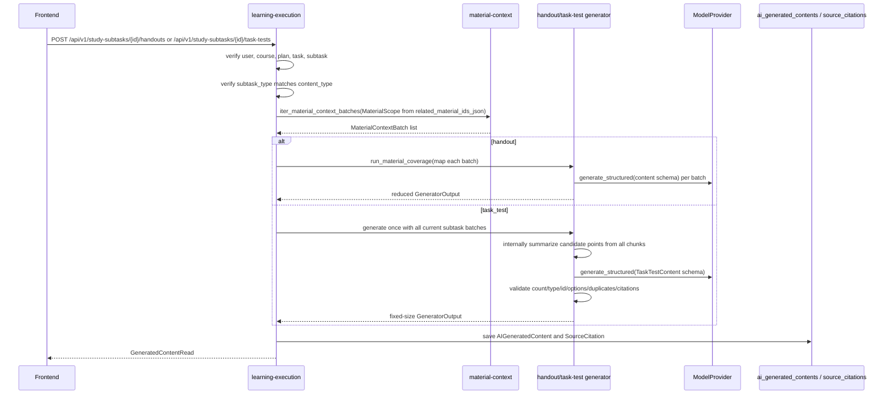

# S06 任务讲义与任务测试题实现

## 范围

S06 为计划学习模式的二级任务提供按需生成内容：

- `learn` / `review` 二级任务只能生成 `handout` 今日讲义。
- `quiz` / `test` 二级任务只能生成 `task_test` 任务测试题。
- 生成内容统一写入 `ai_generated_contents`，通过 `study_subtask_id` 绑定二级任务。
- 不新增 `handouts`、`task_tests` 或其他业务表，不修改 migration，不修改前端。
- 当前只保存二级任务级 `related_material_ids_json`；P0 不新增 chunk 级任务范围字段，引用范围由当次材料上下文批次校验保证。

## 代码入口

- Handout schema：`backend/app/modules/generation/generators/handout/schemas.py`
- Handout generator：`backend/app/modules/generation/generators/handout/generator.py`
- Task test schema：`backend/app/modules/generation/generators/task_test/schemas.py`
- Task test generator：`backend/app/modules/generation/generators/task_test/generator.py`
- API：`backend/app/modules/learning_execution/router.py`
- Service：`backend/app/modules/learning_execution/service.py`
- Repository：`backend/app/modules/learning_execution/repository.py`
- Export API：`backend/app/modules/exports/router.py`
- Export service / renderer：`backend/app/modules/exports/service.py`、`backend/app/modules/exports/renderer.py`
- 测试入口：`backend/tests/modules/generation/test_handout_generator.py`、`backend/tests/modules/generation/test_task_test_generator.py`、`backend/tests/modules/learning_execution/test_task_content_api.py`、`backend/tests/modules/exports/test_exports_api.py`、`backend/tests/integration/test_task_content_generation_flow.py`

## API

- `POST /api/v1/study-subtasks/{subtask_id}/handouts`
- `POST /api/v1/study-subtasks/{subtask_id}/task-tests`
- `GET /api/v1/study-subtasks/{subtask_id}/execution-context`
- `GET /api/v1/generated-contents/{generated_content_id}/exports/markdown`
- `GET /api/v1/generated-contents/{generated_content_id}/exports/pdf`

两个 POST 接口都返回统一成功 envelope，`data` 为 `GeneratedContentRead`。默认重复请求是幂等的：同一个 `study_subtask_id + content_type` 已存在未删除且 `generation_status=success` 的内容时，接口直接返回最近一次成功内容，不调用模型、不新增 `AIGeneratedContent`。请求体可传 `force_regenerate=true` 显式重新生成新内容；failed 记录不会作为幂等命中结果。执行上下文会返回最近一次成功生成的 `handout_content_id` 或 `task_test_content_id`；失败记录不会作为执行页内容 ID 返回。

任务测试题 Markdown 导出接口返回文件流，不包成功 envelope。它复用 `GeneratedContentRead` 的用户归属校验，只支持当前用户自己的成功 `task_test`；非 `task_test` 返回 `EXPORT_UNSUPPORTED_CONTENT_TYPE`，非 success 返回 `EXPORT_CONTENT_NOT_READY`，畸形 `content_json` 返回 `EXPORT_CONTENT_INVALID`。renderer 会把题目、选项、答案、解析和引用来源写入 Markdown；`source_citation_ids` 只和 `source_citations[].id` 匹配，缺失时写 `Sources: unavailable`，不伪造来源。

今日讲义 PDF 导出接口同样返回文件流，不包成功 envelope。它只支持当前用户自己的成功 `handout`，生成文件名为 `handout-{generated_content_id}.pdf`；非 `handout` 返回 `EXPORT_UNSUPPORTED_CONTENT_TYPE`，非 success 返回 `EXPORT_CONTENT_NOT_READY`，畸形 `content_json` 返回 `EXPORT_CONTENT_INVALID`。PDF renderer 使用内置最小 PDF 生成器，不新增依赖、不保存导出历史，内容包含标题、overview、learning objectives、sections、key points、summary 和引用来源；渲染异常返回 `EXPORT_FAILED`，不影响原 generated content。

## 幂等与重新生成

生成入口在完成用户、课程、计划、任务层级和二级任务类型校验后，先查询当前用户下同一 `study_subtask_id + content_type` 最近一次未删除成功内容：

- `force_regenerate=false` 或省略时，命中 success 直接返回该 `GeneratedContentRead`，不会创建新的 `gen_...` 记录，也不会调用 handout / task-test generator 或模型 provider。
- `force_regenerate=true` 时跳过幂等命中，按正常生成流程创建新的 `AIGeneratedContent(generation_status=success)` 和引用。
- `generation_status=failed` 只保留失败审计和错误码，不会阻止下一次请求重新生成，也不会被 execution-context 当作内容 ID。
- execution-context 通过相同的“最近未删除 success”查询返回内容 ID；如果最新记录是 failed，仍返回最近一次 success，若没有 success 则返回 `null`。

幂等命中路径只做一次生成内容查询，模型调用次数为 0。真正生成路径中，handout 仍按材料批次 map/reduce；task_test 会把当前二级任务允许的全部材料批次汇总为一次候选上下文，只调用一次 task-test generator 生成固定题量。

## 数据流

关键约束：

- 材料范围只能来自 `StudySubTask.related_material_ids_json`。
- `MaterialScope.include_all_parsed_materials = false`，`material_ids` 为二级任务关联资料 ID。
- S06 使用 `iter_material_context_batches()` 读取当前二级任务的全材料上下文，不使用 Top-K 检索，也不调用旧的 `resolve_context()`。
- Handout 使用 `run_material_coverage()` 覆盖每个材料批次，再合并讲义章节。
- Task test 不再“每个 batch 各生成一整套题再拼接”；它把当前二级任务的所有批次一次性传给 task-test generator，由 prompt 要求先在内部汇总候选考点，再只输出最终 `question_count` 道题。
- Task test 的 `question_count` 是最终硬约束，输出多题、少题、题型越界、`id` / `sort_order` 不连续、选项答案不自洽、重复或高度相似题干都会返回 `GENERATION_SCHEMA_INVALID`。
- 引用必须来自本次材料上下文的 chunk id，不允许伪造 fallback 引用。task_test 的所有题目引用还必须落在当前二级任务允许的材料批次内。

## 内容结构

`handout.content_json` 包含 `overview`、`learning_objectives`、`sections` 和 `summary`。每个 section 包含 `id`、`title`、`body`、`key_points`、`source_citation_ids` 和 `sort_order`。

`task_test.content_json` 包含 `instructions` 和 `questions`。每道题包含 `id`、`question_type`、`question_text`、`options`、`correct_answer`、`explanation`、`source_citation_ids` 和 `sort_order`。题型支持 `single_choice`、`multiple_choice`、`true_false` 和 `short_answer`。

任务测试题结构不变量：

- `questions.length == request.parameters.question_count`。
- `question_type` 必须属于请求的 `question_types` 白名单。
- 题目 `id` 必须为 `q_1..q_N`，`sort_order` 必须为 `1..N`，二者都按最终题目顺序连续且唯一。
- `single_choice` / `multiple_choice` 必须有 options；option id 非空、无首尾空白且唯一。
- 单选答案必须是命中 option id 的字符串；多选答案必须是无重复字符串数组，且所有值命中 option id。
- `true_false` 答案必须是 boolean；`short_answer` 不要求 options，答案为非空字符串。
- 题干经空白折叠和小写归一后不得重复；长度不少于 8 的归一化题干使用相似度阈值拒绝高度相似题。

## 失败与补偿

权限失败、任务不存在和二级任务类型不匹配发生在生成流程前，不创建生成记录。

进入生成流程后，材料缺失、材料覆盖失败、schema 校验失败、测试题硬约束不满足和模型调用失败都会保存一条 `AIGeneratedContent`：

- `generation_status = failed`
- `study_subtask_id = 当前二级任务`
- `content_type = handout` 或 `task_test`
- `error_code = 稳定错误码`

保存失败记录后，接口仍返回统一错误 envelope。失败记录只作为审计和重试依据，不参与幂等命中；下一次默认请求如果没有 success 会重新尝试生成。生成失败不修改二级任务完成状态，不汇总一级任务状态，也不写 `checkin_records`。

如果 task_test 模型输出无法同时满足题量、题型、结构、去重和引用约束，后端返回 `GENERATION_SCHEMA_INVALID` 并保存 failed 记录，不做静默截断、不用部分题目成功落库。

## 错误码

- `UNAUTHORIZED`：未登录。
- `NOT_FOUND`：二级任务、课程、计划或资料不可访问。
- `STATE_CONFLICT`：任务层级或课程归属不一致，或任务类型不允许生成该内容。
- `NO_PARSED_MATERIAL`：二级任务没有关联资料，或关联资料没有可用解析上下文。
- `MATERIAL_COVERAGE_INCOMPLETE`：全材料覆盖未完成。
- `GENERATION_SCHEMA_INVALID`：模型输出结构、测试题硬约束或引用不符合契约。
- `GENERATION_FAILED`：模型调用或未知生成失败。
- `EXPORT_UNSUPPORTED_CONTENT_TYPE`：导出格式不支持当前生成内容类型。
- `EXPORT_CONTENT_NOT_READY`：生成内容尚未成功，不能导出。
- `EXPORT_CONTENT_INVALID`：历史生成内容结构畸形，不能安全导出。
- `EXPORT_FAILED`：PDF 渲染失败，不影响原 generated content。

## 复杂度与资源预算

材料读取按 `material_batch_max_tokens` 分批。时间复杂度约为 O(b + c)，其中 b 为材料批次数，c 为生成内容中的引用数量；引用保存按去重后的 chunk 数线性处理。

Handout 模型调用次数等于材料批次数。Task test 模型调用次数固定为 1，prompt 包含当前二级任务允许材料批次中的所有候选 chunk；因此它适合当前 POC 的二级任务范围，后续若要支持更大的测试范围，应先评审候选考点摘要、chunk 级范围追溯或后台任务机制。Task test 结构校验最多处理 20 道题，题干相似度比较为 O(q²)，q 上限由 `question_count <= 20` 控制。导出接口不调用模型、不写数据库；Markdown 渲染复杂度约为 O(q + c)，PDF 渲染复杂度约为 O(s + c + p)，其中 q 为题目数，s 为讲义 section 和文本行数，c 为引用数，p 为分页后的页数。

## 已知限制

- 不保存学生作答，作答记录已拆到后续任务。
- 不实现任务测试题 PDF 导出；轻量阶段任务测试题只提供 Markdown 导出，今日讲义支持 PDF 导出。
- 不新增 chunk 级任务范围持久化字段；当前只保证生成时引用来自当前二级任务相关资料的当次 material-context 批次。
- 自动化测试使用 `MockModelProvider` / 测试 provider，不调用真实模型。
