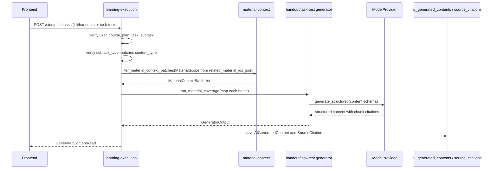

# S06 任务讲义与任务测试题实现

## 范围

S06 为计划学习模式的二级任务提供按需生成内容：

- `learn` / `review` 二级任务只能生成 `handout` 今日讲义。
- `quiz` / `test` 二级任务只能生成 `task_test` 任务测试题。
- 生成内容统一写入 `ai_generated_contents`，通过 `study_subtask_id` 绑定二级任务。
- 不新增 `handouts`、`task_tests` 或其他业务表，不修改 migration，不修改前端。

## 代码入口

- Handout schema：`backend/app/modules/generation/generators/handout/schemas.py`
- Handout generator：`backend/app/modules/generation/generators/handout/generator.py`
- Task test schema：`backend/app/modules/generation/generators/task_test/schemas.py`
- Task test generator：`backend/app/modules/generation/generators/task_test/generator.py`
- API：`backend/app/modules/learning_execution/router.py`
- Service：`backend/app/modules/learning_execution/service.py`
- Repository：`backend/app/modules/learning_execution/repository.py`
- 测试入口：`backend/tests/modules/generation/test_handout_generator.py`、`backend/tests/modules/generation/test_task_test_generator.py`、`backend/tests/modules/learning_execution/test_task_content_api.py`、`backend/tests/integration/test_task_content_generation_flow.py`

## API

- `POST /api/v1/study-subtasks/{subtask_id}/handouts`
- `POST /api/v1/study-subtasks/{subtask_id}/task-tests`
- `GET /api/v1/study-subtasks/{subtask_id}/execution-context`

两个 POST 接口都返回统一成功 envelope，`data` 为 `GeneratedContentRead`。默认重复请求是幂等的：同一个 `study_subtask_id + content_type` 已存在未删除且 `generation_status=success` 的内容时，接口直接返回最近一次成功内容，不调用模型、不新增 `AIGeneratedContent`。请求体可传 `force_regenerate=true` 显式重新生成新内容；failed 记录不会作为幂等命中结果。执行上下文会返回最近一次成功生成的 `handout_content_id` 或 `task_test_content_id`；失败记录不会作为执行页内容 ID 返回。

## 幂等与重新生成

生成入口在完成用户、课程、计划、任务层级和二级任务类型校验后，先查询当前用户下同一 `study_subtask_id + content_type` 最近一次未删除成功内容：

- `force_regenerate=false` 或省略时，命中 success 直接返回该 `GeneratedContentRead`，不会创建新的 `gen_...` 记录，也不会调用 handout / task-test generator 或模型 provider。
- `force_regenerate=true` 时跳过幂等命中，按正常生成流程创建新的 `AIGeneratedContent(generation_status=success)` 和引用。
- `generation_status=failed` 只保留失败审计和错误码，不会阻止下一次请求重新生成，也不会被 execution-context 当作内容 ID。
- execution-context 通过相同的“最近未删除 success”查询返回内容 ID；如果最新记录是 failed，仍返回最近一次 success，若没有 success 则返回 `null`。

幂等命中路径只做一次生成内容查询，模型调用次数为 0；真正生成路径仍按材料批次数调用模型。

## 数据流

关键约束：

- 材料范围只能来自 `StudySubTask.related_material_ids_json`。
- `MaterialScope.include_all_parsed_materials = false`，`material_ids` 为二级任务关联资料 ID。
- S06 使用 `iter_material_context_batches()` 和 `run_material_coverage()`，不使用 Top-K 检索，也不调用旧的 `resolve_context()`。
- 引用必须来自本次材料上下文的 chunk id，不允许伪造 fallback 引用。

## 内容结构

`handout.content_json` 包含 `overview`、`learning_objectives`、`sections` 和 `summary`。每个 section 包含 `id`、`title`、`body`、`key_points`、`source_citation_ids` 和 `sort_order`。

`task_test.content_json` 包含 `instructions` 和 `questions`。每道题包含 `id`、`question_type`、`question_text`、`options`、`correct_answer`、`explanation`、`source_citation_ids` 和 `sort_order`。题型支持 `single_choice`、`multiple_choice`、`true_false` 和 `short_answer`。

## 失败与补偿

权限失败、任务不存在和二级任务类型不匹配发生在生成流程前，不创建生成记录。

进入生成流程后，材料缺失、材料覆盖失败、schema 校验失败和模型调用失败都会保存一条 `AIGeneratedContent`：

- `generation_status = failed`
- `study_subtask_id = 当前二级任务`
- `content_type = handout` 或 `task_test`
- `error_code = 稳定错误码`

保存失败记录后，接口仍返回统一错误 envelope。失败记录只作为审计和重试依据，不参与幂等命中；下一次默认请求如果没有 success 会重新尝试生成。生成失败不修改二级任务完成状态，不汇总一级任务状态，也不写 `checkin_records`。

## 错误码

- `UNAUTHORIZED`：未登录。
- `NOT_FOUND`：二级任务、课程、计划或资料不可访问。
- `STATE_CONFLICT`：任务层级或课程归属不一致，或任务类型不允许生成该内容。
- `NO_PARSED_MATERIAL`：二级任务没有关联资料，或关联资料没有可用解析上下文。
- `MATERIAL_COVERAGE_INCOMPLETE`：全材料覆盖未完成。
- `GENERATION_SCHEMA_INVALID`：模型输出结构或引用不符合契约。
- `GENERATION_FAILED`：模型调用或未知生成失败。

## 复杂度与资源预算

材料读取按 `material_batch_max_tokens` 分批。时间复杂度约为 O(b + c)，其中 b 为材料批次数，c 为生成内容中的引用数量；模型调用次数等于材料批次数。S06 当前同步返回，后续如果引入后台队列，应在 `generation_jobs` 或等价机制设计后再调整。

## 已知限制

- 不保存学生作答，作答记录已拆到 S08。
- 不实现 PDF 导出，导出仍属于 S07。
- 自动化测试使用 `MockModelProvider`，不调用真实模型。