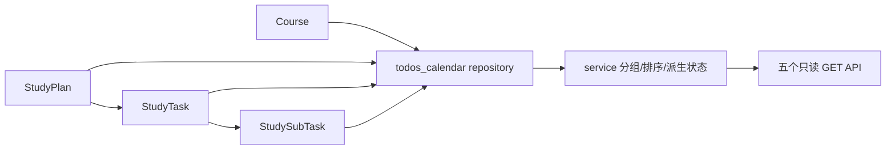

# S03 今日待办与日历聚合

## 业务目标

S03 提供计划学习模式的只读聚合层：学生保存一个或多个单课程学习计划后，可以在首页看到今日待办，在大日历看到日期摘要，在日期弹窗按课程和一级任务查看当天任务，并在课程详情页看到当前课程今天的一二级任务。

本模块只负责读取、聚合和返回跳转所需 ID，不创建、编辑、删除或重新生成学习计划，不更新任务完成状态，不写打卡，不生成讲义、任务测试题或导出文件。

## 代码入口

| 层级 | 文件 | 职责 |
| --- | --- | --- |
| router | `backend/app/modules/todos_calendar/router.py` | 注册五个 GET 接口，注入当前用户和数据库 session，返回统一 success envelope。 |
| service | `backend/app/modules/todos_calendar/service.py` | 日期/月解析、派生状态校验、排序、分组、月历摘要和 Pydantic 输出。 |
| repository | `backend/app/modules/todos_calendar/repository.py` | 只读查询 `study_plans -> study_tasks -> study_subtasks`，过滤用户、课程和软删除。 |
| schemas | `backend/app/modules/todos_calendar/schemas.py` | 今日待办、课程分组、月历摘要和课程日历响应模型。 |
| tests | `backend/tests/modules/todos_calendar/` | service/API 覆盖权限、软删除、空集合、日期边界、摘要限制和零写入。 |
| integration | `backend/tests/integration/test_plan_calendar_flow.py` | 验证 S02 保存的真实计划能被 S03 聚合读取，并继续复用计划详情。 |

## API

- `GET /api/v1/todos/today?date=YYYY-MM-DD`：首页今日待办，返回一级任务和嵌套二级任务，前端默认折叠。
- `GET /api/v1/calendar/month?month=YYYY-MM`：全局月历摘要，日期格返回计数、最多 3 条一级任务摘要和 `hidden_task_count`。
- `GET /api/v1/calendar/days/{date}/todos`：大日历日期弹窗数据，按课程分组，每门课程下按一级任务携带二级任务。
- `GET /api/v1/courses/{course_id}/study-calendar?month=YYYY-MM`：课程月历，只返回该课程日期摘要。
- `GET /api/v1/courses/{course_id}/study-calendar/days/{date}`：课程详情页今日任务数据源；前端传今天，不在 S03 提供日期切换。

计划详情按钮不由 S03 新增接口实现，前端使用返回的 `plan_id` 调用 S02 `GET /api/v1/study-plans/{plan_id}`。

## 数据流



repository 显式过滤：

- `StudyPlan.user_id == current_user.id`
- `Course.user_id == current_user.id`
- `StudyPlan.status != deleted` 且 `StudyPlan.deleted_at is null`
- `Course.status != deleted` 且 `Course.deleted_at is null`

## 排序与聚合算法

1. repository 按日期、课程名、一级任务 `sort_order`、二级任务 `sort_order` 读取行数据。
2. service 用 `task_id` 合并同一一级任务的多行二级任务。
3. 二级任务按 `sort_order` 稳定排序。
4. 一级任务按 `course_name -> task.sort_order -> title -> task_id` 排序。
5. 课程分组按 `course_name` 排序，`plan_ids` 去重并保留出现顺序。
6. 月历按日期聚合，统计课程数、一级任务数、二级任务数、已完成二级任务数。
7. 月历日期格只取前 3 条一级任务摘要，`hidden_task_count = max(task_count - 3, 0)`。

## 状态派生

一级任务响应同时返回数据库 `status` 和 `derived_status`。派生规则：

- 二级任务总数为 0：`not_started`
- 完成数为 0：`not_started`
- 完成数等于总数：`completed`
- 其他：`in_progress`

如果数据库一级任务状态与二级任务派生状态不一致，service 抛出 `STATE_CONFLICT`，S03 不在只读查询中修复数据。

## 复杂度和资源预算

- 日期查询复杂度约为 `O(n log n)`，`n` 为当天任务和二级任务行数，排序主要发生在 Python 分组后的任务/子任务列表。
- 月历查询复杂度约为 `O(m log m)`，`m` 为当月任务和二级任务行数。
- S03 不调用模型，不访问网络，不写缓存表。
- 月历响应限制日期格最多 3 条任务摘要，避免把完整任务树塞入月视图。

## 失败与补偿策略

- 未登录返回 `UNAUTHORIZED`。
- 跨用户、已删除或不存在课程返回 `NOT_FOUND`，不泄露课程名。
- 非法月份返回 `VALIDATION_ERROR`。
- 空日期和空月份返回空数组，不返回 404。
- 状态不一致返回 `STATE_CONFLICT`，由后续写模型或数据修复流程处理。
- 查询不执行 `add`、`delete`、`flush` 或 `commit`，失败时没有补偿写入。

## 测试入口

```powershell
cd D:\Projects\CourseNexus\backend
uv run python -m pytest tests/modules/todos_calendar -q
uv run python -m pytest tests/integration/test_plan_calendar_flow.py -q
```