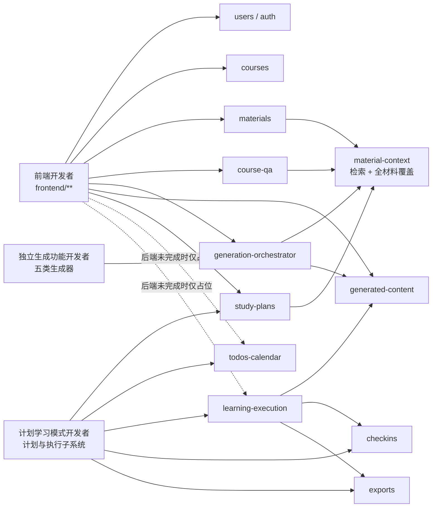

# 第一阶段并行开发任务书

## 1. 目的

本目录用于把 CourseNexus 第一阶段后续开发拆给三名开发者并行执行：

1. 前端开发者：完成可试用的账号、课程工作台、资料、问答、生成内容和基础学习计划界面。
2. 独立生成功能开发者：完成 Quiz、Flashcard、Mindmap、复习提纲和知识点清单五个互相解耦的材料生成能力。
3. 计划学习模式开发者：独立负责学习计划、任务聚合、计划执行、打卡、今日讲义、任务测试题和 PDF 导出的完整子系统。

任务书是实施约束，不替代 PRD、架构文档或 API/数据契约。发生不一致时，先停止实现并按 [共享协作契约](shared-contract.md) 的变更流程处理。

## 2. 当前已实现基线

截至 2026-07-10，仓库已经具备以下可复用基础设施：

- 后端：本地账号注册、登录、退出、当前用户识别；课程 CRUD；资料上传、链接、列表、详情、删除、解析重试；Docling 与纯文本解析；SQLite 切片存储；Chroma 向量索引；材料范围过滤；相关性检索；全材料分批读取与覆盖核算；课程 RAG 问答；会话、消息和引用保存；统一生成编排与生成内容存储；学习计划预览、保存、列表和详情基础接口。
- 前端：API client、Bearer token 会话、基础路由、登录页、课程列表和课程详情空工作台。
- 数据库：PRD v0.1 所需 13 张核心表已经由 baseline migration 建立。Quiz、Flashcard、Mindmap、提纲、知识点清单、讲义和任务测试题按约定保存在 `ai_generated_contents.content_json`，不单独建业务表。
- 验证基线：材料上传、中文文件名解析、切片、索引、检索和带引用问答已经完成真实 PDF 端到端验证。

“已存在”不等于“业务完成”。当前生成器主要是占位实现；学习计划仅有基础任务结构；`todos_calendar`、`learning_execution`、`exports` 尚未接入 API；前端尚未形成完整可用流程。

## 3. 功能模块关联图

## 4. 文档清单

### 4.1 全员必读

| 文档 | 用途 |
| --- | --- |
| [共享协作契约](shared-contract.md) | 固定 API、字段、状态、数据归属、文件所有权、冲突处理和禁止事项。 |
| [任务书写作模板](task-book-template.md) | 统一每份任务书的实现、测试、验收和交付物结构。 |

### 4.2 前端开发者

| 编号 | 任务书 | 主要交付 |
| --- | --- | --- |
| F01 | [账号、会话与路由保护](frontend/F01-auth-session.md) | 注册、登录、退出、会话恢复、过期处理。 |
| F02 | [首页工作台与课程管理](frontend/F02-home-course-workspace.md) | 首页、课程 CRUD、创建课程与初始资料串行流程。 |
| F03 | [课程详情布局与共享资料范围](frontend/F03-course-detail-shell.md) | 三栏工作台、共享 `material_scope`、局部状态隔离。 |
| F04 | [课程资料工作区](frontend/F04-material-workspace.md) | 上传、链接、状态、重试、删除；预览未实现部分占位。 |
| F05 | [课程 Agent 问答](frontend/F05-course-qa.md) | 会话、提问、追问、引用展示和无来源状态。 |
| F06 | [AI 生成内容工作区](frontend/F06-generated-content.md) | 五类生成入口、历史、详情和结构化渲染。 |
| F07 | [学习计划基础界面](frontend/F07-study-plan-foundation.md) | 只接当前已有预览、保存、列表、详情 API；执行模式先占位。 |

### 4.3 独立生成功能开发者

| 编号 | 任务书 | 主要交付 |
| --- | --- | --- |
| G01 | [生成能力公共契约与测试夹具](backend-generation/G01-generator-contract.md) | 稳定注册、上下文覆盖、模型和引用契约。 |
| G02 | [Quiz 生成器](backend-generation/G02-quiz.md) | 课程自测结构化生成与引用。 |
| G03 | [Flashcard 生成器](backend-generation/G03-flashcard.md) | 卡片结构化生成与引用。 |
| G04 | [Mindmap 生成器](backend-generation/G04-mindmap.md) | 节点、边及来源结构化生成。 |
| G05 | [复习提纲生成器](backend-generation/G05-outline.md) | 章节化提纲、重点与复习建议。 |
| G06 | [知识点清单生成器](backend-generation/G06-knowledge-list.md) | 定义、重要度、章节和来源。 |

### 4.4 计划学习模式开发者

| 编号 | 任务书 | 主要交付 |
| --- | --- | --- |
| S01 | [计划学习模式契约与迁移审计](study-mode/S01-subsystem-contract.md) | 子系统接口、状态、字段和迁移基线。 |
| S02 | [学习计划生成、编辑与生命周期](study-mode/S02-plan-lifecycle.md) | 目标解析、真实计划生成、预览、保存、编辑、重生成、删除。 |
| S03 | [今日待办与日历聚合](study-mode/S03-todos-calendar.md) | 首页今日待办、首页大日历、全局当日待办、课程日历。 |
| S04 | [计划学习执行与任务完成](study-mode/S04-learning-execution.md) | 今日任务、执行上下文、完成/取消完成和一级任务汇总。 |
| S05 | [学习打卡与完成比例](study-mode/S05-checkins.md) | 幂等重算、颜色等级、个人中心查询。 |
| S06 | [今日讲义与任务测试题](study-mode/S06-handout-task-test.md) | 按二级任务按需生成并保存到统一生成内容表。 |
| S07 | [PDF 导出与子系统端到端验收](study-mode/S07-export-e2e.md) | 讲义/任务测试题 PDF、权限、失败降级和闭环测试。 |

## 5. 建议实施顺序

- 前端：`F01 -> F02 -> F03 -> F04/F05/F06 -> F07`。F04、F05、F06 在 F03 的共享课程上下文完成后可以并行。
- 独立生成：`G01 -> G02/G03/G04/G05/G06`。五个业务生成器在公共契约完成后互不调用。
- 计划学习模式：`S01 -> S02 -> S03`；随后先完成 `S05` 的纯打卡重算服务，再由 `S04` 接入同一 completion 事务；`S06` 在 G01 合并后执行，最后执行 `S07`。
- 跨开发者依赖：前端只依赖已合并的 API 契约；计划学习模式中的讲义和任务测试题复用 G01 公共生成契约，但不得修改五类独立生成器内部实现。

## 6. 完成定义

每份任务书只有在以下条件全部满足后才算完成：

- 任务书列出的主流程、异常流程和权限测试全部通过。
- API、字段、状态或模块边界变化已同步更新对应 `docs/` 文档。
- 不包含 live OpenAI 网络依赖的自动化测试；真实模型验证单独记录日志，不替代自动化测试。
- `git diff --check` 通过，且不存在越权修改其他开发者所有权目录的变更。
- 每个可验证小功能按 Conventional Commits 单独提交，说明性内容使用中文。
