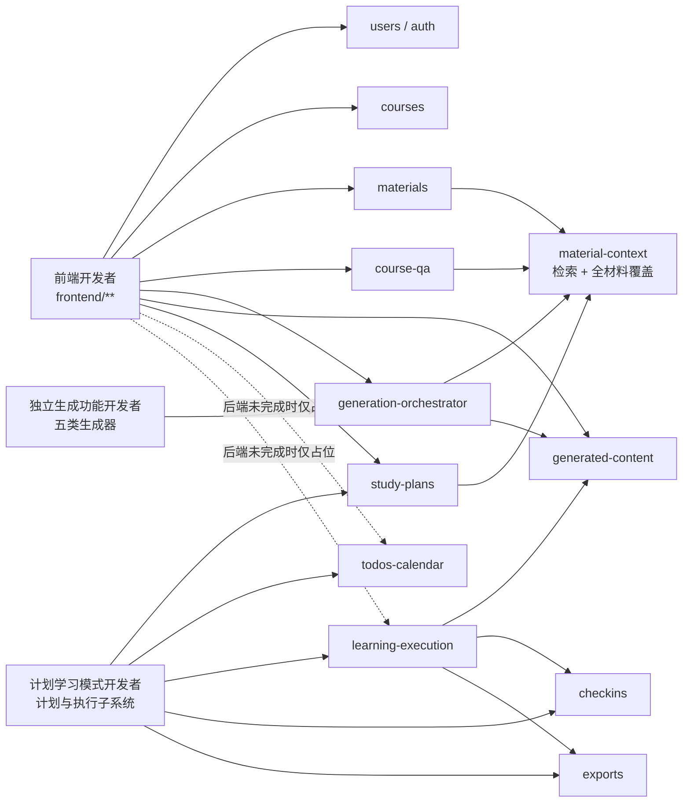

# 第一阶段并行开发任务书

## 1. 目的

本目录用于把 CourseNexus 第一阶段后续开发拆给三名开发者并行执行：

1. 前端开发者：完成可试用的账号、课程工作台、资料、问答、生成内容和基础学习计划界面。
2. 独立生成功能开发者：完成 Quiz、Flashcard、Mindmap、复习提纲和知识点清单五个互相解耦的材料生成能力。
3. 计划学习模式开发者：独立负责学习计划、任务聚合、计划执行、打卡、今日讲义、任务测试题和 PDF 导出的完整子系统。

任务书是实施约束，不替代 PRD、架构文档或 API/数据契约。发生不一致时，先停止实现并按 [共享协作契约](shared-contract.md) 的变更流程处理。

## 1.1 第一阶段要交付的业务闭环

这一阶段不是单纯补齐技术模块，而是让学生能够沿着一条完整学习路径使用 CourseNexus：

```text
注册 / 登录
-> 在首页创建和管理课程
-> 上传课程资料并等待解析
-> 在课程详情中选择资料范围
-> 基于资料问答，或生成 Quiz / Flashcard / Mindmap / 提纲 / 知识点清单
-> 输入学习目标并生成单课程学习计划
-> 在今日待办和日历中查看任务
-> 进入计划执行页完成二级任务
-> 按需生成今日讲义或任务测试题
-> 同步学习打卡，并按需导出 PDF
```

三名开发者分别承接这条业务链的不同部分：

| 开发者 | 面向用户的业务责任 | 第一阶段完成后用户获得的能力 |
| --- | --- | --- |
| 前端开发者 | 把已经存在的后端能力变成可操作页面，并为尚未实现的能力提供明确占位。 | 用户可以注册登录、管理课程和资料、进行课程问答、查看生成内容、预览并保存基础学习计划。 |
| 独立生成功能开发者 | 把选定课程资料转换为五类可复习、可测试、可追溯的学习内容。 | 用户可以真正生成 Quiz、Flashcard、Mindmap、复习提纲和知识点清单，而不是收到占位结果。 |
| 计划学习模式开发者 | 把学习目标转换为计划，并形成日历、执行、完成、打卡、讲义、测试和导出的闭环。 | 用户可以从“制定计划”一直执行到“完成任务并查看学习记录”。 |

## 1.2 三人并行与交接规则

- 三名开发者从第一天同时开始，不需要等待另一组全部完成。
- 三名开发者分别使用固定远程分支：前端使用 `feature/frontend`，独立生成功能使用 `feature/generation`，计划学习模式使用 `feature/study-mode`；F、G、S 子任务不再分别创建远程分支。
- 每名开发者只向自己的工作流分支推送，不得直接向 `main` 推送；子任务通过独立 commit 保留实现和验证边界。
- 开发者负责代码、测试、领域文档、commit、push、提交 PR 和完成报告；不直接推送 `main`，不自行从 `main` rebase，不对远程分支强制推送。
- 不必等待 F01-F07、G01-G06 或 S01-S07 全部完成；每完成一个完整、可验证且不破坏主干的任务书或阶段，开发者从自己的工作流分支向 `main` 提交 PR，并写明任务编号、commit、测试结果、文档更新和已知问题。
- 项目负责人负责审查 PR，并使用 rebase merge 合并到 `main`；数据库、公共 API/schema、架构边界、核心依赖或共享文件变更必须先由项目负责人确认。
- PR 合并后由项目负责人将对应远程工作流分支同步到最新 `main`，再通知开发者更新本地分支；开发者确认工作树干净且没有未推送提交后，执行 `git fetch origin` 和 `git reset --hard origin/<自己的分支>`，再开始下一阶段。同一固定分支可以依次承载多个阶段。
- 独立生成功能开发者优先完成 G01；随后 G02-G06 可以继续实现五类业务生成器。
- 计划学习模式开发者可以独立完成 S01-S05，不依赖 G01；只有 S06 开始前需要 G01 的公共生成协议已经合并。
- 前端开发者可以先完成 F01-F05 和 F07；F06 页面骨架与防御性渲染可以先做，但五类内容最终联调和验收等待 G02-G06 的结构化输出稳定。
- 交接通过已合并的 API、schema 和 docs 完成，不通过双方同时修改公共文件完成。
- 三条分支没有固定的最终合并顺序，以任务依赖和验收完成度为准；G01 必须先于 S06 合并，后端公共契约必须先于对应前端最终联调合并。

## 1.3 业务口径来源

- 产品范围和总体验收以 [PRD 权威入口](../../product/prd.md) 为准。
- 各功能的目标、输入输出和核心规则以 [核心功能模块说明](../../product/PRD/03_功能模块说明.md) 为准。
- 页面入口、交互和状态以 [页面与交互说明](../../product/PRD/04_页面与交互说明.md) 为准。
- 模块如何协作、哪些功能不能互相越界，以 [架构总览](../../architecture/overview.md) 和 [模块边界](../../architecture/module-boundaries.md) 为准。

## 2. 当前已实现基线

截至 2026-07-10，仓库已经具备以下可复用基础设施：

- 后端：本地账号注册、登录、退出、当前用户识别；课程 CRUD；资料上传、链接、列表、详情、删除、解析重试；Docling 与纯文本解析；SQLite 切片存储；Chroma 向量索引；材料范围过滤；相关性检索；全材料分批读取与覆盖核算；课程 RAG 问答；会话、消息和引用保存；统一生成编排与生成内容存储；学习计划预览、保存、列表和详情基础接口。
- 前端：API client、Bearer token 会话、基础路由、登录页、课程列表和课程详情空工作台。
- 数据库：PRD v0.1 所需 13 张核心表已经由 baseline migration 建立。Quiz、Flashcard、Mindmap、提纲、知识点清单、讲义和任务测试题按约定保存在 `ai_generated_contents.content_json`，不单独建业务表。
- 验证基线：材料上传、中文文件名解析、切片、索引、检索和带引用问答已经完成真实 PDF 端到端验证。

“已存在”不等于“业务完成”。当前生成器主要是占位实现；学习计划仅有基础任务结构；`todos_calendar`、`learning_execution`、`exports` 尚未接入 API；前端尚未形成完整可用流程。

## 3. 功能模块关联图



## 4. 文档清单

### 4.1 全员必读

| 文档 | 用途 |
| --- | --- |
| [共享协作契约](shared-contract.md) | 固定 API、字段、状态、数据归属、文件所有权、冲突处理和禁止事项。 |
| [任务书写作模板](task-book-template.md) | 统一每份任务书的实现、测试、验收和交付物结构。 |

### 4.2 前端开发者

| 编号 | 任务书 | 主要交付 |
| --- | --- | --- |
| F01 | [账号、会话与路由保护](frontend/F01-auth-session.md) | 注册、登录、退出、会话恢复、过期处理。 |
| F02 | [首页工作台与课程管理](frontend/F02-home-course-workspace.md) | 首页、课程 CRUD、创建课程与初始资料串行流程。 |
| F03 | [课程详情布局与共享资料范围](frontend/F03-course-detail-shell.md) | 三栏工作台、共享 `material_scope`、局部状态隔离。 |
| F04 | [课程资料工作区](frontend/F04-material-workspace.md) | 上传、链接、状态、重试、删除；预览未实现部分占位。 |
| F05 | [课程 Agent 问答](frontend/F05-course-qa.md) | 会话、提问、追问、引用展示和无来源状态。 |
| F06 | [AI 生成内容工作区](frontend/F06-generated-content.md) | 五类生成入口、历史、详情和结构化渲染。 |
| F07 | [学习计划基础界面](frontend/F07-study-plan-foundation.md) | 只接当前已有预览、保存、列表、详情 API；执行模式先占位。 |

### 4.3 独立生成功能开发者

| 编号 | 任务书 | 主要交付 |
| --- | --- | --- |
| G01 | [生成能力公共契约与测试夹具](backend-generation/G01-generator-contract.md) | 稳定注册、上下文覆盖、模型和引用契约。 |
| G02 | [Quiz 生成器](backend-generation/G02-quiz.md) | 课程自测结构化生成与引用。 |
| G03 | [Flashcard 生成器](backend-generation/G03-flashcard.md) | 卡片结构化生成与引用。 |
| G04 | [Mindmap 生成器](backend-generation/G04-mindmap.md) | 节点、边及来源结构化生成。 |
| G05 | [复习提纲生成器](backend-generation/G05-outline.md) | 章节化提纲、重点与复习建议。 |
| G06 | [知识点清单生成器](backend-generation/G06-knowledge-list.md) | 定义、重要度、章节和来源。 |

### 4.4 计划学习模式开发者

| 编号 | 任务书 | 主要交付 |
| --- | --- | --- |
| S01 | [计划学习模式契约与迁移审计](study-mode/S01-subsystem-contract.md) | 子系统接口、状态、字段和迁移基线。 |
| S02 | [学习计划生成、编辑与生命周期](study-mode/S02-plan-lifecycle.md) | 目标解析、真实计划生成、预览、保存、编辑、重生成、删除。 |
| S03 | [今日待办与日历聚合](study-mode/S03-todos-calendar.md) | 首页今日待办、首页大日历、全局当日待办、课程日历。 |
| S04 | [计划学习执行与任务完成](study-mode/S04-learning-execution.md) | 今日任务、执行上下文、完成/取消完成和一级任务汇总。 |
| S05 | [学习打卡与完成比例](study-mode/S05-checkins.md) | 幂等重算、颜色等级、个人中心查询。 |
| S06 | [今日讲义与任务测试题](study-mode/S06-handout-task-test.md) | 按二级任务按需生成并保存到统一生成内容表。 |
| S07 | [PDF 导出与子系统端到端验收](study-mode/S07-export-e2e.md) | 讲义/任务测试题 PDF、权限、失败降级和闭环测试。 |

### 4.5 领域实现文档交付映射

每个任务拥有独立的领域文档路径，避免多人编辑同一个实现说明。代码实现、自动化测试与对应领域文档必须在同一任务中同步交付。

| 任务 | 领域文档交付路径 | 必须说明的重点 |
| --- | --- | --- |
| F01 | `docs/domains/auth/frontend.md` | 认证页面、会话状态、路由保护、401/403 降级和测试入口。 |
| F02 | `docs/domains/courses/frontend.md` | 首页与课程 CRUD 组件、串行创建流程、partial success 状态。 |
| F03 | `docs/domains/course-workspace/frontend.md` | 三栏布局、共享材料范围、局部状态隔离和 API 数据流。 |
| F04 | `docs/domains/materials/frontend.md` | 上传/链接/状态/重试/删除流程、错误状态与占位边界。 |
| F05 | `docs/domains/course-qa/frontend.md` | 会话与问答状态、引用渲染、防御性处理和降级路径。 |
| F06 | `docs/domains/generated-content/frontend.md` | 五类内容的触发、历史、schema 防御性渲染和占位状态。 |
| F07 | `docs/domains/study-mode/frontend-foundation.md` | 计划预览/保存/列表/详情流程及未接入能力的占位边界。 |
| G01 | `docs/domains/generated-content/index.md`、`architecture.md` | 公共生成架构、注册协议、上下文覆盖、引用映射、事务和资源预算。 |
| G02 | `docs/domains/generated-content/quiz.md` | Quiz schema、生成与聚合算法、覆盖/去重、引用和失败策略。 |
| G03 | `docs/domains/generated-content/flashcard.md` | Flashcard schema、卡片提取/合并/去重算法、引用和资源预算。 |
| G04 | `docs/domains/generated-content/mindmap.md` | 节点/边构建、跨批次合并、稳定 ID、环路处理和复杂度。 |
| G05 | `docs/domains/generated-content/outline.md` | 章节归并、层级构建、重点提取、覆盖核算和引用算法。 |
| G06 | `docs/domains/generated-content/knowledge-list.md` | 知识点抽取、标准化、去重排序、重要度与引用算法。 |
| S01 | `docs/domains/study-mode/index.md`、`architecture.md` | 子系统边界、组件架构、状态与数据流、事务所有权和算法目录。 |
| S02 | `docs/domains/study-mode/plan-lifecycle.md` | 目标解析、全材料计划生成、任务排程、幂等保存和替换事务。 |
| S03 | `docs/domains/study-mode/todos-calendar.md` | 待办/日历只读聚合、日期分组排序、查询复杂度和索引使用。 |
| S04 | `docs/domains/study-mode/learning-execution.md` | 完成状态聚合、事务顺序、打卡联动、回滚与幂等算法。 |
| S05 | `docs/domains/study-mode/checkins.md` | 完成比例重算、颜色映射、upsert、并发一致性和复杂度。 |
| S06 | `docs/domains/study-mode/task-content.md` | 讲义/测试生成的 prompt、schema、覆盖聚合、引用、失败和资源预算。 |
| S07 | `docs/domains/study-mode/exports.md` | PDF 渲染流水线、字体与资源、内存预算、安全和错误处理。 |

后端文档统一按 `docs/domains/implementation-template.md` 编写。G01 和 S01 可以维护各自领域的公共 `index.md`/`architecture.md`；其余任务只维护表中独占文件，确需改公共文档时必须由对应负责人合并最小 patch。

## 5. 建议实施顺序

- 前端：`F01 -> F02 -> F03 -> F04/F05/F06 -> F07`。F04、F05、F06 在 F03 的共享课程上下文完成后可以并行。
- 独立生成：`G01 -> G02/G03/G04/G05/G06`。五个业务生成器在公共契约完成后互不调用。
- 计划学习模式：`S01 -> S02 -> S03`；随后先完成 `S05` 的纯打卡重算服务，再由 `S04` 接入同一 completion 事务；`S06` 在 G01 合并后执行，最后执行 `S07`。
- 跨开发者依赖：前端只依赖已合并的 API 契约；计划学习模式中的讲义和任务测试题复用 G01 公共生成契约，但不得修改五类独立生成器内部实现。

## 6. 完成定义

每份任务书只有在以下条件全部满足后才算完成：

- 任务书列出的主流程、异常流程和权限测试全部通过。
- API、字段、状态或模块边界变化已同步更新对应 `docs/` 文档。
- 任务映射中的 `docs/domains/` 文档已交付，并与代码入口、实现架构、算法、资源预算、失败策略和测试证据一致。
- 不包含 live OpenAI 网络依赖的自动化测试；真实模型验证单独记录日志，不替代自动化测试。
- `git diff --check` 通过，且不存在越权修改其他开发者所有权目录的变更。
- 每个可验证小功能按 Conventional Commits 单独提交，说明性内容使用中文。
