# 01 文档信息、背景范围、用户与架构

本文档为「CourseNexus 课枢 PRD v0.3」的第 01 部分，覆盖标准 PRD 结构中的第 1-6 章：文档信息、版本记录、需求背景与产品目标、产品范围与本期边界、用户与使用前提、产品信息架构。

## 1. 文档信息

- 文档名称：CourseNexus 课枢 PRD - 文档信息、背景范围、用户与架构
- 版本号：v0.3
- 作者：待补充
- 创建时间：2026-07-08
- 更新时间：2026-07-08
- 当前状态：重构中
- 相关人员：产品、前端、后端、测试、评审人员
- 原型链接：当前以本地低保真原型图为准，详见第 19 章附录
- 相关资料：`课程学习助手Agent平台_PRD_v0.2`、原始 PRD 初稿、低保真原型图、PRD 写作建议资料

## 2. 版本记录

| 版本 | 日期 | 修改人 | 修改内容 |
|---|---|---|---|
| v0.1 | 2026-07-08 | 待补充 | 完成 PRD 初稿，描述产品定位、页面、功能、Agent 能力和验收标准 |
| v0.2 | 2026-07-08 | 待补充 | 按后端落地需求重构 PRD 文档包，补充流程、数据对象、接口建议、异常和验收 |
| v0.3 | 2026-07-08 | 待补充 | 按标准 PRD 1-19 章重新组织文档，并将长文档拆分为多个 Markdown 文件 |

## 3. 需求背景与产品目标

### 3.1 需求背景

大学生在多门课程学习过程中，会同时面对课件、教材、课堂笔记、实验指导书、作业要求、复习资料等多种学习材料。这些材料通常分散在不同平台、本地目录或聊天记录中，学生需要花大量时间查找资料、定位知识点和整理复习路径。

现有通用 AI 问答工具虽然可以回答学习问题，但往往缺少用户真实课程资料上下文，回答可能脱离课程内容，也难以给出可追溯的引用来源。普通待办工具可以记录任务，但无法结合课程资料自动拆解学习计划，更无法把计划执行和资料问答、知识整理、测试练习连接起来。

因此，本产品希望构建一个围绕「课程资料 + Agent」运行的 CourseNexus 课枢：用户先建立课程并上传资料，系统解析资料后为问答、学习辅助内容生成、学习计划生成和每日任务执行提供上下文支持，让学生获得可信、可追溯、可执行的学习辅助能力。

### 3.2 用户痛点

| 痛点 | 具体表现 | 影响 |
|---|---|---|
| 课程资料分散 | 课件、教材、笔记、作业要求分布在不同位置 | 查找效率低，复习前准备成本高 |
| 重点定位困难 | 资料页数多、章节多，学生难以快速定位考试重点或复习范围 | 容易浪费时间在低优先级内容上 |
| AI 回答缺少课程上下文 | 通用 AI 不了解当前课程资料和老师课件 | 回答可能泛化，难以判断是否适合本课程 |
| 答案缺少引用来源 | 学生无法知道答案来自哪份资料、哪一页、哪段内容 | 可信度不足，难以回到原资料复查 |
| 学习计划不够可执行 | 学生常得到笼统复习建议，缺少每日任务拆解 | 计划难落地，执行过程容易中断 |
| 多课程任务并行 | 多门课同时有复习、作业、考试和实验 | 容易遗漏任务，缺少统一日历视图 |
| 计划执行与资料脱节 | 有了计划后仍要重新找对应资料和知识点 | 执行效率低，学习路径不连续 |

### 3.3 产品目标

产品核心目标是：围绕学生上传的课程资料，提供可信、可追溯、可执行的 AI 学习辅助能力。

| 目标 | 说明 |
|---|---|
| 多课程管理 | 支持学生创建、编辑、删除和查看多门课程 |
| 资料集中管理 | 支持上传文件、资料分类、资料预览和资料解析；链接资料入口已停止支持，仅保留历史记录查看与删除 |
| 基于资料问答 | 支持 Agent 基于当前课程资料回答问题，并展示引用来源 |
| 学习辅助生成 | 支持生成复习提纲、知识点清单、课程自测 Quiz、Flashcard、Mindmap |
| 学习计划生成 | 支持根据自然语言学习目标生成阶段计划和每日待办 |
| 自然语言配置回填 | 从用户输入中解析课程、资料范围、截止时间、每日学习时间和计划偏好 |
| 任务统一展示 | 支持首页今日待办和首页大日历合并展示多个单课程计划任务 |
| 计划执行闭环 | 支持进入每日任务学习，按需生成今日讲义和任务测试题；讲义支持 PDF 导出，任务测试题支持 Markdown 导出（PDF 为后续能力） |
| 个人中心管理 | 支持账号资料、密码修改和按当日二级任务完成比例自动生成的学习打卡颜色 |

### 3.4 本期目标

本期目标是完成一个可真实落地的 CourseNexus 课枢，而不是只做静态原型或演示页面。

本期需要完成以下闭环：

1. 用户可通过账号和密码注册、登录、退出和修改密码。
2. 用户可创建课程，并可在新建课程时可选上传资料文件。
3. 用户可在课程详情页继续补充资料、管理资料、查看解析状态。
4. 系统可对课程资料进行解析、切片、建立索引，并保存引用来源所需信息。
5. Agent 可基于课程资料回答问题，并展示资料名、页码或页序号、命中文本片段。
6. 用户可基于课程资料生成课程自测 Quiz、Flashcard、Mindmap、复习提纲、知识点清单。
7. 用户可输入自然语言学习目标，系统自动解析并回填计划配置。
8. 系统可生成单课程学习计划、阶段任务和每日待办。
9. 首页今日待办和首页大日历可按日期合并展示多个单课程计划任务。
10. 用户可进入计划学习执行页，围绕今日一二级任务学习，今日讲义和任务测试题按需生成；讲义支持导出 PDF，任务测试题支持导出 Markdown（PDF 为后续能力）。
11. 用户可在个人中心查看基础账号信息，并查看按当日二级任务完成比例呈现的学习打卡颜色。

### 3.5 成功指标

| 指标 | 口径 | 目标意义 |
|---|---|---|
| 课程创建率 | 创建课程用户数 / 登录用户数 | 判断用户是否进入核心学习场景 |
| 资料上传率 | 上传资料用户数 / 创建课程用户数 | 判断资料管理能力是否被使用 |
| 资料解析成功率 | 解析成功资料数 / 上传资料数 | 判断资料处理能力是否稳定 |
| 问答使用率 | 发送 Agent 问题用户数 / 上传资料用户数 | 判断资料问答是否产生价值 |
| 引用来源展示率 | 带引用来源回答数 / Agent 回答总数 | 判断回答可追溯性 |
| 学习辅助生成率 | 生成学习辅助内容用户数 / 上传资料用户数 | 判断 课程自测 Quiz、Flashcard、Mindmap 等能力使用情况 |
| 计划生成成功率 | 成功保存计划数 / 发起计划生成数 | 判断计划生成链路是否可用 |
| 任务完成率 | 已完成任务数 / 已生成任务数 | 判断计划执行情况 |
| 学习完成记录生成率 | 生成学习完成记录用户数 / 活跃用户数 | 判断学习行为沉淀情况 |
| 异常重试成功率 | 重试成功次数 / 重试总次数 | 判断上传、解析、生成等异常恢复能力 |

## 4. 产品范围与本期边界

### 4.1 本期范围

| 模块 | 本期范围 |
|---|---|
| 用户账号 | 账号密码注册、账号密码登录、退出登录、登录状态校验、密码修改 |
| 个人资料 | 昵称、头像、账号信息、按当日二级任务完成比例自动生成的学习打卡颜色 |
| 课程管理 | 创建课程、创建时可选上传资料、编辑课程、删除课程、查看课程列表和课程详情 |
| 课程资料管理 | 上传文件、一级目录分类、移动资料、删除资料、查看资料、预览资料；历史链接资料仅保留查看与删除 |
| 资料解析与索引 | 对上传资料提取文本、页码或页序号、命中文本片段，并建立可检索索引 |
| 课程 Agent 问答 | Agent 基于当前课程和选中资料范围进行自由问答 |
| 引用来源 | Agent 回答必须尽量展示资料名、页码或页序号、命中文本片段 |
| 对话记录 | 保存课程问答记录，支持按课程归档 |
| 保存为笔记 | 用户可将单轮 Agent 回答保存为 `AIGeneratedContent.content_type = note` |
| 学习辅助 | 生成复习提纲、知识点清单、课程自测 Quiz、Flashcard、Mindmap |
| 生成内容管理 | 保存 AI 生成内容，并关联课程、资料范围和引用来源 |
| 学习计划 | 根据自然语言目标和配置项生成单课程学习计划、阶段任务和每日待办 |
| 自然语言配置回填 | 从目标文本中解析课程、资料范围、截止时间、每日学习时间和计划偏好 |
| 今日待办 | 展示当天任务，支持查看任务和勾选完成 |
| 本课程计划学习模式日历 | 从课程详情页进入，只展示当前课程的学习计划日程 |
| 首页大日历 | 以大尺寸月历聚合展示所有课程任务摘要；点击日期后打开全局当日待办弹窗 |
| 全局当日待办弹窗 | 按课程分组展示当天计划学习日程，展开课程后可点击知识点跳转执行页 |
| 课程内计划学习模式 | 从课程详情页进入本课程计划学习模式日历，点击日期查看本课程当日知识点并进入学习执行 |
| 首页今日待办 / 首页大日历 | 只聚合展示所有课程待办并跳转到对应学习执行页，不在首页创建或编辑学习计划 |
| 计划学习执行 | 左侧只展示今日学习任务；查看知识点和关联资料，按需生成今日讲义和任务测试题 |
| 导出能力 | 今日讲义支持导出 PDF；任务测试题支持导出 Markdown，PDF 为后续能力 |

### 4.2 本期不做

| 不做内容 | 说明 |
|---|---|
| 教师端 | 本期不支持教师发布资料、作业或管理班级 |
| 管理员端 | 本期不设计运营后台、用户审核或系统配置后台 |
| 多角色权限 | 本期只有学生用户一种角色 |
| 班级共享空间 | 本期所有课程、资料、计划、对话均归属于单个用户 |
| 系统级提醒推送 | 本期不做站内信、短信、邮件、移动端推送 |
| 多课程联合计划 | 本期一个学习计划只绑定一门课程，不支持一个计划同时规划多门课程 |
| 多课程冲突优化 | 首页今日待办和首页大日历只合并展示多个单课程计划任务，不自动调整排期 |
| 复杂学习统计报表 | 本期不做完整数据看板，只保留基础埋点和后续扩展空间 |
| 复杂个性化推荐 | 本期不基于用户画像自动推荐课程、资料或计划 |
| 教学资源市场 | 本期不做公开资料库、课程市场或资料共享社区 |
| 完整错题本 | 本期任务测试题可生成和导出，但不建设独立错题本系统 |

### 4.3 后续规划

后续可根据开发周期、用户反馈和评审要求扩展：

1. 教师端和班级共享课程空间。
2. 多课程任务冲突检测和智能重排。
3. 作业截止提醒、复习提醒和学习节奏提醒。
4. 学习统计报表，例如完成率、连续学习完成记录天数、课程学习时长。
5. 错题本、题目收藏和掌握度评估。
6. AI 生成内容导出为 Markdown、Anki 卡片或图片。
7. 个性化推荐和用户画像。
8. 更丰富的资料解析格式和更精准的页码、章节定位。
9. 移动端适配或小程序端。
10. 团队协作学习、共享计划和共同学习完成记录。

## 5. 用户与使用前提

### 5.1 用户说明

本期主要用户为大学本科生及其他有多课程学习需求的学生群体。

平台不限定具体专业或课程，适用于高等数学、计算机网络、操作系统、大学物理、专业课、通识课等多种课程场景。

本期仅设置学生用户角色，不设置教师端、管理员端或班级空间。所有页面、功能、数据权限和业务流程均围绕学生个人学习场景设计。

### 5.2 登录要求

| 场景 | 登录要求 | 说明 |
|---|---|---|
| 访问登录页 | 不需要登录 | 未登录用户默认进入登录页 |
| 注册账号 | 不需要登录 | 用户通过账号、密码、确认密码注册 |
| 进入首页 | 必须登录 | 登录成功后进入首页工作台 |
| 创建课程 | 必须登录 | 新课程必须绑定当前用户 |
| 上传资料 | 必须登录 | 资料必须绑定当前用户拥有的课程 |
| Agent 问答 | 必须登录 | 问答记录归属于当前用户和当前课程 |
| 生成学习辅助内容 | 必须登录 | 生成内容归属于当前用户和当前课程 |
| 生成学习计划 | 必须登录 | 学习计划归属于当前用户和单门课程 |
| 查看首页大日历 | 必须登录 | 只展示当前用户自己的任务 |
| 进入计划执行页 | 必须登录 | 只能访问当前用户自己的任务 |
| 个人中心 | 必须登录 | 只能查看和修改当前用户自己的资料 |

登录方式采用账号和密码登录。本期不要求手机号验证码、第三方 OAuth、学校统一身份认证或多因素认证。

### 5.3 数据归属规则

| 数据 | 归属规则 |
|---|---|
| User | 用户账号为数据归属根对象 |
| Course | 必须归属于一个 `user_id` |
| CourseMaterial | 必须归属于一个 `course_id`，并间接归属于课程所属用户 |
| MaterialChunk | 必须归属于一个 `material_id` |
| Conversation | 必须归属于一个 `course_id`，并间接归属于课程所属用户 |
| Message | 必须归属于一个 `conversation_id` |
| SourceCitation | 可关联 Message、AIGeneratedContent 或 StudyTask 等可引用对象 |
| AIGeneratedContent | 必须归属于一个 `course_id`；保存为笔记时 `content_type = note` |
| StudyPlan | 必须归属于一个 `user_id` 和一个 `course_id`；本期为单课程计划 |
| StudyTask | 必须归属于一个 `study_plan_id` |
| StudySubTask | 必须归属于一个 `study_task_id` |
| 任务讲义 / 任务测试题 | 统一保存为 `AIGeneratedContent`，通过 `study_subtask_id` 关联二级任务，`content_type` 分别为 `handout`、`task_test` |
| CheckinRecord | 必须归属于一个 `user_id` |

核心规则：用户只能访问、编辑、删除自己名下的数据。后端所有涉及 `course_id`、`material_id`、`conversation_id`、`study_plan_id`、`task_id` 的接口都需要校验数据是否属于当前登录用户。

### 5.4 未登录与登录失效处理

| 场景 | 系统处理 | 用户提示 |
|---|---|---|
| 未登录访问首页 | 跳转登录页 | 请先登录 |
| 未登录访问课程详情 | 跳转登录页 | 登录后可查看课程 |
| 未登录调用接口 | 返回 `UNAUTHORIZED` | 登录状态已失效，请重新登录 |
| Token 过期 | 清除本地登录态并跳转登录页 | 登录已过期，请重新登录 |
| 登录中提交重复请求 | 禁用按钮或合并请求 | 登录中，请稍候 |
| 无权访问他人数据 | 返回 `FORBIDDEN` | 无权限访问该数据 |
| 登录失效时有未保存内容 | 尽量保留本地输入内容 | 登录后可继续操作 |

## 6. 产品信息架构

### 6.1 页面清单

本节用于区分独立页面、弹窗、弹窗展开态、局部模块和页面视图。第 11 章页面与交互说明需要沿用本表的类型口径。

| 页面 / 区域名称 | 类型 | 所属页面 | 页面目标 | 核心功能 |
|---|---|---|---|---|
| 登录页 | 独立页面 | 无 | 完成用户身份验证 | 账号密码登录、跳转注册、登录错误提示 |
| 注册页 | 独立页面 | 无 | 创建学生用户账号 | 账号注册、密码确认、注册成功后自动登录并进入首页 |
| 首页 | 独立页面 | 无 | 作为学习工作台展示课程和今日任务 | 课程概览、学期筛选、今日待办、日历入口、个人中心入口 |
| 首页 - 今日待办区域 | 局部模块 | 首页 | 查看当天要完成的任务 | 今日任务列表、一级任务、二级任务、完成状态、进入计划学习执行页 |
| 创建课程弹窗 | 弹窗 | 首页 | 新建课程基础信息 | 课程名称、简介、教师、学期；创建成功后进入课程详情并引导上传 |
| 编辑课程弹窗 | 弹窗 | 首页、课程详情页 | 修改课程基础信息 | 编辑课程名称、简介、教师、学期 |
| 课程详情页 | 独立页面 | 无 | 单门课程学习空间 | 资料管理、Agent 问答、右侧 AI 学习工具区、AI 生成内容列表 / 历史记录区、制定计划入口 |
| 资料上传入口 | 弹窗 / 局部模块 | 课程详情页 | 向已创建课程添加学习资料 | 文件上传、一级目录选择、上传状态展示 |
| 资料预览视图 | 页面视图 / 小窗 | 课程详情页、计划学习执行页 | 查看课程资料内容 | PDF/PPT/图片/文本预览、页码定位、资料切换 |
| AI 生成内容列表 / 历史记录区 | 局部模块 | 课程详情页 | 展示课程下已生成的 AI 学习内容记录 | 展示课程自测 Quiz、Flashcard、Mindmap、复习提纲、知识点清单等生成记录，点击记录进入对应内容页面 / 视图 |
| 课程自测 Quiz 页面 | 页面视图 | 课程详情页 / AI 生成内容列表 | 基于课程资料进行课程自测 | 题目展示、答案选择、答案解析、引用来源 |
| Flashcard 页面 | 页面视图 | 课程详情页 / AI 生成内容列表 | 使用卡片记忆概念和知识点 | 卡片正反面、翻转、切换、掌握状态 |
| Mindmap 页面 | 页面视图 | 课程详情页 / AI 生成内容列表 | 查看知识结构图 | 节点展示、层级关系、展开收起、引用来源 |
| 复习提纲页面 | 页面视图 | 课程详情页 / AI 生成内容列表 | 查看章节化复习路径 | 提纲展示、重点说明、引用来源、保存记录 |
| 知识点清单页面 | 页面视图 | 课程详情页 / AI 生成内容列表 | 查看重点知识点列表 | 知识点、定义、重要程度、引用来源 |
| 学习计划页 | 独立页面 | 无 | 生成并保存学习计划 | 自然语言目标输入、配置自动回填、计划预览、保存计划 |
| 本课程计划学习模式日历 | 独立页面 / 页面视图 | 课程详情页 | 查看本课程学习计划日程 | 本课程月历、日期任务摘要、当日知识点列表入口 |
| 本课程当日知识点列表 | 弹窗 / 局部模块 | 本课程计划学习模式日历 | 查看本课程某天学习任务 | 展示当天知识点 / 二级任务，点击进入计划学习执行页 |
| 首页大日历页 | 独立页面 | 首页 | 按日期聚合查看所有课程计划任务 | 大尺寸月历、日期格任务摘要、全局当日待办弹窗入口 |
| 全局当日待办弹窗 | 弹窗 | 首页大日历页 | 查看某天所有课程待办 | 按课程分组展示，可展开某课程知识点并跳转 |
| 计划学习执行页 | 独立页面 | 无 | 完成某日具体学习任务 | 今日任务节点、知识点、关联资料、今日讲义、任务测试题、任务问答 |
| 任务测试题页面 / 视图 | 页面视图 | 计划学习执行页 | 对测试类二级任务进行练习 | 按需生成任务测试题、答案解析、导出 Markdown、返回执行上下文 |
| 个人中心页 | 独立页面 | 无 | 管理账号资料和学习打卡 | 头像、昵称、密码修改、按当日二级任务完成比例展示打卡颜色 |

类型说明：

| 类型 | 说明 |
|---|---|
| 独立页面 | 可以作为完整页面访问，通常对应独立路由或完整主视图 |
| 弹窗 | 依附某个页面打开，不作为独立页面 |
| 弹窗展开态 | 弹窗内部的扩展状态，不是新页面，也不是新弹窗 |
| 局部模块 | 某个页面中的局部模块，不单独访问 |
| 页面视图 | 可承载完整交互，但本期不强制要求独立路由，可作为页面内视图实现 |

### 6.2 信息架构图

```mermaid
flowchart TD
    A["CourseNexus 课枢"] --> B["账号体系"]
    A --> C["首页"]
    A --> D["课程学习空间"]
    A --> E["学习计划体系"]
    A --> F["个人中心"]

    B --> B1["注册"]
    B --> B2["登录"]
    B --> B3["退出登录"]
    B --> B4["修改密码"]

    C --> C1["课程概览"]
    C --> C2["学期筛选"]
    C --> C3["今日待办"]
    C --> C4["首页大日历入口"]
    C --> C5["个人中心入口"]
    C --> C6["新建课程"]

    C6 --> C61["填写课程信息"]
    C6 --> C62["可选上传资料"]

    D --> D1["课程管理"]
    D --> D2["课程资料管理"]
    D --> D3["课程 Agent 问答"]
    D --> D4["学习辅助生成"]
    D --> D5["AI 生成内容记录"]

    D2 --> D21["文件上传"]
    D2 --> D23["一级目录分类"]
    D2 --> D24["资料解析"]
    D2 --> D25["资料索引"]
    D2 --> D26["资料预览"]

    D4 --> D41["复习提纲"]
    D4 --> D42["知识点清单"]
    D4 --> D43["课程自测 Quiz"]
    D4 --> D44["Flashcard"]
    D4 --> D45["Mindmap"]

    E --> E1["计划生成"]
    E --> E2["自然语言配置回填"]
    E --> E3["计划预览"]
    E --> E4["首页今日待办"]
    E --> E5["本课程计划学习模式日历"]
    E --> E6["本课程当日知识点列表"]
    E --> E7["首页大日历"]
    E --> E8["全局当日待办弹窗"]
    E --> E9["计划学习执行"]
    E --> E10["任务测试题页面 / 视图"]

    F --> F1["头像"]
    F --> F2["昵称"]
    F --> F3["密码"]
    F --> F4["学习打卡颜色"]
```

