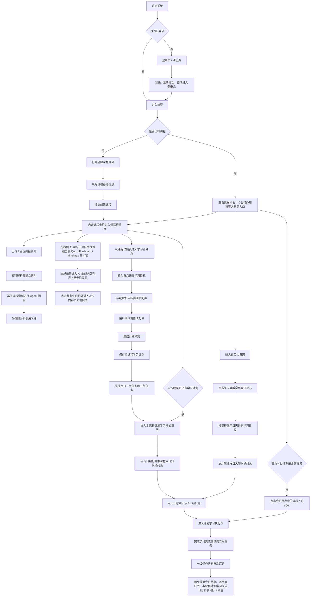
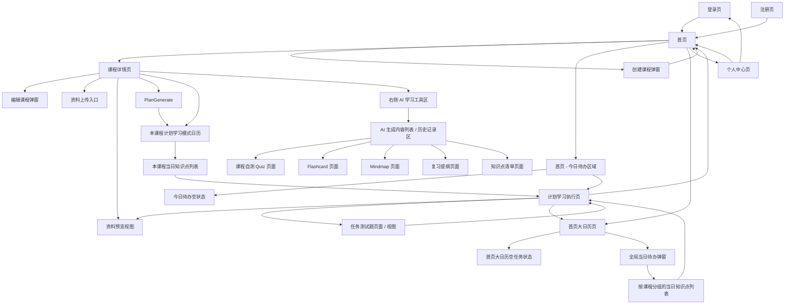
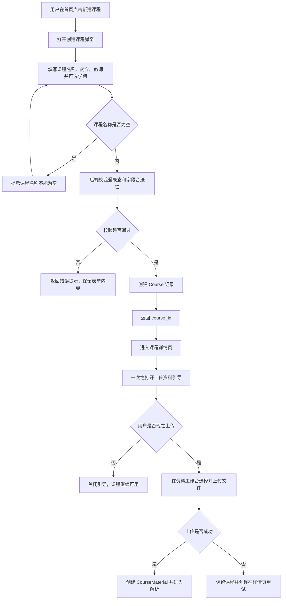
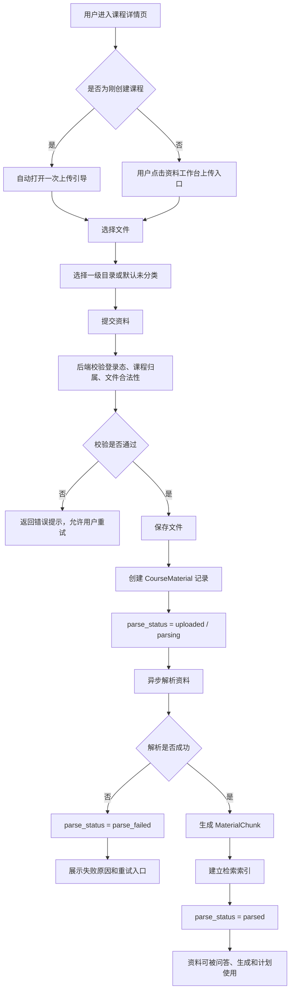
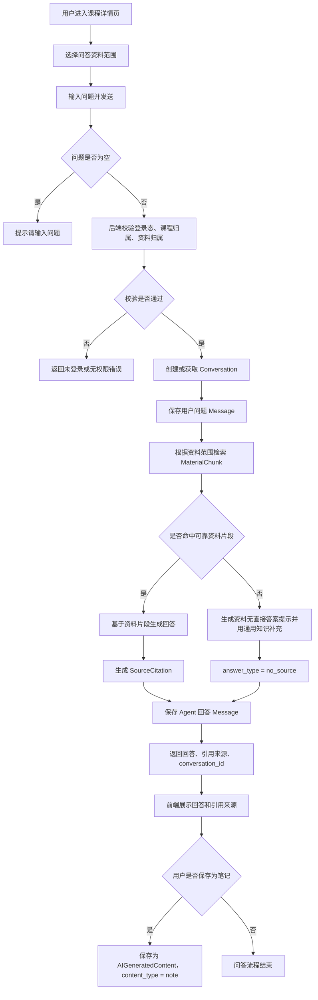
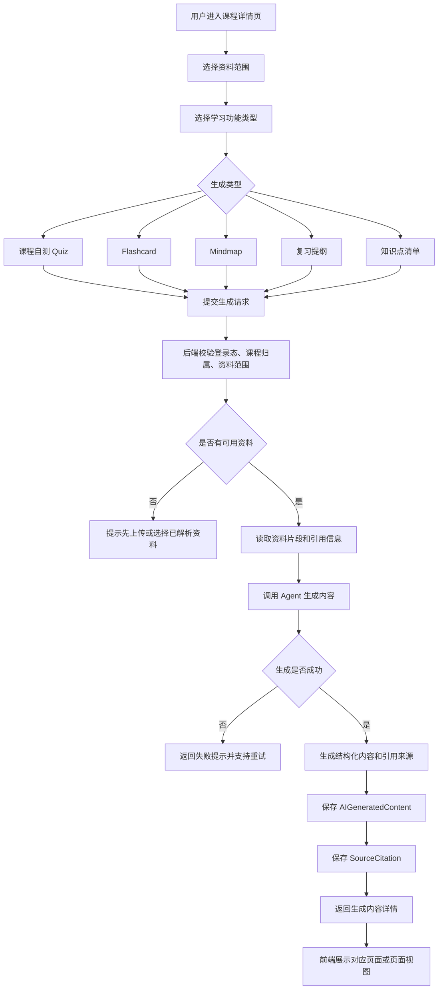
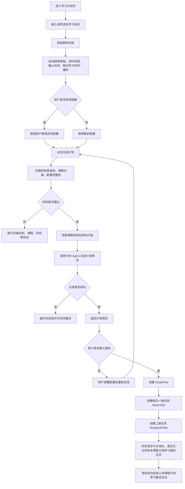
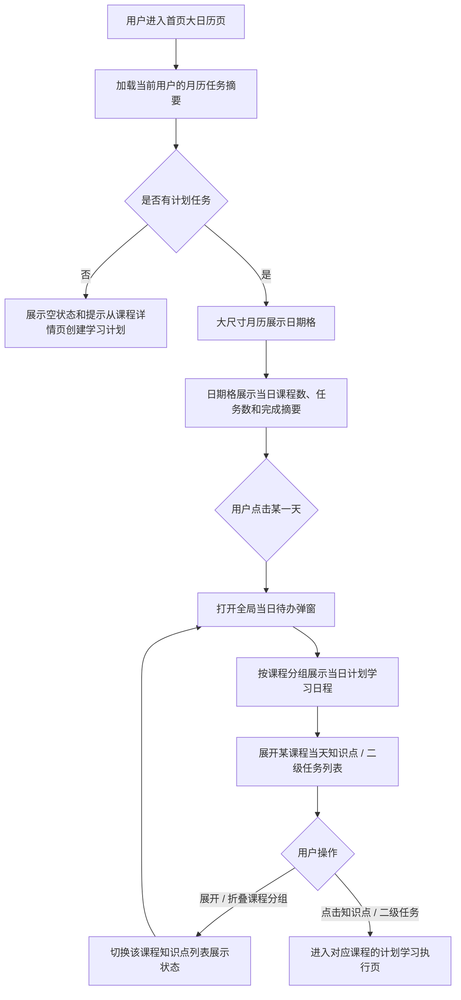
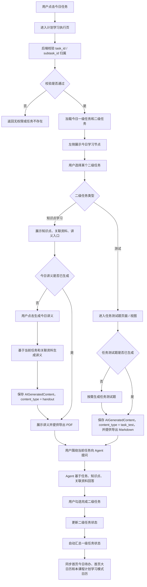
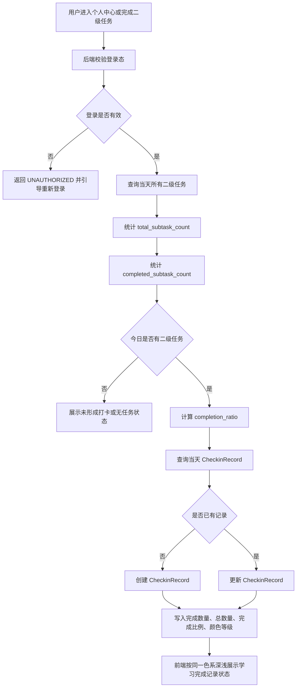

# 02 用户流程、页面跳转与系统流程

本文档为「CourseNexus 课枢 PRD v0.3」的第 02 部分，覆盖标准 PRD 结构中的第 7-9 章：用户主流程、页面跳转流程、核心系统处理流程。

本文件只说明流程、跳转、系统处理顺序和关键状态变化；具体功能模块说明放在第 10 章，页面交互细节放在第 11 章，字段和数据规则放在第 13 章。

## 7. 用户主流程

### 7.1 用户主流程图

### 7.2 主流程说明

用户主流程描述学生从进入系统到完成一次学习任务的完整路径。

1. 用户访问系统，未登录时进入登录页或注册页；登录成功或注册成功后自动进入登录态并进入首页。
2. 用户在首页查看课程列表、今日待办和首页大日历入口。
3. 用户没有课程时，通过创建课程弹窗新建课程；创建成功后进入新建课程的课程详情页。
4. 用户点击课程卡片进入课程详情页，上传或管理课程资料，并查看资料解析状态。
5. 资料解析成功后，系统建立可检索片段，用于 Agent 问答、学习辅助生成和学习计划生成。
6. 用户在课程详情页基于课程资料向 Agent 提问，查看回答和引用来源。
7. 用户可在课程详情页右侧 AI 学习工具区生成 Quiz、Flashcard、Mindmap、复习提纲、知识点清单等内容。
8. 学习辅助内容生成完成后，结果进入课程详情页的 AI 生成内容列表 / 历史记录区；用户点击某条生成记录后，直接进入对应内容页面或视图。
9. 学习计划只在课程详情页内创建，用户从某门课程的“制定学习计划”入口进入学习计划页。
10. 用户进入学习计划页后输入自然语言学习目标，系统自动解析目标并回填配置。
11. 用户确认配置后生成计划预览，保存后形成该课程的单课程学习计划、一级任务和二级任务。
12. 保存计划成功后进入本课程计划学习模式日历；之后有学习计划的课程可从课程详情页直接进入计划学习模式。
13. 在本课程计划学习模式日历中，用户点击日期打开本课程当日知识点 / 二级任务列表，点击任意知识点进入计划学习执行页。
14. 首页今日待办只聚合展示所有课程当天待办，点击课程或知识点后跳转到对应课程、对应任务的计划学习执行页。
15. 首页大日历只承担全局查看和跳转：点击某天后展示当天所有计划学习模式中的课程，展开某课程可看到当天知识点，点击知识点进入对应计划学习执行页。
16. 用户在计划学习执行页完成学习类或测试类二级任务。
17. 用户完成二级任务后，一级任务状态由系统自动汇总，并同步首页今日待办、首页大日历、本课程计划学习模式日历和学习打卡颜色。

## 8. 页面跳转流程

### 8.1 页面跳转图

### 8.2 页面跳转矩阵

| 当前页面 | 操作入口 | 用户操作 | 目标页面 | 携带参数 |
|---|---|---|---|---|
| 登录页 | 登录按钮 | 输入账号和密码并提交 | 首页 | token、user_id |
| 注册页 | 注册按钮 | 输入账号、密码、确认密码并提交 | 首页 | token、user_id；注册成功后自动登录 |
| 首页 | 新建课程按钮 | 点击新建课程 | 创建课程弹窗 | 无 |
| 首页 | 课程卡片 | 点击某门课程 | 课程详情页 | course_id |
| 首页 | 首页 - 今日待办区域 | 点击某个今日任务或知识点 | 计划学习执行页 | task_id、subtask_id、plan_id、course_id |
| 首页 | 今日待办空状态 | 查看空状态 | 当前页展示暂无今日待办 | 无 |
| 首页 | 首页大日历入口 | 点击日历入口 | 首页大日历页 | user_id、month |
| 首页 | 个人中心入口 | 点击头像或个人中心入口 | 个人中心页 | user_id |
| 创建课程弹窗 | 保存按钮 | 填写课程信息并提交 | 课程详情页 | course_id、openUploadPrompt=true |
| 创建课程弹窗 | 取消按钮 | 取消创建 | 首页 | 无 |
| 编辑课程弹窗 | 保存按钮 | 修改课程基础信息并提交 | 原页面 | course_id |
| 课程详情页 | 上传资料按钮 | 上传文件 | 资料上传入口 | course_id、folder_id |
| 课程详情页 | 资料列表 | 点击资料 | 资料预览视图 | course_id、material_id、page_no |
| 课程详情页 | Agent 输入框 | 输入问题并发送 | 当前页展示回答 | course_id、material_scope、question |
| 课程详情页 | 右侧 AI 学习工具区 | 点击生成课程自测 Quiz | 当前页 AI 生成内容列表新增课程自测 Quiz 记录 | course_id、material_scope、content_type=quiz |
| 课程详情页 | 右侧 AI 学习工具区 | 点击生成 Flashcard | 当前页 AI 生成内容列表新增 Flashcard 记录 | course_id、material_scope、content_type=flashcard |
| 课程详情页 | 右侧 AI 学习工具区 | 点击生成 Mindmap | 当前页 AI 生成内容列表新增 Mindmap 记录 | course_id、material_scope、content_type=mindmap |
| 课程详情页 | 右侧 AI 学习工具区 | 点击生成复习提纲 | 当前页 AI 生成内容列表新增复习提纲记录 | course_id、material_scope、content_type=outline |
| 课程详情页 | 右侧 AI 学习工具区 | 点击生成知识点清单 | 当前页 AI 生成内容列表新增知识点清单记录 | course_id、material_scope、content_type=knowledge_list |
| 课程详情页 | AI 生成内容列表 / 历史记录区 | 点击课程自测 Quiz 记录 | 课程自测 Quiz 页面 / 视图 | content_id |
| 课程详情页 | AI 生成内容列表 / 历史记录区 | 点击 Flashcard 记录 | Flashcard 页面 / 视图 | content_id |
| 课程详情页 | AI 生成内容列表 / 历史记录区 | 点击 Mindmap 记录 | Mindmap 页面 / 视图 | content_id |
| 课程详情页 | AI 生成内容列表 / 历史记录区 | 点击复习提纲记录 | 复习提纲页面 / 视图 | content_id |
| 课程详情页 | AI 生成内容列表 / 历史记录区 | 点击知识点清单记录 | 知识点清单页面 / 视图 | content_id |
| 课程详情页 | 制定计划入口 | 点击为本课程制定计划 | 学习计划页 | course_id、material_scope |
| 学习计划页 | 自然语言输入框 | 输入目标并触发解析 | 当前页回填配置 | goal_text、parsed_config |
| 学习计划页 | 生成计划按钮 | 确认配置后生成 | 当前页展示计划预览 | course_id、goal_text、config |
| 学习计划页 | 保存计划按钮 | 保存计划预览 | 本课程计划学习模式日历 | plan_id、course_id |
| 课程详情页 | 计划学习模式入口 | 点击进入本课程计划学习模式 | 本课程计划学习模式日历 | course_id、plan_id |
| 本课程计划学习模式日历 | 日期格 | 点击某一天 | 本课程当日知识点列表 | course_id、date |
| 本课程当日知识点列表 | 知识点 / 二级任务 | 点击进入学习 | 计划学习执行页 | task_id、subtask_id、plan_id、course_id |
| 首页大日历页 | 日期格 | 点击某一天 | 全局当日待办弹窗 | date |
| 全局当日待办弹窗 | 课程分组 | 展开某课程 | 当前弹窗展示该课程当天知识点 | course_id、date |
| 全局当日待办弹窗 | 知识点 / 二级任务 | 点击进入学习 | 计划学习执行页 | task_id、subtask_id、plan_id、course_id |
| 计划学习执行页 | 关联资料 | 点击资料或引用来源 | 资料预览视图 | material_id、page_no、chunk_id |
| 计划学习执行页 | 生成今日讲义按钮 | 点击生成讲义 | 当前页展示今日讲义 | task_id、subtask_id |
| 计划学习执行页 | 测试类二级任务 | 点击进入任务测试 | 任务测试题页面 / 视图 | task_id、subtask_id |
| 任务测试题页面 / 视图 | 返回入口 | 返回任务执行上下文 | 计划学习执行页 | task_id、subtask_id |
| 计划学习执行页 | 完成任务控件 | 勾选二级任务完成 | 当前页更新任务状态 | task_id、subtask_id |
| 个人中心页 | 修改资料按钮 | 修改头像或昵称 | 当前页更新资料 | user_id |
| 个人中心页 | 修改密码按钮 | 提交新密码 | 当前页提示成功或重新登录 | user_id |
| 个人中心页 | 学习打卡颜色区域 | 查看当日任务完成比例 | 当前页展示同色系深浅不同的学习打卡颜色 | user_id、date、completion_ratio |

## 9. 核心系统处理流程

### 9.1 课程创建流程

课程创建流程用于建立课程资料、Agent 问答、学习辅助内容和学习计划的基础上下文。

课程名称为必填项。课程简介、教师、学期为可选项；学期通过统一下拉选项选择，默认“未选择”并保存为 `null`，不允许自由输入。创建课程弹窗只提交课程基础信息；课程创建成功后进入课程详情页并打开可关闭的上传资料引导，链接资料入口已停止支持。

| 处理点 | 规则 |
|---|---|
| 登录校验 | 创建课程前必须校验当前用户登录态 |
| 数据归属 | 新课程必须绑定当前 `user_id` |
| 必填校验 | `course_name` 不能为空 |
| 资料可选 | 建课成功后可以关闭上传引导，不上传资料也保留课程 |
| 提交顺序 | `POST /courses` 成功并返回 `course_id` 后，资料工作台才允许发起独立上传请求 |
| 创建后跳转 | 课程创建成功后进入课程详情页，并一次性打开可关闭的上传资料引导 |
| 上传失败 | 上传失败不回滚已创建课程；用户停留在课程详情页并可重试 |
| 刷新与返回 | 创建成功后的导航状态只用于打开一次上传引导，刷新或返回不得再次创建课程 |

### 9.2 资料上传与选择流程

资料上传与选择流程用于支撑后续 Agent 问答、学习辅助生成和学习计划生成。

资料上传入口统一位于课程详情页资料工作台。首次建课成功后系统会导航到该详情页并自动打开一次上传引导；以后用户也可随时从同一资料工作台主动上传。

资料选择发生在 Agent 问答、学习辅助生成和学习计划生成前。用户可使用整门课程的全部已解析资料，或显式选择一个或多个具体资料。一级目录只用于归类和浏览，不作为资料范围。未选择时默认使用当前课程下全部已解析资料。

| 状态 | 含义 | 是否可用于检索 |
|---|---|---|
| uploaded | 文件已保存，尚未解析 | 否 |
| parsing | 正在解析资料 | 否 |
| parsed | 解析完成并建立索引 | 是 |
| parse_failed | 解析失败 | 否，允许重试 |
| deleted | 已删除 | 否 |

| 处理点 | 规则 |
|---|---|
| 上传归属 | 资料必须绑定课程，课程必须属于当前用户 |
| 重名处理 | 本期允许重名，展示时用上传时间区分 |
| 链接资料 | 链接资料入口已停止支持；历史链接记录标记“已停止支持”，仅保留查看与删除，不可解析、不进入检索 |
| 图片 OCR | 图片可上传；若无法 OCR，则不可被检索 |
| PDF 页码 | 优先使用真实页码，无法识别时使用页序号 |
| PPT 页码 | 使用幻灯片页序号作为 `page_index` |
| Word / Markdown / Text | 按标题或段落切分片段，页码可为空 |

### 9.3 Agent 问答流程

Agent 问答流程用于让用户围绕课程资料进行自由提问。系统应优先基于用户选择的资料范围检索资料片段，并在回答中展示引用来源。

| 处理点 | 规则 |
|---|---|
| 默认范围 | 未选择资料时，默认使用当前课程下全部 `parsed` 资料 |
| 范围过滤 | 选择一个或多个具体资料时，只在指定资料范围内检索；文件夹不参与范围选择 |
| 引用来源 | 基于资料回答时必须返回资料名、页码或页序号、命中文本片段 |
| 无命中提示 | 未命中资料时，回答开头必须提示“当前课程资料中未找到直接答案” |
| 对话保存 | 用户问题和 Agent 回答都需要保存 |
| 保存为笔记 | 保存为 `AIGeneratedContent.content_type = note`，不单独建 Note 对象 |
| 连续追问 | 连续追问应携带当前 conversation_id 和必要上下文 |

### 9.4 学习功能生成流程

学习功能生成流程用于将课程资料转化为结构化学习辅助内容，包括课程自测 Quiz、Flashcard、Mindmap、复习提纲、知识点清单。

| 生成类型 | 输出内容 | 保存对象 | 引用来源 |
|---|---|---|---|
| 课程自测 Quiz | 题目、选项、答案、解析 | AIGeneratedContent | 必须尽量提供 |
| Flashcard | 卡片正面、背面、标签 | AIGeneratedContent | 必须尽量提供 |
| Mindmap | 节点、层级、关系 | AIGeneratedContent | 必须尽量提供 |
| 复习提纲 | 章节结构、重点说明 | AIGeneratedContent | 必须尽量提供 |
| 知识点清单 | 知识点、定义、重要程度 | AIGeneratedContent | 必须尽量提供 |

| 处理点 | 规则 |
|---|---|
| 生成范围 | 每次生成必须记录课程和资料范围 |
| 内容归属 | 生成结果必须绑定当前用户和课程 |
| 重复生成 | 用户可重复生成同一类型内容，每次生成形成独立记录 |
| 结果查看 | 已生成内容可在课程下再次查看 |
| 引用保存 | 引用来源应结构化保存，便于详情页展示和资料预览跳转 |
| 失败重试 | 生成失败时不创建正式生成内容，允许用户重试 |

### 9.5 学习计划生成流程

学习计划生成流程用于根据用户目标和配置生成单课程学习计划、阶段安排和每日任务。

计划生成阶段只生成计划和每日待办，不提前批量生成今日讲义、任务测试题或学习笔记。今日讲义在计划学习执行页按需生成，任务测试题在进入任务测试题页面 / 视图后按需生成。

| 输入项 | 是否必填 | 说明 |
|---|---|---|
| goal_text | 是 | 用户自然语言学习目标 |
| course_id | 是 | 本期一个计划只能绑定一门课程 |
| material_scope | 否 | 资料范围，未选择时默认课程下全部已解析资料 |
| start_date | 是 | 计划开始日期 |
| end_date | 是 | 计划截止日期 |
| daily_available_minutes | 是 | 每日可用学习时间 |
| preference | 否 | 速通、精通、拔高等计划偏好 |

| 输出项 | 说明 |
|---|---|
| StudyPlan | 单课程学习计划，绑定 user_id 和 course_id |
| StudyTask | 每日一级任务，用于本课程计划学习模式日历、首页今日待办和首页大日历展示 |
| StudySubTask | 二级任务，通常为知识点学习任务，最后可包含测试任务 |
| related_materials | 每日任务关联资料，用于计划执行页 |
| knowledge_points | 每日任务关联知识点，用于讲义和问答上下文 |

| 处理点 | 规则 |
|---|---|
| 单课程计划 | 本期一个 StudyPlan 只能绑定一个 course_id |
| 课程内创建 | 学习计划只从课程详情页进入创建流程，保存后属于当前课程 |
| 课程内执行 | 有学习计划的课程可从课程详情页进入本课程计划学习模式日历 |
| 多课程展示 | 多个单课程计划可在首页今日待办和首页大日历按日期合并展示，首页只负责查看和跳转 |
| 不做冲突优化 | 本期不自动检测多课程任务冲突，也不做智能重排 |
| 配置回填 | 自然语言解析结果只做回填，用户最终确认的配置优先级最高 |
| 任务粒度 | 每日任务包含一级任务和二级任务；一级任务表示主题，二级任务表示知识点学习或测试 |
| 测试任务 | 任务测试题内容不在计划生成阶段生成，只生成测试类二级任务壳 |
| 保存时机 | 用户确认保存后才正式创建 StudyPlan、StudyTask、StudySubTask |
### 9.6 首页大日历与当日待办流程

首页大日历与当日待办流程用于说明用户如何从全局日期维度查看所有课程的计划学习日程，并跳转到具体课程、具体知识点的计划学习执行页。

首页大日历页本身只展示大尺寸月历，不默认展示右侧栏，也不提供创建、编辑或重新生成计划入口。日期格展示当日任务摘要，例如课程数量、任务数量和完成状态摘要；不展示完整知识点列表。用户点击某一天后，才打开全局当日待办弹窗。

全局当日待办弹窗按课程分组展示当天所有计划学习模式日程。用户先看到当天涉及的课程，再展开某门课程查看该课程当天的知识点 / 二级任务列表，点击任意知识点后跳转到对应课程的计划学习执行页。

| 处理点 | 规则 |
|---|---|
| 月历摘要 | 首页大日历首次加载只需要返回日期级任务摘要，不需要返回完整二级任务 |
| 日期格内容 | 日期格展示课程数量、任务数量和完成状态摘要，不展示完整知识点列表 |
| 首页只跳转 | 首页大日历和全局当日待办弹窗不提供创建、编辑、删除或重新生成计划能力 |
| 弹窗分组 | 点击日期后按课程分组展示当天所有计划学习日程 |
| 知识点展开 | 用户展开某课程后，查看该课程当天知识点 / 二级任务列表 |
| 任务入口 | 点击知识点 / 二级任务后，进入对应课程、对应任务的计划学习执行页 |
| 空状态 | 无任务日期只展示空状态和提示，不从首页直接进入学习计划页 |
| 状态同步 | 首页今日待办、首页大日历、本课程计划学习模式日历、全局当日待办弹窗、计划执行页的任务完成状态必须一致 |

### 9.7 计划学习执行流程

计划学习执行流程用于说明用户进入某一天具体任务后，如何完成学习、生成今日讲义、进入任务测试题页面 / 视图，并更新任务状态。

计划学习执行页左侧只展示今日学习任务，不展示整个计划树。今日任务包含一级任务和二级任务：一级任务表示今日学习主题，二级任务表示具体知识点学习或测试。一级任务完成状态不由用户直接勾选，而是由其下二级任务完成状态自动计算。

| 处理点 | 规则 |
|---|---|
| 任务范围 | 计划学习执行页左侧只显示今日任务，不显示整个计划所有日期任务 |
| 二级任务类型 | 二级任务可为知识点学习或测试；当天可以没有测试任务 |
| 今日讲义 | 学习类二级任务按需生成讲义，生成后保存并支持导出 PDF |
| 任务测试题 | 测试类二级任务进入任务测试题页面 / 视图后按需生成任务测试题，生成后支持导出 Markdown（PDF 为后续能力） |
| 资料预览 | 用户点击资料或引用来源后，可选择中间分屏或小窗预览，不使用固定右侧抽屉 |
| 二级任务完成 | 二级任务有独立完成状态，可由用户勾选或取消 |
| 一级任务汇总 | 一级任务状态由二级任务自动计算：全未完成为未开始，部分完成为进行中，全部完成为已完成 |
| 状态同步 | 二级任务和一级任务状态变化后，需要同步首页今日待办、首页大日历、本课程计划学习模式日历和全局当日待办弹窗 |

### 9.8 学习打卡颜色流程

学习打卡颜色流程用于记录用户当天学习完成情况。本期学习打卡颜色不是用户手动点击生成，而是根据用户当天二级任务完成比例生成颜色深浅。

同一用户同一自然日只有一条学习完成记录。当天总二级任务数为分母，已完成二级任务数为分子，计算 `completion_ratio = completed_subtask_count / total_subtask_count`。完成比例越高，个人中心中的学习打卡颜色越深；完成比例较低时使用同一色系的浅色。

例如：今天共有 5 个二级任务，只完成 1 个，则完成比例为 20%，显示浅色；完成 5 个，则完成比例为 100%，显示较深颜色。

| 处理点 | 规则 |
|---|---|
| 每日唯一 | 同一用户同一自然日最多一条 CheckinRecord |
| 计算口径 | `completion_ratio = completed_subtask_count / total_subtask_count` |
| 分母范围 | 统计当天所有计划任务下的二级任务，不按一级任务数量计算 |
| 无任务日期 | 当天没有二级任务时，不计算完成比例，可展示无任务或未形成学习完成记录状态 |
| 颜色规则 | 使用同一色系表达完成比例，比例越高颜色越深 |
| 浅色场景 | 当完成比例大于 0 但较低时显示浅色，例如 1/5 |
| 深色场景 | 当完成比例接近或等于 100% 时显示深色，例如 5/5 |
| 状态更新 | 用户完成或取消完成二级任务后，应重新计算当天完成比例 |
| 幂等处理 | 重复触发计算不重复创建记录，只更新同一天记录 |
| 记录内容 | 至少记录 user_id、checkin_date、total_subtask_count、completed_subtask_count、completion_ratio、color_level、updated_at |

建议颜色等级按完成比例映射，具体颜色值由 UI 设计确定：

| 完成比例 | 学习完成记录状态 | 颜色强度 |
|---|---|---|
| 0% | 未完成 | 无色或极浅色 |
| 1%-39% | 少量完成 | 浅色 |
| 40%-79% | 部分完成 | 中等颜色 |
| 80%-99% | 基本完成 | 较深颜色 |
| 100% | 全部完成 | 最深颜色 |

