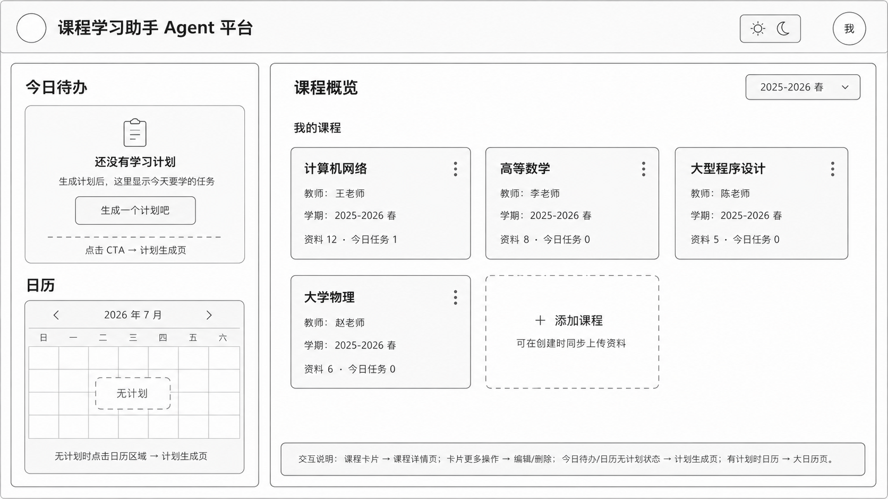
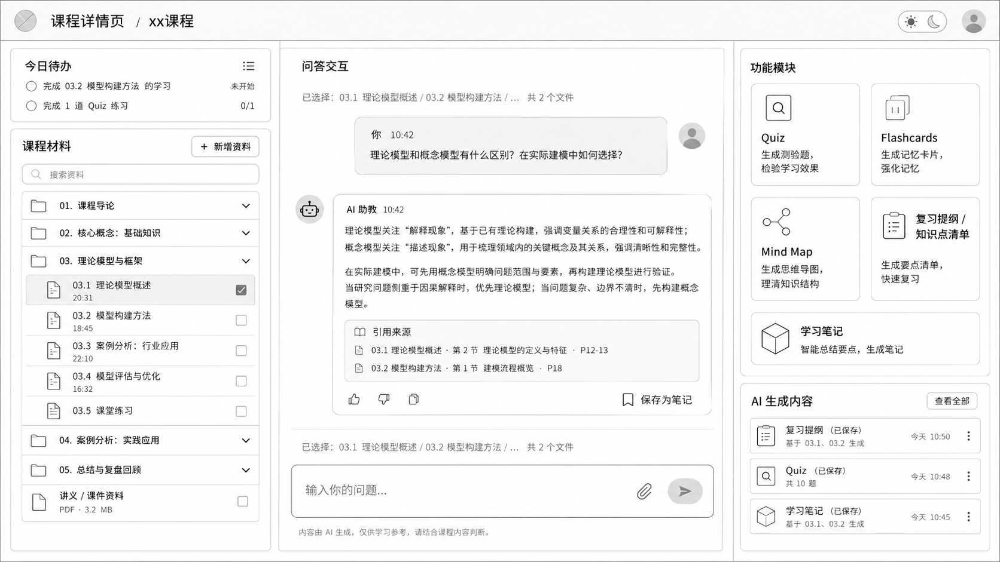
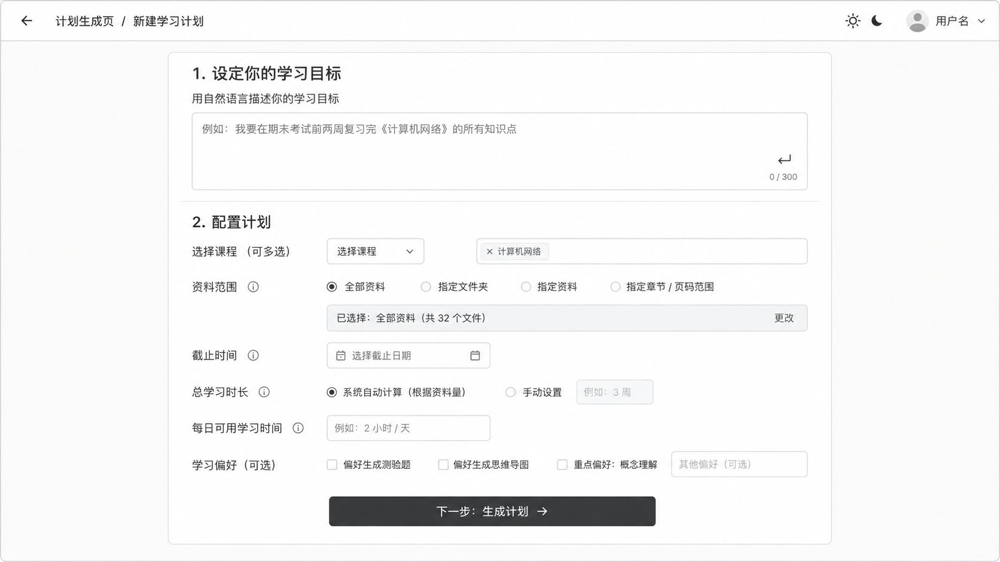
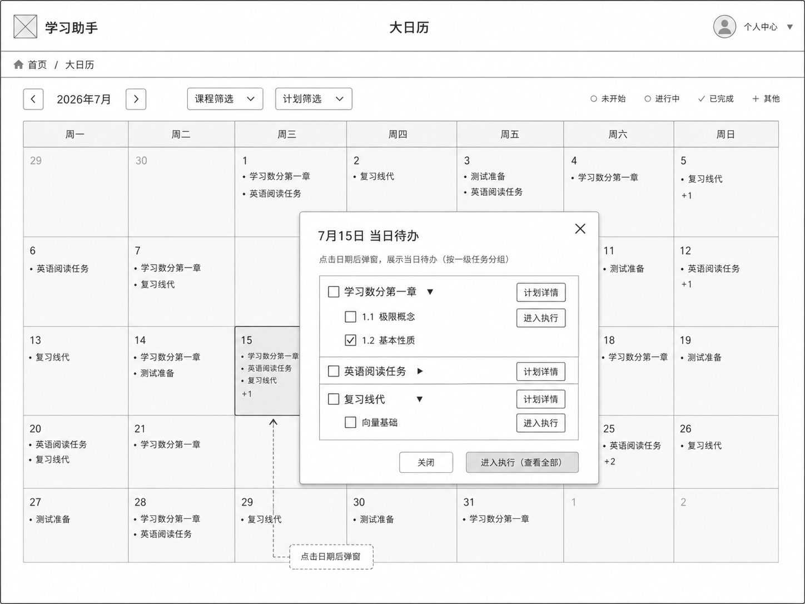
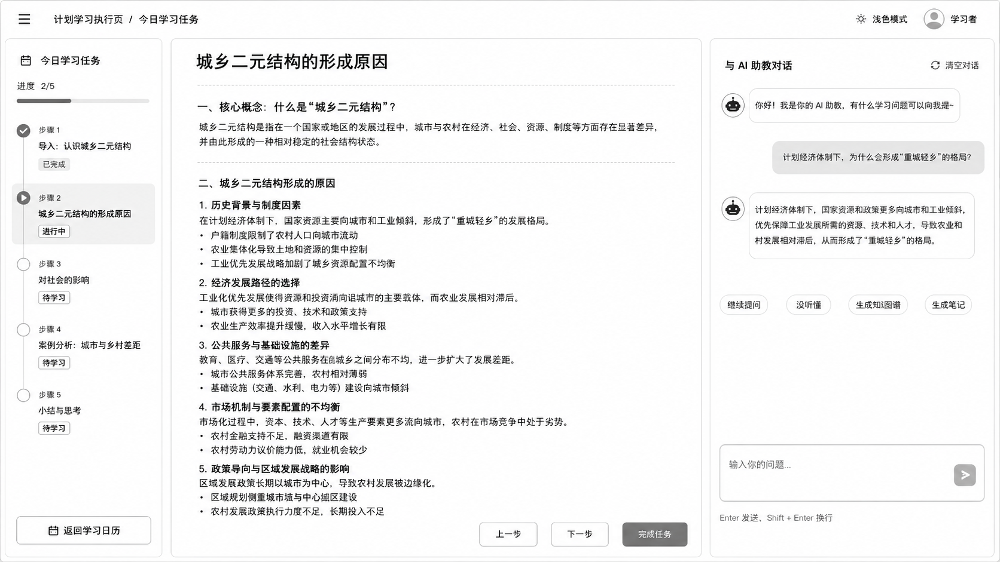
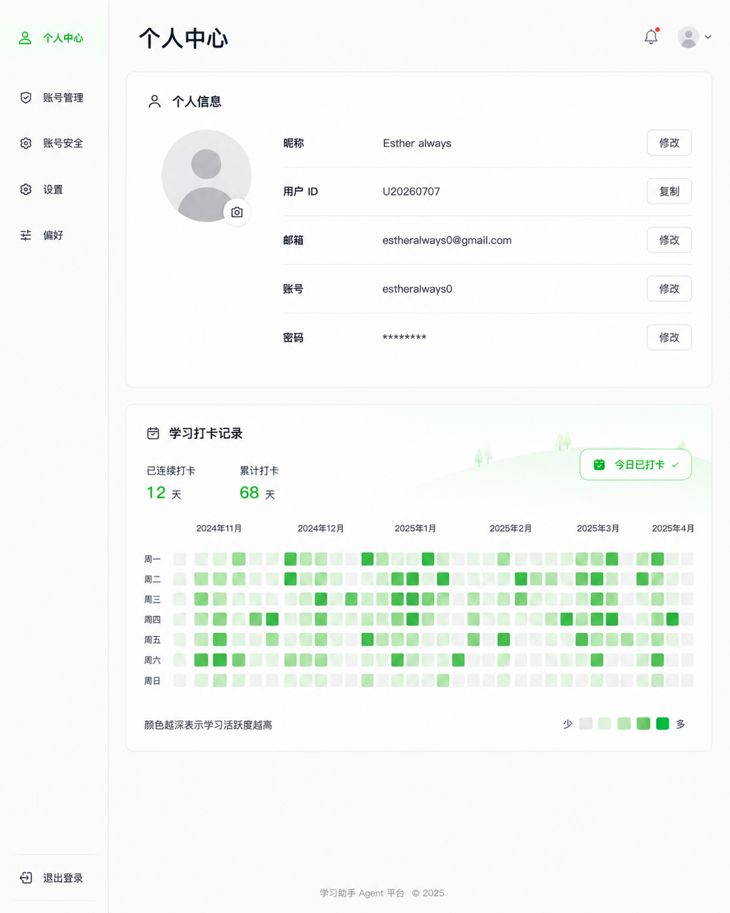

# 04 页面与交互说明

本文档对应《CourseNexus 课枢 PRD》的第 11 章，说明各独立页面、弹窗、弹窗展开态、局部模块和页面视图的页面目标、展示内容、交互规则、跳转规则、状态、异常、埋点和验收标准。

本文件只描述页面与交互，不重复展开功能模块原理、数据对象字段和接口细节。功能模块边界见 `03_功能模块说明.md`，字段与数据规则见 `05_Agent规则_字段与数据规则.md`；具体 API 接口细节后续在架构 / 开发文档中说明。

## 11. 页面与交互说明

### 11.1 页面类型说明

| 类型 | 说明 | 是否独立访问 | 示例 |
|---|---|---:|---|
| 独立页面 | 可以作为完整页面访问，通常对应独立路由或完整主视图 | 是 | 首页、课程详情页、首页大日历页、计划学习执行页、个人中心页 |
| 弹窗 | 依附某个页面打开，不作为独立页面 | 否 | 创建课程弹窗、编辑课程弹窗、全局当日待办弹窗 |
| 弹窗展开态 | 弹窗内部因用户操作进入的扩展状态，不是新页面，也不是新弹窗 | 否 | 本期暂无必须单独拆出的弹窗展开态 |
| 局部模块 | 某个页面中的局部区域，不单独访问 | 否 | 首页 - 今日待办局部模块、课程详情页右侧功能板块区 |
| 页面视图 | 可以承载完整交互，但本期不强制要求独立路由，可由前端实现为页面内视图 | 视实现而定 | 任务测试题页面 / 视图、资料预览视图 |

#### 11.1.1 写作颗粒度规则

| 对象类型 | 在本章中的写法 | 必写内容 | 可省略内容 |
|---|---|---|---|
| 独立页面 | 按完整页面说明写 | 页面入口、页面结构、展示字段、交互规则、跳转规则、页面状态、异常处理、埋点、验收标准 | 无 |
| 弹窗 | 按交互组件说明写 | 触发入口、字段、主要操作、提交/关闭规则、loading/失败状态、触发后端能力、验收标准 | 不要求完整页面级导航、复杂页面布局 |
| 弹窗展开态 | 按状态变化说明写 | 触发条件、展开前后布局变化、展示内容、返回/关闭规则、异常处理 | 不作为新页面单独写路由 |
| 局部模块 | 按页面内模块说明写 | 所属页面、展示内容、点击行为、状态、验收标准 | 不要求完整页面级原型和跳转矩阵 |
| 很小的控件 | 并入所属页面交互规则 | 按钮状态、确认提示、禁用条件 | 不单独成章 |

因此，本章中 `创建课程弹窗`、`编辑课程弹窗`、`全局当日待办弹窗`、`首页 - 今日待办局部模块` 等内容会单独说明。它们单独写，是因为它们承载了关键业务操作、状态变化或后端触发点。
页面命名统一规则：

1. `首页` 是课程、今日待办、日历入口、个人中心入口所在的学习工作台，统一使用“首页”作为页面名称。
2. `创建课程弹窗` 是从首页打开的弹窗，不再写作“创建课程页 / 弹窗”。
3. 页面内区域统一称为 `局部模块`，不再写作“页面区域 / 小组件”。
4. 首页大日历和全局当日待办弹窗只负责查看与跳转，不提供计划详情编辑态。
5. `任务测试题页面 / 视图` 不定死为独立页面还是页面内视图，由前端实现决定，但必须承载完整做题、答案解析和 Markdown 导出能力（测试题 PDF 导出为后续能力）。

### 11.2 首页

#### 11.2.1 页面原型

对应原型中的课程列表 / 学习工作台页面。如原型未覆盖全部状态，以本文档交互规则为准。

#### 11.2.2 页面目标

首页用于让用户快速查看已有课程、进入课程学习空间、查看今日学习任务、进入首页大日历、创建新课程和进入个人中心。

#### 11.2.3 页面入口

| 入口 | 说明 |
|---|---|
| 登录成功 | 用户账号密码登录成功后进入首页 |
| 顶部导航 / 返回首页 | 从课程详情页、学习计划页、首页大日历页、个人中心页返回 |
| 计划保存成功 | 保存学习计划后可回到首页查看今日任务 |

#### 11.2.4 页面结构

| 区域 | 类型 | 说明 |
|---|---|---|
| 顶部导航区 | 局部模块 | 展示产品名称、个人中心入口、退出登录入口 |
| 课程列表区 | 局部模块 | 展示用户已创建课程，支持进入课程详情、编辑课程、删除课程 |
| 今日待办局部模块 | 局部模块 | 展示当天需要完成的任务摘要和完成状态 |
| 首页大日历入口 | 局部模块 | 进入首页大日历页查看按日期聚合的计划任务 |
| 创建课程入口 | 按钮 | 打开创建课程弹窗 |

#### 11.2.5 页面功能矩阵

| 功能 | 优先级 | 触发方式 | 结果 |
|---|---|---|---|
| 查看课程列表 | P0 | 进入首页 | 展示当前用户课程卡片 |
| 创建课程 | P0 | 点击“新建课程” | 打开创建课程弹窗 |
| 进入课程详情 | P0 | 点击课程卡片 | 跳转课程详情页 |
| 编辑课程 | P1 | 点击课程操作入口 | 打开编辑课程弹窗 |
| 删除课程 | P1 | 点击删除 | 二次确认后删除课程 |
| 查看今日待办 | P0 | 首页默认展示 | 展示当天一级任务和完成状态摘要 |
| 进入学习执行 | P0 | 点击今日任务 | 进入计划学习执行页 |
| 进入首页大日历 | P0 | 点击日历入口 | 跳转首页大日历页 |
| 进入个人中心 | P1 | 点击头像 / 个人中心入口 | 跳转个人中心页 |

#### 11.2.6 展示字段

| 区域 | 字段 |
|---|---|
| 课程卡片 | 课程名称、课程简介、教师、学期、资料数量、最近更新时间 |
| 今日待办局部模块 | 日期、一级任务标题、所属课程、完成状态、二级任务完成进度 |
| 顶部导航区 | 用户头像、昵称、退出登录入口 |

#### 11.2.7 交互规则

1. 首页只展示当前登录用户有权限访问的数据。
2. 用户没有课程时，课程列表区展示空状态，并提供“新建课程”入口。
3. 今日待办局部模块只展示当天任务摘要，不展开完整计划详情。
4. 今日待办中的任务可以进入计划学习执行页。
5. 多个单课程计划的当天任务在今日待办局部模块中合并展示。
6. 删除课程前必须二次确认；删除后该课程相关资料、对话、生成内容、计划和任务按数据规则处理。

#### 11.2.8 跳转规则

| 用户操作 | 目标 | 携带参数 |
|---|---|---|
| 点击课程卡片 | 课程详情页 | `course_id` |
| 点击“新建课程” | 创建课程弹窗 | 无 |
| 点击编辑课程 | 编辑课程弹窗 | `course_id` |
| 点击今日任务 | 计划学习执行页 | `task_id`、`date` |
| 点击日历入口 | 首页大日历页 | 默认当前月份 |
| 点击个人中心入口 | 个人中心页 | `user_id` |

#### 11.2.9 页面状态

| 状态 | 说明 |
|---|---|
| loading | 首次进入首页，加载课程和今日待办 |
| empty | 用户没有课程，或当天没有待办任务 |
| success | 正常展示课程和今日待办 |
| error | 首页数据加载失败，允许重试 |
| disabled | 登录失效时页面操作禁用并跳转登录 |

#### 11.2.10 异常处理

| 异常场景 | 系统处理 | 用户提示 |
|---|---|---|
| 课程列表加载失败 | 保留页面骨架，显示重试入口 | 课程加载失败，请重试 |
| 今日待办加载失败 | 不影响课程列表展示，今日待办区域显示错误状态 | 今日任务加载失败 |
| 删除课程失败 | 不移除课程卡片 | 删除失败，请稍后再试 |
| 登录失效 | 清理本地登录态，跳转登录页 | 登录已失效，请重新登录 |

#### 11.2.11 埋点要求

| 事件 | 触发时机 | 关键属性 |
|---|---|---|
| `home_view` | 首页加载成功 | `course_count`、`today_task_count` |
| `course_card_click` | 点击课程卡片 | `course_id` |
| `create_course_click` | 点击新建课程 | `source=home` |
| `today_task_click` | 点击今日任务 | `task_id`、`course_id`、`date` |
| `calendar_entry_click` | 点击日历入口 | `source=home` |

#### 11.2.12 验收标准

1. 登录成功后能进入首页并看到当前用户课程。
2. 无课程时有明确空状态和新建入口。
3. 今日待办局部模块可以合并展示多个单课程计划的当天任务。
4. 点击课程、今日任务、首页大日历、个人中心入口均能进入正确位置。
5. 首页不展示其他用户课程和任务。

### 11.3 创建课程弹窗

> 类型：弹窗。该部分按交互组件说明写，不作为独立页面。

#### 11.3.1 原型位置

对应新建课程弹窗原型；如原型未体现资料上传入口，以本文档为准。

#### 11.3.2 交互目标

创建课程弹窗用于让用户创建一门课程，并可在创建时选择上传初始资料或添加资料链接。

#### 11.3.3 页面入口

| 入口 | 所属页面 |
|---|---|
| 首页“新建课程”按钮 | 首页 |
| 首页空状态“创建课程”按钮 | 首页 |

#### 11.3.4 弹窗结构

| 区域 | 说明 |
|---|---|
| 基础信息区 | 课程名称、课程简介、教师、学期 |
| 初始资料区 | 可选上传文件、展示待上传列表 |
| 操作区 | 取消、创建课程 |

#### 11.3.5 弹窗功能矩阵

| 功能 | 优先级 | 说明 |
|---|---|---|
| 填写课程名称 | P0 | 必填 |
| 填写简介、教师、学期 | P1 | 可选 |
| 上传初始资料 | P0 | 支持文件上传 |
| 添加资料链接 | P0 | 支持网页链接 |
| 删除待上传资料 | P1 | 创建前从待上传列表移除 |
| 提交创建 | P0 | 创建课程并处理初始资料 |

#### 11.3.6 展示字段

| 字段 | 必填 | 说明 |
|---|---:|---|
| 课程名称 | 是 | 用户自定义课程名 |
| 课程简介 | 否 | 课程说明 |
| 教师 | 否 | 授课教师 |
| 学期 | 否 | 下拉选择统一学期选项，默认“未选择”，不允许自由输入 |
| 初始资料 | 否 | 文件或链接列表 |

#### 11.3.7 交互规则

1. 课程名称为空时不能提交。
2. 用户可以只创建课程，不上传资料。
3. 用户也可以在创建课程时上传资料文件。
4. 提交后优先创建课程；课程创建成功后再关联并解析资料。
5. 如果课程创建成功但资料上传或解析失败，不回滚课程。
6. 资料失败时应在课程详情页资料区展示失败状态，并允许重试。
7. 重复点击创建按钮时按钮进入 loading 并禁用，避免重复创建课程。

#### 11.3.8 跳转规则

| 用户操作 | 目标 | 说明 |
|---|---|---|
| 点击取消 | 关闭弹窗 | 不保存输入内容，或由前端决定是否二次确认 |
| 创建成功 | 课程详情页 | 携带 `course_id` |
| 创建成功但资料失败 | 课程详情页 | 课程可用，资料展示失败状态 |

#### 11.3.9 弹窗状态

| 状态 | 说明 |
|---|---|
| default | 等待用户输入 |
| uploading | 初始资料上传中 |
| creating | 课程创建中，提交按钮禁用 |
| partial_success | 课程成功，部分资料失败 |
| error | 课程创建失败 |

#### 11.3.10 异常处理

| 异常场景 | 系统处理 | 用户提示 |
|---|---|---|
| 课程名称为空 | 阻止提交 | 请输入课程名称 |
| 课程创建失败 | 保留输入内容 | 创建失败，请重试 |
| 文件上传失败 | 保留课程创建结果，资料标记失败 | 部分资料上传失败，可稍后重试 |
| 链接抓取失败 | 保存链接记录并标记解析失败 | 链接解析失败，可重试 |

#### 11.3.11 埋点要求

| 事件 | 触发时机 | 属性 |
|---|---|---|
| `create_course_modal_view` | 弹窗打开 | `source` |
| `create_course_submit` | 点击创建 | `has_material`、`file_count`、`link_count` |
| `create_course_success` | 课程创建成功 | `course_id` |
| `create_course_failed` | 课程创建失败 | `error_code` |

#### 11.3.12 验收标准

1. 首页可以打开创建课程弹窗。
2. 只填写课程名称即可创建课程。
3. 创建课程时可以同时上传文件。
4. 资料上传失败不影响已创建课程进入课程详情页。
5. 重复点击创建按钮不会产生重复课程。
6. 学期为可选字段；未选择时保存 `null`，选择时使用后端统一提供的标准选项。

### 11.4 编辑课程弹窗

> 类型：弹窗。该部分按交互组件说明写，不作为独立页面。

#### 11.4.1 原型位置

对应编辑课程信息弹窗。编辑课程只处理课程基础信息，不处理资料上传。

#### 11.4.2 交互目标

允许用户修改课程名称、简介、教师、学期等基础信息。

#### 11.4.3 页面入口

| 入口 | 所属页面 |
|---|---|
| 首页课程卡片操作入口 | 首页 |
| 课程详情页课程信息操作入口 | 课程详情页 |

#### 11.4.4 弹窗结构

| 区域 | 说明 |
|---|---|
| 基础信息表单 | 课程名称、简介、教师、学期 |
| 操作区 | 取消、保存 |

#### 11.4.5 弹窗功能矩阵

| 功能 | 优先级 | 说明 |
|---|---|---|
| 修改课程名称 | P0 | 必填 |
| 修改课程简介 | P1 | 可选 |
| 修改教师 | P1 | 可选 |
| 修改学期 | P1 | 可选 |
| 保存修改 | P0 | 更新课程信息 |

#### 11.4.6 展示字段

课程名称、课程简介、教师、学期、更新时间。

编辑课程时学期同样使用统一下拉选项；选择“未选择”可将学期清空为 `null`。

#### 11.4.7 交互规则

1. 打开弹窗时回填当前课程信息。
2. 课程名称为空时不能保存。
3. 保存期间按钮禁用。
4. 保存成功后关闭弹窗，并刷新课程卡片或课程详情页基础信息。

#### 11.4.8 跳转规则

编辑课程弹窗保存后不跳转，只关闭弹窗并刷新当前页面数据。

#### 11.4.9 弹窗状态

默认态、保存中、保存成功、保存失败。

#### 11.4.10 异常处理

| 异常场景 | 系统处理 | 用户提示 |
|---|---|---|
| 无权限编辑 | 禁止保存 | 无权编辑该课程 |
| 保存失败 | 保留表单 | 保存失败，请重试 |

#### 11.4.11 埋点要求

`edit_course_modal_view`、`edit_course_submit`、`edit_course_success`、`edit_course_failed`。

#### 11.4.12 验收标准

1. 可以从首页或课程详情页打开编辑课程弹窗。
2. 保存成功后页面展示最新课程信息。
3. 无权限用户不能编辑课程。

### 11.5 课程详情页

#### 11.5.1 页面原型

对应课程详情主页面原型。

#### 11.5.2 页面目标

课程详情页是单门课程的学习空间，用户在这里管理资料、基于资料向 Agent 提问，并使用右侧 AI 学习工具区和学习计划生成。

#### 11.5.3 三栏结构说明

| 区域 | 位置 | 说明 |
|---|---|---|
| 左侧课程材料区 | 左侧 | 展示资料列表、一级目录、上传入口、解析状态 |
| 中间 Agent 问答区 | 中间 | 展示对话记录、提问输入框、回答和引用来源 |
| 右侧功能板块区 | 右侧 | 展示课程自测 Quiz、Flashcard、Mindmap、复习提纲、知识点清单、学习计划入口 |

#### 11.5.4 左侧课程材料区

| 功能 | 说明 |
|---|---|
| 查看资料列表 | 按一级目录或上传时间展示课程资料 |
| 上传资料 | 打开资料上传入口 |
| 重命名资料 | 修改资料展示名称，不改变原文件 |
| 查看解析状态 | 展示解析中、解析成功、解析失败 |
| 选择资料范围 | 为 Agent 问答和学习辅助生成选择资料上下文 |
| 预览资料 | 打开资料预览视图 |

交互规则：

1. 默认上下文范围为当前课程下已解析成功的全部资料。
2. 用户可选择单个资料或多个资料作为上下文范围；一级目录按钮只切换列表归类视图，不改变上下文范围。
3. 解析中资料可展示但不可作为检索上下文。
4. 解析失败资料提供重试入口。
5. 删除资料前需要二次确认。

#### 11.5.5 中间 Agent 问答区

| 功能 | 说明 |
|---|---|
| 输入问题 | 用户输入自然语言问题 |
| 发送问题 | 触发 Agent 基于资料回答 |
| 查看回答 | 展示结构化回答内容 |
| 查看引用来源 | 展示资料名、页码/页序号、命中文本片段 |
| 连续追问 | 保留当前对话上下文 |
| 保存为笔记 | 将回答保存为 `AIGeneratedContent.content_type = note` |

交互规则：

1. 输入为空时发送按钮禁用。
2. 发送中按钮显示 loading 并禁用。
3. 回答必须尽量引用课程资料来源。
4. 如果没有命中资料，回答中必须明确说明当前课程资料中未找到直接答案。
5. 点击引用来源可定位到资料预览视图中的对应页码或页序号。

#### 11.5.6 右侧功能板块区

| 功能入口 | 说明 |
|---|---|
| 课程自测 Quiz | 基于课程资料生成自测题 |
| Flashcard | 基于课程资料生成记忆卡片 |
| Mindmap | 基于课程资料生成知识结构图 |
| 复习提纲 | 生成章节化复习路径 |
| 知识点清单 | 生成重点知识点列表 |
| 制定学习计划 | 进入学习计划页 |
| 计划学习模式 | 已存在学习计划时，进入本课程计划学习模式日历 |

交互规则：

1. 点击右侧 AI 学习工具区时，若当前没有可用资料，应提示先上传并解析资料。
2. 生成内容需保存并可在详情页查看引用来源。
3. 学习计划入口进入单课程计划生成流程。
4. 当前课程已存在学习计划时，展示计划学习模式入口，点击进入本课程计划学习模式日历。

#### 11.5.7 页面功能矩阵

| 功能 | 优先级 | 区域 |
|---|---|---|
| 查看课程资料 | P0 | 左侧课程材料区 |
| 上传 / 添加资料 | P0 | 左侧课程材料区 |
| Agent 问答 | P0 | 中间 Agent 问答区 |
| 引用来源定位 | P0 | 中间 Agent 问答区 |
| 保存回答为笔记 | P1 | 中间 Agent 问答区 |
| 使用右侧 AI 学习工具区 | P0 | 右侧功能板块区 |
| 进入学习计划页 | P0 | 右侧功能板块区 |
| 进入计划学习模式 | P0 | 右侧功能板块区 |

#### 11.5.8 跳转规则

| 用户操作 | 目标 | 携带参数 |
|---|---|---|
| 点击资料 | 资料预览视图 | `course_id`、`material_id` |
| 点击引用来源 | 资料预览视图 | `material_id`、`page` 或 `page_index` |
| 点击课程自测 Quiz | 课程自测 Quiz 页面 / 视图 | `course_id`、`material_scope` |
| 点击 Flashcard | Flashcard 页面 | `course_id`、`material_scope` |
| 点击 Mindmap | Mindmap 页面 | `course_id`、`material_scope` |
| 点击复习提纲 | 复习提纲页面 | `course_id`、`material_scope` |
| 点击知识点清单 | 知识点清单页面 | `course_id`、`material_scope` |
| 点击制定学习计划 | 学习计划页 | `course_id` |
| 点击计划学习模式 | 本课程计划学习模式日历 | `course_id`、`plan_id` |

#### 11.5.9 字段说明

| 字段 | 说明 |
|---|---|
| `course_id` | 当前课程 ID |
| `material_scope` | 用户选择的资料范围 |
| `conversation_id` | 当前对话 ID |
| `source_citations` | 引用来源列表 |
| `parse_status` | 资料解析状态 |

#### 11.5.10 状态与异常

| 状态 / 异常 | 处理 |
|---|---|
| 资料为空 | 左侧资料区提示上传资料 |
| 资料解析中 | 可查看状态，不进入检索范围 |
| Agent 生成中 | 输入区禁用或展示停止 / 等待状态 |
| Agent 生成失败 | 保留用户问题，允许重试 |
| 引用来源缺失 | 明确提示未找到直接来源 |

#### 11.5.11 埋点与验收

埋点：`course_detail_view`、`material_upload_click`、`agent_question_send`、`agent_answer_generated`、`citation_click`、`save_note_click`、`learning_tool_click`、`study_plan_entry_click`。

验收标准：

1. 课程详情页三栏结构清晰可用。
2. 用户能上传资料、提问、查看引用来源、使用右侧 AI 学习工具区。
3. 引用来源必须可追溯到资料名和页码/页序号。
4. 没有资料时不能误导用户生成基于资料的结果。

### 11.6 资料上传入口

#### 11.6.1 页面原型

资料上传入口可作为创建课程弹窗内的区域，也可作为课程详情页中的上传弹窗或局部模块。

#### 11.6.2 页面目标

让用户向课程添加学习资料，并展示上传、解析和失败重试状态。

#### 11.6.3 页面入口

| 所属位置 | 触发方式 |
|---|---|
| 创建课程弹窗 | 创建课程时选择上传初始资料 |
| 课程详情页 | 点击左侧课程材料区上传入口 |

#### 11.6.4 页面结构

文件上传区、待上传列表、上传状态列表、失败重试入口。

#### 11.6.5 页面功能矩阵

| 功能 | 优先级 | 说明 |
|---|---|---|
| 文件上传 | P0 | 支持 PDF、PPT/PPTX、Word、Markdown、图片、文本 |
| 链接添加 | 不适用 | 已停止支持：不再提供链接资料新增入口，历史链接记录仅保留查看与删除 |
| 上传状态展示 | P0 | 展示上传中、解析中、解析成功、解析失败 |
| 重试解析 | P1 | 对解析失败资料重新触发解析 |
| 删除资料 | P1 | 从课程资料中移除 |

#### 11.6.6 展示字段

资料名称、资料类型、大小、上传时间、解析状态、失败原因、操作按钮。

#### 11.6.7 交互规则

1. 支持拖拽上传和点击选择文件，具体由前端实现决定。
2. 单文件大小、单次上传数量、支持格式按数据规则文档执行。
3. 文件重名允许存在，前端通过上传时间或资料 ID 区分。
4. 图片可上传；OCR 能力视实现支持，无法 OCR 时不可作为可检索文本。
5. PPT 以幻灯片页序号作为 `page_index`。
7. PDF 优先真实页码，无法识别时使用页序号。

#### 11.6.8 跳转规则

上传入口本身不跳转。点击资料名称可进入资料预览视图。

#### 11.6.9 页面状态

待上传、上传中、解析中、解析成功、解析失败、删除中。

#### 11.6.10 异常处理

| 异常场景 | 系统处理 | 用户提示 |
|---|---|---|
| 格式不支持 | 拒绝上传 | 当前文件格式暂不支持 |
| 文件过大 | 拒绝上传 | 文件超过大小限制 |
| 上传失败 | 保留失败记录 | 上传失败，请重试 |
| 解析失败 | 标记失败，允许重试 | 解析失败，可稍后重试 |

#### 11.6.11 埋点要求

`material_upload_start`、`material_upload_success`、`material_upload_failed`、`material_parse_success`、`material_parse_failed`、`material_retry_parse_click`。

#### 11.6.12 验收标准

1. 创建课程时和课程详情页都能添加资料。
2. 上传状态和解析状态可见。
3. 解析失败资料可重试。
4. 资料解析成功后可被 Agent 和学习辅助功能引用。

### 11.7 资料预览视图

#### 11.7.1 页面原型

资料预览视图用于查看资料内容，也用于引用来源定位。

#### 11.7.2 页面目标

让用户查看课程资料原文，并能根据引用来源定位到对应页码、页序号或片段。

#### 11.7.3 页面入口

课程详情页资料列表、Agent 回答引用来源、AI 生成内容引用来源、计划学习执行页资料预览入口。

#### 11.7.4 页面结构

资料标题区、页码 / 页序号导航、正文预览区、资料切换区、关闭 / 返回入口。

#### 11.7.5 页面功能矩阵

| 功能 | 优先级 | 说明 |
|---|---|---|
| 预览资料 | P0 | 查看 PDF、PPT、图片、文本等 |
| 页码定位 | P0 | 根据引用来源定位 |
| 资料切换 | P1 | 在当前课程资料间切换 |
| 片段高亮 | P1 | 高亮命中文本片段，视实现支持 |

#### 11.7.6 展示字段

资料名称、资料类型、页码 / 页序号、命中文本片段、上传时间。

#### 11.7.7 交互规则

1. 从引用来源进入时，应优先定位到对应页码或页序号。
2. 如果无法定位真实页码，使用页序号。
3. 资料解析失败时不可进入正文预览，只展示失败说明和重试入口。
4. 计划学习执行页中，资料预览可由用户选择中间分屏或小窗，不使用固定右侧抽屉。

#### 11.7.8 跳转规则

关闭后返回触发来源页面或视图。

#### 11.7.9 页面状态

loading、success、parse_failed、not_supported、error。

#### 11.7.10 异常处理

| 异常场景 | 系统处理 | 用户提示 |
|---|---|---|
| 资料不存在 | 返回来源页 | 资料不存在或已删除 |
| 页码定位失败 | 打开资料首页 | 未定位到引用位置 |
| 预览格式不支持 | 展示下载或提示 | 当前格式暂不支持在线预览 |

#### 11.7.11 埋点要求

`material_preview_view`、`citation_locate_success`、`citation_locate_failed`、`material_switch_click`。

#### 11.7.12 验收标准

1. 点击引用来源可打开资料预览视图。
2. 资料名、页码 / 页序号和命中文本片段可对应。
3. 计划学习执行页中用户可选择分屏或小窗预览资料。

### 11.8 AI 生成内容列表 / 历史记录区

#### 11.8.1 模块定位

AI 生成内容列表 / 历史记录区是课程详情页中的局部模块，不是独立页面，也不是跳转中转页。

用户在课程详情页右侧 AI 学习工具区点击生成课程自测 Quiz、Flashcard、Mindmap、复习提纲或知识点清单后，生成结果自动保存，并在该列表中形成一条记录。用户点击某条记录后，直接进入对应内容页面或视图。

#### 11.8.2 模块目标

让用户在课程详情页集中查看本课程已经生成过的 AI 学习内容，并从记录直接进入对应内容页面或视图。

#### 11.8.3 所属页面

| 所属页面 | 说明 |
|---|---|
| 课程详情页 | 作为课程详情页中的 AI 生成内容列表 / 历史记录区展示 |

#### 11.8.4 模块结构

记录列表、内容类型标签、生成标题、生成时间、资料范围摘要、生成状态、引用来源摘要、点击进入详情入口。

#### 11.8.5 模块功能矩阵

| 功能 | 优先级 | 说明 |
|---|---|---|
| 查看生成记录 | P0 | 展示本课程下已生成的 AI 学习内容 |
| 按内容类型识别记录 | P0 | 区分课程自测 Quiz、Flashcard、Mindmap、复习提纲、知识点清单 |
| 点击记录进入内容页面 | P0 | 根据记录 content_type 进入对应页面或视图 |
| 查看生成状态 | P0 | 展示生成中、生成成功、生成失败 |
| 失败重试 | P1 | 对生成失败记录支持重新生成 |
| 删除生成记录 | P1 | 删除不再需要的生成内容记录 |

#### 11.8.6 展示字段

内容标题、内容类型、生成时间、资料范围、生成状态、引用来源数量、content_id。

#### 11.8.7 交互规则

1. 用户点击右侧 AI 学习工具区中的生成入口后，系统在当前课程下创建或更新生成记录。
2. 生成成功后，该记录展示在 AI 生成内容列表 / 历史记录区。
3. 用户点击课程自测 Quiz 记录，进入课程自测 Quiz 页面 / 视图。
4. 用户点击 Flashcard 记录，进入 Flashcard 页面 / 视图。
5. 用户点击 Mindmap 记录，进入 Mindmap 页面 / 视图。
6. 用户点击复习提纲记录，进入复习提纲页面 / 视图。
7. 用户点击知识点清单记录，进入知识点清单页面 / 视图。
8. 本模块不作为独立路由，不再设置独立中转详情页。

#### 11.8.8 跳转规则

| 用户操作 | 目标 | 携带参数 |
|---|---|---|
| 点击课程自测 Quiz 记录 | 课程自测 Quiz 页面 / 视图 | `content_id` |
| 点击 Flashcard 记录 | Flashcard 页面 / 视图 | `content_id` |
| 点击 Mindmap 记录 | Mindmap 页面 / 视图 | `content_id` |
| 点击复习提纲记录 | 复习提纲页面 / 视图 | `content_id` |
| 点击知识点清单记录 | 知识点清单页面 / 视图 | `content_id` |

#### 11.8.9 模块状态

空状态、生成中、生成成功、生成失败、列表加载失败。

#### 11.8.10 异常处理

| 异常场景 | 系统处理 | 用户提示 |
|---|---|---|
| 生成记录加载失败 | 列表展示错误状态并允许重试 | 生成记录加载失败 |
| 生成失败 | 记录展示失败状态并允许重试 | 生成失败，请重试 |
| 点击记录但内容不存在 | 保留列表，提示内容不存在 | 内容不存在或已删除 |

#### 11.8.11 埋点要求

`ai_generated_list_view`、`ai_generated_record_click`、`ai_generated_record_retry`、`ai_generated_record_delete`。

#### 11.8.12 验收标准

1. 课程详情页可以展示 AI 生成内容列表 / 历史记录区。
2. 课程自测 Quiz、Flashcard、Mindmap、复习提纲、知识点清单生成成功后，都能在列表中形成记录。
3. 点击某条记录后，能直接进入对应内容页面或视图。
4. 不存在独立的中转详情页流程。
### 11.9 课程自测 Quiz 页面 / 视图

#### 11.9.1 页面原型

对应自测题展示页面或视图。

#### 11.9.2 页面目标

基于课程资料生成题目，帮助用户自测并查看答案解析。

#### 11.9.3 页面入口

课程详情页右侧 AI 学习工具区中的课程自测 Quiz 入口，以及 AI 生成内容列表 / 历史记录区中的课程自测 Quiz 记录。

#### 11.9.4 页面结构

题目列表区、答题区、提交区、答案解析区、引用来源区、导出区。

#### 11.9.5 页面功能矩阵

| 功能 | 优先级 | 说明 |
|---|---|---|
| 生成题目 | P0 | 基于课程资料生成 |
| 作答 | P0 | 支持选择题等题型 |
| 查看答案解析 | P0 | 提交后展示正确答案和解析 |
| 查看引用来源 | P0 | 展示题目来源 |
| 导出 PDF | P1 | 课程自测 Quiz 题目和解析可导出 |

#### 11.9.6 展示字段

题干、选项、用户答案、正确答案、答案解析、题目序号、引用来源。

#### 11.9.7 交互规则

1. 课程详情页生成的课程自测 Quiz 属于学习辅助内容。
2. 课程自测 Quiz 与计划执行页的任务测试题不是同一入口。
3. 导出格式统一为 PDF。

#### 11.9.8 跳转规则

点击引用来源进入资料预览视图；点击返回时回到课程详情页或 AI 生成内容列表 / 历史记录区。

#### 11.9.9 页面状态

未生成、生成中、待作答、已提交、生成失败、导出中。

#### 11.9.10 异常处理

题目生成失败时允许重试；无资料时提示先上传资料。

#### 11.9.11 埋点要求

`quiz_generate_click`、`quiz_submit`、`quiz_answer_view`、`quiz_export_pdf_click`。

#### 11.9.12 验收标准

1. 课程自测 Quiz 能基于资料生成并展示引用来源。
2. 用户能作答并查看解析。
3. 课程自测 Quiz 支持 PDF 导出。

### 11.10 Flashcard 页面

#### 11.10.1 页面原型

对应记忆卡片页面。

#### 11.10.2 页面目标

使用卡片形式帮助用户记忆概念、定义和重点知识。

#### 11.10.3 页面入口

课程详情页 Flashcard 入口、AI 生成内容列表 / 历史记录区。

#### 11.10.4 页面结构

卡片展示区、翻转操作区、卡片切换区、掌握状态区、引用来源区。

#### 11.10.5 页面功能矩阵

| 功能 | 优先级 | 说明 |
|---|---|---|
| 查看卡片正面 | P0 | 展示概念或问题 |
| 翻转卡片 | P0 | 查看解释或答案 |
| 切换卡片 | P0 | 上一张 / 下一张 |
| 标记掌握状态 | P1 | 已掌握 / 未掌握 |
| 查看引用来源 | P0 | 定位资料来源 |

#### 11.10.6 展示字段

卡片正面、卡片背面、标签、掌握状态、引用来源。

#### 11.10.7 交互规则

1. 卡片正反面应区分清晰。
2. 标记掌握状态不影响原始生成内容。
3. 本期不强制实现复杂间隔复习算法。

#### 11.10.8 跳转规则

引用来源进入资料预览视图；返回进入课程详情页。

#### 11.10.9 页面状态

生成中、可学习、无卡片、生成失败。

#### 11.10.10 异常处理

无可用资料时提示先上传资料；生成失败允许重试。

#### 11.10.11 埋点要求

`flashcard_view`、`flashcard_flip`、`flashcard_next`、`flashcard_mastery_update`。

#### 11.10.12 验收标准

1. 卡片可翻转和切换。
2. 卡片引用来源可查看。
3. 掌握状态可记录。

### 11.11 Mindmap 页面

#### 11.11.1 页面原型

对应思维导图页面。

#### 11.11.2 页面目标

以结构图形式展示课程资料中的知识层级和关系。

#### 11.11.3 页面入口

课程详情页 Mindmap 入口、AI 生成内容列表 / 历史记录区。

#### 11.11.4 页面结构

导图画布、节点详情区、缩放控制、展开收起控制、引用来源区。

#### 11.11.5 页面功能矩阵

| 功能 | 优先级 | 说明 |
|---|---|---|
| 查看导图 | P0 | 展示知识结构 |
| 展开 / 收起节点 | P0 | 控制层级展示 |
| 查看节点详情 | P1 | 展示节点说明 |
| 查看引用来源 | P0 | 节点关联资料来源 |

#### 11.11.6 展示字段

节点名称、节点层级、父子关系、节点说明、引用来源。

#### 11.11.7 交互规则

1. 导图节点应支持展开和收起。
2. 节点过多时应保证页面可滚动或缩放。
3. 点击节点可查看节点说明和引用来源。

#### 11.11.8 跳转规则

点击引用来源进入资料预览视图。

#### 11.11.9 页面状态

生成中、可查看、生成失败、节点为空。

#### 11.11.10 异常处理

导图生成失败允许重试；节点引用资料不存在时提示资料已删除。

#### 11.11.11 埋点要求

`mindmap_view`、`mindmap_node_click`、`mindmap_expand`、`mindmap_citation_click`。

#### 11.11.12 验收标准

1. 导图能展示节点层级关系。
2. 节点可展开收起。
3. 节点引用来源可查看。

### 11.12 复习提纲页面

#### 11.12.1 页面原型

对应复习提纲展示页面。

#### 11.12.2 页面目标

以章节化结构帮助用户快速复习课程重点。

#### 11.12.3 页面入口

课程详情页复习提纲入口、AI 生成内容列表 / 历史记录区。

#### 11.12.4 页面结构

提纲标题、章节列表、重点说明、复习建议、引用来源区、导出区。

#### 11.12.5 页面功能矩阵

| 功能 | 优先级 | 说明 |
|---|---|---|
| 查看提纲 | P0 | 展示章节化结构 |
| 查看重点说明 | P0 | 展示每章重点 |
| 查看引用来源 | P0 | 定位资料来源 |
| 保存记录 | P0 | 生成后保存 |
| 导出 PDF | P1 | 提纲可导出 |

#### 11.12.6 展示字段

标题、章节名称、重点内容、复习建议、引用来源。

#### 11.12.7 交互规则

提纲应结构化展示，不应只返回一段长文本。每个关键章节或重点应尽量带引用来源。

#### 11.12.8 跳转规则

点击引用来源进入资料预览视图。

#### 11.12.9 页面状态

生成中、可查看、生成失败、导出中。

#### 11.12.10 异常处理

生成失败允许重试；无资料时提示先上传资料。

#### 11.12.11 埋点要求

`outline_view`、`outline_generate_success`、`outline_export_pdf_click`、`outline_citation_click`。

#### 11.12.12 验收标准

1. 复习提纲按章节或主题结构化展示。
2. 重点内容有引用来源。
3. 支持 PDF 导出。

### 11.13 知识点清单页面

#### 11.13.1 页面原型

对应知识点清单页面。

#### 11.13.2 页面目标

列出课程中的重点知识点，帮助用户快速查漏补缺。

#### 11.13.3 页面入口

课程详情页知识点清单入口、AI 生成内容列表 / 历史记录区。

#### 11.13.4 页面结构

知识点列表、重要程度、定义说明、关联章节、引用来源区。

#### 11.13.5 页面功能矩阵

| 功能 | 优先级 | 说明 |
|---|---|---|
| 查看知识点 | P0 | 展示知识点列表 |
| 查看定义 | P0 | 展示知识点解释 |
| 查看重要程度 | P1 | 标记重点程度 |
| 查看引用来源 | P0 | 定位资料来源 |

#### 11.13.6 展示字段

知识点名称、定义、重要程度、所属章节、引用来源。

#### 11.13.7 交互规则

1. 知识点应可按重要程度或章节分组展示，具体实现可由前端决定。
2. 重要知识点必须有明确解释，不只列名。
3. 引用来源不足时应明确标记。

#### 11.13.8 跳转规则

点击引用来源进入资料预览视图。

#### 11.13.9 页面状态

生成中、可查看、生成失败、空列表。

#### 11.13.10 异常处理

生成失败允许重试；资料不足时提示生成结果可能不完整。

#### 11.13.11 埋点要求

`knowledge_list_view`、`knowledge_item_click`、`knowledge_citation_click`。

#### 11.13.12 验收标准

1. 知识点清单能展示名称、解释、重要程度和引用来源。
2. 用户能从知识点追溯到资料。

### 11.14 学习计划页

#### 11.14.1 页面原型

对应学习计划生成页面。

#### 11.14.2 页面目标

让用户用自然语言描述学习目标，系统自动解析并回填计划配置，用户确认后生成并保存单课程学习计划。

#### 11.14.3 页面入口

课程详情页制定学习计划入口。

#### 11.14.4 页面结构

自然语言目标输入区、配置回填区、资料范围选择区、计划预览区、保存操作区。

#### 11.14.5 页面功能矩阵

| 功能 | 优先级 | 说明 |
|---|---|---|
| 输入自然语言目标 | P0 | 如“3 天速通计网传输层” |
| 自动解析配置 | P0 | 自动回填目标、周期、重点、任务粒度 |
| 手动调整配置 | P0 | 用户可修改回填结果 |
| 生成计划预览 | P0 | 生成每日安排 |
| 保存计划 | P0 | 保存为 StudyPlan 和任务 |

#### 11.14.6 展示字段

课程名称、学习目标、开始日期、结束日期、每日可用时长、资料范围、生成策略、计划预览、保存状态。

#### 11.14.7 交互规则

1. 本期学习计划只支持单课程计划，一个计划绑定一个 `course_id`。
2. 自然语言解析结果必须回填到可编辑配置项，不直接强制保存。
3. 用户可修改配置后重新生成预览。
4. 保存计划后生成一级任务和二级任务，并同步到本课程计划学习模式日历、首页今日待办和首页大日历。
5. 生成计划时只生成任务结构，不提前生成今日讲义或任务测试题内容。
6. 测试类二级任务在进入任务测试题页面 / 视图后再按需生成任务测试题。

#### 11.14.8 跳转规则

| 用户操作 | 目标 | 携带参数 |
|---|---|---|
| 保存计划成功 | 本课程计划学习模式日历 | `plan_id`、`course_id` |
| 查看某日任务 | 本课程计划学习模式日历 | `date` |
| 返回课程 | 课程详情页 | `course_id` |

#### 11.14.9 页面状态

未输入、解析中、解析成功、解析失败、生成预览中、预览成功、保存中、保存成功、保存失败。

#### 11.14.10 异常处理

| 异常场景 | 系统处理 | 用户提示 |
|---|---|---|
| 自然语言无法解析 | 保留输入，允许手动配置 | 未能完整解析，请手动补充 |
| 截止时间过近 | 生成压缩计划或提示调整 | 当前时间较紧，计划可能较密集 |
| 资料不足 | 允许生成，但提示结果受限 | 当前资料较少，计划可能不完整 |
| 保存失败 | 保留预览 | 保存失败，请重试 |

#### 11.14.11 埋点要求

`study_plan_page_view`、`natural_goal_parse_submit`、`natural_goal_parse_success`、`study_plan_preview_generate`、`study_plan_save_success`、`study_plan_save_failed`。

#### 11.14.12 验收标准

1. 自然语言目标能自动回填配置。
2. 用户能手动调整配置并生成计划预览。
3. 保存计划后任务同步到本课程计划学习模式日历、首页今日待办和首页大日历。
4. 一个计划只绑定一门课程。

### 11.15 首页 - 今日待办局部模块

> 类型：局部模块。该部分说明首页内的任务摘要区域，不作为独立页面。

#### 11.15.1 原型位置

首页中的今日任务区域。

#### 11.15.2 模块目标

让用户在首页快速看到今天要完成的任务，并进入计划学习执行页。

#### 11.15.3 页面入口

首页默认展示。

#### 11.15.4 模块结构

日期标题、任务列表、完成进度、进入学习入口。

#### 11.15.5 模块功能矩阵

| 功能 | 优先级 | 说明 |
|---|---|---|
| 查看今日任务 | P0 | 展示当天一级任务摘要 |
| 查看完成状态 | P0 | 展示完成 / 未完成 / 部分完成 |
| 进入学习执行 | P0 | 点击任务进入计划学习执行页 |

#### 11.15.6 展示字段

任务标题、所属课程、所属计划、二级任务完成数量、总二级任务数量、完成状态。

#### 11.15.7 交互规则

1. 今日待办局部模块不是独立页面。
2. 多个单课程计划的今日任务合并展示。
3. 模块只展示摘要，不展示完整计划详情。
4. 点击任务进入计划学习执行页。

#### 11.15.8 跳转规则

点击任务进入计划学习执行页，携带 `task_id`、`plan_id`、`date`。

#### 11.15.9 模块状态

无任务、加载中、加载失败、正常展示。

#### 11.15.10 异常处理

加载失败时不影响首页课程列表展示。

#### 11.15.11 埋点要求

`home_today_todo_view`、`home_today_task_click`。

#### 11.15.12 验收标准

1. 今日待办局部模块显示在首页。
2. 它不是独立页面。
3. 点击任务能进入对应学习执行页。

### 11.16 首页大日历页

#### 11.16.1 页面原型

对应首页进入的大尺寸全局日历页面。

#### 11.16.2 页面目标

按日期查看所有课程的计划学习任务摘要，并跳转到具体课程、具体知识点的计划学习执行页。

#### 11.16.3 页面入口

首页日历入口。

#### 11.16.4 页面结构

页面主体只有大尺寸月历，不默认展示右侧栏、计划详情面板或其他固定侧边内容。

#### 11.16.5 页面功能矩阵

| 功能 | 优先级 | 说明 |
|---|---|---|
| 查看月历 | P0 | 大尺寸月历展示 |
| 查看日期任务摘要 | P0 | 每个日期格展示课程数量、任务数量和完成摘要 |
| 切换月份 | P0 | 上一月 / 下一月 |
| 打开全局当日待办 | P0 | 点击某一天打开全局当日待办弹窗 |

#### 11.16.6 展示字段

日期、课程数量、任务数量摘要、完成状态摘要。

#### 11.16.7 交互规则

1. 首页大日历页只保留一个大尺寸月历。
2. 日期格子中只显示全局任务摘要，不展示完整二级任务。
3. 点击日期后打开全局当日待办弹窗。
4. 首页大日历不提供创建、编辑、删除或重新生成学习计划入口。
5. 首页大日历页不常驻计划详情右侧栏。

#### 11.16.8 跳转规则

点击某一天不跳转页面，而是打开全局当日待办弹窗，携带 `date`。

#### 11.16.9 页面状态

月历加载中、无任务月份、正常展示、加载失败。

#### 11.16.10 异常处理

月历任务加载失败时展示重试入口，不影响用户切换月份。

#### 11.16.11 埋点要求

`calendar_page_view`、`calendar_month_switch`、`calendar_date_click`。

#### 11.16.12 验收标准

1. 首页大日历页没有默认右侧栏。
2. 日期格只展示课程数量、任务数量和完成摘要。
3. 点击日期能打开全局当日待办弹窗。
4. 首页大日历不提供学习计划创建或编辑入口。

### 11.17 全局当日待办弹窗

> 类型：弹窗。点击首页大日历日期后打开，按课程分组展示当日计划学习日程。

#### 11.17.1 原型位置

点击首页大日历某一天后打开的弹窗。

#### 11.17.2 交互目标

展示某一天所有课程的计划学习日程，并允许用户展开某课程查看当天知识点 / 二级任务。

#### 11.17.3 页面入口

首页大日历页点击某个日期。

#### 11.17.4 弹窗结构

日期标题、课程分组列表、课程下知识点 / 二级任务列表、展开收起控件、关闭按钮。

#### 11.17.5 弹窗功能矩阵

| 功能 | 优先级 | 说明 |
|---|---|---|
| 查看课程分组 | P0 | 展示当天有计划任务的课程 |
| 展开课程知识点 | P0 | 展示某课程当天知识点 / 二级任务 |
| 折叠课程知识点 | P0 | 收起某课程当天知识点列表 |
| 进入学习执行 | P0 | 点击具体知识点 / 二级任务进入计划学习执行页 |

#### 11.17.6 展示字段

日期、课程名称、计划名称、一级任务标题、知识点 / 二级任务标题、完成状态。

#### 11.17.7 交互规则

1. 全局当日待办弹窗按课程分组展示当天日程。
2. 每个课程分组下可展开该课程当天知识点 / 二级任务。
3. 知识点 / 二级任务支持折叠和展开。
4. 首页全局弹窗只负责查看和跳转，不提供计划编辑或重新生成入口。
5. 弹窗不进入左右结构的计划详情视图。

#### 11.17.8 跳转规则

| 用户操作 | 目标 | 说明 |
|---|---|---|
| 展开课程分组 | 当前弹窗 | 展示该课程当天知识点 / 二级任务 |
| 点击知识点 / 二级任务 | 计划学习执行页 | 携带 `course_id`、`plan_id`、`task_id`、`subtask_id` |
| 点击关闭 | 首页大日历页 | 关闭弹窗 |

#### 11.17.9 弹窗状态

加载中、无任务、正常展示、加载失败。

#### 11.17.10 异常处理

当日任务加载失败时弹窗内展示错误状态和重试入口。

#### 11.17.11 埋点要求

`global_day_todo_modal_view`、`global_day_course_expand`、`global_day_subtask_click`。

#### 11.17.12 验收标准

1. 点击首页大日历某天后出现全局当日待办弹窗。
2. 弹窗按课程分组展示当天日程。
3. 展开课程后可以看到该课程当天知识点 / 二级任务。
4. 点击知识点 / 二级任务能进入对应计划学习执行页。
5. 弹窗不提供计划编辑、删除或重新生成入口。

### 11.18 本课程计划学习模式日历

> 类型：独立页面 / 页面视图。从课程详情页进入，只展示当前课程的计划学习日程。

#### 11.18.1 原型位置

课程详情页中点击计划学习模式入口后的本课程计划学习模式日历。

#### 11.18.2 页面目标

让用户在课程内部查看本课程学习计划日程，点击日期后查看本课程当日知识点，并进入对应计划学习执行页。

#### 11.18.3 页面入口

课程详情页计划学习模式入口；学习计划保存成功后也进入本页面 / 视图。

#### 11.18.4 页面结构

| 区域 | 说明 |
|---|---|
| 顶部课程计划信息区 | 展示课程名称、计划名称、起止日期、计划状态 |
| 本课程月历区 | 展示当前课程的日期任务摘要 |
| 当日知识点列表 | 点击日期后展示本课程当天知识点 / 二级任务 |

#### 11.18.5 页面功能矩阵

| 功能 | 优先级 | 说明 |
|---|---|---|
| 查看本课程月历 | P0 | 只展示当前课程计划日程 |
| 查看当日知识点 | P0 | 点击日期后展示当天知识点 / 二级任务 |
| 进入学习执行 | P0 | 点击任意知识点 / 二级任务进入执行页 |
| 返回课程详情 | P0 | 回到当前课程详情页 |
| 编辑 / 重新生成计划 | P1 | 可在课程内部处理，不在首页大日历处理 |

#### 11.18.6 展示字段

课程名称、计划名称、起止日期、计划状态、日期、一级任务标题、知识点 / 二级任务标题、完成状态。

示例：

| 日期 | 本课程安排 |
|---|---|
| 7月10日 | 完成数分第一章 1.1 知识点学习 |
| 7月11日 | 完成数分第一章 1.2 知识点学习 |
| 7月12日 | 完成章节测试 |

#### 11.18.7 交互规则

1. 本页面 / 视图只展示当前课程的学习计划日程。
2. 点击日期后展示该课程当天知识点 / 二级任务列表。
3. 点击任意知识点 / 二级任务后进入计划学习执行页。
4. 首页今日待办和首页大日历跳转到执行页时，应带上同一组 `course_id`、`plan_id`、`task_id`、`subtask_id`。
5. 计划编辑或重新生成若本期实现，应放在课程内部入口，不放在首页大日历或全局当日待办弹窗。

#### 11.18.8 跳转规则

点击知识点 / 二级任务进入计划学习执行页；点击返回进入课程详情页。

#### 11.18.9 页面状态

计划加载中、无计划、正常展示、当日无任务、加载失败。

#### 11.18.10 异常处理

计划已删除时提示计划不存在，并引导返回课程详情页。

#### 11.18.11 埋点要求

`course_plan_calendar_view`、`course_plan_date_click`、`course_plan_subtask_click`、`course_plan_back_click`。

#### 11.18.12 验收标准

1. 从课程详情页可进入本课程计划学习模式日历。
2. 本页面 / 视图只展示当前课程计划任务。
3. 点击日期后能看到本课程当天知识点 / 二级任务。
4. 点击知识点 / 二级任务能进入计划学习执行页。

### 11.19 计划学习执行页

#### 11.19.1 页面原型

对应某日具体学习任务执行页面。

#### 11.19.2 页面目标

让用户完成当天的具体学习任务，包括学习知识点、查看今日讲义、进行测试、向 Agent 提问和更新任务完成状态。

#### 11.19.3 页面入口

首页今日待办、首页大日历的全局当日待办弹窗、本课程计划学习模式日历 / 本课程当日知识点列表。

#### 11.19.4 页面结构

| 区域 | 说明 |
|---|---|
| 左侧今日学习节点栏 | 只显示今日学习任务，不显示完整计划树 |
| 中间学习执行区 | 展示当前二级任务、今日讲义、任务测试题入口或学习内容 |
| 资料预览区 | 用户选择中间分屏或小窗展示，不使用固定右侧抽屉 |
| 操作区 | 标记完成、导出 PDF、返回、任务问答 |

#### 11.19.5 页面功能矩阵

| 功能 | 优先级 | 说明 |
|---|---|---|
| 查看今日学习节点 | P0 | 左侧只显示当天任务 |
| 学习知识点 | P0 | 默认前几个二级任务为知识点学习 |
| 进入测试 | P0 | 最后一个二级任务通常为测试；也可没有测试 |
| 生成今日讲义 | P0 | 学习类任务按需生成 |
| 生成任务测试题 | P0 | 进入任务测试题页面 / 视图后按需生成 |
| 导出 | P1 | 今日讲义支持导出 PDF；任务测试题支持导出 Markdown，PDF 为后续能力 |
| 资料预览 | P1 | 用户选择分屏或小窗 |
| 任务问答 | P1 | 基于当前任务上下文向 Agent 提问 |
| 标记二级任务完成 | P0 | 更新任务状态 |

#### 11.19.6 展示字段

课程名称、计划名称、今日日期、一级任务标题、二级任务列表、当前二级任务标题、任务类型、完成状态、关联资料、今日讲义、任务测试题、引用来源。

#### 11.19.7 交互规则

1. 左侧学习节点栏只显示今日学习任务。
2. 某个课程的每日任务中，默认前几个二级任务是学习知识点，最后一个通常是测试。
3. 如果当天资料或计划不适合测试，可以没有测试类二级任务。
4. 学习类二级任务进入后生成或展示今日讲义。
5. 测试类二级任务进入任务测试题页面 / 视图后再生成任务测试题。
6. 今日讲义支持导出 PDF；任务测试题支持导出 Markdown，PDF 为后续能力。
7. 资料预览不使用右侧抽屉式固定设计，用户可选择中间分屏或小窗。
8. 一级任务完成状态由其下二级任务完成情况自动计算。
9. 二级任务完成状态会影响本课程计划学习模式日历、首页今日待办、首页大日历和个人中心学习打卡颜色。

#### 11.19.8 跳转规则

| 用户操作 | 目标 | 携带参数 |
|---|---|---|
| 点击测试类任务 | 任务测试题页面 / 视图 | `subtask_id`、`course_id`、`plan_id` |
| 点击资料预览 | 资料预览视图 | `material_id`、`page` 或 `page_index` |
| 点击返回 | 来源页面 | 来源可能是首页、首页大日历或本课程计划学习模式日历 |

#### 11.19.9 页面状态

任务加载中、讲义生成中、测试生成中、学习中、已完成、生成失败、导出中。

#### 11.19.10 异常处理

| 异常场景 | 系统处理 | 用户提示 |
|---|---|---|
| 今日任务不存在 | 返回来源页面 | 今日任务不存在或已删除 |
| 讲义生成失败 | 保留任务，允许重试 | 今日讲义生成失败，请重试 |
| 任务测试题生成失败 | 保留测试任务，允许重试 | 任务测试题生成失败，请重试 |
| PDF 导出失败 | 不影响学习状态 | 导出失败，请重试 |
| 资料预览失败 | 保留执行页 | 资料预览失败 |

#### 11.19.11 埋点要求

`task_execution_view`、`subtask_click`、`handout_generate_click`、`test_enter_click`、`task_complete_click`、`handout_export_pdf_click`、`test_export_markdown_click`、`material_preview_mode_select`。

#### 11.19.12 验收标准

1. 左侧只展示今日学习任务。
2. 学习任务可生成今日讲义。
3. 测试任务进入后再生成任务测试题。
4. 今日讲义支持导出 PDF；任务测试题支持导出 Markdown。
5. 资料预览可选择分屏或小窗。
6. 完成二级任务后相关进度会同步更新。

### 11.20 任务测试题页面 / 视图

#### 11.20.1 页面原型

计划学习执行页中测试类二级任务对应的任务测试题页面或视图。

#### 11.20.2 页面目标

让用户完成某个测试类二级任务对应的练习，并查看答案解析。

#### 11.20.3 页面入口

计划学习执行页点击测试类二级任务。

#### 11.20.4 页面结构

测试标题、题目区、作答区、提交区、解析区、引用来源区、导出 PDF 入口。

#### 11.20.5 页面功能矩阵

| 功能 | 优先级 | 说明 |
|---|---|---|
| 按需生成任务测试题 | P0 | 进入后再生成 |
| 作答 | P0 | 用户选择或填写答案 |
| 查看解析 | P0 | 提交后展示答案解析 |
| 导出 PDF | P1 | 导出题目和解析 |
| 返回执行上下文 | P0 | 回到计划学习执行页 |

#### 11.20.6 展示字段

题干、选项、答案、解析、引用来源、所属二级任务、所属一级任务。

#### 11.20.7 交互规则

1. 本视图不强制是独立路由。
2. 任务测试题内容在进入后按需生成。
3. 生成完成前展示 loading。
4. 用户提交后展示解析。
5. 导出格式为 PDF。

#### 11.20.8 跳转规则

返回计划学习执行页；点击引用来源进入资料预览视图。

#### 11.20.9 页面状态

生成中、待作答、已提交、生成失败、导出中。

#### 11.20.10 异常处理

生成失败允许重试；导出失败不影响作答记录。

#### 11.20.11 埋点要求

`task_test_view`、`task_test_generate_success`、`task_test_submit`、`task_test_export_pdf_click`。

#### 11.20.12 验收标准

1. 进入测试类任务后可生成题目。
2. 用户可作答并查看解析。
3. 可导出 PDF。

### 11.21 个人中心页

#### 11.21.1 页面原型

对应个人中心页面。

#### 11.21.2 页面目标

管理账号资料、修改密码，并查看按学习完成比例呈现的学习打卡颜色。

#### 11.21.3 页面入口

首页顶部头像 / 个人中心入口。

#### 11.21.4 页面结构

账号资料区、头像昵称区、密码修改区、学习打卡颜色区、退出登录入口。

#### 11.21.5 页面功能矩阵

| 功能 | 优先级 | 说明 |
|---|---|---|
| 查看账号资料 | P0 | 展示基础用户信息 |
| 修改昵称 | P1 | 更新昵称 |
| 上传头像 | P1 | 更新头像 |
| 修改密码 | P0 | 输入旧密码和新密码 |
| 查看学习打卡颜色 | P0 | 按当日二级任务完成比例展示颜色 |
| 退出登录 | P0 | 清理登录态 |

#### 11.21.6 展示字段

头像、昵称、账号、注册时间、今日二级任务总数、今日已完成二级任务数、完成比例、学习打卡颜色等级。

#### 11.21.7 交互规则

1. 学习打卡颜色不是用户手动点击生成。
2. 学习打卡颜色由当日二级任务完成比例决定。
3. 当日总共有 5 个二级任务且完成 1 个时，显示同色系较浅颜色。
4. 当日 5 个二级任务全部完成时，显示同色系较深颜色。
5. 当日没有二级任务时，可展示无任务状态，不强行生成学习打卡颜色。
6. 修改密码成功后可要求用户重新登录。

#### 11.21.8 跳转规则

退出登录后跳转登录页；点击返回进入首页。

#### 11.21.9 页面状态

资料加载中、保存中、修改成功、修改失败、无今日任务。

#### 11.21.10 异常处理

| 异常场景 | 系统处理 | 用户提示 |
|---|---|---|
| 头像上传失败 | 保留原头像 | 头像上传失败 |
| 密码错误 | 阻止修改 | 原密码错误 |
| 学习完成记录数据加载失败 | 展示重试入口 | 学习完成数据加载失败 |

#### 11.21.11 埋点要求

`profile_view`、`profile_update_submit`、`password_change_submit`、`checkin_panel_view`、`logout_click`。

#### 11.21.12 验收标准

1. 用户能查看和修改基础资料。
2. 用户能修改密码。
3. 学习打卡颜色按当日二级任务完成比例展示。

### 11.22 全局按钮状态规则

| 按钮 | 默认态 | loading 态 | 成功后 | 失败后 | 重复点击规则 |
|---|---|---|---|---|---|
| 登录 | 登录 | 登录中 | 进入首页 | 可重试 | loading 时禁用 |
| 注册 | 注册 | 注册中 | 自动登录并进入首页 | 可重试 | loading 时禁用 |
| 创建课程 | 创建课程 | 创建中 | 进入课程详情页 | 保留输入可重试 | 幂等，避免重复课程 |
| 上传资料 | 上传 | 上传中 | 展示解析中 | 可重试 | 同一批上传中禁用重复提交 |
| 发送问题 | 发送 | 生成中 | 展示回答 | 保留问题可重试 | loading 时禁用 |
| 生成学习辅助内容 | 生成 | 生成中 | 展示生成结果 | 可重试 | 同一请求防重复 |
| 解析自然语言目标 | 解析 | 解析中 | 回填配置 | 可手动补充或重试 | loading 时禁用 |
| 生成计划预览 | 生成计划 | 生成中 | 展示预览 | 可重试 | 同一配置防重复 |
| 保存计划 | 保存计划 | 保存中 | 同步任务并跳转 | 可重试 | 幂等，避免重复计划 |
| 标记任务完成 | 完成 | 更新中 | 状态更新 | 可重试 | 幂等 |
| 导出 PDF | 导出 PDF | 导出中 | 下载 / 保存文件 | 可重试 | 导出中禁用 |
| 修改密码 | 保存 | 保存中 | 提示成功 | 可重试 | loading 时禁用 |

### 11.23 页面状态总表

| 状态 | 适用页面 / 模块 | 展示要求 |
|---|---|---|
| loading | 所有需要拉取数据的页面 | 展示加载态，不应空白 |
| empty | 首页课程列表、资料列表、今日待办、首页大日历月份、本课程计划学习模式日历 | 展示空状态和下一步操作 |
| success | 所有页面 | 展示正常内容 |
| error | 数据加载或生成失败 | 展示错误原因和重试入口 |
| disabled | 无权限、登录失效、loading 中按钮 | 禁止操作并说明原因 |
| generating | Agent 问答、学习辅助生成、计划生成、讲义生成、任务测试题生成 | 展示生成中状态，避免重复点击 |
| partial_success | 创建课程时部分资料失败 | 课程可用，失败资料可重试 |

### 11.24 页面命名与层级总表

| 名称 | 类型 | 所属页面 | 说明 |
|---|---|---|---|
| 登录页 | 独立页面 | 无 | 账号密码登录 |
| 注册页 | 独立页面 | 无 | 创建用户账号 |
| 首页 | 独立页面 | 无 | 课程列表、今日待办、日历入口、个人中心入口 |
| 首页 - 今日待办局部模块 | 局部模块 | 首页 | 查看当天任务摘要 |
| 创建课程弹窗 | 弹窗 | 首页 | 新建课程，可选添加初始资料 |
| 编辑课程弹窗 | 弹窗 | 首页、课程详情页 | 修改课程基础信息 |
| 课程详情页 | 独立页面 | 无 | 单门课程学习空间 |
| 资料上传入口 | 弹窗 / 局部模块 | 创建课程弹窗、课程详情页 | 添加课程资料 |
| 资料预览视图 | 页面视图 | 课程详情页、计划学习执行页 | 查看资料原文与引用位置 |
| AI 生成内容列表 / 历史记录区 | 局部模块 | 课程详情页 | 展示已生成内容记录，点击记录进入对应页面 / 视图 |
| 课程自测 Quiz 页面 / 视图 | 独立页面 / 页面视图 | 课程详情页 / AI 生成内容列表 | 课程自测题和解析 |
| Flashcard 页面 | 独立页面 / 页面视图 | 课程详情页 | 卡片学习 |
| Mindmap 页面 | 独立页面 / 页面视图 | 课程详情页 | 知识结构图 |
| 复习提纲页面 | 独立页面 / 页面视图 | 课程详情页 | 章节化复习内容 |
| 知识点清单页面 | 独立页面 / 页面视图 | 课程详情页 | 重点知识点列表 |
| 学习计划页 | 独立页面 | 课程详情页 | 自然语言生成单课程计划 |
| 首页大日历页 | 独立页面 | 首页 | 只展示大尺寸全局日历 |
| 全局当日待办弹窗 | 弹窗 | 首页大日历页 | 点击日期后按课程分组展示当天任务 |
| 本课程计划学习模式日历 | 独立页面 / 页面视图 | 课程详情页 | 展示当前课程计划日程 |
| 本课程当日知识点列表 | 弹窗 / 局部模块 | 本课程计划学习模式日历 | 点击日期后展示当前课程当天知识点 / 二级任务 |
| 计划学习执行页 | 独立页面 | 首页、首页大日历页、本课程计划学习模式日历 | 完成某日具体学习任务 |
| 任务测试题页面 / 视图 | 页面视图 | 计划学习执行页 | 测试类二级任务进入后生成题目 |
| 个人中心页 | 独立页面 | 首页 | 账号资料、密码修改、学习打卡颜色 |

