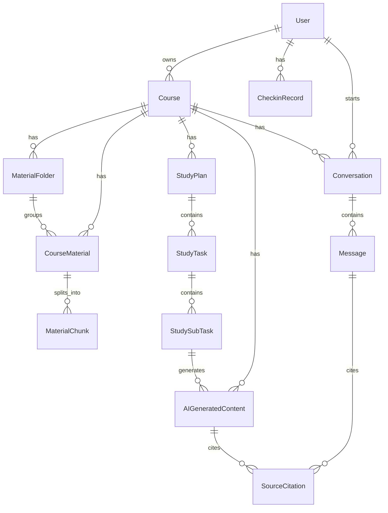

# 05 Agent规则_字段与数据规则

本文档对应《CourseNexus 课枢 PRD》的第 12 章和第 13 章，重点说明 Agent 问答与资料上下文规则、数据对象关系、字段字典和字段与页面/功能关联。

本文件面向后端建模、Agent 编排、数据存储和前后端联调。页面交互细节见 `04_页面与交互说明.md`，核心功能边界见 `03_功能模块说明.md`。

## 12. Agent 问答与资料上下文规则

### 12.1 上下文来源

Agent 的上下文来源必须来自系统内可追溯的数据，不允许生成无法解释来源的“伪引用”。

| 上下文来源 | 说明 | 是否本期支持 | 备注 |
|---|---|---:|---|
| 当前课程资料 | 用户上传到当前课程并解析成功的资料 | 是 | 默认上下文来源 |
| 用户选择的资料范围 | 用户主动选择的单个资料或多个资料 | 是 | 优先级高于默认课程范围；一级目录只用于归类 |
| 当前对话历史 | 同一 `conversation_id` 下的历史问答 | 是 | 用于连续追问 |
| 当前学习任务 | 计划学习执行页中的一级任务、二级任务、关联资料 | 是 | 用于任务问答和讲义生成 |
| AI 生成内容历史 | 已生成的课程自测 Quiz、Flashcard、Mindmap、复习提纲、知识点清单、笔记 | 部分支持 | 本期可作为展示记录，不默认进入检索上下文 |
| 外部互联网 | 未上传到课程的外部信息 | 否 | 本期不作为默认回答来源 |

规则说明：

1. Agent 默认使用当前课程下 `parse_status = parsed` 的资料作为上下文。
2. 用户选择资料范围后，Agent 只能在所选范围内检索和回答。
3. 资料处于 `uploaded`、`parsing`、`parse_failed`、`deleted` 状态时，不得进入检索上下文。
4. 计划学习执行页中的任务问答，应优先使用当前任务关联资料，其次使用当前课程已解析资料。
5. 连续追问可带上当前对话历史，但不得跨课程混用上下文。
6. 所有引用必须能落到 `SourceCitation`，至少包含资料名、页码/页序号、命中文本片段。

### 12.2 资料选择规则

资料选择规则决定 Agent、学习辅助生成和学习计划生成使用哪些资料。

| 场景 | 默认资料范围 | 用户可否调整 | 说明 |
|---|---|---:|---|
| 课程详情页 Agent 问答 | 当前课程全部已解析资料 | 是 | 可选择单资料或多资料，不能选择文件夹 |
| 课程自测 Quiz 生成 | 当前课程全部已解析资料 | 是 | 可按资料范围生成题目 |
| Flashcard 生成 | 当前课程全部已解析资料 | 是 | 可按资料范围生成卡片 |
| Mindmap 生成 | 当前课程全部已解析资料 | 是 | 可按资料范围生成导图 |
| 复习提纲生成 | 当前课程全部已解析资料 | 是 | 可按资料范围生成提纲 |
| 知识点清单生成 | 当前课程全部已解析资料 | 是 | 可按资料范围生成清单 |
| 学习计划生成 | 当前课程全部已解析资料 | 是 | 可选择重点资料或章节范围 |
| 计划学习执行页讲义生成 | 当前二级任务关联资料 | 否/弱调整 | 可补充当前课程资料作为兜底 |
| 计划学习执行页任务测试题生成 | 当前测试任务关联资料 | 否/弱调整 | 进入任务测试题页面/视图后按需生成 |

选择优先级：

1. 用户显式选择的资料范围优先。
2. 当前任务绑定资料优先于课程全部资料。
3. 当前课程已解析资料作为默认兜底。
4. 没有已解析资料时，不得伪造资料引用。

资料范围对象建议：

| 字段 | 说明 |
|---|---|
| `course_id` | 当前课程 ID，必填 |
| `material_ids` | 选中的资料，可为空 |
| `include_all_parsed_materials` | 是否使用当前课程全部已解析资料 |
| `exclude_material_ids` | 排除的资料，可为空 |

### 12.3 提问规则

Agent 问答必须满足可追溯、可连续追问、可失败重试。

| 规则项 | 说明 |
|---|---|
| 输入问题 | 用户输入自然语言问题，不能为空 |
| 课程归属 | 每次提问必须绑定 `course_id` |
| 对话归属 | 新问题可创建新 `conversation_id`，连续追问复用已有 `conversation_id` |
| 资料范围 | 使用当前课程默认资料范围或用户选择范围 |
| 用户权限 | 只能访问当前用户拥有或有权限访问的课程和资料 |
| 内容安全 | 不返回系统提示词、密钥、其他用户数据 |
| 失败重试 | 失败后保留用户问题，允许重新发送 |

典型提问请求字段建议：

| 字段 | 类型 | 必填 | 说明 |
|---|---|---:|---|
| `course_id` | string | 是 | 当前课程 ID |
| `conversation_id` | string | 否 | 连续追问时传入 |
| `question` | string | 是 | 用户问题 |
| `material_scope` | object | 否 | 用户选择的资料范围 |
| `source_page` | string | 否 | 触发来源，如 `course_detail`、`task_execution` |
| `task_id` | string | 否 | 计划学习执行页场景传入 |
| `subtask_id` | string | 否 | 二级任务问答场景传入 |

### 12.4 回答生成规则

回答生成应尽量基于资料检索结果组织答案，并明确区分“资料命中内容”和“模型推理补充”。

| 场景 | 回答规则 |
|---|---|
| 有资料命中 | 回答应围绕命中资料展开，并给出引用来源 |
| 多资料命中 | 可综合多个资料，但每个关键结论应尽量关联引用来源 |
| 资料无命中 | 必须提示“当前课程资料中未找到直接答案”，可给出一般性解释但不得伪造引用 |
| 资料解析中 | 提示资料仍在解析，当前无法使用该资料回答 |
| 资料解析失败 | 提示资料解析失败，建议重试解析或重新上传 |
| 连续追问 | 结合当前对话上下文，但仍需受课程和资料范围限制 |

回答结构建议：

| 字段 | 说明 |
|---|---|
| `answer_text` | Agent 生成的回答正文 |
| `answer_type` | `grounded`、`partial_grounded`、`no_source` |
| `source_citations` | 引用来源列表 |
| `suggested_questions` | 可选，建议追问问题 |
| `used_material_ids` | 实际参与检索的资料 ID |
| `created_message_id` | 回答消息 ID |

回答展示要求：

1. 引用来源必须展示在回答下方或回答段落旁。
2. 引用来源展示格式为：资料名 + 页码/页序号 + 命中文本片段。
3. 命中文本片段不需要展示长段原文，保留能帮助用户识别来源的短片段即可。
4. 如果回答包含推理补充，应避免把推理补充标成资料原文。

### 12.5 对话记录保存规则

每次 Agent 问答应保存对话、用户消息、助手消息和引用来源。

| 对象 | 保存时机 | 说明 |
|---|---|---|
| `Conversation` | 新对话开始时 | 绑定用户和课程 |
| `Message` 用户消息 | 用户发送问题后 | 保存问题正文、资料范围、来源页面 |
| `Message` 助手消息 | Agent 生成完成后 | 保存回答正文、生成状态、错误信息 |
| `SourceCitation` | 生成回答后 | 绑定助手消息或生成内容 |

保存规则：

1. 用户消息和助手消息必须按时间顺序保存。
2. 生成失败也应记录失败状态，便于前端展示重试和排查问题。
3. 连续追问复用同一个 `conversation_id`。
4. 不同课程之间不得复用同一个对话上下文。
5. 删除课程时，对话记录按数据删除规则处理。
6. 用户点击“保存为笔记”时，不创建单独 Note 对象，统一创建 `AIGeneratedContent`，且 `content_type = note`。
7. 保存为笔记时，可选关联来源 `message_id`，并保留回答的 `SourceCitation`。

保存为笔记字段建议：

| 字段 | 说明 |
|---|---|
| `content_type` | 固定为 `note` |
| `course_id` | 所属课程 |
| `source_message_id` | 来源回答消息，可为空 |
| `title` | 默认取回答前若干字或用户自定义标题 |
| `content` | 笔记内容 |
| `source_citations` | 继承回答引用来源 |

### 12.6 失败与重试规则

| 失败场景 | 触发条件 | 系统处理 | 用户提示 |
|---|---|---|---|
| 用户问题为空 | 输入为空 | 禁用发送按钮 | 请输入问题 |
| 无可用资料 | 当前课程无已解析资料 | 可回答但必须说明无资料来源，或提示先上传资料 | 当前课程暂无可用资料 |
| 检索无命中 | 已解析资料中没有相关片段 | 返回 no_source 答案 | 当前课程资料中未找到直接答案 |
| Agent 生成失败 | 模型调用或生成服务失败 | 保存失败状态，允许重试 | 回答生成失败，请重试 |
| 引用定位失败 | 引用的资料或页码不可用 | 保留引用文本，提示定位失败 | 暂时无法定位到原文 |
| 权限异常 | 用户访问无权限课程/资料 | 阻止请求 | 无权访问该课程或资料 |
| 对话不存在 | `conversation_id` 无效 | 创建新对话或报错，按前端场景决定 | 对话不存在或已删除 |

重试规则：

1. 重试时应复用原用户问题和资料范围。
2. 重试成功后，原失败消息可保留为失败记录，也可更新状态，具体以后端实现为准。
3. 重试不得创建重复的用户问题展示项，前端应能识别同一次重试。
4. 对生成接口应增加幂等键或请求 ID，避免重复点击造成重复内容。

### 12.7 与课程自测 Quiz / Flashcard / Mindmap 的联动规则

学习辅助生成能力与 Agent 问答共用资料上下文规则和引用来源规则，但输出结构不同。

| 功能 | 输入上下文 | 输出内容 | 引用要求 |
|---|---|---|---|
| 课程自测 Quiz | 课程资料切片 | 题目、选项、答案、解析 | 每道题尽量带引用来源 |
| Flashcard | 课程资料切片 | 卡片正面、背面、标签 | 每张卡片尽量带引用来源 |
| Mindmap | 课程资料切片 | 节点、层级、关系 | 关键节点带引用来源 |
| 复习提纲 | 课程资料切片 | 章节、重点、复习建议 | 每章或重点带引用来源 |
| 知识点清单 | 课程资料切片 | 知识点、定义、重要程度 | 每个重点知识点带引用来源 |
| 今日讲义 | 任务关联资料 | 讲义正文、重点解释 | 关键内容带引用来源 |
| 任务测试题 | 测试类二级任务关联资料 | 题目、答案、解析 | 每道题尽量带引用来源 |

联动规则：

1. 学习辅助生成前必须确定 `course_id` 和资料范围。
2. 生成结果统一保存为 `AIGeneratedContent` 或其关联结构。
3. 生成结果的引用来源统一保存到 `SourceCitation`。
4. 课程自测 Quiz、Flashcard、Mindmap 可以有结构化子对象，也可以在 `AIGeneratedContent.content_json` 中保存结构化内容，后端根据实现复杂度选择。
5. 计划学习执行页中的今日讲义和任务测试题，应关联到 `StudySubTask`，便于回到任务上下文。

## 13. 字段与数据规则

### 13.1 数据对象关系图

关系说明：

1. 一个用户可以拥有多门课程。
2. 一门课程可以有多份资料、多个对话、多个 AI 生成内容、多个学习计划。
3. 本期一个学习计划只绑定一门课程，即 `StudyPlan.course_id` 为单值。
4. 用户需要规划多门课程时，应创建多个单课程计划。
5. 首页今日待办和首页大日历按日期合并展示多个单课程计划的任务。
6. 资料解析后切分为 `MaterialChunk`，供检索和引用。
7. `SourceCitation` 可关联 `Message`，也可关联 `AIGeneratedContent`；今日讲义和任务测试题也统一通过 `AIGeneratedContent` 承载引用来源。
8. `CheckinRecord` 按用户和日期记录当日二级任务完成比例。

### 13.2 数据对象清单

| 数据对象 | 说明 | 关联页面 | 关联功能 |
|---|---|---|---|
| `User` | 用户账号 | 登录页、注册页、个人中心页 | 登录、注册、个人资料、权限校验 |
| `Course` | 课程基础信息 | 首页、课程详情页、创建课程弹窗、编辑课程弹窗 | 课程管理 |
| `MaterialFolder` | 课程资料一级目录 | 课程详情页、资料上传入口 | 用户自定义一级目录、资料归类 |
| `CourseMaterial` | 课程资料文件或链接 | 创建课程弹窗、课程详情页、资料预览视图 | 资料上传、解析、预览 |
| `MaterialChunk` | 资料解析后的文本片段 | 后端检索对象 | Agent 检索、引用定位 |
| `Conversation` | 一段课程问答会话 | 课程详情页 | Agent 问答、连续追问 |
| `Message` | 用户消息或助手消息 | 课程详情页 | 问答记录、保存笔记 |
| `SourceCitation` | 引用来源 | 课程详情页、生成内容详情、资料预览视图 | 引用追溯 |
| `AIGeneratedContent` | AI 生成内容统一记录 | AI 生成内容列表 / 历史记录区、课程详情页、计划学习执行页 | 课程自测 Quiz、Flashcard、Mindmap、复习提纲、知识点清单、笔记、今日讲义、任务测试题 |
| `Quiz` | 课程自测 Quiz 结构化内容 | 课程自测 Quiz 页面 / 视图 | 课程自测 |
| `Flashcard` | 记忆卡片结构化内容 | Flashcard 页面 | 卡片学习 |
| `Mindmap` | 思维导图结构化内容 | Mindmap 页面 | 知识结构展示 |
| `StudyPlan` | 学习计划 | 学习计划页、本课程计划学习模式日历、首页大日历页 | 单课程计划 |
| `StudyTask` | 一级任务 | 本课程计划学习模式日历、首页今日待办、首页大日历页、全局当日待办弹窗 | 每日任务聚合 |
| `StudySubTask` | 二级任务 | 本课程当日知识点列表、全局当日待办弹窗、计划学习执行页 | 具体学习任务、完成状态 |
| `CheckinRecord` | 学习完成记录 | 个人中心页 | 按完成比例展示学习打卡颜色 |

### 13.3 字段字典

#### 13.3.1 User 用户

| 字段 | 类型 | 必填 | 说明 | 约束 |
|---|---|---:|---|---|
| `id` | string | 是 | 用户 ID | 主键 |
| `username` | string | 是 | 登录账号 | 唯一 |
| `password_hash` | string | 是 | 密码哈希 | 不存明文 |
| `nickname` | string | 否 | 用户昵称 | 可修改 |
| `avatar_url` | string | 否 | 头像地址 | 可为空 |
| `status` | enum | 是 | 用户状态 | `active`、`disabled` |
| `created_at` | datetime | 是 | 创建时间 | 系统生成 |
| `updated_at` | datetime | 是 | 更新时间 | 系统更新 |
| `deleted_at` | datetime | 否 | 删除时间 | 软删除可用 |

规则：

1. 登录使用账号和密码。
2. 密码必须哈希存储，不允许明文保存。
3. 用户只能访问自己创建或被授权的数据。

#### 13.3.2 Course 课程

| 字段 | 类型 | 必填 | 说明 | 约束 |
|---|---|---:|---|---|
| `id` | string | 是 | 课程 ID | 主键 |
| `user_id` | string | 是 | 所属用户 | 外键 User |
| `name` | string | 是 | 课程名称 | 当前用户下建议可重名，但展示需区分 |
| `description` | text | 否 | 课程简介 | 可为空 |
| `teacher` | string | 否 | 教师 | 可为空 |
| `term` | string | 否 | 学期标准值 | 可为空，默认 `null`；仅允许后端学期选项中的值，不接受自由文本 |
| `material_count` | int | 否 | 资料数量 | 可计算字段 |
| `status` | enum | 是 | 课程状态 | `active`、`archived`、`deleted` |
| `created_at` | datetime | 是 | 创建时间 | 系统生成 |
| `updated_at` | datetime | 是 | 更新时间 | 系统更新 |
| `deleted_at` | datetime | 否 | 删除时间 | 软删除 |

规则：

1. 创建课程时 `name` 必填。
2. 创建课程弹窗可同时提交初始资料，但资料失败不回滚课程。
3. 删除课程前端需要二次确认，后端按数据一致性规则处理关联数据。

#### 13.3.2.1 MaterialFolder 资料一级目录

| 字段 | 类型 | 必填 | 说明 | 约束 |
|---|---|---:|---|---|
| `id` | string | 是 | 目录 ID | 主键 |
| `user_id` | string | 是 | 所属用户 | 外键 User，冗余便于权限过滤 |
| `course_id` | string | 是 | 所属课程 | 外键 Course |
| `name` | string | 是 | 目录名称 | 同一课程下建议不重名 |
| `sort_order` | int | 否 | 展示排序 | 从 1 开始，可为空 |
| `created_at` | datetime | 是 | 创建时间 | 系统生成 |
| `updated_at` | datetime | 是 | 更新时间 | 系统更新 |
| `deleted_at` | datetime | 否 | 删除时间 | 兼容字段；用户主动删除目录时物理删除记录 |

规则：

1. 本期只支持一级目录，不支持多级目录，因此不设置 `parent_id`。
2. 目录必须归属于一门课程，且课程必须属于当前用户。
3. 用户可在课程详情页创建、重命名、删除一级目录。
4. 删除目录按“删除目录及其全部资料”处理；当前仅支持一级文件夹。
5. 资料移动目录时只更新 `CourseMaterial.folder_id`。

#### 13.3.3 CourseMaterial 课程资料

| 字段 | 类型 | 必填 | 说明 | 约束 |
|---|---|---:|---|---|
| `id` | string | 是 | 资料 ID | 主键 |
| `course_id` | string | 是 | 所属课程 | 外键 Course |
| `user_id` | string | 是 | 上传用户 | 外键 User |
| `folder_id` | string | 否 | 所属一级目录 | 外键 MaterialFolder，可为空表示未分类 |
| `name` | string | 是 | 展示名称 | 允许重名 |
| `material_type` | enum | 是 | 资料类型 | `pdf`、`ppt`、`word`、`markdown`、`image`、`text`、`link` |
| `source_type` | enum | 是 | 来源类型 | `file`、`url` |
| `file_url` | string | 否 | 文件地址 | 文件资料必填 |
| `source_url` | string | 否 | 原始链接 | 仅历史 `url` 资料持有，链接资料入口已停止支持 |
| `file_size` | int | 否 | 文件大小 | 单位 byte |
| `mime_type` | string | 否 | MIME 类型 | 可为空 |
| `parse_status` | enum | 是 | 解析状态 | `uploaded`、`parsing`、`parsed`、`parse_failed`、`deleted` |
| `parse_error` | text | 否 | 解析失败原因 | 失败时记录 |
| `page_count` | int | 否 | 页数或页序号数量 | 可为空 |
| `created_at` | datetime | 是 | 上传时间 | 系统生成 |
| `updated_at` | datetime | 是 | 更新时间 | 系统更新 |
| `deleted_at` | datetime | 否 | 删除时间 | 兼容字段；用户主动删除资料时物理删除记录 |

规则：

1. 只有 `parse_status = parsed` 的资料可进入 Agent 检索。
2. 链接抓取失败时，保留记录并标记 `parse_failed`。
3. 图片可上传；OCR 不支持或失败时不可检索。
4. PPT 使用幻灯片页序号作为 `page_index`。
5. PDF 优先真实页码，无法识别时使用页序号。

#### 13.3.4 MaterialChunk 资料切片

| 字段 | 类型 | 必填 | 说明 | 约束 |
|---|---|---:|---|---|
| `id` | string | 是 | 切片 ID | 主键 |
| `material_id` | string | 是 | 所属资料 | 外键 CourseMaterial |
| `course_id` | string | 是 | 所属课程 | 冗余便于检索过滤 |
| `chunk_index` | int | 是 | 切片序号 | 同资料内递增 |
| `page` | string/int | 否 | 真实页码 | PDF 可用 |
| `page_index` | int | 否 | 页序号 | PPT/无法识别页码时使用 |
| `heading` | string | 否 | 标题或章节 | 可为空 |
| `content_text` | text | 是 | 切片文本 | 检索基础 |
| `embedding_id` | string | 否 | 向量索引 ID | 视实现而定 |
| `created_at` | datetime | 是 | 创建时间 | 系统生成 |

规则：

1. 切片必须能反向定位到原资料。
2. 引用来源从命中的 `MaterialChunk` 生成。
3. 资料删除或重新解析时，应处理旧切片的失效问题。

#### 13.3.5 Conversation 对话记录

| 字段 | 类型 | 必填 | 说明 | 约束 |
|---|---|---:|---|---|
| `id` | string | 是 | 对话 ID | 主键 |
| `user_id` | string | 是 | 所属用户 | 外键 User |
| `course_id` | string | 是 | 所属课程 | 外键 Course |
| `title` | string | 否 | 对话标题 | 可由首问生成 |
| `source_page` | string | 否 | 来源页面 | 如 `course_detail`、`task_execution` |
| `status` | enum | 是 | 状态 | `active`、`deleted` |
| `created_at` | datetime | 是 | 创建时间 | 系统生成 |
| `updated_at` | datetime | 是 | 更新时间 | 系统更新 |
| `deleted_at` | datetime | 否 | 删除时间 | 软删除 |

规则：

1. 一个对话只能属于一门课程。
2. 连续追问必须复用同一个 `conversation_id`。
3. 删除课程时对话应随课程软删除或隐藏。

#### 13.3.6 Message 消息

| 字段 | 类型 | 必填 | 说明 | 约束 |
|---|---|---:|---|---|
| `id` | string | 是 | 消息 ID | 主键 |
| `conversation_id` | string | 是 | 所属对话 | 外键 Conversation |
| `course_id` | string | 是 | 所属课程 | 冗余便于权限过滤 |
| `role` | enum | 是 | 消息角色 | `user`、`assistant`、`system` |
| `content` | text | 是 | 消息正文 | 用户问题或助手回答 |
| `answer_type` | enum | 否 | 回答类型 | `grounded`、`partial_grounded`、`no_source` |
| `generation_status` | enum | 否 | 生成状态 | `pending`、`generating`、`success`、`failed` |
| `error_code` | string | 否 | 错误码 | 失败时记录 |
| `material_scope_json` | json | 否 | 提问时资料范围 | 用户消息建议保存 |
| `created_at` | datetime | 是 | 创建时间 | 系统生成 |

规则：

1. 用户消息发送后即保存。
2. 助手消息生成失败时也应保存失败状态。
3. 保存为笔记时可通过 `source_message_id` 关联助手消息。

#### 13.3.7 SourceCitation 引用来源

| 字段 | 类型 | 必填 | 说明 | 约束 |
|---|---|---:|---|---|
| `id` | string | 是 | 引用 ID | 主键 |
| `message_id` | string | 否 | 关联消息 | 与生成内容至少一种关联 |
| `generated_content_id` | string | 否 | 关联 AI 生成内容 | 与消息至少一种关联 |
| `material_id` | string | 创建时是 | 来源资料 | 外键 CourseMaterial；资料物理删除后置空 |
| `chunk_id` | string | 否 | 来源切片 | 外键 MaterialChunk；资料物理删除后置空 |
| `material_name` | string | 是 | 资料名快照 | 防资料改名后展示丢失 |
| `page` | string/int | 否 | 真实页码 | 可为空 |
| `page_index` | int | 否 | 页序号 | 可为空 |
| `hit_text` | text | 是 | 命中文本片段 | 不宜过长 |
| `sort_order` | int | 否 | 展示顺序 | 从 1 开始 |
| `created_at` | datetime | 是 | 创建时间 | 系统生成 |

规则：

1. 引用来源必须展示资料名、页码/页序号、命中文本片段。
2. `material_name` 使用快照字段，避免资料改名后历史引用展示异常。
3. `page` 和 `page_index` 至少应有一个可用于定位；无法定位时前端展示“页码未知”。
4. 不允许创建没有 `material_id` 的伪引用；资料物理删除后，历史引用允许仅保留快照字段。

#### 13.3.8 AIGeneratedContent AI 生成内容

| 字段 | 类型 | 必填 | 说明 | 约束 |
|---|---|---:|---|---|
| `id` | string | 是 | 生成内容 ID | 主键 |
| `user_id` | string | 是 | 所属用户 | 外键 User |
| `course_id` | string | 是 | 所属课程 | 外键 Course |
| `study_subtask_id` | string | 否 | 关联二级任务 | 任务讲义/测试时使用 |
| `source_message_id` | string | 否 | 来源消息 | 保存为笔记时可用 |
| `content_type` | enum | 是 | 内容类型 | `quiz`、`flashcard`、`mindmap`、`outline`、`knowledge_list`、`note`、`handout`、`task_test` |
| `title` | string | 是 | 标题 | 可自动生成 |
| `content` | text | 否 | 正文内容 | 文本类内容使用 |
| `content_json` | json | 否 | 结构化内容 | 课程自测 Quiz、Flashcard、Mindmap 等使用 |
| `generation_status` | enum | 是 | 生成状态 | `pending`、`generating`、`success`、`failed` |
| `material_scope_json` | json | 否 | 生成时资料范围 | 便于复现 |
| `error_code` | string | 否 | 错误码 | 失败时记录 |
| `created_at` | datetime | 是 | 创建时间 | 系统生成 |
| `updated_at` | datetime | 是 | 更新时间 | 系统更新 |
| `deleted_at` | datetime | 否 | 删除时间 | 软删除 |

规则：

1. “保存为笔记”统一使用 `content_type = note`，不新增 Note 对象。
2. 今日讲义使用 `content_type = handout`，并关联 `study_subtask_id`。
3. 计划执行中的任务测试题使用 `content_type = task_test`，并关联测试类 `study_subtask_id`。
4. 课程详情页生成的课程自测 Quiz 使用 `content_type = quiz`。
5. 引用来源统一通过 `SourceCitation.generated_content_id` 关联。

#### 13.3.9 课程自测 Quiz 测验

本期课程自测 Quiz 可以作为 `AIGeneratedContent.content_json` 中的结构化数据，也可以拆为独立表。若拆表，建议字段如下。

| 字段 | 类型 | 必填 | 说明 | 约束 |
|---|---|---:|---|---|
| `id` | string | 是 | 题目 ID | 主键 |
| `generated_content_id` | string | 是 | 所属生成内容 | 外键 AIGeneratedContent |
| `question_type` | enum | 是 | 题型 | `single_choice`、`multiple_choice`、`true_false`、`short_answer` |
| `question_text` | text | 是 | 题干 | 必填 |
| `options_json` | json | 否 | 选项 | 选择题必填 |
| `correct_answer` | text/json | 是 | 正确答案 | 必填 |
| `explanation` | text | 否 | 答案解析 | 建议必填 |
| `sort_order` | int | 是 | 题目顺序 | 从 1 开始 |

规则：

1. 每道题尽量关联引用来源。
2. 计划执行页任务测试题进入后按需生成，不在计划保存时提前生成。
3. 任务测试题支持 Markdown 导出；PDF 导出为后续能力。

#### 13.3.10 Flashcard 记忆卡片

| 字段 | 类型 | 必填 | 说明 | 约束 |
|---|---|---:|---|---|
| `id` | string | 是 | 卡片 ID | 主键 |
| `generated_content_id` | string | 是 | 所属生成内容 | 外键 AIGeneratedContent |
| `front` | text | 是 | 卡片正面 | 概念或问题 |
| `back` | text | 是 | 卡片背面 | 解释或答案 |
| `tags_json` | json | 否 | 标签 | 可为空 |
| `mastery_status` | enum | 否 | 掌握状态 | `unknown`、`not_mastered`、`mastered` |
| `sort_order` | int | 是 | 展示顺序 | 从 1 开始 |

规则：

1. 本期不强制实现复杂间隔复习算法。
2. 掌握状态只记录用户学习反馈，不改写生成内容。

#### 13.3.11 Mindmap 思维导图

Mindmap 建议保存在 `AIGeneratedContent.content_json` 中。

| 字段 | 类型 | 必填 | 说明 |
|---|---|---:|---|
| `root_node_id` | string | 是 | 根节点 ID |
| `nodes` | array | 是 | 节点列表 |
| `edges` | array | 是 | 边列表 |

节点字段建议：

| 字段 | 类型 | 必填 | 说明 |
|---|---|---:|---|
| `id` | string | 是 | 节点 ID |
| `label` | string | 是 | 节点名称 |
| `summary` | text | 否 | 节点说明 |
| `level` | int | 否 | 层级 |
| `source_citation_ids` | array | 否 | 关联引用来源 |

规则：

1. 节点必须有稳定 ID，便于前端展开收起。
2. 边表示节点之间的父子或关联关系。

#### 13.3.12 StudyPlan 学习计划

| 字段 | 类型 | 必填 | 说明 | 约束 |
|---|---|---:|---|---|
| `id` | string | 是 | 计划 ID | 主键 |
| `user_id` | string | 是 | 所属用户 | 外键 User |
| `course_id` | string | 是 | 所属课程 | 本期单课程计划，单值 |
| `title` | string | 是 | 计划名称 | 如“数分第一章学习计划” |
| `goal_text` | text | 是 | 用户自然语言目标 | 原始输入 |
| `parsed_config_json` | json | 否 | 自然语言解析后的配置 | 可编辑后保存 |
| `start_date` | date | 是 | 开始日期 | 必填 |
| `end_date` | date | 是 | 结束日期 | 不早于开始日期 |
| `daily_available_minutes` | int | 是 | 每日可用学习时长 | 单位分钟，计划生成必填 |
| `status` | enum | 是 | 计划状态 | `draft`、`active`、`completed`、`deleted` |
| `created_at` | datetime | 是 | 创建时间 | 系统生成 |
| `updated_at` | datetime | 是 | 更新时间 | 系统更新 |
| `deleted_at` | datetime | 否 | 删除时间 | 软删除 |

规则：

1. 本期明确只支持单课程计划。
2. 不使用 `course_ids` 作为 StudyPlan 主字段。
3. 多门课程计划通过创建多个 StudyPlan 实现。
4. 首页今日待办和首页大日历按日期合并展示多个计划的任务。
5. 保存计划时生成任务结构，不提前生成讲义和任务测试题内容。

#### 13.3.13 StudyTask 一级任务

| 字段 | 类型 | 必填 | 说明 | 约束 |
|---|---|---:|---|---|
| `id` | string | 是 | 一级任务 ID | 主键 |
| `plan_id` | string | 是 | 所属计划 | 外键 StudyPlan |
| `course_id` | string | 是 | 所属课程 | 冗余便于查询 |
| `title` | string | 是 | 一级任务标题 | 如“学习数分第一章节” |
| `task_date` | date | 是 | 任务日期 | 用于日历展示 |
| `start_time` | time | 否 | 开始时间 | 本期可为空 |
| `end_time` | time | 否 | 结束时间 | 本期可为空 |
| `status` | enum | 是 | 一级任务状态 | `not_started`、`in_progress`、`completed` |
| `sort_order` | int | 是 | 当日排序 | 从 1 开始 |
| `created_at` | datetime | 是 | 创建时间 | 系统生成 |
| `updated_at` | datetime | 是 | 更新时间 | 系统更新 |

规则：

1. 本课程计划学习模式日历可展示当前课程的一级任务标题或摘要。
2. 一级任务状态由下属二级任务完成情况自动计算。
3. 首页大日历日期格只展示日期级任务摘要；完整知识点列表需点击日期后在全局当日待办弹窗中按课程展开。

#### 13.3.14 StudySubTask 二级任务

| 字段 | 类型 | 必填 | 说明 | 约束 |
|---|---|---:|---|---|
| `id` | string | 是 | 二级任务 ID | 主键 |
| `task_id` | string | 是 | 所属一级任务 | 外键 StudyTask |
| `plan_id` | string | 是 | 所属计划 | 冗余便于查询 |
| `course_id` | string | 是 | 所属课程 | 冗余便于查询 |
| `title` | string | 是 | 二级任务标题 | 如“学习数分 1.1 知识点” |
| `subtask_type` | enum | 是 | 任务类型 | `learn`、`review`、`quiz`、`test` |
| `description` | text | 否 | 任务说明 | 可为空 |
| `related_material_ids_json` | json | 否 | 关联资料 | 可为空 |
| `status` | enum | 是 | 完成状态 | `not_started`、`in_progress`、`completed` |
| `completed_at` | datetime | 否 | 完成时间 | 完成时记录 |
| `sort_order` | int | 是 | 排序 | 从 1 开始 |
| `created_at` | datetime | 是 | 创建时间 | 系统生成 |
| `updated_at` | datetime | 是 | 更新时间 | 系统更新 |

规则：

1. 计划学习执行页左侧只展示今日二级任务。
2. 每日任务默认前几个二级任务为学习知识点，最后一个通常为测试。
3. 如果资料不足或不适合测试，当天可以没有测试类二级任务。
4. 学习类二级任务可按需生成今日讲义。
5. 测试类二级任务进入任务测试题页面 / 视图后再生成任务测试题。
6. 二级任务完成状态影响一级任务状态、本课程计划学习模式日历、首页今日待办、首页大日历和个人中心学习打卡颜色。

#### 13.3.15 CheckinRecord 学习完成记录

| 字段 | 类型 | 必填 | 说明 | 约束 |
|---|---|---:|---|---|
| `id` | string | 是 | 学习完成记录 ID | 主键 |
| `user_id` | string | 是 | 所属用户 | 外键 User |
| `checkin_date` | date | 是 | 日期 | 与 user_id 联合唯一 |
| `total_subtask_count` | int | 是 | 当日二级任务总数 | 可为 0 |
| `completed_subtask_count` | int | 是 | 当日已完成二级任务数 | 不大于总数 |
| `completion_ratio` | decimal | 是 | 完成比例 | `completed / total`，无任务时为 0 或空值，按实现统一 |
| `color_level` | int | 是 | 学习打卡颜色等级 | 0-5 或其他等级，前后端统一 |
| `created_at` | datetime | 是 | 创建时间 | 系统生成 |
| `updated_at` | datetime | 是 | 更新时间 | 系统更新 |

规则：

1. 每个用户每天最多一条 `CheckinRecord`。
2. 学习打卡颜色不是用户手动点击生成，而是由当日二级任务完成比例决定。
3. 示例：今天共 5 个二级任务，只完成 1 个，完成比例为 20%，展示同色系浅色。
4. 示例：今天共 5 个二级任务，完成 5 个，完成比例为 100%，展示同色系深色。
5. 二级任务状态变化时，应更新当天 `CheckinRecord`。
6. 更新应幂等，重复完成同一任务不能重复累计。

### 13.4 字段与页面/功能关联表

| 字段 / 对象 | 使用页面 | 使用功能 | 说明 |
|---|---|---|---|
| `User.username` | 登录页、注册页 | 登录注册 | 账号密码登录 |
| `User.nickname`、`User.avatar_url` | 首页、个人中心页 | 用户资料展示 | 顶部导航和个人中心使用 |
| `Course.name` | 首页、课程详情页、学习计划页、本课程计划学习模式日历、首页大日历页 | 课程识别 | 任务和计划需要展示课程名 |
| `MaterialFolder.name`、`MaterialFolder.sort_order` | 课程详情页、资料上传入口 | 资料目录 | 一级目录展示、排序和资料归类 |
| `CourseMaterial.parse_status` | 课程详情页、资料上传入口 | 资料管理 | 控制是否可检索 |
| `CourseMaterial.name` | 资料预览视图、引用来源 | 来源展示 | 引用来源必须展示资料名 |
| `MaterialChunk.page`、`MaterialChunk.page_index` | 资料预览视图、引用来源 | 页码定位 | PDF/PPT/文本引用定位 |
| `Conversation.id` | 课程详情页 | 连续追问 | 维持对话上下文 |
| `Message.content` | 课程详情页 | 问答展示 | 用户问题和助手回答 |
| `SourceCitation.material_name` | Agent 回答、生成内容详情 | 引用来源 | 展示资料名快照 |
| `SourceCitation.hit_text` | Agent 回答、生成内容详情 | 引用来源 | 展示命中文本片段 |
| `AIGeneratedContent.content_type` | AI 生成内容列表 / 历史记录区 | 内容分类 | 区分 quiz、flashcard、note、task_test 等 |
| `AIGeneratedContent.study_subtask_id` | 计划学习执行页 | 今日讲义、任务测试题 | 关联任务上下文 |
| `StudyPlan.course_id` | 学习计划页、本课程计划学习模式日历、首页大日历页 | 单课程计划 | 本期不使用 course_ids |
| `StudyPlan.start_date`、`StudyPlan.end_date` | 学习计划页、本课程计划学习模式日历 | 计划周期 | 展示计划起止日期 |
| `StudyTask.task_date` | 本课程计划学习模式日历、首页今日待办、首页大日历页、全局当日待办弹窗 | 按日期聚合任务 | 日历和今日待办核心字段 |
| `StudyTask.title` | 本课程计划学习模式日历、首页大日历页、全局当日待办弹窗 | 一级任务展示 | 日期格展示摘要和弹窗分组使用 |
| `StudySubTask.title` | 本课程当日知识点列表、全局当日待办弹窗、计划学习执行页 | 二级任务展示 | 具体学习任务 |
| `StudySubTask.status` | 首页今日待办、计划学习执行页、个人中心页 | 完成状态 | 影响进度和学习打卡颜色 |
| `CheckinRecord.completion_ratio` | 个人中心页 | 学习完成记录 | 控制学习打卡颜色深浅 |
| `CheckinRecord.color_level` | 个人中心页 | 学习完成记录 | 前端展示学习打卡颜色等级 |

### 13.5 核心枚举值汇总

| 枚举 | 值 | 说明 |
|---|---|---|
| `parse_status` | `uploaded` | 已上传，未开始解析 |
| `parse_status` | `parsing` | 解析中 |
| `parse_status` | `parsed` | 解析成功，可检索 |
| `parse_status` | `parse_failed` | 解析失败，可重试 |
| `parse_status` | `deleted` | 已删除 |
| `generation_status` | `pending` | 等待生成 |
| `generation_status` | `generating` | 生成中 |
| `generation_status` | `success` | 生成成功 |
| `generation_status` | `failed` | 生成失败 |
| `content_type` | `quiz` | 课程详情页课程自测 Quiz |
| `content_type` | `flashcard` | 记忆卡片 |
| `content_type` | `mindmap` | 思维导图 |
| `content_type` | `outline` | 复习提纲 |
| `content_type` | `knowledge_list` | 知识点清单 |
| `content_type` | `note` | 保存为笔记 |
| `content_type` | `handout` | 计划执行页今日讲义 |
| `content_type` | `task_test` | 计划执行页任务测试题 |
| `task_status` | `not_started` | 未开始 |
| `task_status` | `in_progress` | 进行中 |
| `task_status` | `completed` | 已完成 |
| `subtask_type` | `learn` | 学习知识点 |
| `subtask_type` | `review` | 复习巩固 |
| `subtask_type` | `quiz` | 小测 / 练习 |
| `subtask_type` | `test` | 测试类任务 |

### 13.6 数据一致性规则

| 操作 | 处理规则 |
|---|---|
| 删除课程 | 课程软删除；资料、对话、生成内容、计划和任务对用户隐藏；是否物理删除文件由后端策略决定 |
| 删除资料目录 | 不可恢复地物理删除目录及其全部资料、切片、RAG 向量和原始文件；当前仅支持一级文件夹 |
| 删除资料 | 不可恢复地物理删除资料记录、切片、RAG 向量和原始文件；问答和生成内容保留，历史引用解除资料/切片外键并保留快照 |
| 重新解析资料 | 新切片替换旧切片；历史引用仍指向原 chunk 时需能处理定位失败 |
| 删除学习计划 | 计划软删除；其一级任务和二级任务从本课程计划学习模式日历、首页大日历、今日待办隐藏 |
| 完成二级任务 | 更新二级任务状态；自动计算一级任务状态；更新今日待办和学习完成记录 |
| 保存为笔记 | 创建 `AIGeneratedContent.content_type = note`；复制或关联引用来源 |
| 生成讲义 | 创建或更新 `AIGeneratedContent.content_type = handout` 并关联 `study_subtask_id` |
| 生成任务测试题 | 创建或更新 `AIGeneratedContent.content_type = task_test` 并关联 `study_subtask_id` |

### 13.7 后端实现注意事项

1. 所有课程、资料、对话、生成内容、计划和任务接口都必须校验 `user_id` 权限。
2. 上传资料、解析资料、Agent 生成、学习辅助生成、讲义生成、任务测试题生成都应支持异步状态。
3. 生成类接口应有请求 ID 或幂等键，防止重复点击生成重复内容。
4. 引用来源应保存快照字段，不能只依赖资料实时名称。
5. `StudyPlan` 本期使用单 `course_id`，不要混入 `course_ids`。
6. 首页今日待办和首页大日历的多课程展示由查询层按日期合并多个单课程计划任务实现。
7. 二级任务状态更新应幂等，重复请求不应重复累计学习完成数。
8. 资料解析失败不影响课程本身可用。
9. 保存计划时只保存任务结构，不提前生成讲义和任务测试题正文。
10. 所有软删除数据默认不在前端列表展示。

