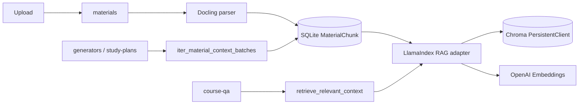

# CourseNexus Material Context and RAG Design

## Status

Approved direction, documented 2026-07-10.

The selected approach is mode 1: CourseNexus owns material parsing, indexing, retrieval, context assembly, citations, and generation orchestration. RAGFlow is a future option only.

## Goals

- Embed real document parsing and RAG into the existing FastAPI modular monolith.
- Use FastAPI + LlamaIndex + Docling + Chroma + OpenAI API.
- Run all infrastructure locally without Docker or a separate Chroma / RAG server.
- Support two distinct business semantics: scoped RAG Q&A and selected-material generation.
- Preserve current CourseNexus ownership of users, courses, material scope, generated content, citations, and study plans.

## Non-Goals

- Global or cross-course retrieval.
- Agent-driven automatic material selection.
- Shared multi-user knowledge bases.
- Local LLM serving.
- RAGFlow deployment or integration.
- A production task queue in this phase.

## Chosen Architecture

Docling parses local files and emits ordered, source-grounded chunks. LlamaIndex converts project chunks into nodes, calls OpenAI embeddings, writes them through a Chroma vector-store integration, and performs filtered retrieval. Chroma runs through `PersistentClient` inside the FastAPI Python process and stores its files under a configured local path.

SQLite remains authoritative for `CourseMaterial` and `MaterialChunk`; Chroma is a rebuildable derivative index. Third-party types stay inside `app/integrations/`. Business services consume project-owned DTOs such as `ContextChunk` and do not import Docling, LlamaIndex, Chroma, or OpenAI.

## Two Context Contracts

### Scoped RAG Q&A

`retrieve_relevant_context(query, material_scope, top_k)` validates user and course ownership, converts the scope to Chroma metadata filters, performs semantic retrieval, and returns authoritative SQLite-backed `ContextChunk` values. Filters always include `user_id` and `course_id`, plus selected material or folder ids.

The answer provider receives only retrieved chunks. A citation is valid only when its chunk id belongs to that result set. Empty scope or no reliable hit produces `answer_type = no_source`.

### Selected-Material Generation

`iter_material_context_batches(material_scope, max_tokens)` loads every eligible selected chunk from SQLite in stable material and chunk order. It never substitutes a Top-K query for complete material coverage.

Each batch is mapped into a typed intermediate result carrying source chunk ids. A reduce pass deduplicates and shapes the final feature schema. Every selected parsed material must enter at least one batch; a partial batch failure fails the whole generation rather than presenting an incomplete result as full coverage.

Flashcard, Quiz, Mindmap, Outline, Knowledge List, Handout, and Task Test persist to `AIGeneratedContent` plus `SourceCitation`. Study-plan generation uses the same coverage context but persists to `StudyPlan`, `StudyTask`, and `StudySubTask`.

## Ingestion and Consistency

1. Mark the material `parsing`.
2. Parse with Docling and build ordered chunks with deterministic ids.
3. Replace SQLite `MaterialChunk` records.
4. Delete previous Chroma records for the material, embed, and upsert the new nodes.
5. Mark the material `parsed` only after both stores succeed.

On indexing failure, remove partial new vector records, record `INDEXING_FAILED`, and leave the material unavailable. Reparse and delete operations remove old records by `material_id`. A rebuild command can recreate the Chroma collection from SQLite.

## Local Runtime

- Python 3.12 in the existing `course-nexus` Conda environment.
- No Docker.
- No Chroma server process or port.
- `CHROMA_PERSIST_PATH=./data/chroma` for local vector files.
- OpenAI API for embeddings and structured generation.
- Unit tests use temporary Chroma paths, fake embeddings, fake retrieval, and the existing mock model provider.

## Error Handling

- `PARSING_FAILED`: Docling cannot parse a supported input.
- `INDEXING_FAILED`: embedding or Chroma upsert fails.
- `RETRIEVAL_FAILED`: the local vector index cannot be queried.
- `NO_PARSED_MATERIAL`: selected scope has no eligible material.
- `GENERATION_SCHEMA_INVALID`: model output cannot be repaired into the required schema.
- `GENERATION_FAILED`: a batch or model request fails for another reason.

Errors remain stable CourseNexus errors; raw third-party exceptions do not cross integration boundaries.

## Acceptance Criteria

- PDF, DOCX, PPTX, Markdown, and text fixtures produce ordered chunks with useful source metadata.
- Chroma persists across client recreation and enforces user, course, and material filters.
- Q&A uses query-dependent Top-K results and only stores citations from those results.
- Selected-material generation records coverage of every selected material, including when input spans multiple batches.
- Deletion and reparse remove stale vector hits.
- Business modules contain no third-party RAG imports.
- The complete test suite runs without Docker and without live OpenAI calls.

## Formal Documentation

- [AI material business](../../product/ai-material-business.md)
- [Material context and RAG architecture](../../architecture/material-context-rag.md)
- [ADR 0003](../../architecture/adr/0003-local-rag-stack.md)
