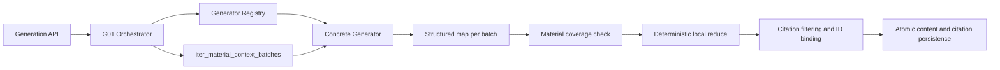

# CourseNexus G01-G06 Generation Design

## Status

Approved in conversation on 2026-07-11. This specification covers the backend generation work owned by `feature/generation`: the shared G01 orchestration contract and the G02-G06 Quiz, Flashcard, Mindmap, Outline, and Knowledge List generators.

## Goals

- Replace the five deterministic placeholder generators with real structured generation.
- Process every eligible chunk from every selected parsed material.
- Use only the project `ModelProvider` abstraction for model calls.
- Persist validated `AIGeneratedContent` and real `SourceCitation` rows atomically.
- Keep each generator isolated behind the stable G01 contract.
- Preserve renderer-neutral Mindmap output.

## Non-Goals

- Frontend rendering, answer submission, scoring, mastery persistence, editing, export, queues, cancellation, or durable idempotency.
- New database tables, migrations, or generator-specific persistence models.
- Direct OpenAI, Docling, Chroma, or LlamaIndex calls from generation modules.
- Calls between concrete generators or writes to study-plan and task state.

## Chosen Architecture

The implementation uses independent concrete generators behind a small shared orchestration layer. G01 owns registration, dependency injection, full-material batch delivery, generic citation binding, error translation, and persistence. G02-G06 own their parameters, prompts, map schemas, reduce algorithms, final schemas, and business validation.

The rejected alternatives are a shared business-heavy MapReduce base class and a single type-switching generator. Both reduce superficial duplication but couple unrelated schemas and violate the task ownership boundaries.

## G01 Public Contract

`GeneratorRegistry` stores `GeneratorFactory` values and exposes `register`, `create`, and `supported_content_types`. The default registry discovers `generator.py:build_generator` from the five built-in module paths. A factory receives the purpose-specific `ModelProvider`; concrete modules do not construct providers themselves.

The generator protocol receives immutable material batches, the expected material ID set, and an untyped request parameter dictionary. A successful `GeneratorOutput` contains:

- `title`
- nullable `content`
- structured `content_json`
- `item_citation_chunk_ids`, keyed by final business item ID

Every concrete generator validates parameters before its first model call, maps every batch, invokes `run_material_coverage`, reduces only mapped values, validates its final schema, and returns citation bindings only for retained items.

The orchestrator filters every requested chunk ID against the chunks in the delivered batches. It allocates one citation row per unique retained chunk in stable source order, recursively finds final objects by their `id`, and fills their `source_citation_ids`. Empty bindings remain empty and never fall back to the first chunk.

The generation response, history response, and detail response include `source_citations`, with `[]` as the stable empty value. Pagination metadata remains unchanged. A source without pagination preserves both `page=null` and `page_index=null`.

## Provider Resolution

The endpoint resolves a provider for the requested purpose (`quiz`, `flashcard`, `mindmap`, `outline`, or `knowledge_list`) using the existing purpose-specific settings. Tests override the provider dependency with recording, deterministic, schema-invalid, and failing providers. The registry still receives an already-created provider, keeping configuration and network concerns outside concrete generators.

## Generator Data Flows

### G02 Quiz

The map prompt emits `QuizCandidate` values grounded in the current batch. Local validation enforces the four question types and their option and answer invariants. Reduce deduplicates normalized question text, balances requested question types and difficulty, favors material coverage and focus relevance, and selects at most `question_count`. Final IDs are `q_001...q_N`, with continuous `sort_order` and at least one real citation per question.

### G03 Flashcard

The map prompt extracts atomic concepts, definitions, formula meanings, procedures, and confusions. Reduce deduplicates normalized fronts, merges compatible backs, tags, and citations, and ranks candidates by requested style, focus, information gain, and material coverage. Final IDs are `card_001...card_N`; `mastery_status` is always `unknown` and has no write endpoint.

### G04 Mindmap

Map results contain local concepts, local parent keys, explicit related relations, and source chunk IDs. Reduce normalizes synonymous concepts, chooses one root, builds a child tree, optionally adds related edges, and prunes to the requested depth and node limit. When pruning an intermediate concept, descendants are attached to the nearest retained ancestor when valid; otherwise the affected subtree is removed.

Local graph code uses adjacency dictionaries, BFS numbering, and DFS color-state validation. It enforces one root, reachability, one child parent for every non-root node, no child cycles or self-loops, continuous levels, depth and node limits, sibling label uniqueness, valid related endpoints, and real citations for every non-root node. Final IDs are `node_001...node_N` in stable breadth-first order.

The backend outputs only `root_node_id`, `nodes`, `edges`, and node citation IDs. It does not output coordinates, collapsed state, SVG, HTML, Mermaid, or frontend-library objects. Expand and collapse remain frontend projections over child edges.

### G05 Outline

Map results contain section candidates, summaries, review suggestions, source-order keys, and source chunk IDs. Reduce merges normalized titles and complementary grounded summaries, then orders by source order, topic, or review path. Detail level controls the final summary limit. Final IDs are `sec_001...sec_N`; hierarchy is represented by stable numbering in titles, without adding parent or level fields.

### G06 Knowledge List

Map results contain names, definitions, importance, related sections, and source chunk IDs. Reduce merges normalized and synonymous items, combines complementary grounded definitions within the length limit, unions citations, and takes the highest supported importance. It filters by minimum importance and orders by importance followed by first source appearance. Final IDs are `kp_001...kp_N`.

## Deterministic Responsibilities

The model extracts candidates and explicit relationships only. Local Python code owns:

- parameter and final schema validation
- stable IDs and continuous sort order
- enum, length, count, and type invariants
- exact normalized deduplication and deterministic tie-breaking
- citation allow-list filtering and binding
- graph construction and validation
- final pruning and ordering

Reduce functions never reread source text or add external facts.

## Transactions and Errors

Successful content and citations are added and committed in one transaction. Any persistence failure rolls back both. Failed generation records contain no partial JSON or citations.

| Condition | HTTP behavior | Persistence |
| --- | --- | --- |
| Invalid parameters or unsupported type | `422 VALIDATION_ERROR` | No record |
| No eligible parsed batch | `400 NO_PARSED_MATERIAL` | No record |
| Ownership or scope failure | Existing `404 NOT_FOUND` behavior | No record |
| Model or unexpected generation failure | HTTP 200 failed record, `GENERATION_FAILED` | Failed record only |
| Invalid map/final structure or empty legal result | HTTP 200 failed record, `GENERATION_SCHEMA_INVALID` | Failed record only |
| Missing material coverage | HTTP 200 failed record, `MATERIAL_COVERAGE_INCOMPLETE` | Failed record only |

Raw provider and validation exceptions do not cross the API boundary.

## Testing Strategy

G01 fixtures provide in-memory SQLite, two users, two parsed multi-chunk materials, invalid material states, a test client, and recording/failing structured providers. G01 tests cover registry discovery and replacement, provider injection, all-batch delivery, citation filtering and deduplication, null page metadata, response citations, transaction rollback, permissions, empty scope, and all stable error paths.

Each concrete generator has schema, generator, and API suites. Tests cover parameter boundaries, one and multiple materials, one and multiple batches, every-batch model calls, deterministic reduce behavior, stable IDs, limits, deduplication, retained-only citations, fabricated citations, provider failure, schema failure, coverage failure, authentication, ownership, history, detail, and independent imports. No test performs a live model or RAG network request.

Mindmap additionally tests root uniqueness, reachability, single parent, dangling endpoints, self-loops, cycles, multiple parents, depth, count, sibling uniqueness, related-edge toggling, pruning reconnection, and citation binding.

Final verification includes the targeted generation suites, generated-content and material-context regressions, the complete backend suite, frontend tests and build, and `git diff --check`.

## Documentation

Implementation updates the generated-content domain index and architecture plus one domain file for each concrete generator. It also updates API contracts, frontend integration notes, runtime flows, module boundaries where necessary, citation field semantics, and current state. Domain documents record real code entry points, map/reduce algorithms, complexity, token and node/item budgets, failure behavior, and current test evidence.

## Delivery Order

1. G01 public contract, registry, batch orchestration, citations, transactions, fixtures, tests, and documentation.
2. G02 Quiz.
3. G03 Flashcard.
4. G04 Mindmap.
5. G05 Outline.
6. G06 Knowledge List.
7. Full regression, documentation consistency audit, and local commit audit.

Each independently verified feature is committed locally with a Conventional Commit. No push, force-push, pull request, or merge is performed without explicit user authorization.

## Environment Constraint

The current shell cannot find Conda, and its system Python lacks the backend dependencies. Before the first TDD cycle, the implementation plan must include locating the intended Python 3.12 environment or creating a repository-local reproducible test environment without changing production dependency contracts. No completion claim may rely on unexecuted tests.

## Acceptance Criteria

- All five placeholders are replaced by real, independently registered generators.
- Every selected parsed material is mapped and coverage-checked.
- Every retained business item has only real in-scope citations.
- All five `content_json` structures pass their final business schemas.
- Mindmap output remains renderer-neutral and satisfies all graph invariants.
- Parameter, permission, empty-material, model, schema, coverage, and persistence paths are tested.
- Content and citations have no partial-success transaction state.
- Required domain, API, architecture, and current-state documentation matches the implementation.
- Targeted, regression, full backend, frontend, build, and diff checks pass in the verified environment.
- No database schema, migration, frontend implementation, study-plan state, or export behavior is changed.
- All changes are represented by scoped local commits and no unauthorized remote operation occurs.
